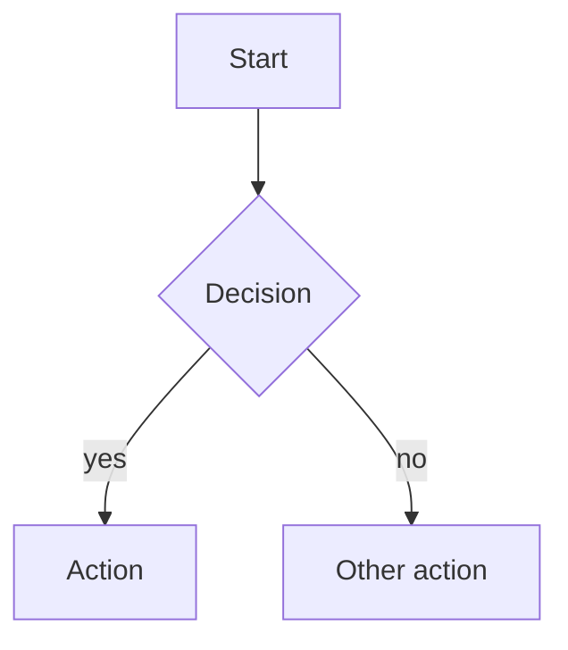

# Markdown Rendering

This is a format-rendering reference — it describes how to render any
artifact in markdown by the plan skill. It is paired with
`references/plan-sections.md`, which describes what the plan contains.

## Hard invariants

These hold regardless of context.

- **YAML frontmatter at the top of the file.** Standard `---` delimited block
  containing the artifact's stable metadata (title, status, date, type, etc.).
- **ASCII identifiers in anchors.** Keep headings ASCII so anchors are predictable
  (`#implementation-units`, not `#implementación-units`).
- **Repo-relative paths for file references.** Always.
- **No HTML mixed in.** Keep the markdown pure.

## Format principles

### ID prefix format

Stable IDs (R, U, A, F, AE, KTD) appear as plain prefixes at the start of
the bullet or heading — do NOT bold the prefix.

```markdown
- R1. The plan returns paginated sessions.   ← right
- **R1.** The plan returns paginated sessions.   ← wrong
```

### Content shape: prose vs bullets vs tables

- **Prose** when the content has narrative flow.
- **Bullets** when items share a parallel shape but each carries enough prose.
- **Tables** when 5+ items share uniform structure.

### Bold leader labels within bullets

When a bullet has substructure, use bold leader labels at the start of nested
bullets — not deeper heading levels.

```markdown
- F1. Anonymous capture
  - **Trigger:** Agent enters Step 2a with no session.
  - **Actors:** A1, A2
  - **Steps:** Preflight detects cloak; agent launches; capture proceeds.
  - **Covered by:** R1, R2, R5
```

### Section separators

For substantial artifacts, use horizontal rules (`---`) between top-level
H2 sections. Omit for short docs.

### Tables for genuinely comparative info only

Use tables for the uniform-shape case. Don't use tables to render content
lists that are really bullets.

## Section anatomy

- **Summary / Problem Frame** — prose paragraphs.
- **Requirements** — bullets with `R<N>.` prefix. Group under bold inline
  headers when they span distinct concerns.
- **Implementation Units** — H3 heading per unit with `U<N>.` prefix.
  Fields render as bullets with bold leader labels.
- **Key Technical Decisions** — bullets with bold decision name + prose
  rationale.
- **Key Flows / Acceptance Examples** — bullets with bold leader labels.
- **Scope Boundaries** — bullets, optionally split into "Deferred for
  later" / "Outside this product's identity".

## Diagrams

Render as a fenced mermaid block.

```markdown

```

## Inline code and code blocks

- **Inline code** for identifiers (variable names, function names,
  flag names, file paths, IDs that aren't section anchors).
- **Fenced code blocks** with language tag for code, shell commands,
  API request/response samples.

## No process exhaust

Engineering process metadata stays out of the artifact:

- No "captured at Phase X" notes
- No `## Next Steps` pointing to the next skill
- No italic provenance lines
- No engineering-flow shepherding

## Frontmatter shape

- YAML at the top of the file, delimited by `---` on its own line above
  and below.
- Field names in lowercase snake_case.
- Stable across artifact revisions.

## Post-write audit

Before declaring the markdown file written, scan for:

- All stable IDs are plain-prefix format, not bolded.
- No HTML elements mixed in.
- All file paths are repo-relative.
- Horizontal rule separators between H2s (for Standard / Deep artifacts).
- No process exhaust.
- Tables only where 5+ uniform-shape items justify them.
- Frontmatter has all required fields with reasonable values.
