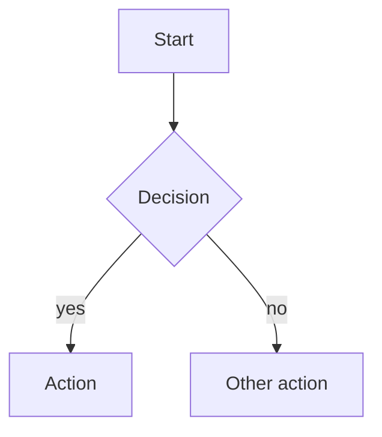

# Markdown Rendering

Describes how to render artifacts in markdown. Paired with `plan-sections.md` (what the plan contains).

## Hard Invariants

- **YAML frontmatter** at top of file (`---` delimited). Stable metadata: title, status, date, type, etc. Field names in lowercase snake_case. Editable in place.
- **ASCII identifiers in headings** — anchors must be predictable (`#implementation-units`, not `#implementación-units`).
- **Repo-relative paths** for file references. Never absolute paths.
- **No HTML mixed in.** Keep pure markdown.

## Format Principles

**ID prefix format:** stable IDs (R, U, A, F, AE, KTD) as plain un-bolded prefixes: `- R1. The plan returns paginated sessions.` (not `**R1.**`).

**Content shape: prose vs bullets vs tables.**

- **Prose** when narrative flow (motivation, rationale, framing).
- **Bullets** when parallel shape but each carries prose.
- **Tables** when 5+ items share uniform structure (ID+body, decision+rationale, risk+mitigation).

**Bold leader labels within bullets** for substructure (Trigger, Actors, Steps, Outcome). Avoid deeper heading levels.

**Section separators:** horizontal rules (`---`) between H2s for substantial artifacts.

**Tables** for genuinely comparative info only — not for content lists that are really bullets.

## Section Anatomy

- **Summary / Problem Frame** — prose paragraphs.
- **Requirements** — bullets with `R<N>.` prefix. Group by capability when spanning distinct concerns.
- **Implementation Units** — H3 heading per unit with `U<N>.` prefix. Fields as bullets with bold leader labels.
- **Key Technical Decisions** — bullets with bold decision name + rationale.
- **Key Flows / Acceptance Examples** — bullets with bold leader labels.
- **Scope Boundaries** — bullets, optionally split by sub-heading.

## Diagrams

Render as fenced mermaid block:

Use `TB` direction default for narrow viewports. For quantitative comparisons not suited to mermaid, use a table with data + prose interpretation.

## Inline Code and Code Blocks

- **Inline code** for identifiers (variable names, flags, file paths, non-anchor IDs).
- **Fenced code blocks** with language tag for code, shell commands, API samples.

## No Process Exhaust

No "captured at Phase X" notes, no `## Next Steps`, no italic provenance lines, no engineering-flow shepherding.

## Frontmatter Shape

YAML `---` delimited at top. Field names in lowercase snake_case. Status lifecycle per section contract (plans: `active → completed`). Stable across revisions.

## Post-Write Audit

Scan for: all stable IDs plain-prefix (not bolded); no HTML elements; all paths repo-relative; HR between H2s (Standard/Deep); no process exhaust; tables only where 5+ uniform items justify them; frontmatter has required fields.
