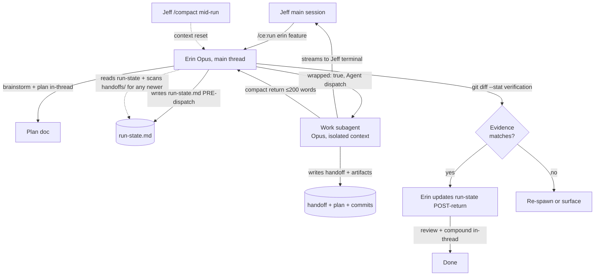

# Erin Phase Isolation: Subagent Wrapping for Long-Running Phases

## Problem Frame

Two distinct pains drive this work, and conflating them obscures the right design:

1. **Context bloat.** When Erin runs a long phase (`/ce:work` especially) as an in-thread skill invocation, every tool call, every file read, every reviewer panel output accumulates in the main conversation. Long features burn through the context window before Erin even reaches `compound`. Jeff has to manually `/compact` mid-workflow.

2. **Memory loss across `/compact`.** When Jeff does `/compact` mid-workflow, Erin loses the thread of which phase is current, what decisions were made, what the user just said. He copy-pastes a re-priming reminder to keep going.

These are different problems with different fixes. Pain #2 is solved by Erin writing a small `run-state.md` after each phase and reading it on resume — no subagent isolation needed. Pain #1 is the part that actually requires dispatching long phases out of the main thread so their tool churn doesn't accumulate.

Two rounds of document review tightened the design. The first pass cut a "Tina persona" framing, generic primitive in `ce-run`, JSONL event log, and 4-of-5 wrapped phases. The second pass surfaced epistemic gaps: spike thresholds were unfalsifiable, "observable evidence" was self-reported by the entity being checked, and the `needs-input` round-trip path was destructive (not just wasteful) for a phase like `/ce:work` that already mutates filesystem and git state. v1 now ships: a spike with numeric pass/fail thresholds, the `work` phase wrapped, Erin-verified evidence via direct `git diff` checks, and a hard halt on any subagent that needs user input mid-phase (no dialogue-relay protocol; the user re-runs `/ce:run erin` with the answer in args).

## User Flow

## Requirements

**Phase 0 — Platform Spike (v0 prerequisite, hard gate)**

- R1. Before any other implementation, run a measurement spike that dispatches an Opus subagent which itself dispatches two parallel Sonnet subagents. The spike MUST capture, with explicit numeric pass/fail thresholds:
  - **(a) Main-thread token accumulation.** Measure parent-context token growth attributable to the wrapped phase. **Pass:** parent grows by less than 20% of the total tokens consumed by the leaf subagents (i.e., isolation captures >80%). **Fail:** parent grows by more than 50% of leaf token cost.
  - **(b) Streaming fidelity.** Capture what surfaces in the user's terminal during the wrapped phase. **Pass:** at minimum, each leaf tool call's name and abbreviated input is visible in real time. **Fail:** terminal shows nothing until subagent returns ("black box for N minutes" UX).
  - **(c) Reliability.** Run the dispatch at least 5 times in succession. **Pass:** all 5 succeed end-to-end. **Fail:** any run fails outright; investigate before proceeding.
  - **(d) Per-phase baseline.** As part of the spike, also capture per-phase token shares from the most recent 3 real `/ce:run erin` workflows on this codebase. This produces the baseline against which v1's success criterion (≥30% main-thread reduction) is measured AND validates the assumption that `work` is the largest phase.
- R2. The spike's findings document MUST live at `docs/solutions/2026-05-XX-agent-tool-depth-2-spike.md` and include the four measurements above with pass/fail status against the thresholds in R1. The rest of v1 is gated on (a), (b), and (c) all passing. (d) informs v1 scope but is not a pass/fail gate.
- R3. If any of (a)–(c) fail at the thresholds in R1, the rest of v1 is redesigned (or abandoned). If (d) shows `work` is not the largest source of bloat, v1 scope re-considers which phase to wrap first before proceeding.

**Phase Wrapping Primitive (post-spike)**

- R4. Erin's orchestrator file (`erin.md` in `ce-reviewers-jsl`) MUST support a `wrapped: true` flag on individual phase entries.
- R5. When a phase has `wrapped: true`, Erin dispatches that phase via the `Agent` tool to a fresh Opus subagent. The subagent runs the phase's `skill:` (e.g., `ce:work`) in its isolated context, persists artifacts to disk, and returns a compact summary.
- R6. The wrapping logic lives in Erin's behavior (in `erin.md` itself), NOT as a generic primitive in `ce-run`. `ce-run` is unchanged. When orchestrator #2 needs the same pattern, the abstraction extracts itself.
- R7. Phase args (`$ARGUMENTS`, `$PLAN_PATH`) MUST pass through to the subagent prompt unchanged.
- R8. Subagent prompt scope: in v1, the wrapped subagent receives the skill invocation + args ONLY. It does NOT receive Erin's review-preferences, persona definition, or other orchestrator-level prose. (Moot in v1 because review isn't wrapped; revisit when v2 wraps `review` or `plan-review`.)
- R9. Model resolution: subagent runs on Opus by default (judgment-bearing). Workers it spawns follow per-skill defaults (typically Sonnet for reviewers, Haiku for research).

**v1 Wrapped Phases (intentionally narrow)**

- R10. v1 wraps **only the `work` phase**. This is the single largest source of context bloat in the working hypothesis (validated in spike R1(d)). Other phases stay in-thread.
- R11. Phases NOT wrapped in v1: `brainstorm`, `plan`, `plan-review`, `user-plan-review`, `review`, `user-scenarios` (all stages), `everyday-usability`, `todo-resolve`, `test-browser`, `feature-video`, `compound`. Some are interactive; some are short enough that wrapping adds ceremony beyond savings.
- R12. v2 candidates for wrapping: `review` and `plan-review`. Adding them depends on (a) the spike confirming depth-2 streaming and (b) v1's `work` wrap demonstrating real context savings on a real workflow.

**Phase Handoff Contract**

- R13. The wrapped phase's subagent MUST produce a handoff document at `docs/plans/<plan-filename-stem>/handoffs/<phase>.md`, where `<plan-filename-stem>` is the plan's filename minus the `.md` extension. (Stable `plan_id` in plan frontmatter is deferred to a future iteration if rename collisions become a real problem in practice.)
- R14. Handoff frontmatter required fields: `phase`, `plan_filename`, `started`, `completed`, `status`, `claimed_files_modified`, `claimed_lines_changed_delta`. The last two are the subagent's *self-reported* numbers; Erin verifies them independently (R18).
- R15. Handoff body required sections: `## Outcome` (one sentence), `## Artifacts` (paths, commit SHAs), `## Recommended Next Phase Action`. Optional: `## Open Questions`. If the subagent has anything to flag for Erin's between-phase judgment, include `## Judgment Calls For Erin`; omit the section entirely when nothing applies (no stub `None.`).
- R16. `status` enum: `success | partial | failed | needs-input`. `partial` means the phase made forward progress but couldn't complete (e.g., test failures the subagent couldn't resolve). `needs-input` means the underlying skill required user dialogue — see R23.
- R17. The subagent's return value to Erin MUST be a compact summary (≤200 words) containing: `status`, claimed evidence numbers, one-sentence outcome, judgment-call count (if any), recommended next action, handoff doc path.

**Erin-Verified Evidence (Independent Ground Truth)**

- R18. Before dispatching a wrapped phase, Erin captures a pre-dispatch snapshot: the current git HEAD SHA. After the subagent returns, Erin runs `git diff --stat <pre-sha>..HEAD` and `git log <pre-sha>..HEAD --oneline` in the main thread to obtain *independent* counts of files modified and lines changed. These are the **verified** numbers; the subagent's `claimed_*` fields are claims to compare against.
- R19. Sanity-check rule: if the subagent returned `success` OR `partial` AND the verified evidence shows zero files modified AND zero lines changed, treat the result as suspicious. Trigger a re-spawn (R20) on first occurrence; surface to user on second.
- R20. If the subagent's `claimed_*` fields disagree with verified counts by more than a tolerance band (e.g., claimed says 50 files, verified says 5), this is also a sanity-check failure — the subagent is hallucinating progress. Trigger re-spawn with corrective prompt naming the discrepancy.

**Failure Recovery**

- R21. On detectable subagent failure (Agent tool error, malformed handoff frontmatter, missing required artifact paths, evidence sanity-check failure per R19/R20), Erin re-spawns once with a corrective prompt that includes the prior return value verbatim plus the specific complaint.
- R22. If the second attempt also fails, Erin surfaces to Jeff with: phase name, both return values, the specific complaint, and four options — retry, fall back to in-thread skill execution, edit the handoff manually, or abandon.
- R23. **`needs-input` is a hard halt in v1, not a round-trip.** When the subagent encounters a question that requires user dialogue, it captures the question(s) in `## Judgment Calls For Erin` and returns `status: needs-input`. Erin reads the questions, surfaces them to Jeff, and stops. Jeff resolves the questions and re-invokes `/ce:run erin <args-with-answers-folded-in>` for a fresh workflow. **There is no in-flight resume.** This is a deliberate non-goal: re-spawning a partially-completed `/ce:work` is destructive (duplicate commits, conflicting state, silent skips), and supporting safe resume requires a skill-level redesign that's out of v1 scope.

**Erin Disagrees Response**

- R24. After reading a successful handoff and verifying evidence, Erin may judge the subagent's `Recommended Next Phase Action` differently. Three responses are available — Erin uses judgment, not a protocol, to choose:
  - **Override:** Erin proceeds with a different next-phase decision based on her between-phase view.
  - **Re-dispatch:** Erin re-spawns the subagent with a corrective prompt naming the specific judgment Erin disagrees with.
  - **Escalate:** Erin surfaces the disagreement to Jeff with both views.
- R25. Run-state.md (R26) records every phase transition regardless of whether Erin agreed or overrode. This avoids the asymmetric-logging pathology (logging only divergence biases toward override).

**Run-State for `/compact` Survival**

- R26. Erin MUST maintain `docs/plans/<plan-filename-stem>/run-state.md` as the durable workflow thread. The file's content includes: phases complete, current phase, key decisions made by Erin, recent user input, recommended next action.
- R27. Write ordering for wrapped phases:
  - **Pre-dispatch:** Erin updates run-state.md with `current_phase: <name>`, `current_phase_status: dispatched`, `pre_dispatch_sha: <git HEAD>`, then dispatches the subagent.
  - **Post-return:** Erin updates run-state.md with `current_phase_status: completed` (or `failed`/`needs-input`), records the verified evidence, and notes the next action.
  - The pre-dispatch write ensures that a `/compact` between dispatch and return doesn't leave run-state.md silently stale.
- R28. On `/ce:run erin` resume after `/compact`: Erin's first action is to (a) read `run-state.md`, (b) scan `docs/plans/<plan-filename-stem>/handoffs/` for any handoff file with mtime newer than run-state.md's last write — if found, the handoff returned during a `/compact` window and Erin reconciles it before continuing.
- R29. For pre-plan phases (brainstorm, plan-creation), there is no plan-filename-stem yet. Run-state during these phases lives at `docs/runs/<YYYY-MM-DD-HH-MM-SS>-<topic-slug>/run-state.md`. Once a plan file exists, Erin migrates run-state.md into the plan's directory and links forward from the run-state location.

**Explicit Non-Goals (v1 scope)**

- R30. v1 does not build a dialogue-relay protocol for wrapped phases. Interactive phases stay in-thread; wrapped phases that hit `needs-input` halt and require a fresh `/ce:run`. This may be revisited if real-world usage shows `needs-input` halts are common AND a safe resume mechanism is feasible.
- R31. v1 does not support parallel wrapped phases. The wrapped subagent itself may spawn parallel reviewer/worker subagents (`/ce:work` already does), but Erin doesn't run multiple wrapped phases concurrently.
- R32. v1 does not thread persistence across separate `/ce:run` invocations. `run-state.md` covers within a single workflow only.

## Success Criteria

- **Spike clears the gate.** R1 passes (a)/(b)/(c) at the numeric thresholds. R1(d) baseline data is captured and confirms `work` is the right phase to wrap first; if not, v1 scope adjusts.
- **Measurable context savings.** Running `/ce:run erin <a representative feature>` with `work` wrapped consumes meaningfully less main-thread context than the same workflow today. Concrete target: ≥30% reduction in main-thread tokens at the point of entering `compound`, measured against the baseline captured in R1(d). If R1(d) shows `work` is, e.g., 70% of main-thread tokens today, the actual savings should approach that number minus subagent-summary overhead.
- **No regressions.** Existing orchestrators behave exactly as today. Only `erin.md` changes (and only the `work` phase entry).
- **`/compact` survives mid-run.** Jeff can `/compact` after any phase completes; Erin reads `run-state.md` on resume, scans for newer handoffs, and continues without losing thread. Pre-dispatch write ordering ensures the `/compact`-between-dispatch-and-return window doesn't corrupt state.
- **Sanity checks fire on synthetic tests.** Test cases: (a) subagent returns `success` with verified zero files modified → re-spawn fires; (b) subagent's `claimed_files_modified` substantially exceeds verified count → re-spawn fires; (c) `partial` with zero verified evidence → suspicious-success path triggers.
- **Failure recovery exercised.** Test cases for malformed handoff (R21), double failure (R22), and `needs-input` halt (R23) all behave as specified — particularly R23: the workflow stops cleanly and Jeff sees the captured questions.

## Scope Boundaries

- **Out of scope: a `tina.md` persona file.** v1 treats wrapping as infrastructure. The wrapped subagent is "the work-phase subagent," not a named character.
- **Out of scope: cross-repo persona work.** v1 only changes `erin.md` (in `ce-reviewers-jsl`). No new files in either repo.
- **Out of scope: generic `wrapped: <persona>` primitive in `ce-run`.** Erin handles dispatch herself.
- **Out of scope: JSONL event log.** Foreground subagent terminal streaming is sufficient visibility for v1.
- **Out of scope: wrapping more than `work` in v1.** `review`, `plan-review` are v2 contingent on v1 evidence.
- **Out of scope: dialogue-relay for `needs-input`.** See R23 / R30.
- **Out of scope: stable `plan_id` in plan frontmatter.** v1 uses filename-stem; introduce when rename collisions are observed in practice.
- **Out of scope: parallel wrapped phases.** See R31.
- **Out of scope: cross-`/ce:run` continuity.** See R32.

## Key Decisions

- **Spike first with numeric thresholds.** Document review surfaced that the prior spike spec was a vibes-check ("token delta," "reliable"). v1 specifies pass/fail numbers per axis (R1) so the gate is testable, not arguable.
- **Erin-verified evidence via `git diff`, not subagent self-report.** The first sanity-check spec relied on the subagent reporting its own work counts — same entity as the one reporting `success`, so a hallucinating subagent fools both checks identically. v1 has Erin run `git diff --stat` against a pre-dispatch snapshot in the main thread for independent ground truth.
- **`needs-input` is a hard halt in v1 (C-forbid path).** Re-running `/ce:work` from scratch with augmented args is destructive (duplicate commits, conflicts, silent skips). Building safe resume is a skill-level redesign out of v1 scope. v1 halts cleanly; Jeff re-runs.
- **Erin-specific dispatch, not a generic primitive.** Reversed under document review (premature framework). Extracts to `ce-run` later when orchestrator #2 has stated need.
- **Wrap one phase in v1, not five.** `work` is the working hypothesis for largest bloat source; spike R1(d) validates. `review`, `plan-review` are v2.
- **Infrastructure, not persona.** `wrapped: true`, no `tina.md`. The wrapper has no judgment; it's plumbing.
- **Handoff includes claimed evidence; Erin verifies independently.** Two-source check catches subagent hallucination, not just honest-zero-work.
- **`run-state.md` separate from `phase-handoff.md`.** Different readers, different writers, different lifecycles. Pre-dispatch write ordering prevents the `/compact`-corruption window.
- **Erin's three responses to disagreement are judgment, not protocol.** Original draft over-formalized this with audit logging; review flagged the asymmetry pathology. v1: Erin uses judgment; run-state logs all phase transitions equally.
- **Filename-stem for handoff dir, not stable `plan_id`.** Premature infrastructure for v1; legacy fallback already covers what `plan_id` was meant to fix.
- **Drop `tool_calls_count` from handoff fields.** Redundant for the v1 sanity check.

## Dependencies / Assumptions

- Spike (R1) confirms depth-2 Agent dispatch behavior. **Hard prerequisite — failure triggers redesign.**
- The `Agent` tool reliably passes a custom system prompt / persona definition to subagents. (Already used at depth-1 by reviewer panels; spike validates depth-2.)
- Erin can shell out to `git diff --stat` and `git log` in the main thread for evidence verification. (Bash tool is available; this is essentially free.)
- Plans created by `/ce:plan` have stable filenames during a single `/ce:run` workflow. (Today's convention; rename mid-workflow is rare and out of v1 scope.)

## Outstanding Questions

### Resolve Before Planning
*(none — strategic decisions are locked)*

### Deferred to Planning

- [Affects R1][Needs research] Spike implementation form: ad-hoc Bash invocation, or written-to-disk regression test we keep around? Recommend the latter — durable artifact, runnable on every Claude Code platform update.
- [Affects R20][Technical] Tolerance band for evidence-discrepancy sanity check. "Substantially exceeds" needs a number. 2× ratio? Absolute delta? Lock during planning.
- [Affects R8, R9][Technical] If/when v2 wraps `review`, the subagent will need access to Erin's review-preferences (named-persona team composition). Plan for this explicitly when v2 lands; v1 ducks it because review isn't wrapped.
- [Affects R29][Technical] Migration of run-state when a plan file is created mid-workflow (brainstorm → plan transition). Linking forward + leaving a pointer at the original location is the obvious shape; lock specifics during planning.
- [Affects R27][Technical] Atomic-write semantics for run-state.md. If Erin crashes between writes, the file shouldn't be left half-written. Probably write-to-temp + rename. Lock during planning.

## Next Steps

→ `/ce:plan` for structured implementation planning. The plan MUST schedule R1 (the spike) as the first implementation unit, with a hard gate that the rest of the plan only executes if R1's pass/fail thresholds are met. The plan MUST also explicitly include capturing R1(d) baseline data before declaring v1 success criteria measurable.
