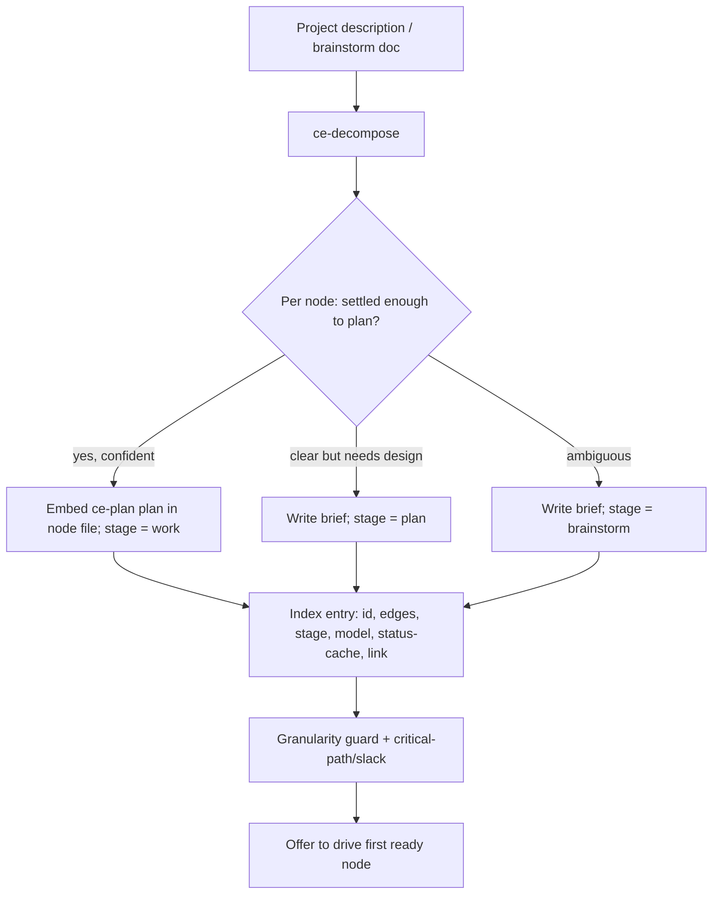

# ce-decompose + Committed Task-Graph

## Summary

`ce-decompose` is a new CE skill that sits one level above `ce-plan`: it turns a big project into a committed, diffable **task-graph** — a thin index plus one file per node. Each node is a feature-sized unit of work tagged with where it enters the CE pipeline (`brainstorm` / `plan` / `work`) and a recommended model tier. When ce-decompose is confident a node is settled, it embeds a ready plan; when a node is too big or ambiguous, it writes a brief and tags the earlier stage. After building the graph, it offers to start driving the first ready node.

## Problem Frame

Breaking a large project into workable pieces is currently a manual ritual: a long-lived model session shatters the project into features, hand-creates tickets, and holds the dependency map and "what's next" in its own context. That state lives in one chat — it dies at context compaction, can't be resumed from another session or machine, and isn't reviewable by anyone else.

The execution primitives already exist in the plugin. `ce-plan` decomposes one feature into stable U-ID units with dependencies cited by ID. `ce-work` already runs parallel, worktree-isolated sub-agents with collision detection and dependency-order merge. `lfg` already runs the full pipeline for one unit. What's missing is the layer above them: nothing decomposes a multi-feature project, nothing holds a cross-ticket dependency map, and nothing tracks where the whole project stands in a place other than one session's memory. This foundation is the spine the rest of an orchestration family (a what's-next recommender, an autonomous executor, tracker sync, recovery) becomes thin operations on top of.

## Key Decisions

- **Thin index + per-node files.** The graph is a small structured index (one entry per node) plus a separate file per node under `docs/plans/`. A work-ready node's file *is* a `ce-plan` plan; an unsettled node's file is a brief. Chosen over one self-contained file because constant status churn would make a single file's diffs unreadable, and over "plans always external" because it must allow embedding a plan directly for confident nodes.

- **Split ownership of structure vs. status.** The committed files own *structure* — nodes, edges, embedded plans, stage/model tags. *Live status* is derived on read from git (`gh pr view`) plus the tracker; the index's status field is a refreshable cache, never the source of truth. This is what makes status correct even when work happened outside a CE session, and avoids a second status copy that drifts.

- **Variable-depth nodes; the stage tag carries granularity.** Rather than forcing every node to one fixed depth, ce-decompose goes as deep as it confidently can per node. It assigns stage by *settledness* (settled+plannable → `work` with an embedded plan; clear-but-needs-design → `plan`; ambiguous → `brainstorm`) and model by *task shape*. Both are recommendations a human overrides by editing the committed graph.

- **Reuse the `ce-plan` unit schema for embedded plans.** A node's embedded plan uses ce-plan's existing unit fields (Goal, Files, Dependencies cited by ID, Test scenarios, Verification) so `ce-work` / `lfg` consume it with zero new format.

- **Files are canonical; the tracker is a downstream projection.** The repo's committed graph — not an external tracker, not a session — is the source of truth. Projecting nodes out to Linear/GitHub is deferred (see Scope Boundaries).

## Requirements

### Decomposition and output

- R1. Given a project description or an existing brainstorm/strategy doc, ce-decompose produces a task-graph consisting of one index plus one file per node.
- R2. Each node represents a feature-sized unit of work and has a stable, globally-unique ID that persists across edits. Deleting a node leaves a gap; IDs are never renumbered.
- R3. When ce-decompose is confident a node is settled, it embeds a ready plan in the node file using `ce-plan`'s existing unit schema, so the node file is directly consumable by `ce-work` / `lfg`.
- R4. When a node is too large or ambiguous to plan confidently, its file holds a brief instead of a plan, and the node enters the pipeline at the earlier stage (R5).
- R8. Edges express dependencies between nodes, cited by node ID, matching `ce-plan`'s "cite by ID" convention at project scope.

### Node metadata

- R5. Each node carries an entry-stage tag, one of: `brainstorm`, `plan`, `work`. The tag names where the node next enters the CE pipeline. (`done` is a derived status, not a stage value.)
- R6. Each node carries a model-tier recommendation for its next action, drawn from the CE tier vocabulary — e.g., generation tier for well-specified mechanical work, ceiling tier for cross-cutting or architectural judgment.
- R7. ce-decompose assigns stage by settledness and model by task shape. Both are recommendations a human can override by editing the committed graph; an overridden value is respected, not recomputed away.

### Storage and ownership

- R9. The index is a small structured file holding, per node: ID, dependency edges, stage, model, cached status, and a link to the node file. A status change touches one entry, keeping diffs reviewable.
- R10. The committed files own structure (nodes, edges, embedded plans, stage/model tags). Live status is derived on read from git plus tracker; the index status field is a cache, never the source of truth.
- R11. Stateless re-orient: on any invocation, each node's true status is reconstructed from index + git + tracker, so a fresh or context-compacted session yields identical output and any session or machine can resume by reading the files.
- R12. A human may edit the index and node files directly; ce-decompose and downstream skills respect those edits.
- R16. A node maps to its branch/PR by an explicit reference stored in the index entry when one is known, falling back to an ID-naming convention (the node ID present in the branch name and/or PR title) when no explicit ref exists. Re-orient (R11) uses the explicit ref first, then the convention.

### Quality guards

- R13. A granularity guard runs before emitting and audits: missing dependencies (a node's plan touches a file no prior node creates), spurious dependencies (a declared edge with no supporting basis), over/under-decomposition, and index↔file consistency (no orphaned index entries or node files).
- R14. ce-decompose computes the critical path through the dependency DAG and marks which nodes are schedule-critical (zero or low slack).

### Handoff

- R15. After producing the graph, ce-decompose surfaces a menu offering to drive the first ready node, and can chain into `ce-plan` / `ce-brainstorm` / `lfg` on a single chosen node. The routing action for each option is inline in the skill.

## Acceptance Examples

- AE1. **Covers R3, R7.** Given a node whose requirements and files are clear and self-contained, when ce-decompose processes it, then the node file contains a ce-plan-shaped plan and the index entry shows `stage = work`.
- AE2. **Covers R4, R5, R7.** Given a node whose approach is genuinely unresolved, when ce-decompose processes it, then the node file contains a brief (not a plan) and the index entry shows `stage = brainstorm`.
- AE3. **Covers R10, R11.** Given a node whose PR was merged outside any CE session and whose index cache still reads `in-progress`, when re-orient runs, then the derived status is `done` (from git), and the cache is irrelevant to the result.
- AE4. **Covers R13.** Given node B's embedded plan modifies a file that node A creates, but no `A → B` edge is declared, when the granularity guard runs, then it flags a missing dependency before the graph is emitted.
- AE5. **Covers R7, R12.** Given a human edits a node's `stage` from `plan` to `brainstorm` in the committed file, when ce-decompose or a downstream skill next reads the graph, then the human's value is honored.

## Scope Boundaries

### Deferred for later

- **Tracker projection** to Linear/GitHub (pushing nodes out as issues with dependency links) — the foundation runs file-first; this is the separate `ce-tracker-sync` skill's job.
- **Standalone `ce-route` skill** that re-stamps stage/model tags onto plans authored outside ce-decompose, or as a `ce-plan` deepening pass. The field *semantics* and ce-decompose's own assignment are in scope (R5–R7); re-annotating foreign plans is not.
- **Downstream family skills:** the what's-next recommender (`ce-next`), the autonomous executor (`ce-fanout`), and the recovery manifest — each its own brainstorm.

### Outside this product's identity

- ce-decompose is **not an executor.** Beyond the optional single-node chain handoff (R15), it never runs work itself.
- The task-graph is **not a replacement tracker.** It coordinates above Linear/GitHub; it does not become the issue tracker.

## Dependencies / Assumptions

- Depends on `ce-plan`'s unit schema (Goal, Files, Dependencies, Test scenarios, Verification) as the embedded-plan format for work-ready nodes.
- Assumes `ce-work` / `lfg` consume a node file's embedded plan unchanged.
- Node-to-git mapping uses an explicit index ref with an ID-naming-convention fallback (R16); downstream execution should name branches/PRs with the node ID so the fallback works.
- Tracker integration is assumed absent in v1; re-orient derives status from git alone when no tracker is configured.

## Outstanding Questions

### Deferred to planning

- Index file format (YAML / JSON / markdown table) and node-file naming under `docs/plans/`.
- How ce-decompose measures "confidence / settledness" to choose embed-plan vs. brief.
- Whether the granularity guard blocks emission or only warns, and how findings are surfaced.
- The concrete status vocabulary derived during re-orient (e.g., `not-started` / `in-progress` / `in-review` / `done` / `blocked`).

## Sources / Research

- `plugins/compound-engineering/skills/ce-plan/` — unit schema, stable-ID dependency citations (the embedded-plan format R3 reuses).
- `plugins/compound-engineering/skills/ce-work/` — parallel worktree-isolated dispatch, dependency-order merge, and the "progress lives in git commits and the task tracker, not the plan body" stance behind the split-ownership decision.
- `plugins/compound-engineering/skills/lfg/` — the single-unit autonomous pipeline a work-ready node hands off to.
- `plugins/compound-engineering/skills/ce-worktree/` — the detect → native → git isolation state machine downstream execution relies on.
- `docs/ideation/2026-06-21-project-orchestration-skills-ideation.html` — origin ideation (ideas "ce-decompose", "committed task-graph as coordination bus", and the stage/model routing fields folded in here).
- External: Spec-Kit epic → plan → tasks hierarchy; Graph-Harness DAG scheduling and its named decomposition failure modes (missing/spurious dependencies, over/under-decomposition) — the basis for the granularity guard (R13).
