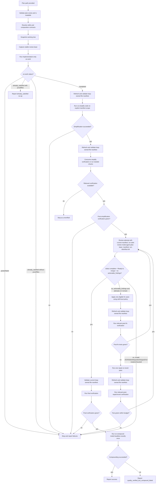

# ce-codex-loop Requirements

## Summary

`ce-codex-loop` is a new Compound Engineering orchestrator skill that runs a bounded, auditable implementation-quality loop from an existing code-execution plan file. It snapshots the working tree, invokes implementation-only `ce-work`, scopes `ce-simplify-code` to an explicit loop-owned file manifest, reviews the same stable diff base up to three total times, bounds each non-clean review attempt to one fix wave and one repair-or-revert pass, and invokes `ce-compound mode:headless` exactly once only after clean review and concrete verification. If `ce-work` proves the plan is already satisfied without producing a reviewable diff, the loop reports a terminal `already_satisfied` no-op outcome and does not simplify, review, or compound.

---

## Problem Frame

Compound Engineering already has skills for individual implementation stages and `/lfg` for a broad autonomous pipeline. The needed shape here is narrower: a reusable Codex-oriented local quality loop that stops at verified implementation, review closure, and compounding, without taking ownership of commits, PRs, CI watching, or release automation.

Hooks are the wrong primary mechanism for this behavior. Hooks are useful for deterministic lifecycle checks or safety blocks, but this workflow needs stage orchestration, bounded iteration, working-tree isolation, structured stage contracts, and success/failure reporting. That makes it a skill contract, not a Stop hook contract.

Earlier prototype work demonstrated bounded review-loop behavior. The architecture to ship is a Compound Engineering skill under the plugin's skills surface, not a standalone runner.

---

## Key Decisions

- **Build a skill, not a hook.** The loop is an intentional reusable workflow with stage sequencing and reporting; hooks remain out of v1.
- **Keep it narrower than `/lfg`.** The skill ends after local implementation quality and compounding, with no commit, push, PR, CI watch, or release automation.
- **Treat `ce-work` as implementation-only.** `ce-codex-loop` must not compose with `ce-work`'s branch, commit, review, simplify, or shipping workflow; if `ce-work` lacks that mode, adding it is part of v1.
- **Use structured stage contracts.** `ce-work`, `ce-simplify-code`, and `ce-code-review mode:agent` must provide machine-readable outputs; the orchestrator must not infer success from prose alone.
- **Treat `already_satisfied` as a terminal no-op.** A zero-diff run is not a meaningful review target against the starting review base, so v1 reports proof and identified files without simplifying, reviewing, or compounding.
- **Use `actionable_findings` as the only review follow-up queue.** Severity determines priority only; `requires_verification` controls post-fix test scope and does not make advisory findings actionable. Each item still passes through the review-followup eligibility policy before mutation.
- **Keep the new skill self-contained.** Runtime reference contracts needed by `ce-codex-loop`, including review-followup eligibility, live under `skills/ce-codex-loop/references/` rather than sibling skill internals.
- **Protect pre-existing work.** The loop may only mutate loop-owned files or temporary reversible index state required for review coverage.
- **Run `ce-compound mode:headless` only after verified success.** Partial, failed, or unverified work must never be compounded as solved.

---

## Actors

- A1. **User:** Provides the plan path and expects a clear staged execution report.
- A2. **`ce-codex-loop` orchestrator:** Validates inputs, snapshots state, invokes CE skills in order, applies review fixes, runs verification, and reports the outcome.
- A3. **Stage skills:** `ce-work`, `ce-simplify-code`, `ce-code-review`, and `ce-compound` retain their own local contracts while being sequenced by the orchestrator.

---

## Key Flow

- F1. Bounded implementation loop
  - **Trigger:** The user invokes `ce-codex-loop` with a plan file path.
  - **Actors:** A1, A2, A3
  - **Steps:** Validate that the plan is a code-execution plan with implementation units and declared file scope, validate downstream capabilities, snapshot the working tree, capture one review base, run implementation-only `ce-work`, refresh and validate the loop-owned file manifest after implementation, simplify only that manifest, refresh and validate the manifest again before verification and review, review with `mode:agent base:<ref>` plus explicit loop-owned manifest scope and deterministic artifact correlation, process `actionable_findings` through the skill-local review-followup eligibility policy, spend at most one fix wave and one repair-or-revert pass per non-clean review attempt, require green post-fix tests before re-review, refresh the manifest after every fix wave and every repair or revert, and repeat until clean or the attempt limit is reached.
  - **Outcome:** The skill either invokes `ce-compound mode:headless` exactly once after success, reports `quality_verified_but_compound_failed` after compounding failure, exits `unverified`, reports terminal `already_satisfied`, or stops with a concrete failure report.
  - **Covered by:** R1 through R70

---

## Requirements

**Input, state, and review scope**

- R1. The skill must require an existing plan file path as input.
- R2. The skill must validate that the supplied plan exists, is readable, and is a code-execution plan with implementation units and declared file scope before invoking any downstream skill. The skill must reject `execution: knowledge-work` plans and plans whose implementation scope cannot be determined safely.
- R3. The skill must snapshot `HEAD` plus staged, unstaged, and untracked state before any mutation.
- R4. The skill must never modify or absorb pre-existing non-loop-owned changes.
- R5. The skill must stop before mutation when existing code changes overlap the planned scope or cannot be safely separated.
- R6. The skill must capture one stable review base before implementation changes begin.
- R7. The skill must pass the same `base:<ref>` to every `ce-code-review` attempt.
- R8. The skill must require review coverage for newly created untracked files owned by the loop.
- R9. No loop-owned file may be silently excluded from review scope.
- R10. The implementation plan must define explicit untracked-file support or a reversible index strategy that restores the original staged state exactly.

**Implementation-only work**

- R11. The skill must invoke `ce-work` through an implementation-only orchestration mode that does not commit, switch or create branches, invoke `ce-simplify-code`, invoke `ce-code-review`, or enter `ce-work`'s shipping workflow.
- R12. If the implementation-only `ce-work` mode does not exist, adding it is part of v1.
- R13. Implementation-only `ce-work` must return structured `status`, `files_created`, `files_modified`, `files_deleted`, verification commands and outcomes, and `issues`.
- R14. Allowed `ce-work` statuses are `completed`, `already_satisfied`, `partial`, and `failed`.
- R15. `already_satisfied` is valid only as a terminal no-op outcome with proof that plan requirements are met and identified plan-related files. The skill must not run `ce-simplify-code`, `ce-code-review`, or `ce-compound` after `already_satisfied`.
- R16. The orchestrator must stop and report failure when `ce-work` returns `partial`, `failed`, malformed output, or prose-only success.
- R17. Zero diff alone must not be treated as failure when `ce-work` returns valid terminal `already_satisfied` proof and identified files.
- R18. When zero diff is not proven already satisfied, the skill must report no-op or incomplete work instead of continuing.
- R19. After `ce-work` completes with reviewable changes, the skill must build a loop-owned file manifest from structured stage output and working-tree state.
- R20. The loop-owned file manifest must distinguish created, modified, deleted, and temporarily-indexed files when those categories exist.

**Simplification and verification**

- R21. The skill must run `ce-simplify-code` exactly once after implementation work completes with reviewable loop-owned changes.
- R22. The skill must pass the explicit loop-owned file manifest to `ce-simplify-code`.
- R23. The skill must never let `ce-simplify-code` default to the full branch diff.
- R24. `ce-simplify-code` must return structured status, `files_created`, `files_modified`, `files_deleted`, applied fixes, skipped fixes, verification commands and outcomes, and issues.
- R25. The orchestrator must stop and report failure when `ce-simplify-code` returns failure, malformed output, or prose-only success.
- R26. The skill must consume `ce-simplify-code`'s own verification result and must not repeat identical checks immediately unless the result is missing, unavailable, or insufficient.
- R27. The skill must prefer verification commands from the plan file.
- R28. When the plan lacks verification commands, the skill must infer commands from project conventions and report that fallback explicitly.
- R29. When no relevant verification command can be found, inferred, or run, the skill must classify the result as `unverified`.
- R30. The skill must not claim success or invoke `ce-compound` from an `unverified` outcome.
- R31. The skill must not claim success without concrete command output from relevant verification.
- R32. The skill must ensure post-simplification verification is green before the first review attempt.

**Review, fix, and test loop**

- R33. The skill must invoke `ce-code-review` with `mode:agent plan:<plan-path> base:<ref>` plus explicit loop-owned manifest scope and deterministic review-artifact correlation for every review attempt.
- R34. The skill must parse the primary `ce-code-review mode:agent` response first.
- R35. If the primary review response is unavailable or malformed, the skill must read and validate the deterministically correlated `review.json` artifact.
- R36. The skill must fail closed only when neither the primary response nor matching artifact provides valid JSON.
- R37. The `actionable_findings` array from valid review JSON must be the sole machine-readable review follow-up and blocking queue.
- R38. Severity must determine priority only and must not independently decide whether a finding is actionable.
- R39. The `requires_verification` field must control post-fix test scope and must not make advisory findings actionable.
- R40. A clean review must require `status == complete`, `verdict == Ready to merge`, and an empty `actionable_findings` array.
- R41. Failed, degraded, skipped, malformed JSON, `Ready with fixes`, and `Not ready` review results must not pass the success gate.
- R42. The review loop must allow a maximum of three total `ce-code-review` attempts.
- R43. Attempt 1 must be the first review after `ce-simplify-code` and post-simplification verification.
- R44. Attempts 2 and 3 must occur only after fixes and relevant tests.
- R45. When `actionable_findings` is non-empty and attempts remain, the orchestrator must process every item through the skill-local review-followup eligibility policy at `skills/ce-codex-loop/references/review-followup-eligibility.md`. The skill must not reference a sibling skill's internal reference files for this policy.
- R46. The review-followup policy must apply findings only with current evidence and a concrete, scoped fix; skip incorrect or stale findings with a recorded reason; preserve design-dependent or non-mechanical findings as unresolved; and treat any unresolved actionable finding as blocking success.
- R47. Each non-clean review attempt permits at most one fix wave and one repair-or-revert pass before either re-review or terminal failure.
- R48. If no eligible finding can be applied, the skill must stop immediately with the remaining findings instead of reviewing an unchanged tree again.
- R49. The skill must never start a new code-review attempt on a known red tree.
- R50. Post-fix tests must pass before the next review; if a fix leaves tests failing, the skill must repair or revert the failing fix or stop within the bounded budget.
- R51. The skill must stop and report remaining `actionable_findings` when they remain after attempt 3.
- R52. The skill must stop and report remaining verification failures when tests still fail after the bounded loop.

**Compounding, outputs, and mutation boundaries**

- R53. The skill must track whether `ce-compound mode:headless` has run.
- R54. The skill must invoke `ce-compound mode:headless` exactly once after the final review is clean and final verification passes.
- R55. The skill must not invoke `ce-compound` on partial, failed, or unverified work.
- R56. If `ce-compound mode:headless` fails after verified quality success, the skill must report `quality_verified_but_compound_failed` and must not retry compounding automatically.
- R57. The skill may mutate the repository only through implementation of the supplied plan, explicitly scoped behavior-preserving simplification, application of review fixes, temporary reversible index operations needed for review coverage, and verified-success documented outputs or maintenance side effects from `ce-compound mode:headless`.

**Manifest-scoped review, preflight, and audit**

- R58. Every review attempt must be restricted to the current loop-owned file manifest. `base:<ref>` alone is not sufficient to define review scope.
- R59. The implementation must either add explicit manifest/file-scope support to `ce-code-review`, or use an isolated and fully reversible review mechanism that includes all loop-owned created, modified, and deleted files; excludes every non-loop-owned file; and preserves the user's original index and working-tree state.
- R60. Findings targeting files outside the loop-owned manifest must not enter the fix queue and must never be applied by the orchestrator.
- R61. The loop-owned manifest must be refreshed after `ce-work`, after `ce-simplify-code`, after every fix wave, and after every repair or revert. The current manifest must be validated immediately before every verification and review attempt.
- R62. The matching review artifact must be identified deterministically. The implementation plan must define a caller-provided run ID, output directory, or another collision-safe correlation mechanism.
- R63. The skill must not select a review artifact solely by latest modification time.
- R64. Before any mutation, the orchestrator must resolve the exact installed skill entries for `ce-work`, `ce-simplify-code`, `ce-code-review`, and `ce-compound` from the host platform's available-skills registry.
- R65. Before mutation, the orchestrator must verify that every required composition mode and structured-output contract is available.
- R66. If a required skill or contract is unavailable, the loop must stop before modifying the repository and report the missing capability.
- R67. The skill must not commit, push, open or edit a PR, watch CI, or run release automation.
- R68. The skill must emit progress updates after preflight, implementation, simplification, each review attempt, each fix/verification wave, final verification, and compounding.
- R69. Every terminal summary must include the plan path, stable review base, loop-owned file manifest when one exists, stage statuses, verification commands and outcomes, total review attempts, review run IDs and artifact paths, applied, skipped, and unresolved finding IDs, whether compounding ran, any `already_satisfied` proof and identified files, and the final terminal status.
- R70. Terminal statuses must be explicit and machine-distinguishable: `success`, `failed`, `unverified`, `already_satisfied`, or `quality_verified_but_compound_failed`.

---

## Acceptance Examples

- AE1. **Covers R1, R2.** Given a missing plan path, unreadable plan, `execution: knowledge-work` plan, or plan without safely declared implementation file scope, when the user invokes the skill, then the skill stops before running `ce-work` and reports the input or plan-shape problem.
- AE2. **Covers R3, R4, R5.** Given the working tree has pre-existing edits that overlap planned files, when the loop prepares to mutate, then it stops before changing files rather than absorbing those edits.
- AE3. **Covers R6, R7, R33.** Given implementation changes are about to begin, when the loop starts work, then it captures one review base and passes the same `base:<ref>` to every review attempt.
- AE4. **Covers R8, R9, R10.** Given implementation creates untracked files, when review scope is prepared, then the files are included explicitly or through a reversible index strategy that restores the original staged state exactly.
- AE5. **Covers R11, R12.** Given `ce-work` lacks an implementation-only orchestration mode, when v1 is planned, then adding that mode is in scope before `ce-codex-loop` composes with `ce-work`.
- AE6. **Covers R13, R14, R15, R16.** Given `ce-work` returns prose without structured status and file lists, when the orchestrator evaluates the stage, then it does not infer success and stops with a stage-contract failure.
- AE7. **Covers R15, R17, R18.** Given `ce-work` returns zero diff with valid terminal `already_satisfied` proof and identified plan-related files, when the implementation stage ends, then the loop reports `already_satisfied` and does not simplify, review, or compound; without that proof, it reports no-op or incomplete work.
- AE8. **Covers R19, R20, R21, R22, R23.** Given implementation succeeds with reviewable changes, when simplification runs, then the loop refreshes a manifest after `ce-work` and passes that explicit scope to `ce-simplify-code` instead of letting it simplify the full branch diff.
- AE9. **Covers R24, R25, R26.** Given `ce-simplify-code` reports structured verification that is sufficient and green, when post-simplification verification is evaluated, then the loop consumes that result without immediately repeating identical checks.
- AE10. **Covers R27, R28, R29, R30, R31, R32.** Given no relevant verification command can be found, inferred, or run, when the loop reaches verification, then it exits `unverified` and does not claim success or invoke `ce-compound`.
- AE11. **Covers R34, R35, R36.** Given the primary review response is malformed but the matching `review.json` artifact is valid, when review output is evaluated, then the loop uses the artifact instead of failing closed.
- AE12. **Covers R37, R38, R39.** Given `findings` contains only P3 or advisory items and `actionable_findings` is empty, when the review result is otherwise clean, then those findings are reported but do not create a review follow-up queue.
- AE13. **Covers R40, R41.** Given review JSON is failed, degraded, skipped, `Ready with fixes`, `Not ready`, or has non-empty `actionable_findings`, when the review result is evaluated, then the skill treats the review as not clean.
- AE14. **Covers R42, R43, R44, R45, R46, R47, R48.** Given review returns actionable findings on attempt 1, when one eligible fix wave is applied through the skill-local policy and relevant tests pass, then attempt 2 runs; if no eligible finding can be applied or the single repair-or-revert pass cannot restore a green tree, then the loop stops instead of reviewing an unchanged or red tree again.
- AE15. **Covers R49, R50, R52.** Given a review fix makes tests fail, when the loop considers re-review, then it repairs or reverts the failing fix before review or stops without spending a new review attempt on a known red tree.
- AE16. **Covers R51, R55.** Given actionable findings remain after attempt 3, when the loop exits, then the skill reports the remaining findings and does not run `ce-compound`.
- AE17. **Covers R53, R54, R56, R57.** Given final review is clean and final verification passes, when compounding runs, then the skill invokes `ce-compound mode:headless` exactly once; if compounding fails, the summary reports `quality_verified_but_compound_failed`.
- AE18. **Covers R57.** Given `ce-compound mode:headless` succeeds, when it writes solution documentation, `CONCEPTS.md` updates, or instruction-file maintenance side effects, then those verified-success outputs are allowed repository mutations.
- AE19. **Covers R58, R59, R60.** Given the working tree contains both loop-owned and unrelated user changes, when review runs, then review includes only loop-owned created, modified, and deleted files, excludes unrelated files, preserves the user's index and working tree, and ignores any finding outside the manifest.
- AE20. **Covers R61.** Given `ce-work`, `ce-simplify-code`, a review fix, or a repair/revert creates, modifies, or deletes loop-owned files, when verification or review is prepared, then the loop refreshes and validates the current manifest before continuing.
- AE21. **Covers R62, R63.** Given multiple review artifacts exist from concurrent or older runs, when the primary review response is malformed, then the loop selects only the artifact correlated by the caller-provided run ID, artifact directory, or equivalent collision-safe mechanism, never by newest modification time alone.
- AE22. **Covers R64, R65, R66.** Given `ce-code-review` does not expose the required manifest-scope mode, when preflight runs, then the loop stops before mutation and reports the missing capability.
- AE23. **Covers R67.** Given the loop reaches verified success, when it completes, then it still does not commit, push, open or edit a PR, watch CI, or run release automation.
- AE24. **Covers R68, R69, R70.** Given the loop exits with any terminal status, when it prints the terminal summary, then progress has been emitted at each required stage and the final report includes the required audit fields with one of the explicit machine-distinguishable statuses.

---

## Success Criteria

- The supplied plan was a code-execution plan with implementation units and declared file scope.
- The plan was implemented by implementation-only `ce-work` with reviewable loop-owned changes.
- Pre-existing working-tree state was snapshotted and protected from loop-owned mutation.
- Loop-owned files, including newly created files, were included in review scope.
- Simplification completed against the explicit loop-owned file manifest without changing intended behavior.
- Relevant verification commands produced concrete passing output.
- Final review has `status == complete`, `verdict == Ready to merge`, and empty `actionable_findings`.
- Review attempts were scoped to the refreshed loop-owned manifest and used deterministic review artifact correlation.
- Every non-clean review attempt used at most one fix wave and one repair-or-revert pass.
- `ce-compound mode:headless` runs exactly once after verified success.
- The final summary includes every required audit field and one of the explicit terminal statuses.
- For terminal `already_satisfied`, the summary includes proof, identified files, and confirmation that simplification, review, and compounding did not run.

---

## Failure Criteria

- If the supplied plan is `execution: knowledge-work` or lacks safely determinable implementation scope, the skill stops before mutation.
- If pre-existing changes overlap planned scope or cannot be safely separated, the skill stops before mutation.
- If required downstream skills, composition modes, or structured-output contracts are unavailable, the skill stops before mutation.
- If `ce-work` lacks structured output, returns `partial`, returns `failed`, or reports incomplete work, the skill stops and reports the implementation-stage failure.
- If zero diff is not proven as terminal `already_satisfied` with identified files, the skill stops and reports no-op or incomplete work.
- If `ce-simplify-code` lacks structured output or fails, the skill stops and reports the simplification failure.
- If no relevant verification command can be found, inferred, or run, the skill exits `unverified`.
- If tests still fail after the bounded loop, the skill stops and reports the remaining failures.
- If no eligible actionable finding can be applied through the skill-local policy, the skill stops without spending another review attempt.
- If `actionable_findings` remains non-empty after three total review attempts, the skill stops and reports them.
- If a review artifact cannot be deterministically correlated to the current review attempt, the skill fails closed.
- The skill does not run `ce-compound` on partial, failed, or unverified work.
- If `ce-compound mode:headless` fails after verified quality success, the skill reports `quality_verified_but_compound_failed` and does not retry automatically.

---

## Scope Boundaries

- This is a Compound Engineering skill, not a hook.
- No Stop hook is included in v1.
- No standalone Python runner is the primary architecture.
- No commit, push, PR creation, CI watch, or release automation is included.
- No implicit reliance on `ce-work`'s branch, commit, review, simplify, or shipping phases is allowed.
- Repository mutation is limited to the channels named in R57.
- Verified-success compounding outputs and maintenance side effects from `ce-compound mode:headless` are explicitly allowed.
- Earlier prototype evidence may be referenced only as behavior evidence, not as the architecture to ship.

---

## Sources

- `skills/ce-work/SKILL.md` shows that current `ce-work` includes branch, commit, simplification, review, and shipping behavior that `ce-codex-loop` must not invoke implicitly.
- `skills/ce-simplify-code/SKILL.md` shows that current simplification defaults to an explicit user scope or branch diff and does not yet provide a structured manifest-scoped result.
- `skills/ce-code-review/SKILL.md` defines `mode:agent`, `base:<ref>`, `review.json`, `actionable_findings`, `status`, and `verdict`.
- `skills/ce-compound/SKILL.md` defines `mode:headless` and its non-interactive documentation behavior.
- `skills/lfg/references/review-followup.md` and `skills/ce-work/references/review-findings-followup.md` are existing review-followup references that can inform the new skill-local policy copy.
