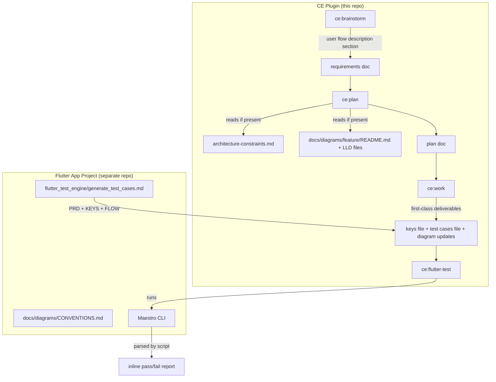

# feat: Integrate Maestro Flutter test suite into CE plugin workflow

## Overview

Add first-class Flutter test support to the Compound Engineering plugin. The integration has two fronts: changes to this plugin repo (new `ce:flutter-test` skill plus workflow hooks in `ce:plan`, `ce:brainstorm`, and `ce:work`) and a separate body of work in the Flutter app project (diagram conventions, `generate_test_cases.md` improvements, and per-feature diagram backfill). This plan covers both fronts in sequenced phases with a clear repo boundary.

## Problem Frame

The CE workflow (brainstorm → plan → implement) has no test step. A Maestro test engine exists in the Flutter app project and has proven capable of running 18 onboarding tests on a real emulator, but 10/18 currently fail. The failures fall into four buckets: native system widgets outside the Flutter accessibility layer, flow-blind test generation (missing `clearState`, no state graph input), no CE integration requiring widget keys or a test skill, and diagrams too coarse to serve as AI context or test generation input.

The desired end state: every Flutter feature ships with a complete diagram set, a keys file, and a passing Maestro test suite — all generated and verified as part of the CE workflow. (See origin: `docs/brainstorms/test-suite-compound-engineering-integration.md`)

## Requirements Trace

- R3. HLD updated as part of any new feature delivery (CE plugin enforcement)
- R12. `ce:plan` reads feature diagram README and LLD files before generating a plan
- R13. BLoC flow + UI↔BLoC diagrams passed as FLOW context to test generation
- R14. `generate_test_cases.md` mandates `clearState` before every `launchApp`
- R15. Testable boundary documented in `generate_test_cases.md` (Flutter layer only)
- R16. Native UI gate pattern: assert blocked state, then "manual verification only"
- R17. CE guideline: prefer custom in-app pickers over OS system dialogs
- R18. `keys_<feature>.json` supports optional `native_boundaries` field
- R19. CE rules mandate `<Feature>Keys` abstract class, `Semantics(identifier:)`, and `keys_<feature>.json` for every new Flutter screen
- R20. `/ce:flutter-test` skill: accepts test cases file + keys file, runs Maestro, surfaces pass/fail inline
- R21. `ce:work` treats keys file, test cases file, and diagram set as first-class feature deliverables
- R24. `ce:brainstorm` produces a user flow diagram description for UI features
- R25. FLOW-aware test generation covers all distinct flow paths (happy, back navigation, error recovery)
- R26. Test IDs trace to specific flow transitions in the diagram

- R22. User flow diagram standard: every UI feature includes a `user-flow.excalidraw` with screens as nodes and user actions as directed edges (see origin: `docs/brainstorms/test-suite-compound-engineering-integration.md`); implementation deferred to Phase 2
- R23. FLOW input contract: `generate_test_cases.md` accepts FLOW text derived from the user flow diagram; contract between ce:brainstorm output (Unit 3) and the prompt file (Unit 7) is validated end-to-end with the onboarding feature

App-project requirements addressed in Phase 2:
- R1–R11. Layered diagram system (HLD + per-feature LLD sets + conventions)

## Scope Boundaries

- `flutter_test_engine/` itself is not being replaced — only the prompt file and CE integration change
- iOS is out of scope; Android (Maestro on emulator) is the only target platform
- Auto-discovery of widget keys from source code is future scope
- CI/CD pipeline integration is future scope
- The layered diagram system (R1–R11) belongs in the Flutter app project, not this plugin repo

### Deferred to Separate Tasks

- HLD retrofit vs. fresh start decision for `lib/architecture.excalidraw`: determined during Flutter app project Phase 2 implementation
- Per-feature LLD diagram sets beyond the onboarding reference implementation: separate task per feature
- User flow diagram standard (R22): implemented in Flutter app project as part of Phase 2

## Context & Research

### Relevant Code and Patterns

- `plugins/compound-engineering/skills/test-xcode/SKILL.md` — closest structural analog for `ce:flutter-test`: `disable-model-invocation: true`, MCP tool availability check, multi-phase workflow, structured pass/fail summary, human verification gates for native UI
- `docs/solutions/skill-design/script-first-skill-architecture.md` — canonical pattern: script handles all parsing/classification, outputs structured JSON, model presents results. Drops token footprint from 85-115k to 35-40k.
- `plugins/compound-engineering/skills/ce-plan/SKILL.md` Phase 0.1c — existing hook for `architecture-constraints.md`; diagram README reading is an additive change to this same phase
- `plugins/compound-engineering/skills/ce-brainstorm/references/visual-communication.md` — trigger conditions for visual aids; user flow output extends this file
- `plugins/excalidraw-diagrams/agents/diagram/diagram-reader.md` — reads `.excalidraw` files; supports user flow diagrams in same format; no new agent variant needed
- `plugins/excalidraw-diagrams/` color conventions: blue=Screen/UI (`#dbeafe`), purple=BLoC/Cubit (`#ede9fe`), green=Repo/UseCase (`#dcfce7`), yellow=Core/external (`#fef9c3`)
- `plugins/compound-engineering/AGENTS.md` — skill compliance checklist, script path conventions, cross-platform interaction patterns

### Institutional Learnings

- Script-first skills: script is the single source of classification rules; SKILL.md does not re-state them; output is structured JSON (`docs/solutions/skill-design/script-first-skill-architecture.md`)
- Self-contained skill directories: never cross-reference sibling skill files; duplicate shared content into each skill's own `references/` (`docs/solutions/integrations/colon-namespaced-names-break-windows-paths-2026-03-26.md`, root AGENTS.md)
- Beta skills: use `disable-model-invocation: true` and `[BETA]` prefix; promote atomically in a single PR that updates all orchestration callers (`docs/solutions/skill-design/beta-skills-framework.md`, `beta-promotion-orchestration-contract.md`)
- Platform-agnostic interaction: name `AskUserQuestion` (Claude Code), `request_user_input` (Codex), `ask_user` (Gemini); include numbered-option fallback (`docs/solutions/skill-design/compound-refresh-skill-improvements.md`)
- Pass paths not content to sub-agents for large file material (`docs/solutions/skill-design/pass-paths-not-content-to-subagents-2026-03-26.md`)

### External References

No external research was needed. Local patterns (test-xcode, script-first architecture, excalidraw-diagrams plugin) provide sufficient precedent.

## Key Technical Decisions

- **Script-first for ce:flutter-test**: Maestro output (YAML report, stdout) is structured, high-volume data. Script (`parse-maestro-output.mjs`) classifies each result as pass/fail/native-boundary and outputs JSON. Model only presents the pre-classified summary. This is the canonical pattern per `script-first-skill-architecture.md`.
- **Beta launch for ce:flutter-test**: The skill touches device state and external Maestro CLI. Use `disable-model-invocation: true` for controlled rollout. Promote to stable in a follow-up PR once validated against a real device run.
- **Flutter conventions in ce:flutter-test references/, not AGENTS.md**: AGENTS.md loads in every CE session — adding Flutter-specific rules there inflates every non-Flutter session unnecessarily. The conventions live in `skills/ce-flutter-test/references/flutter-conventions.md` and are loaded on demand.
- **ce:plan diagram hook is additive to Phase 0.1c**: The existing architecture-constraints check in Phase 0.1c is the right hook point. Adding LLD README reading after that check preserves the existing flow and keeps both diagram sources co-located in the same phase.
- **ce:brainstorm user flow output via visual-communication.md**: The `references/visual-communication.md` file already governs when brainstorm produces visual aids. Adding a new trigger row for UI features with screen transitions keeps the logic in its canonical location and avoids fragmenting the rule.
- **Device targeting: JSON-first, then prompt**: `ce:flutter-test` reads `app.device` from the test cases JSON as the primary source. If absent, it uses the platform's blocking question tool to prompt the user. This supports both scripted (autonomous) and interactive use.
- **generate_test_cases.md ownership**: This prompt file lives in the external Flutter app project (`flutter_test_engine/`), not in this plugin repo. The CE plugin defines the FLOW input contract (produced by ce:brainstorm); the Flutter app project implements it.
- **Onboarding feature as reference implementation**: The onboarding feature's LLD diagram backfill is the reference implementation that validates the diagram standard works end-to-end before other features adopt it.

## Open Questions

### Resolved During Planning

- **[R20] Device targeting**: Read `app.device` from test cases JSON; prompt user if absent. Supports both autonomous and interactive modes.
- **[R22/R24] diagram-reader for user flow diagrams**: The `excalidraw-diagrams:diagram:diagram-reader` agent reads any `.excalidraw` file and produces a structured description. User flow diagrams use the same format. No new agent variant needed; the ce:brainstorm user flow description can be text-only for FLOW input.
- **[R21] When to generate test artifacts**: During implementation alongside code — as checkbox deliverables in the plan, not a post-implementation step. This keeps artifacts in sync with code changes.

### Deferred to Implementation

- **[R4-R8] Retrofit vs. fresh HLD**: Inspect `lib/architecture.excalidraw` at implementation time. If the existing file structure is close to the HLD standard (feature blocks without internal detail), retrofit it. If it duplicates widget/BLoC internals, start fresh. Decision point is early in Phase 2.
- **[R1-R8] Migration path for existing features**: Determined per-feature during backfill. Onboarding is the reference; other features (home, meals, etc.) are separate tasks.
- **[Maestro output format]**: Confirm whether the `flutter_test_engine` CLI surfaces Maestro results as JSON report or stdout text. The `parse-maestro-output.mjs` script handles both, but the primary format should be confirmed during Phase 1 Unit 1 implementation.

---

## High-Level Technical Design

> *This illustrates the intended approach and is directional guidance for review, not implementation specification. The implementing agent should treat it as context, not code to reproduce.*



Key integration seams:
1. `ce:brainstorm` → requirements doc: adds User Flow Description section for UI features (FLOW contract)
2. `ce:plan` Phase 0.1c: reads `docs/diagrams/<feature>/README.md` if present (diagram context injection)
3. `ce:work` task list: keys file, test cases file, diagram README are checkbox deliverables (not optional)
4. `ce:flutter-test`: reads test cases JSON → resolves device → invokes Maestro CLI → script parses output → model presents summary

### FLOW Format Contract

The FLOW text produced by `ce:brainstorm` (Unit 3) is passed verbatim as the FLOW input to `generate_test_cases.md` (Unit 7). Format:

```
Screen: <screen name>          # declare a named node
<source> --[<action>]--> <destination>   # directed transition
<source> --[<action>]--> <destination> (error)  # error/blocked state node
```

Example:
```
Screen: Onboarding Start
Screen: Profile Setup
Screen: Permission Blocked (error)
Onboarding Start --[tap Next]--> Profile Setup
Profile Setup --[tap Allow]--> Permission Blocked (error)
Profile Setup --[tap Allow]--> Home Screen
```

`generate_test_cases.md` reads this format to enumerate all distinct paths (happy, back navigation, error recovery). Both units must use this format — no reformatting at the seam.

---

## Output Structure

```
plugins/compound-engineering/skills/ce-flutter-test/
  SKILL.md
  references/
    flutter-conventions.md
  scripts/
    parse-maestro-output.mjs
```

---

## Implementation Units

### Phase 1: CE Plugin (this repo)

- [ ] **Unit 0: Excalidraw AI readability spike**

**Goal:** Verify that the model can extract meaningful semantic content (screen names, BLoC state names, user action labels) from real `.excalidraw` files before committing to Units 2, 6, 7, and 8 which all depend on this capability.

**Requirements:** (blocking prerequisite — not directly traced to a requirement number)

**Dependencies:** None

**Files:**
- No file changes. Read-only verification task.

**Approach:**
- Read the existing `lib/architecture.excalidraw` in the Flutter app project. Attempt to extract: (a) all named blocks (feature module names), (b) all labeled edges (dependency descriptions).
- Also create a minimal hand-crafted 3-node `.excalidraw` test file (Screen A → action → Screen B with an error state node) and verify the model can enumerate its nodes and edges correctly.
- If both extractions succeed: proceed. Units 2, 6, 7, 8 are unblocked.
- If extraction fails or produces only coordinates/IDs with no readable labels: switch to text-based LLD files. Change Units 6, 7, 8 to create `docs/diagrams/<feature>/architecture-notes.md` (plain text) as the AI context source instead of `.excalidraw`. Change Unit 2 to read `architecture-notes.md` (not `.excalidraw`) from the feature's diagram directory. The `.excalidraw` files remain as human-facing artifacts only — they are not passed to the model.

**Verification:**
- Model can name at least 3 feature blocks from `lib/architecture.excalidraw` without reading any other source file
- Or: fallback decision is documented with the specific failure mode, and Units 2, 6, 7, 8 are updated to the text-based approach before proceeding

---

- [ ] **Unit 1: ce:flutter-test skill**

**Goal:** Create a new beta skill that accepts a Maestro test cases file and keys file, runs the tests against the pre-installed debug build, and surfaces a structured pass/fail report inline.

**Requirements:** R15, R17, R18, R19, R20

**Dependencies:** None

**Files:**
- Create: `plugins/compound-engineering/skills/ce-flutter-test/SKILL.md`
- Create: `plugins/compound-engineering/skills/ce-flutter-test/references/flutter-conventions.md`
- Create: `plugins/compound-engineering/skills/ce-flutter-test/scripts/parse-maestro-output.mjs`
- Modify: `plugins/compound-engineering/README.md` (add skill to table, update count)

**Approach:**
- SKILL.md frontmatter: `name: ce:flutter-test`, `disable-model-invocation: true`, argument-hint `<test-cases-file> [keys-file]`. Description must include platform qualifier: e.g., "Run Maestro test suite for a Flutter feature (Android). Use after implementing a Flutter screen."
- SKILL.md pre-flight section: add a `**Platform:**` row — "Android emulator via Maestro CLI. iOS is not yet supported."
- Phase 0 (pre-flight): pre-resolution check for Maestro CLI availability using `` !`command -v maestro >/dev/null 2>&1 && echo "AVAILABLE" || echo "NOT_FOUND"` ``. If not found, print a single error block: `**ce:flutter-test halted** — Maestro CLI not found. Install with: brew install maestro` and halt. No further phases run.
- Phase 1 (resolve device): read `app.device` from test cases JSON. If absent, use the platform's blocking question tool (`AskUserQuestion` in Claude Code, `request_user_input` in Codex) to prompt the user for a device ID. Include a numbered-option fallback listing connected devices.
- Phase 2 (keys pre-flight, optional): if a keys file path was provided, verify it exists and report any `Semantics(identifier:)` mismatches found between keys file entries and test case `id:` fields. This is informational, not blocking.
- Phase 3 (run tests): invoke `maestro test <test-cases-file>` with the resolved device. Capture stdout regardless of Maestro's exit code — a non-zero exit code indicates test failures, not a script error, and must not prevent the script from running. Pass the captured output to `scripts/parse-maestro-output.mjs` to produce structured JSON: `{total, passed, failed, native_boundary_stops, failures: [{id, description, error}]}`.
- Phase 4 (surface results): present a markdown summary table with columns `| Test ID | Description | Status |`. Status vocabulary: `PASS`, `FAIL`, `MANUAL` (native boundary stop). Example row: `| TC005 | Alarm window: wake start card appears | PASS |`. Render native boundary stops (`MANUAL`) in a separate section titled "Manual Verification Required" below the main table. If failures exist, offer to create tasks for each failing test.
- `references/flutter-conventions.md` documents: (a) `<Feature>Keys` abstract class pattern with `Key` constants, (b) `Semantics(identifier:)` placement rules, (c) `keys_<feature>.json` format including the optional `native_boundaries` field, (d) `clearState` rule, (e) testable boundary definition (Flutter layer only), (f) native gate pattern (assert blocked state, document dialog as "manual verification only"), (g) custom picker preference over OS dialogs, (h) diagram set structure per feature.
- `scripts/parse-maestro-output.mjs`: accepts Maestro stdout or JSON report path as argument. Handles both text and JSON Maestro output formats. Outputs structured JSON to stdout. Classifies each test as pass/fail/native-boundary based on test ID presence in the `native_boundaries` field of the keys file (if provided).

**Patterns to follow:**
- `plugins/compound-engineering/skills/test-xcode/SKILL.md` — structure, pre-flight check, phase breakdown, human-verification gate language
- `docs/solutions/skill-design/script-first-skill-architecture.md` — script-first classification, structured JSON output
- `plugins/compound-engineering/AGENTS.md` skill compliance checklist — backtick paths, platform-agnostic interaction, no markdown links to references/

**Test scenarios:**
- Happy path: `ce:flutter-test product_requirements/test_cases_onboarding.yaml product_requirements/keys_onboarding.json` → reads device from JSON, runs Maestro, script parses output, model presents a table with pass/fail counts and lists failures
- Happy path: all 18 tests pass → summary shows "18/18 passed", no failure section
- Edge case: `app.device` absent from test cases JSON → skill prompts user with numbered list of connected devices before running
- Edge case: keys file omitted → skip keys pre-flight phase, run tests without key validation
- Edge case: Maestro not installed → print install instructions (`brew install maestro`) and halt before running anything
- Edge case: test cases file path does not exist → error with clear path-not-found message before invoking Maestro
- Error path: 10/18 tests fail → table shows each failure with test ID, description, and Maestro error message; native boundary stops appear in a separate section labeled "Manual verification"
- Error path: all tests fail (possible device disconnected) → surfaces all failures; script output still valid JSON even with 0 passed
- Integration: `native_boundaries` field in keys file → tests that stop at a system dialog are classified as "native boundary stop" in the script output, not as failures; model renders them in a separate group

**Verification:**
- `bun run release:validate` passes after adding the skill
- README.md skill count and table reflect the new skill
- SKILL.md frontmatter passes `bun test tests/frontmatter.test.ts`

---

- [ ] **Unit 2: ce:plan diagram README hook**

**Goal:** Extend ce:plan Phase 0.1c to also read `docs/diagrams/<feature>/README.md` and relevant LLD files when they exist, providing diagram context before the plan is generated.

**Requirements:** R12, R13

**Dependencies:** None (additive change to existing phase)

**Files:**
- Modify: `plugins/compound-engineering/skills/ce-plan/SKILL.md`

**Approach:**
- In Phase 0.1c, after the `architecture-constraints.md` check, add a second check: look for `docs/diagrams/` directory. If it exists, derive the feature name from the plan input: first, check the `title` field of the origin document's YAML frontmatter and extract the feature noun (the significant noun or phrase after the colon and before any verb, e.g., "onboarding" from "feat: Improve onboarding flow"). Fall back to the descriptive portion of the argument string if no frontmatter is present. Search for `docs/diagrams/<feature>/README.md`.
- If found: read the README and announce "Found feature diagram set for `<feature>`. Reading LLD context." Then read the LLD files referenced in the README that are relevant to planning (ui-bloc.excalidraw and bloc-flow.excalidraw are highest priority; read others if they are present and small). Pass this context to the planning phases as additional grounding alongside the origin document.
- If not found: skip silently. Do not print a warning — the diagram system is new and most features will not have it yet.
- Feature name derivation fallback: if the feature name cannot be inferred from the input, check for an `architecture-constraints.md` feature reference. If still ambiguous, skip the diagram check silently rather than prompting the user.
- Keep the addition minimal: no new phases, no new agents. Reading 1-2 LLD files inline is appropriate; avoid reading all 5 LLD types unconditionally (some will be large).

**Patterns to follow:**
- Existing Phase 0.1c architecture-constraints logic in `plugins/compound-engineering/skills/ce-plan/SKILL.md` — same conditional check and announce pattern

**Test scenarios:**
- Happy path: `docs/diagrams/onboarding/README.md` exists → phase reads it, announces "Found feature diagram set for onboarding", reads ui-bloc.excalidraw and bloc-flow.excalidraw referenced in README; planning context includes screen and state information from diagrams
- Edge case: `docs/diagrams/` directory does not exist → check is skipped silently, no output
- Edge case: `docs/diagrams/onboarding/` exists but README.md is absent → skip silently
- Edge case: README exists but LLD files referenced are missing → read README, skip missing LLD files with a brief inline note ("ui-bloc.excalidraw not yet created")
- Edge case: feature name cannot be inferred from input → skip diagram check silently rather than prompting

**Verification:**
- Running `ce:plan` on a Flutter feature with a populated `docs/diagrams/<feature>/README.md` produces a planning context that references component names, screen names, or BLoC states drawn from the LLD files — not just from source code

---

- [ ] **Unit 3: ce:brainstorm user flow output**

**Goal:** Extend ce:brainstorm to produce a User Flow Description section as part of its output for UI features, making it usable as the FLOW input to `generate_test_cases.md`.

**Requirements:** R24

**Dependencies:** None (additive change to existing reference file)

**Files:**
- Modify: `plugins/compound-engineering/skills/ce-brainstorm/references/visual-communication.md`
- Modify: `plugins/compound-engineering/skills/ce-brainstorm/references/requirements-capture.md`

**Approach:**
- In `visual-communication.md`: add a new trigger row to the "When to include" table: "UI feature with screen transitions or distinct user journeys" → "User Flow Description section"
- In `requirements-capture.md`: add an explicit instruction to generate a "User Flow Description" section when the feature involves UI screens, screen transitions, or distinct user journeys. This instruction is what causes the section to appear in the output — the `visual-communication.md` trigger row defines the format; `requirements-capture.md` defines when to produce it.
- The two files must be updated together: `requirements-capture.md` triggers the section, `visual-communication.md` specifies the format.
- The User Flow Description section format: named screens/states as bullet nodes, user actions as directed edges (use `-->` arrow notation inline), error and blocked states as explicit terminal or recovery nodes. Text-only (no Mermaid required) since this output is passed as FLOW text input to `generate_test_cases.md`.
- Placement: after Success Criteria in the requirements document, before Outstanding Questions.
- Trigger condition: the brainstorm involves one or more UI screens, user navigation between screens, or distinct states visible to the user. Non-UI brainstorms (backend services, data pipelines) do not produce this section.
- The description should name screens (e.g., "Onboarding Start Screen"), actions (e.g., "tap Next"), and outcomes (e.g., "→ Profile Setup Screen" or "→ error: permission denied"). This level of specificity is sufficient for `generate_test_cases.md` to generate path-covering test cases (R25).
- Keep the addition concise — a single new row in the trigger table and a format note. The existing "When to skip" rules still apply.

**Patterns to follow:**
- `plugins/compound-engineering/skills/ce-brainstorm/references/visual-communication.md` — existing trigger table structure and format selection guidance

**Test scenarios:**
- Happy path: UI feature brainstorm (e.g., onboarding flow with 4 screens) → requirements doc includes a "User Flow Description" section with named screens, action arrows, and error states
- Happy path: the User Flow Description contains enough path information that an implementer could derive both happy path and error recovery test cases from it without re-reading source code
- Edge case: non-UI brainstorm (e.g., backend data sync feature) → no User Flow Description section produced
- Edge case: UI feature with a single screen and no navigation → User Flow Description produced but brief (single screen, tap actions, no inter-screen transitions)
- Edge case: brainstorm involving both UI and backend components → User Flow Description covers only the UI-facing states and transitions, not internal data flow

**Verification:**
- Running `ce:brainstorm` for a multi-screen UI feature produces a requirements doc with a User Flow Description section that references at least the happy path and one error/blocked state
- The section uses screen names, action labels, and outcome nodes consistently with the BLoC state machine vocabulary (states map to named BLoC states where relevant)

---

- [ ] **Unit 4: ce:work test artifact integration**

**Goal:** Update ce:work to treat the keys file, test cases file, and feature diagram updates as first-class deliverables for Flutter UI features — not as optional follow-up steps.

**Requirements:** R21, R3

**Dependencies:** Unit 1 (ce:flutter-test skill must exist before ce:work references it)

**Files:**
- Modify: `plugins/compound-engineering/skills/ce-work/SKILL.md`

**Approach:**
- In Phase 1 (Read Plan and Clarify), add a detection step: if the plan mentions Flutter screens, widget keys, or `Semantics(identifier:)`, flag that this is a Flutter UI feature.
- When building the task list (Phase 2), add Flutter-specific deliverables as explicit tasks (not under a conditional block — they are required):
  - "Create or update `product_requirements/keys_<feature>.json` with all semantic keys for the new screen"
  - "Create or update test cases file (e.g., `flutter_test_engine/tests/<feature>/`) covering happy path and error states from the User Flow Description"
  - "Update `docs/diagrams/<feature>/` diagram set if component boundaries changed"
  - "If HLD is affected by a new feature module, update `lib/architecture.excalidraw`"
- After implementation tasks complete, add a final task: "Invoke the ce:flutter-test skill with arguments `<test-cases-file> <keys-file>` to verify the test suite passes against the installed build."
- These additions are conditional on Flutter UI feature detection — non-Flutter plans are unaffected.

**Patterns to follow:**
- `plugins/compound-engineering/skills/ce-work/SKILL.md` Phase 1 and Phase 2 task list construction
- `plugins/compound-engineering/AGENTS.md` cross-platform task tracking guidance (use `TaskCreate`/`TaskUpdate`/`TaskList` not `TodoWrite`)

**Test scenarios:**
- Happy path: ce:work invoked with a Flutter UI feature plan → task list includes keys file, test cases file, diagram update, and `ce:flutter-test` run as final step
- Edge case: ce:work invoked with a non-Flutter plan (Rails feature, backend service) → no Flutter-specific tasks added; existing behavior unchanged
- Edge case: Flutter plan that modifies an existing screen (not a new screen) → task list includes "update keys file" and "update test cases file" rather than "create", and "run ce:flutter-test to verify no regressions"
- Integration: when the `ce:flutter-test` final task runs and reports failures, they are surfaced as tasks or in the failure report — implementer does not need to leave the Claude Code session to see results

**Verification:**
- A Flutter UI feature plan passed to ce:work produces a task list where keys file and test cases file are checked off alongside implementation tasks, not as an afterthought
- The `ce:flutter-test` invocation step appears as the final task in the task list, after all implementation tasks

---

- [ ] **Unit 5: Plugin manifest and README update**

**Goal:** Ensure plugin manifests, skill counts, and README tables are consistent after the new skill is added.

**Requirements:** (operational — no direct requirement number, but required for release:validate to pass)

**Dependencies:** Unit 1

**Files:**
- Modify: `plugins/compound-engineering/README.md`

**Approach:**
- Add `ce:flutter-test` to the skills table in `plugins/compound-engineering/README.md` under an appropriate category (test/validation skills alongside `test-xcode` and `test-browser` if such a section exists, otherwise create one). The README table description should include `(Android)` to make the platform scope visible without reading the SKILL.md.
- Update the skill count in the README description (do NOT touch `plugins/compound-engineering/.claude-plugin/plugin.json` — the description field there is controlled by release automation via a hardcoded constant in `src/release/metadata.ts`; editing it manually will cause `bun run release:validate` to fail)
- Run `bun run release:validate` to confirm consistency

**Test expectation:** `bun run release:validate` exits 0 with no manifest consistency errors; `bun test tests/frontmatter.test.ts` passes for the new skill's frontmatter.

**Patterns to follow:**
- `plugins/compound-engineering/AGENTS.md` pre-commit checklist — no version bumps, description count accuracy

**Verification:**
- `bun run release:validate` passes
- `bun test tests/frontmatter.test.ts` passes
- Manually verify that README skill count matches the number of SKILL.md files in `skills/` — `bun run release:validate` checks plugin.json/marketplace.json consistency only, not README prose counts

---

### Phase 2: Flutter App Project (separate repo)

> **Target repo:** The Flutter mobile application project (separate from this plugin repo). All file paths in this phase are relative to that repo's root.

- [ ] **Unit 6: Diagram conventions and feature README template**

**Goal:** Establish the `docs/diagrams/` directory structure, color coding conventions, and the per-feature README template that `ce:plan` will read (R10).

**Requirements:** R9, R10, R11

**Dependencies:** None (greenfield directory)

**Files:**
- Create: `docs/diagrams/CONVENTIONS.md`
- Create: `docs/diagrams/README.md` (directory overview and feature index)

**Approach:**
- `docs/diagrams/CONVENTIONS.md` documents: (a) color coding (blue=Screen/UI `#dbeafe`, purple=BLoC/Cubit `#ede9fe`, green=Repo/UseCase `#dcfce7`, yellow=Core/external `#fef9c3`), (b) the five LLD diagram types and their file names (`ui-structure.excalidraw`, `ui-bloc.excalidraw`, `bloc-flow.excalidraw`, `data-flow.excalidraw`, `repo-flow.excalidraw`), (c) the user flow diagram (`user-flow.excalidraw`), (d) the update-before-code rule (diagrams are updated when a feature changes, not after), (e) HLD relationship (HLD at `lib/architecture.excalidraw` references feature blocks; LLD diagrams show internals).
- Per-feature README format (`docs/diagrams/<feature>/README.md`) must include: feature name, key screens, one-line description per diagram file, link to keys file (`product_requirements/keys_<feature>.json`), link to test cases file, and a short summary of the BLoC states. This is the entry point that `ce:plan` reads.

**Test scenarios:**
- Happy path: `docs/diagrams/onboarding/README.md` is created with correct format → `ce:plan` reads it, extracts screen names and BLoC state names for planning context
- Edge case: CONVENTIONS.md is the only file created (no feature directories yet) → repo is in a valid intermediate state; `ce:plan` finds `docs/diagrams/` but no feature-specific README, skips silently

**Verification:**
- `docs/diagrams/CONVENTIONS.md` contains the five LLD type definitions and color table
- A `docs/diagrams/onboarding/README.md` exists after Unit 8 and matches the template format

---

- [ ] **Unit 7: generate_test_cases.md improvements**

**Goal:** Update the Maestro test generation prompt to add `clearState` isolation, testable boundary documentation, `native_boundaries` handling, FLOW-aware path coverage, and trace-to-flow test IDs.

**Requirements:** R13, R14, R15, R16, R18, R23, R25, R26

**Dependencies:** None

**Files:**
- Modify: `flutter_test_engine/generate_test_cases.md`

**Approach:**
- **Input format**: Change the prompt header to accept three inputs — PRD (product requirements), KEYS (`keys_<feature>.json` content), and FLOW (User Flow Description text from the requirements doc). All three are optional but FLOW enables path-covering generation.
- **clearState rule** (R14): Add a mandatory rule at the top of the test case generation guidance: "Every test must be fully independent. Always start with `clearState` to wipe app state, then `launchApp`. There are no exceptions."
- **Testable boundary** (R15): Add a section titled "Maestro Testable Boundary" documenting: Maestro interacts with Flutter-layer widgets only. System dialogs (time pickers, permission prompts, OS notifications) cannot be tapped via `tapOn id:`. Test steps must stop at the Flutter layer boundary.
- **Native gate pattern** (R16, R18): Add a section "Native System UI Gates": "If a test must pass through a system dialog (e.g., alarm permission), the pattern is: (1) assert the app's blocked/error state is visible via `assertVisible`, (2) document the dialog interaction as `description: 'Manual verification: grant permission in system dialog'`. Check the keys file `native_boundaries` field for pre-declared native stops." Generate this pattern when a `native_boundaries` entry is present in the keys file.
- **FLOW-aware coverage** (R25): When FLOW input is provided, generate test cases that cover all distinct paths through the flow graph — not just the primary success path. At minimum: happy path, back navigation (each screen's back action), error recovery (each error/blocked state). Name paths explicitly.
- **Test ID tracing** (R26): Test IDs must trace to specific flow transitions. Format: `TC<NNN> = "<flow transition description>"`, e.g., `TC005 = "Alarm window: wake start card -> time picker appears"`. The description is the flow edge label from the User Flow Description section of the requirements doc.

**Patterns to follow:**
- Existing `generate_test_cases.md` prompt structure and YAML test case output format

**Test scenarios:**
- Happy path: PRD + KEYS + FLOW input → generated test cases cover happy path, back navigation, and at least one error recovery path with trace-able test IDs
- Happy path: clearState appears as the first step in every generated test case before launchApp
- Edge case: KEYS file has `native_boundaries: ["alarm_permission_step"]` → the generated test for that step uses the native gate pattern (assertVisible + manual verification description) rather than a tapOn
- Edge case: FLOW input omitted (PRD + KEYS only) → generates tests without path coverage guarantee; still applies clearState and testable boundary rules; logs a note that FLOW was not provided
- Edge case: FLOW input provided but has only one path (simple screen) → generates at least happy path and error state tests; test IDs trace to the single flow

**Verification:**
- Running the updated prompt with the onboarding PRD + keys file + User Flow Description produces a test suite where: all tests start with clearState; test IDs trace to named flow transitions; native boundary steps use the gate pattern; at least 3 distinct paths are covered (happy, back navigation, error)
- The generated test suite achieves at least 14/18 pass on first Maestro run (up from 8/18), with remaining failures documented as known native boundaries

---

- [ ] **Unit 8: Onboarding feature LLD diagram backfill**

**Goal:** Create the complete LLD diagram set for the onboarding feature as the reference implementation validating the diagram standard works end-to-end.

**Requirements:** R4, R5, R6, R7, R8, R10, R22

**Dependencies:** Unit 6 (conventions and template must exist first)

**Files:**
- Create: `docs/diagrams/onboarding/README.md`
- Create: `docs/diagrams/onboarding/ui-structure.excalidraw`
- Create: `docs/diagrams/onboarding/ui-bloc.excalidraw`
- Create: `docs/diagrams/onboarding/bloc-flow.excalidraw`
- Create: `docs/diagrams/onboarding/data-flow.excalidraw`
- Create: `docs/diagrams/onboarding/repo-flow.excalidraw`
- Create: `docs/diagrams/onboarding/user-flow.excalidraw`

**Approach:**
- Read `lib/features/onboarding/` source files directly to gather component inventory: screen widget names, BLoC/Cubit class names, events, states, use cases, repository methods. **Do not** use `excalidraw-diagrams:diagram:diagram-generator` for LLD files — that agent produces HLD format only (`architecture.excalidraw` + `architecture-constraints.md`). Reserve it for Unit 9. Create each LLD file from scratch using the component inventory and conventions from Unit 6.
- `ui-structure.excalidraw`: widget tree for each onboarding screen. Blue color coding. No BLoC references. Annotate with semantic key IDs from `keys_onboarding.json`.
- `ui-bloc.excalidraw`: which widgets dispatch which events to `OnboardingBloc`/`OnboardingCubit`, and which states the UI listens to. Purple for BLoC, blue for UI components.
- `bloc-flow.excalidraw`: state machine — all BLoC states, events that trigger transitions, which use cases are called. Purple color coding throughout.
- `data-flow.excalidraw`: end-to-end path from UI tap → event → use case → repository → API/storage and back. All four colors.
- `repo-flow.excalidraw`: repository and data source layer in isolation. Green color coding. Error propagation paths annotated.
- `user-flow.excalidraw`: screens as nodes (blue), user actions as directed edges, error/blocked states as explicit nodes (distinct shape). This is the source of truth for the User Flow Description section in the brainstorm doc.
- `README.md`: follows the template from Unit 6. Links to `product_requirements/keys_onboarding.json` and the test cases file.

**Execution note:** Use the existing onboarding source code (`lib/features/onboarding/`) as the ground truth. Read the source before generating diagrams to verify accuracy. The `excalidraw-diagrams:diagram:diagram-generator` agent can produce a starting point but will need manual refinement for the LLD decomposition.

**Test scenarios:**
- Happy path: `ce:plan` invoked for an onboarding change reads `docs/diagrams/onboarding/README.md` and extracts at least 3 screen names and 2 BLoC state names from the LLD files without needing to read source files
- Integration: the user flow diagram (`user-flow.excalidraw`) maps cleanly to the User Flow Description section in the onboarding requirements doc; each node in the diagram has a corresponding test case in the test suite

**Verification:**
- All 6 LLD files + README exist under `docs/diagrams/onboarding/`
- Color coding is consistent with CONVENTIONS.md
- `ce:plan` on an onboarding task announces "Found feature diagram set for onboarding" and references screen/state names from the diagrams in its context summary

---

- [ ] **Unit 9: App-level HLD diagram**

**Goal:** Update or replace `lib/architecture.excalidraw` to conform to the HLD standard — feature modules as named blocks, core layer as a separate block, cross-feature dependencies as labeled edges, no internal widget or BLoC detail.

**Requirements:** R1, R2, R3

**Dependencies:** Unit 8 (onboarding LLD must exist as the reference feature block)

**Files:**
- Modify or replace: `lib/architecture.excalidraw`

**Approach:**
- **Decision point at implementation time** (deferred from planning): inspect the current `lib/architecture.excalidraw`. If it shows top-level feature blocks without internal detail → retrofit by removing internal node duplication and adding cross-feature dependency edges. If it duplicates widget/BLoC internals → start fresh with the HLD standard.
- HLD shows: each feature module (onboarding, home, meals, etc.) as a named block; the core layer as a distinct block; cross-feature dependencies as labeled directed edges; the data layer block; the external API/services block. No widget trees, no BLoC state machines inside blocks.
- Each feature block's boundary corresponds to its top-level public API — what other features call, not what the feature contains internally.
- The HLD remains valid when feature LLD diagrams change because it only references block boundaries.

**Test scenarios:**
- Happy path: after update, the HLD shows all current app features as distinct named blocks with labeled dependency edges; no internal BLoC states or widget names appear in the HLD
- Edge case: a new feature added by a developer → adding a new named block to the HLD is a ~5 minute task because the HLD standard is clearly documented and the block boundary is defined by the LLD boundary

**Verification:**
- HLD contains one block per feature module currently in the app
- Cross-feature dependencies are labeled (e.g., "reads auth state", "uses meal data")
- No widget tree structure or BLoC state names appear inside any feature block

---

## System-Wide Impact

- **Interaction graph:** ce:plan, ce:brainstorm, ce:work all read from or write to `docs/diagrams/<feature>/` in the Flutter app project. These skills do not conflict — each reads (ce:plan) or writes (ce:work) distinct phases of the workflow. No shared state between skill invocations.
- **Error propagation:** If `docs/diagrams/<feature>/README.md` is malformed or missing LLD file links, ce:plan should degrade gracefully (read what it can, skip what is missing) rather than halting. Maestro failures in ce:flutter-test are surfaced as tasks, not as skill errors.
- **State lifecycle risks:** The `parse-maestro-output.mjs` script must handle Maestro CLI non-zero exit codes without crashing — a failed test suite exits non-zero, which is not a script error.
- **API surface parity:** ce:work changes must not add Flutter-specific tasks to non-Flutter plans. The detection logic (Flutter screen mention in plan) must be conservative — false positives inflate non-Flutter task lists.
- **Integration coverage:** The end-to-end path (ce:brainstorm FLOW description → generate_test_cases.md → test cases YAML → ce:flutter-test → Maestro → pass/fail) crosses two repos and one external CLI. Each seam should be validated manually with the onboarding feature as the reference run.
- **Unchanged invariants:** ce:plan's existing Phase 0.1c architecture-constraints behavior is unchanged; diagram README reading is additive and does not replace or override constraints. `bun test` passes throughout Phase 1 changes.

## Risks & Dependencies

| Risk | Mitigation |
|------|------------|
| Maestro CLI output format differs between versions | Script accepts both JSON report and stdout text formats; version-specific behavior isolated to the script |
| Feature name inference in ce:plan is ambiguous for some inputs | Fall through to silent skip rather than prompting; diagram context is enrichment, not required for planning |
| FLOW input format from ce:brainstorm doesn't match generate_test_cases.md's expectations | Validate end-to-end with the onboarding feature before other features adopt the pattern |
| ce:work Flutter detection produces false positives on non-Flutter plans that mention "screen" | Use compound detection: "Flutter screen" + "widget" + "Semantics" — not "screen" alone |
| Phase 2 diagram backfill requires deep onboarding feature knowledge | Use `excalidraw-diagrams:diagram:diagram-generator` for the initial scan; refine with source code as ground truth |
| Release:validate fails due to description field mismatch after skill count change | Run `bun run release:validate` immediately after Unit 1 before committing other changes |

## Documentation / Operational Notes

- No rollout concerns — all changes are additive. `ce:flutter-test` uses `disable-model-invocation: true` so it does not auto-trigger.
- Phase 1 and Phase 2 can proceed in parallel once Phase 1 Unit 0 (spike) is complete and Unit 1 is merged. The Flutter app project does not depend on the CE plugin changes being merged first — the diagram conventions (Unit 6, 7) are independent.
- After Phase 2 Unit 8 (onboarding backfill) is complete, run a full end-to-end test: invoke ce:plan on an onboarding change, verify diagram context is injected, execute the plan with ce:work, run ce:flutter-test, verify pass/fail report is surfaced inline.
- Beta promotion for ce:flutter-test (removing `disable-model-invocation: true`): separate PR, must atomically update any ce:work references to the skill name at the same time per `docs/solutions/skill-design/beta-promotion-orchestration-contract.md`.

### Pass Rate Metric

The 90%+ first-run pass rate (from the origin document's success criteria) uses this denominator: **total tests minus MANUAL tests**. A test is `MANUAL` only if its test ID appears in the `native_boundaries` field of the keys file. Tests that fail for any other reason — including tests whose *description* mentions a system dialog — count as failures in the denominator. This prevents native-boundary misclassification from inflating the reported pass rate.

### Phase 2 Coordination

Phase 2 targets the Flutter app project repo (separate from this plugin repo).
- **Owner:** Assigned at Phase 1 completion — document here when known.
- **Target start:** After Phase 1 Unit 1 is merged and Unit 0 spike results are known.
- **Tracking:** Phase 2 work is tracked as issues in the Flutter app project repo. Link issue numbers here when created.
- **Recommended execution order (Phase 1):** Unit 0 → Unit 1 → Unit 5 → (Units 2, 3, 4 in parallel). Phase 2 Units 6 and 7 can begin as soon as Unit 0 spike results are known.

## Sources & References

- **Origin document:** [docs/brainstorms/test-suite-compound-engineering-integration.md](docs/brainstorms/test-suite-compound-engineering-integration.md)
- Pattern: `plugins/compound-engineering/skills/test-xcode/SKILL.md`
- Pattern: `docs/solutions/skill-design/script-first-skill-architecture.md`
- Pattern: `docs/solutions/skill-design/beta-skills-framework.md`
- Pattern: `docs/solutions/skill-design/beta-promotion-orchestration-contract.md`
- Pattern: `docs/solutions/skill-design/pass-paths-not-content-to-subagents-2026-03-26.md`
- Pattern: `plugins/excalidraw-diagrams/agents/diagram/diagram-reader.md`
- Related agent: `excalidraw-diagrams:diagram:diagram-generator`
