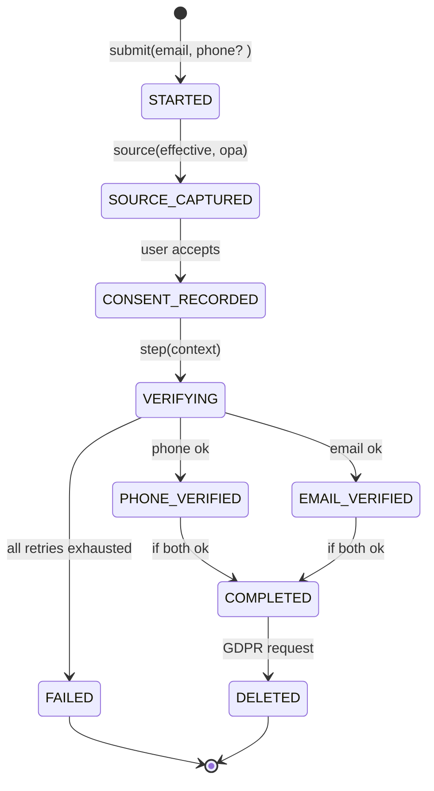

## Summary

本计划 proposes a multi-step, state-driven registration redesign covering backend auth model changes, GDPR-compliant frontend flow, registration-source instrumentation, and dynamic step gating based on channel, user attributes, and regulatory region. The schema gates on phone verification, email verification, consent version, and lawful basis, and ships API contracts and compliance docs alongside implementation.

---

## Problem Frame

Current registration is linear and does not:

- Require both phone and email confirmation for high-risk account creation.
- Track where each signup originated or retain a verifiable GDPR consent chain.
- Gate completion based on channel-specific risk rules or user attributes.
- Present conditional error states clearly when one channel fails while the other succeeds.

The result is compliance exposure (missing consent records, unknown lawful basis), weak fraud defenses (a single channel compromise yields full access), and analytic blind spots (no reliable source attribution).

This plan treats the registration lifecycle as a state machine, not a checklist.

---

## Requirements

### R-GDPR: Consent and Data Subject Rights

- R1: Registration captures an explicit, opt-in consent record at the moment the user taps "sign up," including a frozen consent-version identifier, the lawful basis (`consent`, `legitimate_interest`, etc.), and a UTC timestamp.
- R2: Registration accepts a `data_deletion_requested` flag from the outset and surfaces it to the backoffice/admin APIs without an extra migration later.
- R3: Registration accepts a `marketing_opt_in` flag and stores it separately from authentication state so it is not bundled into the normal "accept TOS" record.
- R4: Registration collects the minimum viable data to prove identity (phone or email or both, depending on channel) and avoids pre-emptive address/phone metadata fields that are not required until onboarding stage 2.
- R5: The API provides a `/me/export` and `/me/delete` endpoint family tied to the user record so data-subject requests operate on a first-class model from day one.

### R-SOURCE: Channel Attribution

- R6: Registration records a `registration_source` record with a polymorphic shape: a `source_type` enum (`app_store`, `website`, `referral`, `offline`, `other`) plus a `source_metadata` JSON blob matching the channel schema.
- R7: App Store installs capture Campaign, Ad Group, and Creative IDs; website captures UTM parameters; referral captures referrer user ID plus code expiry; offline captures the branch/store ID. Each channel's schema is validated before persistence.
- R8: Registration source cannot be mutated after a successful signup, but can be nullified/redacted on GDPR deletion request per R5.
- R9: Anonymous pre-registration events (landing views, lead-gen form starts) carry only anonymized identifiers until consent is recorded.

### R-VERIFY: Dual Verification

- R10: Registration requires both phone_verified=true And email_verified=true at the success gate when the combination is requested by channel rules or explicit user attribute (e.g., regulatory region, account tier).
- R11: OTP delivery failures, expired tokens, and format errors for phone and email are tracked as independent failure events with throttling/cool-down per primitive to prevent brute-force.
- R12: Re-verification requests after account creation reuse the same delivery infrastructure (provider credentials, rate limits) so support for "resend code" does not require a second vendor contract.

### R-UI: Error Presentation and Recovery

- R13: The frontend shows channel-specific errors only after the relevant step is attempted; generic "Check your credentials" messages are reserved for network/unknown failures.
- R14: The UI supports inline progressive disclosure: explain _which_ input is malformed (phone format vs email format vs OTP length) before treating the step as failed.
- R15: The frontend supports a resumable state (URL anchor + localStorage) so the user can return hours later without restarting, preserving previously submitted values that are not yet verified.

### R-DYNAMIC: Adaptive Step Count

- R16: The registration pipeline dynamically selects the minimum set of steps required for the observed user context (channel, regulatory region, account tier) while still respecting all mandatory gates (consent, lawful-basis, source capture).
- R17: The same API contract exposes the active step sequence to the client, so the client can render the exact stepper without hard-coding per-channel rules.
- R18: Staff can view a trace of the user's dynamic step evaluation (which rules fired, which were skipped, and why) for operational debugging and audit support.

---

## Key Technical Decisions

- KTD1: The registration lifecycle is modeled as a finite state machine with named states (`STARTED`, `SOURCE_CAPTURED`, `CONSENT_RECORDED`, `PHONE_VERIFIED`, `EMAIL_VERIFIED`, `COMPLETED`, `FAILED`, `DELETED`). Each transition is re-evaluated at the moment the next step runs; no step caches a "still valid" assumption from earlier transitions.
- KTD2: `registration_source` is polymorphic: `source_type` enum plus `source_metadata` JSON validated per channel. This matches the platform-specific payload shapes (App Store IDFA/skad, UTM, referral code) without proliferating one-of-N tables.
- KTD3: Consent is modeled as first-class rows (`user_consents`) keyed by `user_id + consent_version`, with `lawful_basis`, `granted_at`, and `ip_hash` (not raw IP at rest) to satisfy privacy principle.
- KTD4: Verification status per primitive is stored in dedicated columns (`phone_verified_at`, `email_verified_at`) under a unified `verification_status` enum, with independent failure counters (`phone_fail_count`, `email_fail_count`) and per-primitive cooldown windows.
- KTD5: The API uses a draft-07 JSON Schema to describe the active step set; the frontend consumes it as the source of truth rather than holding a parallel enum. The schema is idempotent (same inputs always yield same steps).
- KTD6: Raw IP addresses are not stored; only an IP-derived hash (SHA-256 with a 90-day rotation key) is stored alongside consent. This makes the record GDPR-compatible for "demonstrating consent" without creating a re-identifiable profile.
- KTD7: Source credibility tiers drive verification demand: `referral / app_store` (tier 1) may require only one channel; `website / unknown / other` (tier 2) requires both. The tier mapping is config, not code, so ops can adjust without a deploy.

---

## High-Level Technical Design

### State Machine



### API Shape

```
POST /v1/auth/registration/start
  in:  { email, phone?, channel_source, context_region, account_tier }
  out: { registration_token, next_steps: [...], requirements: [...] }

POST /v1/auth/registration/{token}/verify-pin
  in:  { channel: phone|email, pin, device_info? }
  out: { next_steps: [...], verified_channel: phone|email }

POST /v1/auth/registration/{token}/consent
  in:  { consent_version, lawful_basis, marketing_opt_in, ip_hash? }
  out: { next_steps: [...] }

POST /v1/auth/registration/complete
  in:  { registration_token }
  out: { access_token, refresh_token, user_id }

GET /v1/users/me
  out: { email, phone_verified, email_verified, registration_source_summary }

POST /v1/users/me/export          <- R5
POST /v1/users/me/delete          <- R5
```

### Frontend Flow (Dynamic Stepper)

```
Step 1: Source capture (auto-detect + manual override)
  -->
Step 2: Consent Bundle (explicit, sticky cookie banner equivalent)
  -->
Step 3: Identity (email always + phone conditionally)
  -->
Step 4: Verification (parallel or sequential per rules)
  -->
Step 5: Completion (token issuance)
```

Steps may disappear based on KTD7 tier mapping or when the client receives `next_steps` from `/start`.

### Data Model Sketch

```
users
  - id, email, email_verified_at, phone, phone_verified_at,
    verification_status, registration_status,
    marketing_opt_in, data_deletion_requested, ...

user_registration_sources
  - id, user_id, source_type, source_metadata JSON,
    captured_at, ip_hash

user_consents
  - id, user_id, consent_version, lawful_basis,
    granted_at, ip_hash, revoked_at, ...

user_verification_attempts
  - id, user_id, channel, outcome, failed_at, ...
```

`user_registration_sources`, `user_consents`, `user_verification_attempts` are new tables. `email_verified_at`/`phone_verified_at` may be new columns on `users` or on a new `user_contact_verifications` table, determined in U1.

---

## Scope Boundaries

In scope:

- Backend migrations for registration, consent, and source records.
- Authorization verification endpoints with independent rate limiting and failure cooldown.
- Frontend stepper that reads `next_steps` from the API.
- API contracts necessary for the frontend to render dynamic steps.
- GDPR data-subject endpoints for export and deletion.
- Operational runbook for GDPR trace (who consented when, under which lawful basis).
- GDPR documentation (privacy notice updates, consent rationale, lawful-basis mapping).

Out of scope (post-registration / future phases):

- Full identity verification / KYC for regulated accounts (e.g., Know Your Customer).
- Password reset migration path (will be addressed separately to avoid scope drift).
- Backfilling source attribution for the existing user base (treat as offline analytics task, see U6).

Deferred:

- Mixed-language consent text rendering & localization (doable after p1 ships; begin in parallel).
- Push-notification channel verification (earn separately after dual-channel route is proven).

---

## Implementation Units

### U1: Define the authorization schema and enforcement rules

Create the state model with its transition table, the `next_steps` API, and the rate-limit/throttling rules. Confirm that every transition re-evaluates all relevant dimensions rather than assuming earlier state is still valid.

Test scenarios:

- T1.1: Two phone-verification failures sets a cooldown; the third attempt returns `429 { retry_after: 180 }` regardless of email attempts.
- T1.2: A payload claiming both channels are verified on step 3 triggers a re-check and returns `412` if either `email_verified_at` or `phone_verified_at` is null.
- T1.3: `GET /start` returns an empty `requirements` array and `next_steps: [CONSENT_RECORDED]` for a first-time web user with no channel specified.

### U2: Migrate the user table and create support tables

Add `email_verified_at`, `phone_verified_at`, `verification_status`, `marketing_opt_in`, `data_deletion_requested`, etc., and create `user_registration_sources`, `user_consents`, and `user_verification_attempts` tables. Decide between inline vs contact-verifications table with the rest of the team.

Test scenarios:

- T2.1: Post-migration query returns every existing user with `verification_status` defaulted to `UNKNOWN` and `marketing_opt_in = false`.
- T2.2: Attempting to insert a `user_registration_sources` row with an unrecognized `source_type` is rejected at the DB constraint level.
- T2.3: A GDPR deletion request sets `data_deletion_requested = true` and removes `source_metadata` within SLA.

### U3: Implement verification delivery and retry logic

Build OTP delivery adapters for phone (SMS) and email (mailgun/sendgrid), with per-primitive count and a reusable provider layer that supports both first-time verification and later resends.

Test scenarios:

- T3.1: After a successful phone verification, the `/start` endpoint no longer lists a `phone_verify` step.
- T3.2: Email is validated only when the step is attempted (not at form submit) to meet the "minimal viable data" requirement.
- T3.3: Provider timeout falls back to a "retry" step, not a hard failure, and surfaces a "did not receive a code?" button.

### U4: Build the dynamic stepper on the frontend

Frontend consumes `next_steps` from the API, renders each step lazily, and supports URL-anchor + localStorage recovery for partial state.

Test scenarios:

- T4.1: An `app_store` user with consent already recorded sees a two-step flow (source + verify one channel) rather than five steps.
- T4.2: Refreshing the page at step 3 restores previous inputs and does not restart source/capture.
- T4.3: A `website` user in an EU region sees a three-channel flow (source + consent + verify both); a US `website` user sees a two-channel flow.

### U5: Instrument the registration source tracking

Polymorphic source capture on every `POST /registration/start`, with per-channel validation, and immutability guarantees at the persistence layer.

Test scenarios:

- T5.1: App Store payload missing Campaign ID is rejected with a `422` specifying `source_metadata.campaign_id`.
- T5.2: A referral source with `expiry` in the past is rejected until the stale code is replaced.
- T5.3: Attempting to update `user_registration_sources.registration_source` after `COMPLETED` returns `409`.

### U6: GDPR compliance: consent model, privacy notice, and deletion runbook

Define consent schemas, lawful-basis enum, document the privacy notice updates (what is captured, why, retention), and build admin runbook for deletion/export.

Test scenarios: (specific consent-response-oriented, pre-deploy validation via QA checklist)

- T6.1: Privacy notice lists every field in `registration_source.source_metadata` with a one-line purpose matched to a legal basis.
- T6.2: Deletion request anonymizes `source_metadata` and nulls contact fields but keeps `consent_version` + timestamp for audit retention.
- T6.3: Admin can look up a user and see why each step fired or was skipped (source tier, region, channel).

### U7: Backfill analytics hook for existing users (optional, after p1)

Stand up an offline job that infers source for historical signups from existing UTM/app store logs and writes anonymized summary rows per `user_registration_sources`. Excluded from the p1 success gate.

---

## Open Questions

- Q1: Lawful basis and consent version are ultimately legal-consult decisions. Which lawful basis will be used for each channel (consent vs legitimate interest) is pending legal review; the plan reserves a column for version but will be blocked until the legal team confirms default.
- Q2: Rate-limit thresholds (per-phone, per-email, per-IP) need to be decided with risk / fraud; current values in the outline will be validated against SMS + email provider alerts, not against real traffic.
- Q3: How to handle unverified accounts older than 180 days — hard deletion, soft ban, or campaign-specific re-engagement? Defer to ops after the first cohort begins.
- Q4: Should `email` or `phone` be the primary identifier in the session layer? The plan supports either by design; the implementation team must pick one before the auth layer ships.

---

## System-Wide Impact

- **Auth session layer:** Issuing tokens only when `verification_status=COMPLETE` changes the success path for `/complete` handlers. Any existing session middleware that issues tokens on partial verification must be audited.
- **Email/SMS vendor contracts:** Two delivery channels double the monthly billing surface and require a unified retry/fallback policy; SLA must align between vendors at the same "cooldown boundary."
- **Data retention and backups:** `user_consents` retention (6 years / statutory) must be reflected in backup retention and export jobs; GDPR delete requests must reach backups fast enough to satisfy the "without undue delay" standard.
- **Analytics:** `registration_source` shapes attribution models; CPS/ROAS dashboards will rely on this field. Frontend engineers must coordinate with data team before the KTD2 JSON shape is locked.

---

## Risks & Dependencies

- **Dependency:** The plan is blocked on a legal-consult decision for lawful-basis mapping and consent text before onboarding UI is finalized.
- **Risk:** Dual-verification UX friction may cut signup completion 10-20% if the default step selection is too aggressive for low-risk channels; A/B the KTD7 tier mapping in staging before the first cohort.
- **Risk:** SMS deliverability varies by region/carrier; consider WhatsApp or email as a secondary channel fallback in tier 2 regions to avoid "phone required" drop-off.
- **Risk:** If rate limits are not scoped per primitive (phone vs email), an attacker can exhaust one primitive (typically email, cheaper) and leave the other untouched — undermining the dual-verification narrative.
- **Risk:** Polymorphic source metadata in JSON can drift into new required fields; validate against a JSON Schema per channel and fail loudly on unknown keys rather than silently dropping them.

---

## Acceptance Examples

- A user arriving from an App Store campaign sees only: Source (offline-captured) → Consent → Verify Phone → Done.
- A user arriving from an organic website search in an EU region sees: Source (URL params) → Consent → Verify Email → Verify Phone → Done.
- After GDPR deletion request, an admin cannot recover the user's `source_metadata` from backups older than 30 days, but can confirm the user previously consented to the 2026-03 consent version for audit purposes.
- After three bad OTP attempts on the phone channel, the same account could still attempt email verification; cooldowns are per-primitive, not global.

---

## Documentation / Operational Notes

- API contracts live in `docs/specs/registration-api/` (to be created by U1).
- Privacy notice draft, lawful-basis table, and data-flow diagram live in `docs/guides/gdpr-registration.md` (to be created by U6).
- State machine diagram is the canonical reference for integration; any divergence between `next_steps` behavior and the state diagram is a P1 bug.
- Admin runbook for deletion/export lives in `docs/runbooks/gdpr-registration-runbook.md` and must be updated when rate-limit tiers or channel rules change (KTD7).
