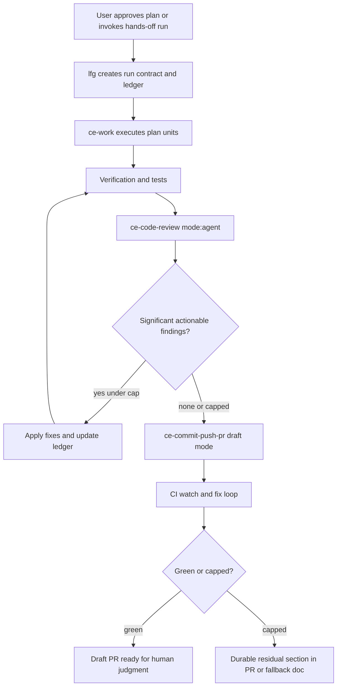

# Plan-Bounded Autopilot

**Target repo:** EveryInc/compound-engineering-plugin

## Summary

Add a plan-bounded autopilot path to Compound Engineering by evolving the existing full-pipeline workflow instead of introducing a separate runtime. The change makes an approved plan executable through implementation, verification, review-fix loops, draft PR creation, and CI follow-up while keeping escalation, residual risk, and release control visible to the human.

---

## Problem Frame

Compound Engineering already has strong primitives for planning, execution, code review, PR creation, and CI repair. The gap is coordination: after a plan is accepted, the agent still often pauses at predictable phase boundaries or after routine interruptions even when the next action is implied by the plan.

The requirements call for bounded autonomy, not open-ended agency. The implementation should make continuation inspectable and resumable, and it should only remove prompts that do not protect a real decision.

---

## Implementation Preconditions

- Execute this plan from a checkout or worktree of `EveryInc/compound-engineering-plugin`. This local planning workspace is only the artifact home; it does not contain the plugin source paths listed below.
- When carrying the plan into the target checkout, preserve the origin requirements and ideation docs as planning context, but do not treat this docs-only workspace as the implementation root.

---

## Autopilot Run Contract

**Allowed actions**

- Continue through implementation, focused verification, review-fix-review loops, draft PR creation, and CI follow-up without asking for phase-by-phase confirmation.
- Create and update a run ledger before implementation and after each phase transition.
- Commit and push scoped changes when verification has run and no unresolved blocker remains outside the residual handoff path.
- Create or update a draft PR, preserving residual review findings and other caller-owned durable sections.

**Forbidden actions**

- Do not merge, mark a PR ready for review, create a release, run production-impacting commands, rotate secrets, or perform destructive repository cleanup.
- Do not continue through a major scope, architecture, stack, provider, cost-bearing, security-sensitive, or production-impacting decision that this plan does not already authorize.
- Do not treat human-owned or release-owned P1/P2 review findings as clean; make them durable residuals when they are not agent-fixable.

**Escalation triggers**

- Pause for user input when the implementation discovers a material architecture/provider change, a production-impacting operation, a secret-touching operation, or a decision that would broaden the plan scope.
- Stop and report when required review, verification, commit, push, or PR-body-update actions are blocked by the write boundary or fail repeatedly.

**Retry caps**

- Review-fix-review loop: 3 iterations.
- CI fix loop: 3 iterations.
- Repeated tool failure: 3 consecutive failures for the same phase before recording a residual and stopping or moving only through non-write phases.

**GitHub write boundary**

```json
{
  "commit_allowed": true,
  "push_allowed": true,
  "draft_pr_allowed": true,
  "pr_body_update_allowed": true
}
```

**Resume state**

- Use the run ledger as the source of truth for repo identity, branch, current phase, retry counters, open residuals, blocked writes, and next action.
- Resume only when the ledger repo identity matches the active checkout and the user's latest instruction does not conflict with this plan.

**Evidence-research triggers**

- Use current external research before introducing a new technology stack, AI model/provider/API, security-sensitive dependency, cost-bearing service, or architecture pattern whose best choice may have changed recently.
- Prefer local repo patterns for routine prose, skill-contract, test, and documentation changes when the plan already names the target behavior.

---

## Requirements

**Run contract and resume**

- R1. Autopilot execution must start only from an approved plan or an explicit hands-off feature request that first produces a plan. See origin requirements R1-R4.
- R2. The run must create a durable ledger recording repo identity, plan path, branch, current phase, retry counters, last verification, open residuals, escalation state, and next action. See origin requirements R2-R4.
- R3. Resume behavior must read the ledger and continue from the next safe action when the user gives a non-conflicting continuation signal. See origin flow F2.

**Interrupt and escalation policy**

- R4. Routine user messages during an active run must be treated as context updates unless they contain pause, stop, hold, change-course language, or conflict with the approved plan. See origin acceptance examples AE1-AE2.
- R5. The agent must pause before destructive, irreversible, secret-touching, cost-bearing, production-impacting, major scope, major architecture, stack, or provider-changing actions. See origin requirements R8-R10.
- R6. Fast-moving architectural, stack, model, API, provider, or security-sensitive decisions discovered during execution must trigger source-weighted and freshness-aware research or become explicit residual assumptions. See origin requirements R17-R19.

**Quality loops**

- R7. Code review must run in machine-readable mode inside autopilot, and significant actionable findings must be fixed and re-reviewed until clean, capped, or escalated. See origin requirements R11-R13.
- R8. CI follow-up must repair failing checks within the run contract and record remaining failures durably after the retry cap. See origin requirements R10 and R16.
- R9. Low-signal, duplicate, stylistic, or speculative review findings must not keep the loop alive indefinitely. See origin requirement R13.

**Shipping boundary**

- R10. Autopilot may commit scoped changes, push the branch, and open or update a draft PR when the run contract allows GitHub writes. See origin acceptance example AE4.
- R11. Autopilot must not mark a PR ready, merge, release, run production migrations, or perform production write canaries without explicit human approval. See origin requirements R14-R16.

**Compatibility and adoption**

- R12. The change must preserve the normal `/ce-plan`, `/ce-work`, `/ce-code-review`, and `/ce-commit-push-pr` experience for users who do not opt into autopilot.
- R13. Behavioral skill changes must be covered by contract tests and a skill-eval style validation path, not prose inspection alone.

---

## Key Technical Decisions

- KTD1. **Use `/lfg` as the autopilot surface.** `/lfg` already owns the full pipeline and is explicitly hands-off, so extending it avoids a second workflow users must learn. `/ce-work`, `/ce-code-review`, and `/ce-commit-push-pr` stay focused primitives.
- KTD2. **Add an optional Autopilot Run Contract to plans.** `/ce-plan` should emit this section only when the request, origin doc, or `/lfg` invocation asks for autopilot or hands-off execution. Ordinary plans should not gain extra ceremony.
- KTD3. **Store local resume state in a repo-safe run artifact location.** Prefer `.context/compound-engineering/autopilot-runs/` only when the active project repo ignores or explicitly allows `.context/`; otherwise use a stable OS-temp path such as `/tmp/compound-engineering/lfg/<run-id>/`. Durable residuals that must survive outside the local machine still belong in a PR body or tracked fallback doc.
- KTD4. **Use conservative default caps.** Review-fix-review gets 3 iterations, CI fix gets 3 iterations, and repeated tool failure gets 3 consecutive attempts before durable residual handoff. These match the existing CI loop shape and prevent infinite progress theater.
- KTD5. **Make draft PR creation an explicit shipping mode.** `/ce-commit-push-pr` should accept a draft-PR token that adds `--draft` for new PRs and leaves existing PR readiness state unchanged. `/lfg` passes that token when running autopilot.
- KTD6. **Treat evidence escalation as a run-contract rule, not universal browsing.** `/ce-work` should honor the Autopilot Run Contract when a plan contains one, using current external research only for fast-moving or high-stakes decisions instead of slowing routine local-pattern work.
- KTD7. **Validate prompt behavior through contract tests plus skill-creator evals.** The repository already protects skill contracts with Bun tests; new autopilot behavior should add similar sentinel tests and then use `skill-creator` to evaluate live skill prose.

---

## High-Level Technical Design

Autopilot is a coordinator around existing CE skills. The plan and ledger are the control plane; the existing skills remain the workers.



The ledger should be readable enough for a human and structured enough for the next agent turn. A markdown ledger with a small fenced JSON state block is enough for v1: the markdown explains the run, while the JSON block gives resume logic stable fields.

---

## Implementation Units

### U1. Add plan-time Autopilot Run Contract support

- **Goal:** Teach planning to produce a compact run contract when autopilot is explicitly requested or when `/lfg` invokes planning for a hands-off/autopilot run.
- **Files:** Modify `plugins/compound-engineering/skills/ce-plan/SKILL.md`, `plugins/compound-engineering/skills/ce-plan/references/plan-sections.md`, and the nearest skill docs under `docs/skills/ce-plan.md` if present in the target checkout. Create or update `tests/skills/ce-plan-autopilot-contract.test.ts`.
- **Approach:** Add a material-only plan section for allowed actions, forbidden actions, escalation triggers, retry caps, GitHub write boundary, and evidence-research triggers. Keep the section absent for normal plans unless the input asks for hands-off/autopilot/LFG behavior.
- **Patterns to follow:** `tests/skills/ce-plan-output-mode.test.ts` and `tests/skills/ce-plan-handoff-routing.test.ts` for prose-contract assertions that protect cached skill behavior.
- **Test scenarios:** A normal plan request does not require an Autopilot Run Contract; an explicit autopilot request does; an LFG hands-off/autopilot plan does; the section includes draft PR, no-merge, retry caps, resume state, and evidence escalation.
- **Verification:** Run `bun test tests/skills/ce-plan-autopilot-contract.test.ts tests/skills/ce-plan-output-mode.test.ts tests/skills/ce-plan-handoff-routing.test.ts`.

### U2. Add `/lfg` run ledger and resume protocol

- **Goal:** Make `/lfg` the plan-bounded autopilot coordinator with durable run state and resume semantics.
- **Files:** Modify `plugins/compound-engineering/skills/lfg/SKILL.md`. Add `plugins/compound-engineering/skills/lfg/references/autopilot-run-contract.md` or `plugins/compound-engineering/skills/lfg/references/run-ledger.md`. Create or update `tests/lfg-autopilot-contract.test.ts`.
- **Approach:** Extend `/lfg` argument handling to accept a feature description, a plan path, or a resume signal. At run start, choose a ledger location by first checking whether `.context/compound-engineering/autopilot-runs/<run-id>/` is ignored or allowed by the active project repo; if not, fall back to a stable OS-temp path such as `/tmp/compound-engineering/lfg/<run-id>/`. Record the chosen path and write repo root, repo remote, plan path, branch, head SHA, current phase, retry counters, last verification, residuals, escalation state, and next action. On resume, load the latest matching active ledger for the current repo identity and branch, then continue from the recorded next action unless the user message conflicts with the plan.
- **Patterns to follow:** Existing `/lfg` gate structure in `plugins/compound-engineering/skills/lfg/SKILL.md`; AGENTS.md scratch-space rules for `.context/`; `/tmp/compound-engineering/ce-code-review/<run-id>/` as precedent for discoverable run artifacts.
- **Test scenarios:** New runs create a ledger before implementation; ignored `.context/` repos use the repo-local ledger path; repos where `.context/` is not ignored use the OS-temp fallback; each phase updates current phase and next action; resume reads an active ledger; pause/stop/hold language prevents continuation; non-conflicting context updates are incorporated and execution continues.
- **Verification:** Run `bun test tests/lfg-autopilot-contract.test.ts`.

### U3. Convert review handling into a capped review-fix-review loop

- **Goal:** Replace the single review pass in `/lfg` with an autonomous loop that fixes significant actionable findings and re-reviews until clean or capped.
- **Files:** Modify `plugins/compound-engineering/skills/lfg/SKILL.md`, `plugins/compound-engineering/skills/lfg/references/review-followup.md`, and `plugins/compound-engineering/skills/lfg/references/tracker-defer.md` if residual handoff fields need to be shared. Update `tests/pipeline-review-contract.test.ts` or create `tests/lfg-review-loop-contract.test.ts`.
- **Approach:** Keep `ce-code-review mode:agent plan:<plan-path>` as the review contract. After applying fixes, re-run review when significant actionable findings were fixed or remain. Stop after 3 review iterations, when no significant actionable findings remain, or when a finding requires human judgment. Record capped findings in the ledger and in the PR/fallback residual sink.
- **Patterns to follow:** `plugins/compound-engineering/skills/ce-code-review/SKILL.md` JSON output contract; `tests/review-skill-contract.test.ts`; existing `/lfg` residual handoff section.
- **Test scenarios:** A clean review skips follow-up; actionable findings trigger fix and re-review; low-signal findings do not loop forever; capped findings become durable residuals; residuals are not left only in transient session text.
- **Verification:** Run `bun test tests/lfg-review-loop-contract.test.ts tests/pipeline-review-contract.test.ts tests/review-skill-contract.test.ts`.

### U4. Add draft PR mode to shipping

- **Goal:** Ensure autopilot can push and open or update a PR without crossing the human-owned readiness and merge boundary.
- **Files:** Modify `plugins/compound-engineering/skills/ce-commit-push-pr/SKILL.md`, `plugins/compound-engineering/skills/ce-commit-push-pr/references/pr-description-writing.md` if body context needs draft wording, and `plugins/compound-engineering/skills/lfg/SKILL.md`. Create `tests/ce-commit-push-pr-draft-contract.test.ts`.
- **Approach:** Add a literal-prefix token such as `draft:true` for full PR creation mode. New PR creation uses `gh pr create --draft`; existing PR updates push commits and refresh body content without marking ready. `/lfg` passes draft mode by default for autopilot. In autopilot draft mode, suppress nonessential PR-description and evidence-capture prompts; use available verification, review, CI, and residual context, and record skipped optional evidence instead of blocking unless the run contract explicitly requires that evidence.
- **Patterns to follow:** Token parsing conventions in `ce-plan` and `ce-work-beta`; current `ce-commit-push-pr` branch and PR-state resolution; AGENTS.md merge policy requiring PRs for `main`.
- **Test scenarios:** `draft:true` is recognized and stripped from description input; new PR command includes `--draft`; existing PR path does not attempt to mark ready; autopilot draft mode does not stop for optional PR-body or demo-evidence prompts; no autopilot path invokes merge, ready-for-review, production migrations, or production write canaries.
- **Verification:** Run `bun test tests/ce-commit-push-pr-draft-contract.test.ts`.

### U5. Make `/ce-work` honor Autopilot Run Contract escalation rules

- **Goal:** Prevent the execution primitive from silently making high-stakes decisions when it is running under an autopilot plan.
- **Files:** Modify `plugins/compound-engineering/skills/ce-work/SKILL.md`, `plugins/compound-engineering/skills/ce-work-beta/SKILL.md` if the beta surface mirrors plan execution behavior, and possibly `plugins/compound-engineering/skills/ce-work/references/shipping-workflow.md` for quality gate wording. Update `tests/pipeline-review-contract.test.ts` or create `tests/ce-work-autopilot-contract.test.ts`.
- **Approach:** During plan reading, detect an Autopilot Run Contract section. Carry its allowed actions, escalation triggers, and evidence-research triggers into task execution. If implementation discovers a major architecture, stack, provider, model/API, security-sensitive, destructive, production-impacting, or cost-bearing decision, pause or record a residual rather than pushing through. For fast-moving technical decisions, invoke current external research if tools are available; otherwise mark the decision as an assumption.
- **Patterns to follow:** `ce-work` plan-reading behavior for `Execution note`, `Scope Boundaries`, and `Implementation-Time Unknowns`; `ce-plan` research failure honesty; `ce-web-researcher` source-weighting guidance.
- **Test scenarios:** Plans without a run contract behave as before; plans with a run contract carry escalation triggers into execution; provider/stack changes are not silently made; unavailable research becomes an assumption or escalation item.
- **Verification:** Run `bun test tests/ce-work-autopilot-contract.test.ts tests/pipeline-review-contract.test.ts`.

### U6. Document and validate the autopilot workflow

- **Goal:** Make the behavior discoverable and protect it from drift across plugin releases.
- **Files:** Modify `plugins/compound-engineering/README.md`, `docs/skills/lfg.md`, `docs/skills/ce-work.md`, `docs/skills/ce-commit-push-pr.md`, and any generated component docs that own skill summaries. Update `tests/release-metadata.test.ts` only if metadata assertions require it.
- **Approach:** Document the user-facing contract: one approved plan, resume ledger, automatic review/fix loops, draft PR only, CI repair cap, and escalation triggers. Keep future-roadmap ideas out of v1 docs except as brief non-goals.
- **Patterns to follow:** Existing README skill tables and docs under `docs/skills/`; AGENTS.md instruction that plugin behavior changes should update substantive docs.
- **Test scenarios:** README and skill docs name draft PR boundary, no automatic merge, resume ledger, review loop cap, CI cap, and escalation triggers; plugin inventory counts remain valid if no new skill is added.
- **Verification:** Run `bun test`, `bun run release:validate`, and the `skill-creator` eval suite at `plugins/compound-engineering/skills/lfg/evals/`, which exercises a plan-path autopilot run, a resume after interruption, a review-loop cap, and a draft-PR shipping path.

---

## Acceptance Examples

- AE1. **Routine interruption resumes**
  - **Covers:** R3, R4
  - **Given:** `/lfg` is running against an approved plan and the ledger says the current phase is review follow-up.
  - **When:** The user sends a clarification that does not change the plan.
  - **Then:** The run records the clarification and continues from the next ledger action.

- AE2. **Explicit hold stops before push**
  - **Covers:** R4, R10, R11
  - **Given:** The next ledger action is draft PR creation.
  - **When:** The user says "hold before pushing."
  - **Then:** The run pauses before GitHub writes and records the pause in the ledger.

- AE3. **Stack change escalates**
  - **Covers:** R5, R6
  - **Given:** Implementation discovers that satisfying the plan may require switching providers or frameworks.
  - **When:** The decision is not already approved in the Autopilot Run Contract.
  - **Then:** The agent researches current evidence when possible and asks for human approval before changing direction.

- AE4. **Review loop converges**
  - **Covers:** R7, R9
  - **Given:** `ce-code-review mode:agent` returns significant actionable findings with suggested fixes.
  - **When:** The fixes are applied and verified.
  - **Then:** `/lfg` re-runs review and proceeds only when significant actionable findings are gone or the cap is reached.

- AE5. **CI cap creates durable residual**
  - **Covers:** R8
  - **Given:** CI remains red after the maximum fix attempts.
  - **When:** An open draft PR exists.
  - **Then:** The PR body is updated with a `CI Failures Unresolved` section and the ledger records the capped state.

---

## Scope Boundaries

**Included**

- `/lfg` as the plan-bounded autopilot coordinator.
- Optional Autopilot Run Contract in `/ce-plan`.
- Local run ledger and resume behavior.
- Capped review-fix-review loop.
- Draft PR creation/update path.
- CI repair cap and durable residual recording.
- Evidence-aware escalation for fast-moving technical decisions.
- Contract tests and skill-eval validation.

**Deferred to follow-up work**

- Multi-repo or multi-worktree orchestration.
- Organization-level autonomy policy packs.
- Reviewer calibration based on accepted/rejected findings history.
- Scheduled landscape-memory refreshes.
- Parallel plan-unit ownership by independent long-running agents.
- Budget-aware autonomy that trades off time, tokens, CI minutes, and confidence.

**Out of scope**

- Automatic merge, release, deployment, or production data mutation.
- Replacing `/ce-work`, `/ce-code-review`, or `/ce-commit-push-pr`.
- Rewriting CE around a new orchestration framework.
- Making autopilot the default for ordinary `/ce-work` invocations.

---

## System-Wide Impact

- **Skill behavior:** This changes user-visible behavior for `/lfg`, optional `/ce-plan` output, `/ce-work` plan-reading, and `/ce-commit-push-pr` PR creation mode.
- **Converter output:** Skill and agent prose is product code. Any new reference file must stay inside its skill directory so converters can copy it self-contained.
- **Local filesystem state:** Autopilot creates a user-visible local run ledger, preferring ignored `.context/compound-engineering/autopilot-runs/` and falling back to a stable OS-temp path when repo policy does not allow repo-local scratch state.
- **GitHub workflow:** Autopilot PRs should default to draft, and readiness/merge remains human-owned.
- **Research behavior:** External research becomes conditional on run-contract escalation triggers rather than universal browsing.

---

## Risks & Dependencies

- **Prompt-only behavior can drift:** Contract tests should assert sentinel language and routing shape, and `skill-creator` evals should exercise the actual behavior.
- **Wrong implementation root would block execution:** This plan must be carried into a `EveryInc/compound-engineering-plugin` checkout before `/ce-work` starts; the current planning workspace only stores docs.
- **Resume can pick the wrong run:** Ledger discovery needs repo identity first, then branch, plan path, and head SHA matching to avoid resuming stale work.
- **Repo-local state may leak into user repos:** Ledger creation must verify ignore policy before writing `.context/`; otherwise it should use the OS-temp fallback and surface the chosen path.
- **Draft PR support may conflict with existing PR updates:** Existing open PRs should keep their current draft/ready state unless the user explicitly changes it.
- **Research tools may be unavailable:** The run contract must record requested-but-unavailable research as an assumption or escalation item.
- **Autopilot could over-prompt if escalation wording is too broad:** Tests and evals should include routine local-pattern work that proceeds without unnecessary questions.

---

## Documentation / Operational Notes

- Update user-facing docs to say autopilot reduces repeated "continue?" prompts but does not remove human control over readiness, merge, release, secrets, cost, production writes, or architecture pivots.
- Keep docs clear that `/lfg` is manual opt-in and should not auto-route casual conversation.
- Add a short example using an existing plan path and a resume invocation once the exact invocation syntax is implemented.

---

## Sources / Research

- Origin requirements: `docs/brainstorms/2026-06-07-plan-bounded-autopilot-requirements.md`
- Prior ideation: `docs/ideation/2026-06-07-compound-engineering-planning-evidence-ideation.md`
- Target repo instructions: `AGENTS.md`
- Target repo workflow primitives: `plugins/compound-engineering/skills/lfg/SKILL.md`, `plugins/compound-engineering/skills/ce-work/SKILL.md`, `plugins/compound-engineering/skills/ce-code-review/SKILL.md`, `plugins/compound-engineering/skills/ce-commit-push-pr/SKILL.md`, `plugins/compound-engineering/agents/ce-web-researcher.md`
- Target repo tests to follow: `tests/pipeline-review-contract.test.ts`, `tests/review-skill-contract.test.ts`, `tests/skills/ce-plan-handoff-routing.test.ts`, `tests/skills/ce-plan-output-mode.test.ts`
- OpenAI: [Harness engineering](https://openai.com/index/harness-engineering/), [Background mode](https://developers.openai.com/api/docs/guides/background), [Agents SDK harness and sandbox update](https://openai.com/index/the-next-evolution-of-the-agents-sdk/)
- Anthropic: [Building effective agents](https://www.anthropic.com/engineering/building-effective-agents), [Effective harnesses for long-running agents](https://www.anthropic.com/engineering/effective-harnesses-for-long-running-agents), [Trustworthy agents in practice](https://www.anthropic.com/research/trustworthy-agents)
