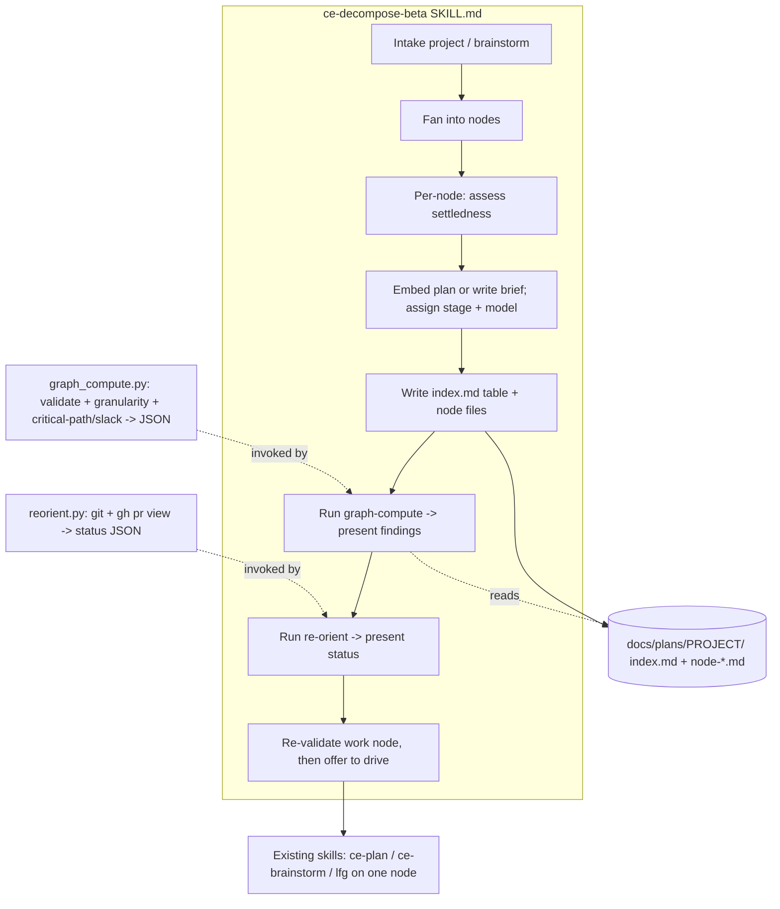
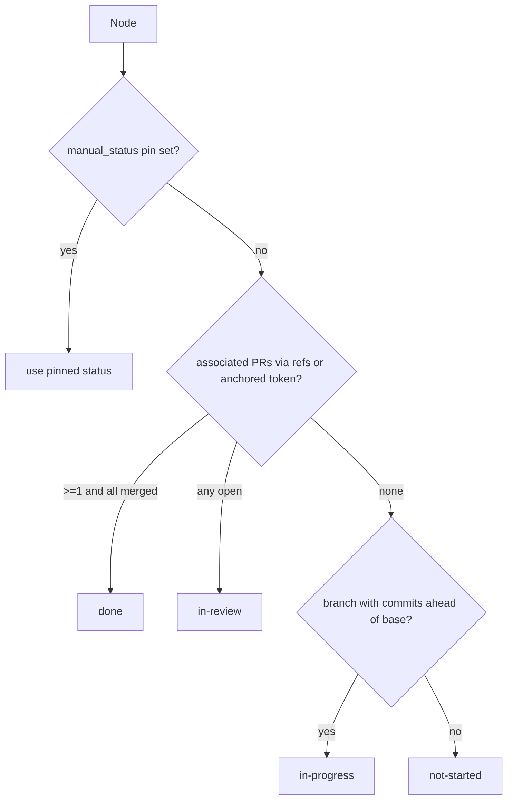

# feat: ce-decompose + Committed Task-Graph (Foundation)

## Summary

Build `ce-decompose-beta`, a new compound-engineering skill that turns a big project into a committed, diffable **task-graph** — a markdown index table plus one markdown file per node under `docs/plans/<project>/`. Each node is a feature-sized unit tagged with an entry stage (`brainstorm`/`plan`/`work`) and a model tier; ce-decompose embeds a ready `ce-plan`-shaped plan when confident and writes a brief otherwise. The foundation ships three capabilities together (rungs 1–3 of the family roadmap): the decompose producer, a granularity guard + critical-path/slack pass, and a stateless status re-orient that derives state from git. The downstream family (ce-next, ce-tracker-sync, ce-fanout, recovery) is deferred; the index schema is designed complete for rungs 1–4 and carries a `schema_version` so later rungs evolve it additively rather than via a breaking migration.

---

## Problem Frame

Breaking a large project into workable pieces is currently a manual ritual run in a long-lived model session: shatter the project into features, hand-create tickets, hold the dependency map and "what's next" in one chat's head. That state dies at context compaction, can't resume on another machine, and isn't reviewable. The execution primitives already exist — `ce-plan` decomposes one feature into U-ID units, `ce-work` runs parallel worktree-isolated sub-agents, `lfg` runs the full per-unit pipeline — but nothing sits above them to decompose a multi-feature project, carry a cross-ticket dependency map, or track project state outside a session. This foundation is the spine the rest of an orchestration family becomes thin layers on. See origin: `docs/brainstorms/2026-06-21-ce-decompose-task-graph-requirements.md`.

---

## Key Technical Decisions

- **KTD1 — Ship as `ce-decompose-beta` first.** Standalone `ce-decompose-beta/` directory, `disable-model-invocation: true`, `[BETA]` description prefix written so promotion is a prefix removal, and `-beta`-suffixed graph artifacts so beta and future stable graphs never collide. Rationale: the skill chains into core skills (`ce-plan`/`ce-brainstorm`/`lfg`); manual-invoke is the right rollout posture and fits dogfooding against real in-flight projects (origin Key Decisions; `docs/solutions/skill-design/beta-skills-framework.md`).
- **KTD2 — Markdown-table index, markdown node files.** The index is a single markdown file: a table with one row per node for the flat fields plus comma-separated cells for list fields (dependencies, PR refs). Chosen over YAML (Python's stdlib has *no* YAML parser and the repo declares no third-party Python deps — see KTD4), JSON (stdlib-parseable but poorer for human editing and diffs), and a single self-contained file (status churn makes its diffs unreadable). A markdown table is human-editable, diffs one row at a time, and parses with stdlib line/cell splitting. Node files are markdown — a `ce-plan` plan for work-ready nodes, a brief otherwise.
- **KTD3 — Schema complete for rungs 1–4; versioned additive evolution after.** The index carries the fields rungs 1–4 consume — `id`, `title`, `stage`, `model`, `status`, `manual_status`, `depends_on`, `node_file`, `branch_ref`, `pr_refs`, `base_commit` — and an index-header `schema_version`. Fields whose semantics only become knowable when a later rung is designed (tracker-sync conflict metadata, recovery checkpoint/lease state, circuit-breaker counters) are **not** speculatively added now; `schema_version` makes adding them later a cheap, backward-compatible migration rather than a breaking one. (Revised from a "no migration ever" claim, which the deferred rungs' own unforeseeable state needs would have falsified.)
- **KTD4 — Script-first; stdlib-only; Claude-Code-only for beta.** A single bundled Python 3 **stdlib-only** script owns all DAG math (parse the markdown index + node files → validate → topological sort → critical-path/slack → granularity audit → JSON). A second stdlib-only script owns status re-orient (git + `gh pr view` → JSON). SKILL.md presents the JSON and is forbidden from recomputing or re-classifying (`docs/solutions/skill-design/script-first-skill-architecture.md`). Python over Bash because both chain CLIs with conditional failure paths (`docs/solutions/best-practices/prefer-python-over-bash-for-pipeline-scripts.md`). **For the beta, both scripts are Claude-Code-only**: the existence-guard `else` branch emits "this skill requires Claude Code; graph computation / status derivation is unavailable on this platform" rather than attempting an error-prone inline reproduction (the git/`gh` state machine in particular cannot be reliably reproduced by an LLM inline). An off-Claude story is revisited at promotion.
- **KTD5 — Split ownership, with an explicit manual status pin.** Committed files own structure (nodes, edges, embedded plans, stage/model tags). Live status is derived on read; the index `status` column is a refreshable cache. **A node may carry a `manual_status` pin that re-orient always respects over the derived value** (until the human clears it). This resolves the otherwise-silent overwrite of a human who marks a node done/blocked for work git can't see (vendored deps, external repos, manual ops). `blocked` and `done` are the common pins; any status value is pinnable.
- **KTD6 — Variable-depth nodes.** ce-decompose assigns stage by settledness (settled+plannable → `work` with embedded plan; clear-but-needs-design → `plan`; ambiguous → `brainstorm`) and model by task shape (well-specified mechanical → generation tier; cross-cutting/architectural → ceiling tier). Both are recommendations a human overrides by editing the committed graph; overridden values are respected, not recomputed away.
- **KTD7 — Granularity guard reports, does not hard-block; scoped by stage.** The guard surfaces findings for human review before the graph is finalized (CE's visible-preview philosophy); correctness-class findings (cycle, missing dependency, orphan) are flagged prominently. **The missing/spurious-dependency check runs only over `work`-stage nodes** — they are the only nodes with embedded `Files:` lists; `brainstorm`/`plan`-stage briefs carry no file enumeration, so a file-level edge check is impossible for them and the guard says so rather than silently passing them. Cycle detection, orphan detection, and critical-path/slack run over **all** nodes (edges exist regardless of stage). The file check distinguishes files an upstream node **creates** from files already present in the repo, so editing an existing committed file is not mis-flagged as a missing dependency.
- **KTD8 — Node↔git mapping: explicit refs (1:N) with an anchored-token fallback.** A node carries an optional `branch_ref` and a `pr_refs` list (0..N — a feature-sized node may span several PRs). When refs are absent, re-orient falls back to an **anchored** ID-token convention — the node ID as a delimited token in the branch name (`<id>/...`) or PR title (`[<id>]`), never bare substring matching (which would bind `n3` to `n30`). When 0 candidates match → `not-started`; >1 ambiguous candidates → flag and leave `not-started` with a note, never silently pick.
- **KTD9 — Duplicate the `ce-plan` unit schema into references.** Skills are self-contained — no cross-skill file references — so the embedded-plan field contract is duplicated into `ce-decompose-beta/references/`, including the machine-parseable `Files:` line format with explicit `(create)`/`(modify)` markers that the granularity guard (U3) keys on. The reference names its `ce-plan` source to manage drift.
- **KTD10 — Status vocabulary and 1:N derivation rule.** Vocabulary: `not-started` / `in-progress` / `in-review` / `done` / `blocked`. Derivation per node (when no `manual_status` pin is set): **`done`** when the node has ≥1 associated PR and *all* of them are merged; **`in-review`** when any associated PR is open; **`in-progress`** when a branch exists with commits ahead of the base branch but the done/in-review conditions are unmet; **`not-started`** when no branch, PR, or commits exist. A node completed by direct commits with no PR reaches `done` only via a `manual_status: done` pin in v1 (automatic no-PR completion detection is deferred — see Open Questions). The base branch for the commit-ahead check is resolved once via `git symbolic-ref refs/remotes/origin/HEAD` (fallback `gh repo view`), then merge-base.

---

## High-Level Technical Design

Component shape — the skill orchestrates two bundled scripts over the committed graph and presents their JSON; per-node execution reuses existing skills:



Re-orient status derivation per node (state machine, re-probing at each decision — never a stale earlier value):



`gh pr view` returning non-zero "no PR" is an expected state transition, not a failure — the script captures the exit code itself (`docs/solutions/skill-design/git-workflow-skills-need-explicit-state-machines.md`). Ambiguous anchored-token matches (>1 candidate) are flagged, not silently resolved.

---

## Output Structure

```text
plugins/compound-engineering/skills/ce-decompose-beta/
  SKILL.md
  references/
    task-graph-schema.md        # index markdown-table columns, node-file conventions, status vocab, ID rules, schema_version
    embedded-unit-schema.md     # duplicated ce-plan unit field contract + Files (create)/(modify) markers + U-ID stability
  scripts/
    graph_compute.py            # validate + granularity + critical-path/slack -> JSON
    reorient.py                 # git + gh pr view -> status JSON

tests/fixtures/ce-decompose/    # sample graphs incl. a real manually-decomposed project (golden fixture)
tests/ce-decompose-scripts.test.ts   # bun test invoking the python scripts via Bun.spawn
```

A produced task-graph lands at `docs/plans/<project>/index.md` + `docs/plans/<project>/<node-id>-<slug>.md`. Test fixtures live under `tests/fixtures/` (not in the skill dir) to match the repo's existing Python-script test pattern and keep the installed/converted skill lean.

---

## Implementation Units

### U1. Scaffold `ce-decompose-beta` and register it

- **Goal:** Create the skill directory with valid frontmatter and a phase skeleton; register it so validation passes.
- **Requirements:** Advances the foundation delivery (origin R1, R15); establishes the home for all later units.
- **Dependencies:** none
- **Files:** `plugins/compound-engineering/skills/ce-decompose-beta/SKILL.md` (create, skeleton), `plugins/compound-engineering/README.md` (modify — add skill row, update count). Also resolve during this unit whether the `docs/skills/` convention requires a skill doc for a `-beta` skill (check plugin `AGENTS.md`); if required, create `docs/skills/ce-decompose-beta.md` here and U7 finalizes it, otherwise U7 drops it.
- **Approach:** Frontmatter: `name: ce-decompose-beta` (must equal dir), `description` (`[BETA]`-prefixed, what+when, ≤1024 chars, backtick-wrap any angle-bracket tokens), `disable-model-invocation: true`, `argument-hint`. Phase headings stubbed for the workflow built in U5/U6. No marketplace.json / plugin.json edits — skill count is computed dynamically by `release:validate` (`src/release/metadata.ts`), not declared.
- **Patterns to follow:** `plugins/compound-engineering/skills/ce-update/SKILL.md:1-13` (frontmatter incl. `disable-model-invocation`), `ce-plan/SKILL.md:1-5`.
- **Test scenarios:** Covers frontmatter contract. `bun test tests/frontmatter.test.ts` passes — name equals directory; `ce-` prefix present; description ≤1024 chars with no unwrapped angle brackets. `bun run release:validate` passes and the reported skill count increments by one.
- **Verification:** `bun test` and `bun run release:validate` are green; the skill appears in the README inventory with an accurate count; the skill-doc convention question is resolved and U7's file list matches the answer.

### U2. Define the task-graph schema and reference files

- **Goal:** Specify the markdown-table index columns, node-file conventions, and the embedded-plan contract that scripts and the workflow consume.
- **Requirements:** origin R1–R12, R16 (schema-bearing); KTD2, KTD3, KTD5, KTD8, KTD9, KTD10.
- **Dependencies:** U1
- **Files:** `plugins/compound-engineering/skills/ce-decompose-beta/references/task-graph-schema.md` (create), `plugins/compound-engineering/skills/ce-decompose-beta/references/embedded-unit-schema.md` (create)
- **Approach:** Document the index as a markdown table, one row per node, columns: `id`, `title`, `stage`, `model`, `status` (cache), `manual_status` (optional pin), `depends_on` (comma-separated node IDs), `node_file`, `branch_ref` (optional), `pr_refs` (comma-separated, optional), `base_commit` (optional; the commit a work node's embedded plan was authored against — see KTD on staleness in U6). Define an index-header line carrying `schema_version`. Define the ID scheme: stable, globally unique, never renumbered, gaps allowed, and an **anchored token form** safely matchable in branch/PR names (`n7`, used as `n7/` in branches and `[n7]` in PR titles per KTD8). Specify list-cell escaping so a stdlib split is unambiguous. In `embedded-unit-schema.md`, duplicate `ce-plan`'s per-unit field contract and U-ID stability rule, and specify the machine-parseable `Files:` line format with explicit `(create)`/`(modify)` markers (KTD9) that U3's guard keys on; note the `ce-plan` source for drift management.
- **Patterns to follow:** `plugins/compound-engineering/skills/ce-plan/references/plan-sections.md` (unit fields, ID rules, metadata-field stability).
- **Test scenarios:** `Test expectation: none -- reference documents; the schema is exercised by the scripts in U3/U4 and validated through their fixtures.`
- **Verification:** A reviewer can construct a valid index table + node file by hand from these references alone; column names and the `Files:` `(create)`/`(modify)` markers match exactly what U3/U4 parse.

### U3. Graph-compute script (validate + granularity guard + critical-path/slack)

- **Goal:** One stdlib-only Python script that owns all DAG math and emits structured JSON findings.
- **Requirements:** origin R13 (granularity guard), R14 (critical-path/slack); KTD4, KTD7.
- **Dependencies:** U2
- **Files:** `plugins/compound-engineering/skills/ce-decompose-beta/scripts/graph_compute.py` (create), `tests/fixtures/ce-decompose/` (create — sample graphs), `tests/ce-decompose-scripts.test.ts` (create — bun test harness invoking the script via `Bun.spawn`)
- **Approach:** Pure Python 3 stdlib (no third-party deps; parse the markdown-table index by line/cell splitting, not a YAML parser). Build the edge list from `depends_on` → validate (cycle detection, index↔file orphan detection) → topological sort → critical-path (longest path) + per-node slack → granularity audit. The missing/spurious-dependency audit runs **only over `work`-stage nodes** (they have embedded `Files:` lists); it distinguishes `(create)` from `(modify)` and from files already in the repo so editing an existing file is not flagged as a missing dependency (KTD7). Emit a single JSON object: per-node findings + graph-level summary, and explicitly mark brief-stage nodes as "dependency check skipped (no file list)". Exit-code contract (0 clean / 1 findings present / 2 usage), actionable stderr. Read paths from argv.
- **Execution note:** Characterization-first. Build the fixtures (including a real manually-decomposed in-flight project supplied at execution time as a golden fixture) and write failing checks before the algorithm.
- **Patterns to follow:** `tests/session-history-scripts.test.ts` (the established pattern: `bun test` invoking a Python script via `Bun.spawn(["python3", scriptPath, ...])` against `tests/fixtures/`); `plugins/compound-engineering/skills/ce-compound/scripts/validate-frontmatter.py` (stdlib-only validator shape — note its "no YAML parser dependency" constraint, which is why the index is a markdown table, not YAML).
- **Test scenarios:**
  - Happy path: a valid acyclic graph → exit 0, critical path and slack values correct against a hand-computed fixture.
  - Edge: single-node graph; disconnected components; node with no dependencies and no dependents.
  - Missing dependency (work nodes): node B's plan `(modify)`s a file node A `(create)`s with no `A → B` edge → flagged.
  - Existing-file non-flag: a work node `(modify)`s a file already in the repo that no node creates → NOT flagged.
  - Brief-stage skip: a `plan`/`brainstorm` node → dependency check reported as skipped, not silently passed.
  - Spurious dependency: declared edge with no supporting file/requirement → flagged.
  - Cycle: `A → B → A` → flagged as a correctness finding, exit 1, no partial topo-sort emitted.
  - Orphans: index row with no node file; node file with no index row → both flagged.
  - Over/under-decomposition: a node touching far more files than its siblings; two trivially-coupled nodes → flagged per heuristic.
  - Golden fixture: the real manually-decomposed project parses and produces a graph whose shape matches the human decomposition (sanity signal).
- **Verification:** `bun test tests/ce-decompose-scripts.test.ts` passes; each fixture yields the expected JSON and exit code; the golden fixture round-trips sensibly.

### U4. Stateless re-orient script (git + `gh pr view` state machine)

- **Goal:** Derive each node's live status from git and the tracker, reconstructing identically on every run.
- **Requirements:** origin R10, R11, R16; KTD4, KTD5, KTD8, KTD10.
- **Dependencies:** U2
- **Files:** `plugins/compound-engineering/skills/ce-decompose-beta/scripts/reorient.py` (create), `tests/fixtures/ce-decompose/` (extend), `tests/ce-decompose-scripts.test.ts` (extend)
- **Approach:** Python 3 stdlib + `subprocess.run(..., check=False)`. Honor a `manual_status` pin first (KTD5). Otherwise resolve a node's associated PRs/branch via `pr_refs`/`branch_ref`, then the anchored ID-token convention (KTD8), then apply the 1:N state machine from the High-Level Technical Design above: `done` only when ≥1 associated PR and all merged; `in-review` when any open; else branch-with-commits-ahead-of-base → `in-progress`; else `not-started`. Resolve the base branch once (`git symbolic-ref refs/remotes/origin/HEAD`, fallback `gh repo view`) then merge-base for the commits-ahead check. Treat `gh pr view` non-zero "no PR" as an expected state. Flag (don't silently pick) when >1 anchored-token candidates match. Emit per-node status JSON. The index `status` cache is output, never trusted as input.
- **Execution note:** Characterization-first against fixtures; model the git/PR dimensions explicitly (detached HEAD, untracked-only, no-upstream vs unpushed, zero-commits-ahead, no-PR vs one-PR vs multi-PR partial-merge) before considering it done.
- **Patterns to follow:** `docs/solutions/skill-design/git-workflow-skills-need-explicit-state-machines.md`; `tests/session-history-scripts.test.ts` (Python-via-bun-test); `gh pr view --json url,title,state` usage in `ce-work`.
- **Test scenarios:**
  - No branch → `not-started`.
  - Branch off base with zero commits ahead → `not-started` (distinct from in-progress).
  - Branch with commits ahead, no PR → `in-progress`.
  - One open PR → `in-review`.
  - One merged PR → `done`.
  - Multi-PR node: 2 of 3 merged, 1 open → `in-review` (not `done`).
  - Multi-PR node: all merged → `done`.
  - `manual_status: done` pin on a node with no PR → `done` regardless of git.
  - `manual_status: blocked` → `blocked` regardless of git.
  - Anchored-token ambiguity: two branches match `n3/` → flagged, status `not-started` with a note, no silent pick.
  - `gh` unavailable / non-zero "no PR" → handled as expected state, status derived from git, no crash.
  - Re-run determinism: same repo state → identical JSON across two invocations and a fresh process.
- **Verification:** `bun test` passes; each git/PR fixture yields the correct status; multi-PR and pin cases resolve per KTD10; an unavailable `gh` degrades to git-only with a clear note.

### U5. Decompose workflow in SKILL.md

- **Goal:** Write the core skill phases that produce the graph and surface guard findings.
- **Requirements:** origin R1–R9, R13, R14; KTD2, KTD4, KTD6, KTD7.
- **Dependencies:** U2, U3
- **Files:** `plugins/compound-engineering/skills/ce-decompose-beta/SKILL.md` (modify)
- **Approach:** Phases: intake (project description or existing brainstorm/strategy doc) → fan into feature-sized nodes → per-node settledness assessment (KTD6) → embed a `ce-plan`-shaped plan (stamping `base_commit` = current HEAD for work nodes) or write a brief → assign `stage` + `model` tags → write `index.md` + node files → invoke `graph_compute.py` via the `${CLAUDE_SKILL_DIR}` existence guard, present the JSON findings, and have the agent (not the script) decide how to act on correctness findings (KTD7). SKILL.md must explicitly forbid recomputing or re-classifying the script's output. The guard `else` branch (off-Claude) emits the "requires Claude Code" message per KTD4 — there is no inline reproduction in the beta.
- **Execution note:** Iterate via the `skill-creator` eval workflow — plugin skill prose caches at session start, so test changes by injecting current source into a fresh subagent, not by re-dispatching the cached skill (plugin AGENTS.md "Validating Agent and Skill Changes").
- **Patterns to follow:** `ce-compound/SKILL.md:257-262` (existence-guard invocation), `ce-plan/SKILL.md` phase structure and the `### U1.`-style unit headings the embedded plans must use.
- **Test scenarios:** `Test expectation: none -- skill prose; validated via skill-creator eval. Eval cases: (a) a project with a clearly settled feature yields a node with an embedded plan tagged stage=work and a base_commit; (b) an ambiguous feature yields a brief tagged stage=brainstorm; (c) guard findings are surfaced verbatim and not recomputed; (d) decomposition-soundness check — run against the golden fixture and score whether ce-decompose's cut points and edges materially match the human decomposition (cut quality, not just output format).`
- **Verification:** A skill-creator eval run on a sample project produces a well-formed graph, correct stage/model tags per KTD6, surfaces guard findings without re-deriving them, and the golden-fixture soundness case scores the decomposition's cut quality against the human baseline.

### U6. Re-orient, staleness re-validation, and handoff phases in SKILL.md

- **Goal:** Add the status-presentation step, a drive-time staleness check, and the create-then-offer-to-drive menu with inline routing.
- **Requirements:** origin R11, R15; KTD4, KTD5, KTD8.
- **Dependencies:** U4, U5
- **Files:** `plugins/compound-engineering/skills/ce-decompose-beta/SKILL.md` (modify)
- **Approach:** After writing the graph, invoke `reorient.py` via the existence guard and present the status table (pins honored). Before offering to drive a `work` node, run a **staleness check**: compare the node's `base_commit` against current HEAD and re-run the graph-compute file-existence/granularity check for that node; if the embedded plan was authored against an older base and upstream changes have landed, warn that the plan may be stale and offer to re-plan the node rather than drive it directly. Then a handoff menu (create-then-offer-to-drive): offer to start the first ready node, with the routing action for each option written **inline** in the menu phase — invoke `ce-plan` / `ce-brainstorm` / `lfg` via the platform skill-invocation primitive on the chosen single node, passing the node file path; do not merely instruct the user to type a command (`docs/solutions/skill-design/post-menu-routing-belongs-inline.md`). The re-orient `else` branch (off-Claude) emits the "requires Claude Code" message per KTD4.
- **Execution note:** Iterate via skill-creator eval.
- **Patterns to follow:** `ce-plan/SKILL.md` post-generation menu and its inline routing; `references/plan-handoff.md` routing language.
- **Test scenarios:** `Test expectation: none -- skill prose; validated via skill-creator eval. Eval cases: (a) selecting "drive first ready node" fires the correct skill invocation with the node path as argument, not a printed instruction; (b) re-orient status (incl. a manual pin) renders from the script JSON; (c) a work node whose base_commit is behind HEAD triggers the staleness warning before drive.`
- **Verification:** Eval confirms the menu fires the routed skill invocation for each option, re-orient status renders from script output, and the staleness check warns before driving an out-of-date work node.

### U7. Discoverability, docs, and final validation

- **Goal:** Make the task-graph location discoverable and confirm the whole skill passes validation.
- **Requirements:** origin (foundation completeness); `docs/solutions/skill-design/discoverability-check-for-documented-solutions.md`.
- **Dependencies:** U1, U5, U6
- **Files:** `AGENTS.md` (modify — one informational line, consent-gated), `plugins/compound-engineering/README.md` (verify count), and `docs/skills/ce-decompose-beta.md` (finalize **only if** U1 determined the skill-doc convention requires it; otherwise omit)
- **Approach:** Add one minimal informational (not imperative) line to `AGENTS.md` describing where task-graphs live (`docs/plans/<project>/`), their shape, and when an agent should read one — gated on user consent, matching existing density (no "always read X first" directive). Finalize the skill doc if applicable per U1's resolution.
- **Patterns to follow:** existing `AGENTS.md` "Repository Docs Convention" density; sibling entries in `docs/skills/`.
- **Test scenarios:** `Test expectation: none -- documentation. bun run release:validate and bun test remain green.`
- **Verification:** `bun run release:validate` and `bun test` pass; `AGENTS.md` references the task-graph location once, informationally.

---

## Scope Boundaries

### Deferred to Follow-Up Work

These are the later rungs of the family roadmap — separate releases, each its own brainstorm/plan, all reading the schema this release designs and evolving it additively via `schema_version` (KTD3):

- **Rung 4 — `ce-next`** (ready-set recommender): reads the graph + re-orient, recommends the single next move.
- **Rung 5 — `ce-tracker-sync`** (origin "Deferred for later" — tracker projection): project nodes to Linear/GitHub with dependency links; pull status back. Adds its own sync/`tracker_url` fields when designed.
- **Rung 6 — recovery manifest**: durable checkpoint of in-flight nodes (worktree path, lease, attempt count) for crash/compaction resume. Adds its own checkpoint fields when designed.
- **Rung 7 — `ce-fanout`** (autonomous executor): worktree-isolated parallel `/lfg` with visible preview + circuit breaker. Adds breaker-state fields when designed.
- **Standalone `ce-route`** (origin "Deferred for later"): re-stamp stage/model onto plans authored outside ce-decompose.
- **Automatic no-PR completion detection** (commit-to-default-branch heuristic): v1 reaches `done` for PR-less work via the `manual_status` pin only.
- **Off-Claude execution of the bundled scripts**: beta is Claude-Code-only (KTD4); an inline or ported computation story is a promotion concern.

### Outside This Foundation's Identity

- ce-decompose is **not an executor** — beyond the optional single-node chain handoff (U6), it never runs work itself (origin).
- The task-graph is **not a replacement tracker** — it coordinates above Linear/GitHub, it does not become the issue tracker (origin).

---

## Risks & Dependencies

- **Decomposition quality is the central risk (now partially addressed).** The product's value rests on how well the project is cut into nodes — a judgment the granularity guard (a structural linter) cannot fully measure. U5's eval now includes a decomposition-**soundness** case that scores ce-decompose's cut points and edges against the golden fixture's human baseline, not just output format. Residual risk: soundness scoring is itself heuristic and beta-calibrated against one real project; broaden the fixture set as more projects run.
- **Granularity-guard heuristic precision (U3).** Over/under-decomposition detection is heuristic and may produce false positives/negatives, and the missing-dep check only covers work-stage nodes by design (KTD7). Mitigation: KTD7 makes the guard advisory; brief-stage nodes are reported as unchecked rather than silently passed.
- **Embedded-plan staleness (addressed).** A work node's embedded plan can go stale before it is driven. Mitigation: `base_commit` stamp (U2/U5) + a drive-time staleness check that warns and offers re-plan (U6). Residual: the check is heuristic (base-commit delta + file-existence), not a full semantic re-validation.
- **Embedded-schema drift (KTD9).** The duplicated `ce-plan` unit contract can drift from `ce-plan`'s canonical version. Mitigation: the reference names its source; a future shared-schema mechanism (noted in AGENTS.md as a known constraint) would supersede this.
- **Beta is Claude-Code-only (KTD4).** Both bundled scripts require Claude Code; off-Claude invocations get a clear "requires Claude Code" message rather than a degraded result. Acceptable for a `disable-model-invocation` beta with a near-zero off-Claude population; revisit at promotion.
- **Dependency on `gh` / git availability (U4).** Re-orient degrades to git-only when `gh` is absent; status for nodes whose state lives only in a PR is coarser. Surfaced, not silently wrong.
- **Skill-prose iteration friction.** SKILL.md behavior must be tested via skill-creator eval, not in-session dispatch (cached at session start). Carried as Execution notes on U5/U6.

---

## Open Questions (Deferred to Implementation)

- Exact markdown-table column ordering and list-cell escaping format — settle in U2 against the script parsers (the column set and ID/token form are decided; only the precise serialization remains).
- Over/under-decomposition heuristic thresholds and the decomposition-soundness scoring rubric — tune against the real-project golden fixture during U3/U5.
- Whether the `docs/skills/` skill-doc convention applies to a `-beta` skill — resolved in U1 (drives whether U7 finalizes that file).

---

## Sources & Research

- Origin requirements: `docs/brainstorms/2026-06-21-ce-decompose-task-graph-requirements.md`
- Ideation: `docs/ideation/2026-06-21-project-orchestration-skills-ideation.html` (the 7-rung family this foundation anchors)
- `plugins/compound-engineering/skills/ce-plan/SKILL.md`, `plugins/compound-engineering/skills/ce-plan/references/plan-sections.md` — unit schema, U-ID stability, metadata fields (reused/duplicated in U2)
- `tests/session-history-scripts.test.ts` — the established Python-script-via-`bun test`/`Bun.spawn` pattern (U3/U4 harness model)
- `plugins/compound-engineering/skills/ce-compound/scripts/validate-frontmatter.py` — stdlib-only validator template and its "no YAML parser dependency" constraint (the reason for the markdown-table index, KTD2)
- `plugins/compound-engineering/skills/ce-update/SKILL.md` — `disable-model-invocation` frontmatter and `allowed-tools` pin pattern
- `src/release/metadata.ts`, `scripts/release/validate.ts` — what `release:validate` checks (skill count computed, not declared)
- `docs/solutions/skill-design/script-first-skill-architecture.md` — script produces, model presents (KTD4)
- `docs/solutions/best-practices/prefer-python-over-bash-for-pipeline-scripts.md` — language choice for U3/U4
- `docs/solutions/skill-design/git-workflow-skills-need-explicit-state-machines.md` — re-orient state machine (U4)
- `docs/solutions/skill-design/post-menu-routing-belongs-inline.md` — handoff routing (U6)
- `docs/solutions/skill-design/beta-skills-framework.md`, `docs/solutions/skill-design/beta-promotion-orchestration-contract.md` — beta rollout (KTD1)
- `docs/solutions/skill-design/discoverability-check-for-documented-solutions.md` — AGENTS.md registration (U7)
- `docs/solutions/skill-design/pass-paths-not-content-to-subagents.md` — if any sub-agent runs over the graph
- AGENTS.md (root + `plugins/compound-engineering/`) — skill authoring, `${CLAUDE_SKILL_DIR}` guard, registration, self-contained references
