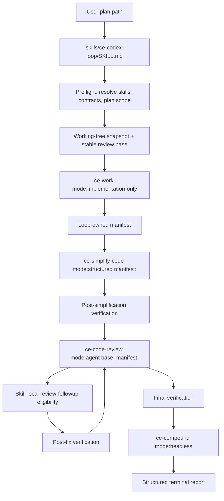
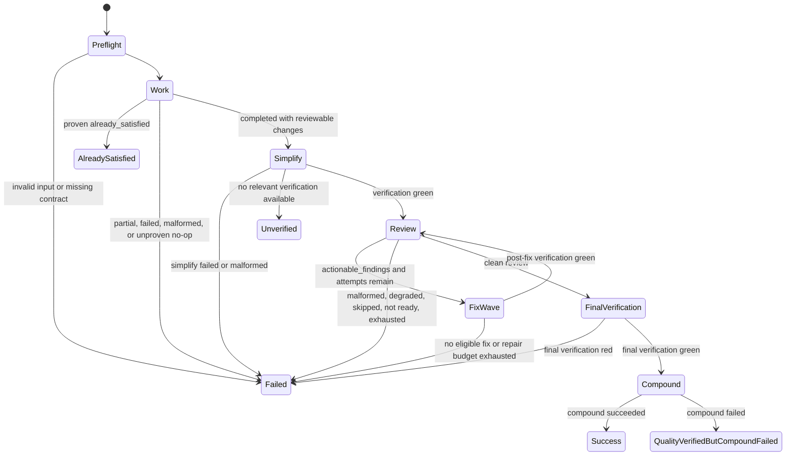

# feat: Add ce-codex-loop orchestrator

**Target repo:** EveryInc/compound-engineering-plugin

## Summary

Add a self-contained `ce-codex-loop` skill that runs a bounded local implementation-quality loop from an existing code-execution plan, without inheriting `/lfg` shipping behavior. The work also adds composition-safe structured contracts to `ce-work`, `ce-simplify-code`, and `ce-code-review` so the new orchestrator can make stage decisions from machine-readable outputs rather than prose.

The current plan is grounded in `docs/brainstorms/2026-06-24-ce-codex-loop-requirements.md` and the current `EveryInc/compound-engineering-plugin` checkout. All referenced target paths are repo-relative to this checkout.

---

## Problem Frame

Compound Engineering has individual skills for implementation, simplification, review, and compounding, and `/lfg` already runs a broad end-to-end automation that includes commit, PR, CI, and release-adjacent behavior. The requested shape is narrower: a Codex-oriented local loop that protects the user's working tree, restricts simplification and review to loop-owned files, closes review findings within a bounded budget, verifies concrete commands, and compounds only after verified success.

The current contracts do not yet compose safely enough for that loop. `ce-work` owns branch setup, commits, simplification, review, and shipping handoff; `ce-simplify-code` defaults to branch-diff scope and returns prose; `ce-code-review mode:agent` already emits JSON and `/tmp/compound-engineering/ce-code-review/<run-id>/` artifacts, but has no manifest-scope argument or caller-provided artifact correlation; `ce-compound mode:headless` is available and must remain a post-success-only final stage.

---

## Requirements

**Loop entry, state, and scope**

- R1. `ce-codex-loop` requires an existing code-execution plan path and rejects unreadable, knowledge-work, or unsafe-scope plans before mutation.
- R2. The loop snapshots `HEAD`, staged changes, unstaged changes, and untracked files before mutation, and stops when existing work overlaps planned scope.
- R3. The loop captures one stable review base before implementation and passes that same base to every review attempt.
- R4. The loop owns a refreshed file manifest that distinguishes created, modified, deleted, and temporarily indexed files when those categories exist; v1 keeps `temporarily_indexed` empty because review coverage uses explicit untracked-file content.
- R5. The loop mutates only implementation changes, behavior-preserving simplification, eligible review fixes, and verified-success compounding side effects.

**Stage contracts**

- R6. `ce-work` exposes an implementation-only mode that never creates or switches branches, commits, simplifies, reviews, ships, or invokes PR/CI automation.
- R7. `ce-work` returns structured `completed`, `already_satisfied`, `partial`, or `failed` results with file lists, verification outcomes, issues, and `already_satisfied` proof when applicable.
- R8. `ce-simplify-code` exposes a manifest-scoped structured-result mode and never widens to the full branch diff when called by `ce-codex-loop`.
- R9. `ce-code-review mode:agent` accepts manifest scope plus deterministic review correlation and returns or writes valid JSON before the caller acts on findings.
- R10. `ce-compound mode:headless` runs exactly once only after clean review and green final verification.

**Review loop and terminal results**

- R11. Clean review requires `status == complete`, `verdict == Ready to merge`, and an empty `actionable_findings` array.
- R12. `actionable_findings` is the only machine-readable follow-up queue; severity only affects priority and `requires_verification` only affects post-fix verification scope.
- R13. Each non-clean review attempt permits at most one eligible fix wave and one repair-or-revert pass before re-review or terminal failure.
- R14. The loop runs at most three total review attempts and never reviews an unchanged tree, a known red tree, or findings outside the current manifest.
- R15. Terminal statuses are machine-distinguishable: `success`, `failed`, `unverified`, `already_satisfied`, and `quality_verified_but_compound_failed`.
- R16. Every terminal report includes plan path, stable base, manifest, stage statuses, verification commands and outcomes, review attempts, run IDs and artifact paths, finding decisions, compounding state, and terminal status.

---

## Key Technical Decisions

- **Self-contained orchestrator skill:** `ce-codex-loop` owns its runtime policy and references so installed skills remain isolated and converter-safe. This follows the repo rule that skills must not reference sibling skill internals.
- **Composition modes are explicit opt-ins:** Add mode flags to existing skills instead of trying to drive their interactive defaults with prompt wording. This prevents `ce-codex-loop` from accidentally inheriting branch, commit, full-diff, or shipping behavior.
- **Structured JSON is the orchestration boundary:** The loop treats prose as user-facing explanation only. Stage success, files, verification, issues, and terminal state must come from structured fields.
- **Manifest scope plus stable base defines review:** `base:<ref>` alone is insufficient because unrelated local changes may share the same diff base. Review must receive both the stable base and the current loop-owned manifest.
- **Caller-provided review correlation:** Add a caller-provided `run-id:` or `artifact-dir:` token to `ce-code-review mode:agent` so fallback artifact lookup never depends on newest modification time.
- **Explicit untracked review content:** v1 should not mutate the git index for review coverage. Manifest-scoped `ce-code-review` should include loop-owned untracked files by adding generated create/delete diff snippets and full file content to the reviewer bundle.
- **Already satisfied is a terminal no-op:** A zero-diff run only succeeds when `ce-work` proves the plan is already satisfied and identifies related files. The loop then skips simplify, review, and compound.
- **Compounding is post-success-only:** `ce-compound mode:headless` is not a cleanup or partial-progress logger. It runs once after final verification and clean review, and failures become `quality_verified_but_compound_failed`.

---

## High-Level Technical Design

### Stage Contract Topology



### Terminal State Machine



---

## Output Structure

The new skill is self-contained. The exact filenames can adjust during implementation, but this is the planned shape:

```text
skills/ce-codex-loop/
  SKILL.md
  references/
    review-followup-eligibility.md
    stage-result-schemas.md
    terminal-statuses.md
    working-tree-manifest.md
docs/skills/
  ce-codex-loop.md
```

---

## Implementation Units

### U1. Add the self-contained `ce-codex-loop` orchestrator skill

- **Goal:** Create the new public skill that validates input, preflights downstream composition contracts, snapshots working-tree state, sequences stages, enforces review-loop budgets, and emits structured terminal reports.
- **Requirement traceability:** Plan R1, R2, R3, R5, R10, R11, R13, R14, R15, R16; origin R1-R10, R15, R17-R18, R29-R32, R40-R57, R64-R70; covers AE1, AE2, AE3, AE7, AE10, AE14, AE15, AE16, AE17, AE23, AE24.
- **Files:** Create `skills/ce-codex-loop/SKILL.md`, `skills/ce-codex-loop/references/stage-result-schemas.md`, `skills/ce-codex-loop/references/terminal-statuses.md`, `docs/skills/ce-codex-loop.md`; modify `README.md`, `docs/skills/README.md`; test with `tests/skills/ce-codex-loop-contract.test.ts`, `tests/real-plugin-conversion.test.ts`, `tests/release-metadata.test.ts`.
- **Dependencies:** None for the initial skill scaffold; complete orchestration behavior depends on U2, U3, U4, U5, U6, U7, and U8.
- **Patterns to follow:** `skills/lfg/SKILL.md` for ordered pipeline gates and skill resolution; `skills/ce-plan/SKILL.md` and `skills/ce-doc-review/SKILL.md` for mode-token parsing; `skills/ce-compound/SKILL.md` for headless structured terminal behavior; `AGENTS.md` skill self-containment rules.
- **Approach:** Add argument parsing for a required plan path and no shipping options. Resolve available skill entries before mutation, validate that every required mode and structured-output field is documented, snapshot the tree, capture one stable review base, and orchestrate `ce-work`, `ce-simplify-code`, `ce-code-review`, bounded finding follow-up, final verification, and compounding. Keep progress updates stage-oriented and keep the terminal report machine-readable enough for future callers.
- **Test scenarios:** Missing plan path, unreadable file, `execution: knowledge-work`, and plan without safe file scope stop before downstream skills. Missing downstream composition mode stops before mutation. `already_satisfied` with proof returns terminal no-op and skips simplify, review, and compound. `completed` changes run simplify, review, final verification, and one compound call. Review attempts stop at three and report unresolved findings. `ce-compound` failure after verified quality returns `quality_verified_but_compound_failed`.
- **Verification:** `bun test tests/skills/ce-codex-loop-contract.test.ts`; `bun test tests/real-plugin-conversion.test.ts tests/release-metadata.test.ts`; `bun run release:validate`.

### U2. Add implementation-only, composition-safe mode to `ce-work`

- **Goal:** Let orchestrators invoke implementation work without branch setup, commits, simplification, review, shipping workflow, PR creation, or CI watching.
- **Requirement traceability:** Plan R6, R7, R15, R16; origin R11-R20, R64-R67; covers AE5, AE6, AE7, AE22, AE23.
- **Files:** Modify `skills/ce-work/SKILL.md`; create `skills/ce-work/references/implementation-only-mode.md` if the mode body is too large for the main skill; modify `tests/pipeline-review-contract.test.ts`; create or modify `tests/skills/ce-work-implementation-mode.test.ts`; update `docs/skills/ce-work.md` if the user-visible mode is documented.
- **Dependencies:** None, but U1 consumes this contract.
- **Patterns to follow:** `skills/ce-code-review/SKILL.md` argument parsing table; `skills/ce-work/references/non-code-execution.md` as a carve-out pattern; existing `ce-work` plan parsing and U-ID preservation behavior.
- **Approach:** Add a token such as `mode:implementation-only` that is valid only with a plan-file input. In that mode, reuse plan reading, task derivation, execution posture, and test discovery, but bypass branch/worktree prompts, incremental commits, phase-boundary `ce-simplify-code`, Tier 2 review, residual gates, and shipping workflow. Require a final structured result with status, file lists, verification outcomes, issues, and `already_satisfied` proof when no reviewable diff is produced.
- **Test scenarios:** Mode parsing strips the token and rejects bare prompts. Branch and commit instructions are skipped in implementation-only mode but preserved in default mode. Existing plan already satisfied produces `already_satisfied` only with proof and identified files. Partial implementation and malformed/prose-only completion produce `partial` or `failed`. File lists distinguish created, modified, and deleted paths.
- **Verification:** `bun test tests/skills/ce-work-implementation-mode.test.ts tests/pipeline-review-contract.test.ts`; `bun test tests/skill-conventions.test.ts`.

### U3. Add manifest-scoped structured-result mode to `ce-simplify-code`

- **Goal:** Make simplification safe for composition by accepting an explicit loop-owned manifest and returning structured results instead of only a prose summary.
- **Requirement traceability:** Plan R4, R8, R15, R16; origin R19-R32, R61; covers AE8, AE9, AE10.
- **Files:** Modify `skills/ce-simplify-code/SKILL.md`; create `skills/ce-simplify-code/references/structured-result-schema.md`; create `tests/skills/ce-simplify-code-structured-mode.test.ts`; update `docs/skills/ce-simplify-code.md` if the new mode is user-visible.
- **Dependencies:** U7 defines the manifest schema consumed by this mode.
- **Patterns to follow:** Existing `ce-simplify-code` explicit-scope precedence; `skills/ce-code-review/SKILL.md` JSON-output contract; `tests/review-skill-contract.test.ts` style for prose contract assertions.
- **Approach:** Add a composition flag such as `mode:structured` and a `manifest:<path>` token. When present, the manifest is authoritative and branch-diff fallback is disabled. Return JSON with status, file lists, applied/skipped simplifications, verification commands and outcomes, and issues. Preserve the default human workflow and summary outside structured mode.
- **Test scenarios:** Manifest token overrides branch diff. Missing, unreadable, or empty manifest fails closed. Structured mode never says to simplify the full branch diff. Successful run reports applied and skipped items plus verification outcomes. Failed verification reports `failed` with issues and does not claim behavior preservation.
- **Verification:** `bun test tests/skills/ce-simplify-code-structured-mode.test.ts`; `bun test tests/skill-conventions.test.ts`.

### U4. Add manifest-scoped review support to `ce-code-review`

- **Goal:** Restrict `ce-code-review mode:agent` to the loop-owned manifest so unrelated local changes and out-of-manifest findings never enter the orchestrator queue.
- **Requirement traceability:** Plan R3, R4, R9, R11, R12, R14, R16; origin R33-R41, R58-R60, R62-R66; covers AE11, AE12, AE13, AE19, AE20, AE22.
- **Files:** Modify `skills/ce-code-review/SKILL.md`, `skills/ce-code-review/references/diff-scope.md`, `skills/ce-code-review/references/findings-schema.json` only if schema wording needs manifest clarification; modify `tests/review-skill-contract.test.ts`; create `tests/skills/ce-code-review-manifest-scope.test.ts`.
- **Dependencies:** U7 for manifest shape. Coordinate token parsing and artifact fields with U5, but manifest scope can be specified independently.
- **Patterns to follow:** Existing `base:<ref>` fast path, `plan:<path>` parsing, `mode:agent` no-mutation contract, protected-artifact filtering, and remote-scope workspace-inspection restrictions.
- **Approach:** Add `manifest:<path>` as a recognized scope token for `mode:agent` and reject incompatible scope selectors when necessary. Build `FILES:` and `DIFF:` by intersecting the stable `base:<ref>` diff with manifest entries. Include manifest-declared created untracked files through generated create-file diff snippets plus full file content in the review context, not by staging them. Record excluded unrelated paths in coverage. Filter synthesized findings so any finding outside the manifest is excluded from `actionable_findings` and reported as out-of-scope coverage rather than caller work.
- **Test scenarios:** `mode:agent base:<ref> manifest:<path>` reviews only manifest paths. Out-of-manifest findings are never in `actionable_findings`. Created untracked files in the manifest are included through explicit review content without changing the git index. Missing manifest fails in `mode:agent`. Default review behavior without manifest remains unchanged.
- **Verification:** `bun test tests/skills/ce-code-review-manifest-scope.test.ts tests/review-skill-contract.test.ts`.

### U5. Add deterministic review run and artifact correlation

- **Goal:** Ensure orchestrators can identify the exact `review.json` for a review attempt without relying on latest modification time.
- **Requirement traceability:** Plan R9, R11, R15, R16; origin R34-R36, R62-R63, R69; covers AE11, AE21, AE24.
- **Files:** Modify `skills/ce-code-review/SKILL.md`; update artifact docs in `docs/skills/ce-code-review.md`; modify `tests/review-skill-contract.test.ts`; create `tests/skills/ce-code-review-run-correlation.test.ts`.
- **Dependencies:** None. Coordinate token parsing and JSON coverage updates with U4.
- **Patterns to follow:** Existing `/tmp/compound-engineering/ce-code-review/<run-id>/` artifact layout, `metadata.json` minimum fields, and `mode:agent` raw JSON output shape.
- **Approach:** Add `run-id:<id>` and optionally `artifact-dir:<path>` tokens for `mode:agent`. Validate the run ID for path safety, write `review.json` and `metadata.json` under the caller-correlated directory, echo the same `run_id` and `artifact_path` in the primary JSON, and fail closed on collisions or unsafe paths.
- **Test scenarios:** Caller-provided run ID is preserved in primary JSON and artifact path. Unsafe run ID is rejected. Concurrent simulated run IDs produce distinct directories. Primary malformed response with valid matching artifact is recoverable by `ce-codex-loop`; wrong-run artifact is ignored.
- **Verification:** `bun test tests/skills/ce-code-review-run-correlation.test.ts tests/review-skill-contract.test.ts`.

### U6. Define structured result schemas and terminal statuses

- **Goal:** Pin the shared JSON contracts that `ce-codex-loop` consumes from stages and emits at termination.
- **Requirement traceability:** Plan R7, R8, R9, R10, R11, R12, R15, R16; origin R13-R16, R24-R25, R34-R41, R53-R56, R69-R70; covers AE6, AE9, AE10, AE11, AE12, AE13, AE17, AE24.
- **Files:** Create `skills/ce-codex-loop/references/stage-result-schemas.md`, `skills/ce-codex-loop/references/terminal-statuses.md`; modify `skills/ce-codex-loop/SKILL.md`, `skills/ce-work/SKILL.md`, `skills/ce-simplify-code/SKILL.md`, `skills/ce-code-review/SKILL.md`; create `tests/skills/ce-codex-loop-schema-contract.test.ts`.
- **Dependencies:** U2, U3, U4, and U5 define the stage fields this schema must capture.
- **Patterns to follow:** `skills/ce-code-review/SKILL.md` JSON minimum shape; `skills/ce-code-review/references/findings-schema.json` enum discipline; `ce-compound` headless terminal report behavior.
- **Approach:** Define required fields for implementation, simplification, review, verification, and terminal summaries. Keep schemas text-based unless the repo already has a JSON-schema pattern for skill outputs; the important contract is stable field names and terminal status enums. Make the orchestrator fail closed on malformed or prose-only stage output.
- **Test scenarios:** Stage result docs contain all required statuses and fields. Terminal status enum exactly matches `success`, `failed`, `unverified`, `already_satisfied`, `quality_verified_but_compound_failed`. `already_satisfied` requires proof and identified files. Review success gate requires all three clean-review predicates.
- **Verification:** `bun test tests/skills/ce-codex-loop-schema-contract.test.ts`.

### U7. Add working-tree snapshot and loop-owned manifest handling

- **Goal:** Specify and test how the orchestrator separates loop-owned files from pre-existing user work, including untracked files and temporary review-index state.
- **Requirement traceability:** Plan R2, R3, R4, R5, R9, R14, R16; origin R3-R10, R19-R20, R57-R61, R69; covers AE2, AE3, AE4, AE8, AE19, AE20, AE24.
- **Files:** Create `skills/ce-codex-loop/references/working-tree-manifest.md`; modify `skills/ce-codex-loop/SKILL.md`; create `tests/skills/ce-codex-loop-manifest.test.ts`.
- **Dependencies:** U1 creates the orchestrator; U2 and U3 provide stage file lists that feed manifest refresh.
- **Patterns to follow:** `ce-work` parallel safety file-to-unit mapping; `ce-code-review` current untracked-file coverage note; repo scratch-space guidance in `AGENTS.md`.
- **Approach:** Define snapshot fields for `HEAD`, staged entries, unstaged paths, and untracked paths. Build the loop-owned manifest from the plan file scope, stage structured file lists, and working-tree delta. Stop before mutation when existing non-loop-owned changes overlap. For created untracked files, rely on U4's explicit review-content support and record `temporarily_indexed` as empty in v1 rather than mutating the user's index.
- **Test scenarios:** Pre-existing overlapping tracked edit stops before work. Pre-existing unrelated edit remains excluded. Loop-created untracked file is included in manifest and review scope without staging. Manifest refresh after simplify, fix, and repair updates created/modified/deleted categories. The original staged state is unchanged by review preparation.
- **Verification:** `bun test tests/skills/ce-codex-loop-manifest.test.ts`.

### U8. Copy review-followup policy into `ce-codex-loop`

- **Goal:** Make the review-fix eligibility rules skill-local so `ce-codex-loop` does not read `ce-work` or `lfg` internals at runtime.
- **Requirement traceability:** Plan R12, R13, R14; origin R37-R39, R45-R50, R60; covers AE12, AE14, AE15, AE16, AE19.
- **Files:** Create `skills/ce-codex-loop/references/review-followup-eligibility.md`; modify `skills/ce-codex-loop/SKILL.md`; create or modify `tests/skills/ce-codex-loop-contract.test.ts`, `tests/skill-conventions.test.ts`.
- **Dependencies:** U1 and U6.
- **Patterns to follow:** Origin requirements R45-R50 for eligibility behavior; `skills/lfg/references/review-followup.md` and `skills/ce-work/references/review-findings-followup.md` only as source material during implementation, not as runtime references; `AGENTS.md` self-containment rule.
- **Approach:** Copy the policy into the new skill's own references tree, then have `SKILL.md` load that local file after a valid review JSON result. The policy must filter only `actionable_findings`, require current evidence and concrete scoped fixes, skip stale or out-of-manifest findings with reasons, preserve design-dependent findings as unresolved, and keep unresolved actionable findings blocking success.
- **Test scenarios:** `skills/ce-codex-loop/SKILL.md` references `skills/ce-codex-loop/references/review-followup-eligibility.md` and does not reference sibling skill paths. Policy text states that severity is priority only and `requires_verification` is test-scope only. Findings outside manifest are skipped and never applied. No eligible finding causes immediate terminal failure rather than another unchanged review.
- **Verification:** `bun test tests/skills/ce-codex-loop-contract.test.ts tests/skill-conventions.test.ts`.

### U9. Add mechanical tests, behavioral eval scenarios, documentation, and inventory validation

- **Goal:** Cover the new skill and composition modes with static contract tests, conversion/inventory checks, and behavioral fixture scenarios that make regressions visible without running real autonomous implementation loops.
- **Requirement traceability:** Plan R1-R16; origin R1-R70; covers AE1-AE24.
- **Files:** Create fixture files under `tests/fixtures/ce-codex-loop/`; create `tests/skills/ce-codex-loop-contract.test.ts`, `tests/skills/ce-codex-loop-manifest.test.ts`, `tests/skills/ce-codex-loop-schema-contract.test.ts`, `tests/skills/ce-work-implementation-mode.test.ts`, `tests/skills/ce-simplify-code-structured-mode.test.ts`, `tests/skills/ce-code-review-manifest-scope.test.ts`, `tests/skills/ce-code-review-run-correlation.test.ts`; modify `tests/real-plugin-conversion.test.ts`, `tests/release-metadata.test.ts`, `tests/skill-conventions.test.ts`, `README.md`, `docs/skills/README.md`, `docs/skills/ce-codex-loop.md`.
- **Dependencies:** U1 through U8.
- **Patterns to follow:** Existing Bun static contract tests in `tests/review-skill-contract.test.ts`, `tests/pipeline-review-contract.test.ts`, `tests/skill-conventions.test.ts`, and conversion inventory tests in `tests/real-plugin-conversion.test.ts`.
- **Approach:** Prefer static, deterministic tests over trying to execute live skill orchestration. Add fixtures that represent terminal paths: invalid input, preflight missing contract, already satisfied, simplify failure, unverified, clean review success, review findings exhausted, repair failure, and compound failure after verified quality. Update inventory expectations so adding one skill changes counts intentionally, and run release validation for manifest/catalog consistency.
- **Test scenarios:** Every terminal status has a fixture. Every origin acceptance example maps to at least one unit or fixture. New skill appears in converted target inventories. Plugin skill count changes are intentional. Docs list the new skill without implying `/lfg` shipping behavior.
- **Verification:** `bun test tests/skills/ce-codex-loop-contract.test.ts tests/skills/ce-codex-loop-manifest.test.ts tests/skills/ce-codex-loop-schema-contract.test.ts tests/skills/ce-work-implementation-mode.test.ts tests/skills/ce-simplify-code-structured-mode.test.ts tests/skills/ce-code-review-manifest-scope.test.ts tests/skills/ce-code-review-run-correlation.test.ts`; `bun test`; `bun run release:validate`.

---

## Scope Boundaries

### In Scope

- A new `skills/ce-codex-loop/` skill and self-contained references.
- Composition-safe mode and structured result additions in `ce-work`, `ce-simplify-code`, and `ce-code-review`.
- Deterministic review run correlation and manifest-scoped review support.
- Tests, fixtures, docs, and plugin inventory validation required for the new skill surface.

### Out of Scope

- Stop hooks or hook-based orchestration.
- A standalone Python runner as the primary shipped architecture.
- Commit, push, PR creation, PR editing, CI watching, release automation, or `/lfg` replacement behavior.
- Auto-retrying `ce-compound mode:headless` after a post-success compounding failure.
- Treating advisory review findings, triage groups, severity, or `requires_verification` as independent apply queues.

### Deferred to Follow-Up Work

- Runtime implementation helpers in TypeScript or shell, if later implementation proves the prose skill cannot reliably express manifest diff assembly.
- Cross-run persistence or resumability beyond the terminal report and generated artifacts.
- HTML or UI presentation for loop reports.

---

## System-Wide Impact

This change adds a new public skill to the plugin inventory, so conversion and marketplace validation must account for one additional skill. It also changes contracts for three existing public skills by adding composition modes while preserving default behavior. The highest-risk compatibility point is `ce-code-review`: default and existing `mode:agent` callers must continue to work without a manifest, while `ce-codex-loop` gets stricter manifest and run-correlation semantics.

---

## Risks & Dependencies

- **New contract coupling:** This plan is now in the target repo, but implementation still changes several public skill contracts at once. Keep compatibility tests close to each mode addition so default skill behavior does not drift while composition modes are added.
- **Skill prose as API:** Existing skills are prose-driven, so structured output contracts must be phrased with enough precision for LLM execution and backed by static tests that guard future edits.
- **Manifest review for untracked files:** `ce-code-review` currently excludes untracked files unless staged. U4 must add explicit review-context support for loop-owned untracked files without changing the user's index.
- **Backward compatibility:** New tokens must not break existing `ce-work`, `ce-simplify-code`, or `ce-code-review` invocations.
- **Artifact correlation:** `run-id:` and `artifact-dir:` validation must avoid path traversal and collision bugs while remaining usable across platforms.

---

## Acceptance Examples

- AE1. Given a missing, unreadable, `execution: knowledge-work`, or unsafe-scope plan, invoking `ce-codex-loop` returns `failed` before downstream skills run.
- AE2. Given pre-existing changes overlap the plan scope, preflight returns `failed` before mutation and reports the overlapping files.
- AE3. Given valid implementation work, the same captured review base appears in every review invocation and terminal report.
- AE4. Given `ce-work` returns valid `already_satisfied` proof and identified files with zero diff, the loop returns `already_satisfied` and reports that simplify, review, and compound did not run.
- AE5. Given implementation produces reviewable changes, simplification receives the explicit loop-owned manifest and cannot widen to the full branch diff.
- AE6. Given no relevant verification command can be found or inferred, the loop returns `unverified` and does not compound.
- AE7. Given a malformed primary review response and a valid matching artifact, the loop uses the correlated artifact; if the artifact run ID does not match, it fails closed.
- AE8. Given review findings outside the manifest, those findings are excluded from the fix queue and reported as out-of-scope.
- AE9. Given actionable findings remain after the third review attempt, the loop returns `failed` and does not compound.
- AE10. Given final review is clean and final verification is green, the loop invokes `ce-compound mode:headless` once and reports `success` or `quality_verified_but_compound_failed`.

---

## Documentation / Operational Notes

- Update the public skill inventory to describe `ce-codex-loop` as a local implementation-quality loop, not an autopilot shipping pipeline.
- Keep `/lfg` documentation distinct: `/lfg` remains the broad autonomous plan/work/review/test/commit/push/PR/CI flow.
- Document `ce-work mode:implementation-only`, `ce-simplify-code mode:structured manifest:<path>`, and `ce-code-review mode:agent manifest:<path> run-id:<id>` as composition contracts with default human workflows unchanged.
- Do not hand-bump release-owned versions or changelog entries; release automation owns those fields.

---

## Sources & Research

- `docs/brainstorms/2026-06-24-ce-codex-loop-requirements.md` supplied the product and acceptance contract.
- `skills/ce-work/SKILL.md` currently includes branch/worktree setup, incremental commits, simplification, Tier 2 review, and shipping workflow handoff that implementation-only mode must bypass.
- `skills/ce-simplify-code/SKILL.md` currently resolves explicit scope first but otherwise defaults to branch diff or working-tree diff and summarizes prose.
- `skills/ce-code-review/SKILL.md` currently supports `mode:agent`, `base:<ref>`, `plan:<path>`, raw JSON, `review.json`, `actionable_findings`, and `/tmp/compound-engineering/ce-code-review/<run-id>/` artifacts.
- `skills/ce-code-review/references/diff-scope.md` currently defines working-copy and remote-scope inspection rules but not manifest-scoped review.
- `skills/ce-compound/SKILL.md` currently defines `mode:headless` as non-interactive Full mode with a structured terminal report.
- `skills/lfg/SKILL.md` currently runs the broader plan, work, simplify, review, fix, browser-test, commit, PR, and CI loop that `ce-codex-loop` must not copy wholesale.
- `.codex-plugin/plugin.json`, `.claude-plugin/plugin.json`, `.cursor-plugin/plugin.json`, `.agy/plugin.json`, `package.json`, `tests/real-plugin-conversion.test.ts`, and `tests/release-metadata.test.ts` are the relevant inventory and release-validation surfaces.
