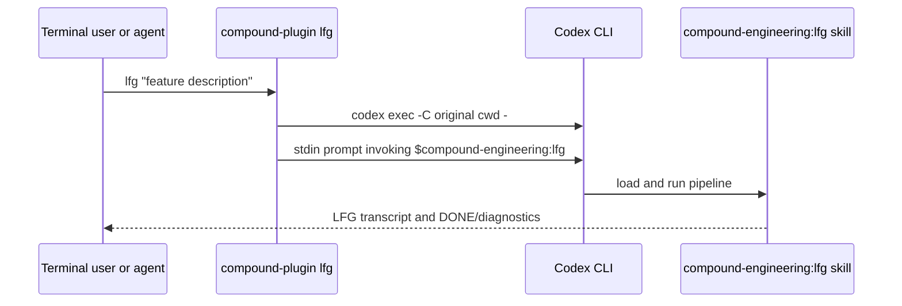

# feat: add lfg CLI command

## Summary

Add a first-class `lfg` subcommand to the Compound Engineering Bun CLI so users and agents can start the existing `compound-engineering:lfg` pipeline from a terminal while preserving the skill as the source of pipeline behavior.

---

## Problem Frame

`skills/lfg/SKILL.md` is currently invocable as an agent skill, but the plugin CLI in `src/index.ts` only exposes install, conversion, cleanup, listing, and plugin-path operations. Users who discover the plugin from the shell cannot ask the CLI to run the same hands-off planning-to-PR pipeline without manually knowing the Codex skill invocation shape.

---

## Requirements

- R1. The CLI exposes an `lfg` subcommand from the existing `compound-plugin` entrypoint.
- R2. The command forwards the feature description arguments to the installed Codex skill invocation without reimplementing the pipeline steps in TypeScript.
- R3. The command preserves the caller's working directory so LFG plans and edits the project where the CLI was launched.
- R4. The command fails fast with an actionable error when the Codex CLI is unavailable or exits non-zero.
- R5. The command is documented in CLI help and package scripts so humans and agents can discover it.
- R6. Automated coverage proves argument forwarding, cwd preservation, and error propagation without needing a real Codex install.

---

## Key Technical Decisions

- **Delegate to Codex skill execution:** The TypeScript CLI should launch `codex exec` with a prompt that explicitly invokes `$compound-engineering:lfg` and includes the user's feature description. This keeps `skills/lfg/SKILL.md` as the source of the orchestration contract and avoids a second pipeline implementation.
- **Use stdin prompt composition instead of shell quoting:** Build the prompt string in TypeScript and pass it to the child process stdin so arbitrary feature descriptions do not need shell escaping.
- **Inject the Codex binary for tests:** Read the binary path from an environment variable with a `codex` default so tests can point the command at a stub executable and assert argv, cwd, and stdin deterministically.
- **Pass through stdio:** Let Codex own progress output. The wrapper's job is process setup, not transcript parsing.

---

## High-Level Technical Design

---

## Implementation Units

### U1. CLI command implementation

**Goal:** Add a reusable command module for `lfg` and register it in the root command table.

**Requirements:** R1, R2, R3, R4

**Dependencies:** None

**Files:**
- `src/commands/lfg.ts`
- `src/index.ts`

**Approach:** Create `src/commands/lfg.ts` using the existing `citty` command pattern. Accept a variadic positional argument for the feature description, compose a prompt that starts with `$compound-engineering:lfg` and preserves the full description, then spawn the Codex CLI with `exec -C process.cwd() -`. Use `process.env.COMPOUND_ENGINEERING_CODEX_BIN ?? "codex"` for the binary. Pipe stdout and stderr through to the parent and throw an error that names the failed binary and exit code when the child exits non-zero.

**Patterns to follow:** `src/index.ts` subcommand registration; existing Bun subprocess handling in tests; agent-friendly CLI principles in `docs/solutions/agent-friendly-cli-principles.md`.

**Test scenarios:**
- Happy path: running `bun run src/index.ts lfg build the thing` invokes the stub Codex binary with `exec`, `-C`, the original cwd, and `-`.
- Happy path: the stub receives a stdin prompt containing `$compound-engineering:lfg` and the full feature description.
- Edge case: no feature description still invokes the skill with an empty argument body so the skill can run its own clarification behavior.
- Failure path: a stub Codex binary exiting non-zero causes the CLI to exit non-zero and includes the child exit code in stderr.

**Verification:** Targeted CLI tests pass without a real Codex install.

### U2. Discoverability and scripts

**Goal:** Make the new command visible through package scripts and help output.

**Requirements:** R5

**Dependencies:** U1

**Files:**
- `package.json`
- `tests/cli.test.ts`

**Approach:** Add a root package script such as `lfg: "bun run src/index.ts lfg"`. Rely on `citty` metadata for help text and cover `--help` output with a focused assertion if the existing CLI test style supports it.

**Patterns to follow:** Current package scripts for `list`, `convert`, and `cli:install`; CLI tests in `tests/cli.test.ts`.

**Test scenarios:**
- Happy path: package metadata exposes an `lfg` script that runs `src/index.ts lfg`.
- Happy path: top-level CLI help lists `lfg` with a short description.

**Verification:** CLI tests prove discoverability and package metadata is syntactically valid JSON.

---

## Scope Boundaries

- This plan does not rewrite the LFG pipeline in TypeScript.
- This plan does not change `skills/lfg/SKILL.md` pipeline order or review/CI behavior.
- This plan does not require Codex plugin installation during tests; stubbing the Codex binary is enough.

### Deferred to Follow-Up Work

- A more general `compound-plugin run-skill <name>` command could be added later if multiple skills need shell wrappers.
- Machine-readable run summaries can be considered later if Codex exposes a stable output contract for skill runs.

---

## System-Wide Impact

The change adds a new exported CLI contract and a package script, but it keeps the skill registry, converters, plugin manifests, and installed skill contents unchanged. It improves agent access to a high-value workflow without widening the plugin install surface.

---

## Risks & Dependencies

- **Codex CLI invocation drift:** The wrapper depends on `codex exec -C <cwd> -` accepting stdin prompts. Keep the wrapper small and covered by argv tests so future Codex changes have one clear update point.
- **Pipeline duplication risk:** Reimplementing LFG in TypeScript would create drift from `skills/lfg/SKILL.md`; the design avoids this by delegating to the skill prompt.
- **External binary availability:** Runtime success depends on Codex being installed and authenticated. The command should report that plainly when the child process cannot start or exits non-zero.

---

## Sources & Research

- Existing skill pipeline: `skills/lfg/SKILL.md`.
- CLI entrypoint and command registry: `src/index.ts` and `src/commands/*.ts`.
- Existing CLI tests: `tests/cli.test.ts`.
- Codex plugin and skill model notes: `docs/specs/codex.md`.
- Agent-friendly CLI design guidance: `docs/solutions/agent-friendly-cli-principles.md`.
