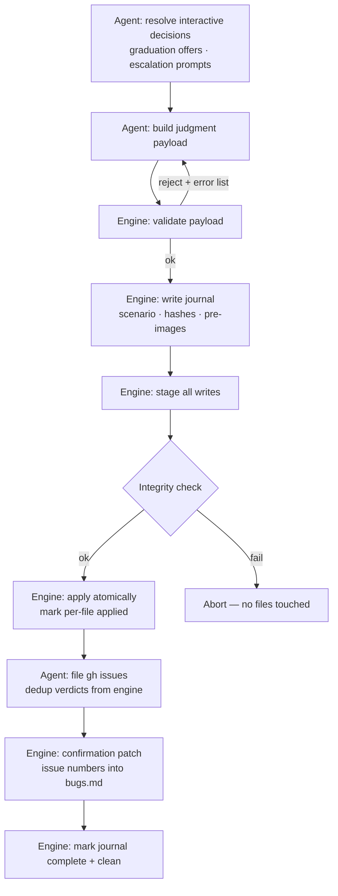
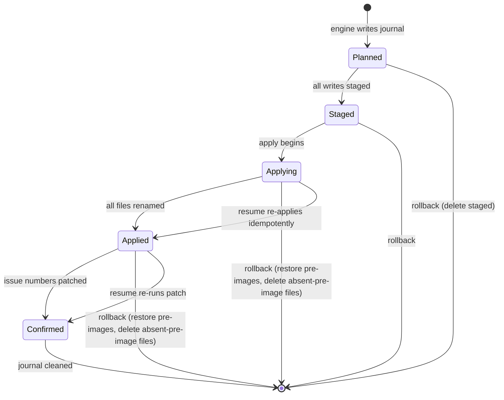

# refactor: ce-user-test deterministic core — scripts own arithmetic and file mutation

## Summary

Move ce-user-test's four mechanical subsystems — schema migration, caps/thresholds, the commit write sequence, and issue dedup — from SKILL.md prose into stdlib-Python scripts under `skills/ce-user-test/scripts/`, with a fixture-based aging harness in the plugin test suite as the regression gate. The agent keeps judgment (scores, maturity decisions, notes, issue text) and hands the commit engine a judgment payload; scripts own all arithmetic and file mutation.

---

## Problem Frame

The skill's compounding state is maintained by prose an LLM re-executes every run: nine cascading migration conditionals (`skills/ce-user-test/SKILL.md:44-53`), ~13 caps/thresholds scattered across five files (several stated twice — SKILL.md plus a reference), an 11-step commit mutating 8 files with atomic write documented for one, and an issue-dedup fallback ("semantic title search") that is unspecified. Drift, miscounts, and partial-commit corruption compound with the state they manage; every schema bump adds prose. The planned v11 change (anomaly ledger + evidence array) and the upstream PR both benefit from this landing first (see origin: docs/brainstorms/2026-07-01-user-test-deterministic-core-requirements.md).

---

## Requirements

Origin R1-R14 carry forward unchanged. Plan-level additions (from flow and repo research) extend them:

**Migration (origin R1-R4)**

- R15. Loading an already-current file is a byte-level no-op — no mtime churn, no EOL or whitespace normalization, no git diff.
- R16. Migration round-trips unknown frontmatter fields, unknown table columns, and unknown sections — the rewrite never drops content it doesn't recognize.
- R17. Absent `schema_version` routes to the existing agent-side corruption path (regenerate offer); an unrecognized version aborts with a distinct machine-readable error. The two cases are distinguishable by exit signal.
- R18. `.user-test-last-run.json` vintage is normalized or validated by the same script, so migration rules have exactly one home.

**Commit engine (origin R7-R9)**

- R19. The journal records scenario slug, test-file path, run timestamp, base-file hashes, per-file pre-images, per-file applied status, and the issue-candidate list with per-issue status (pending / filed #N / duplicate-of #N); apply is idempotent on re-run.
- R20. Resume refuses to proceed silently when the base file was hand-edited since planning, when the journal belongs to a different scenario, or when staged files fail integrity checks — each surfaces a distinct choice (re-plan or rollback).
- R21. Journal staleness follows the skill's existing rules: warn before resuming a >24h journal; default to rollback for >7 days. Values live in the registry.
- R22. Payload validation is whole-payload reject with a machine-readable error list; a payload maturity transition that contradicts the script's count evidence is rejected with that evidence, and the agent re-decides.
- R23. All interactive commit decisions (graduation offers, persistent-low-score escalation) resolve before the payload is built; the engine runs non-interactively end to end.
- R24. GitHub issue filing happens after the atomic file apply; a journaled confirmation patch writes issue numbers into `bugs.md`. A crash on either side of filing is recoverable from the journal: resume files only journal-pending issues, and a failed corpus fetch during resume is a hard stop ("cannot verify prior filing"), never treated as no-duplicates.
- R25. The engine emits a structured result (files written, duplicates found, caps applied, rotations performed) that the agent uses to render the report's FILED THIS SESSION and SIGNALS content.

**Registry (origin R5-R6)**

- R26. The registry is a standalone JSON data file readable by prose and scripts; threshold precedence is per-area override > test-file frontmatter > registry default.

**Environment (origin R13-R14)**

- R27. A Phase 0 preflight checks `python3`; if missing, the run aborts with an install instruction. No prose fallback exists after the superseded prose is deleted.
- R28. The commit journal and staged files are gitignored and covered by the skill's protected-artifacts rule.

---

## Key Technical Decisions

- **Mirror the repo's existing script conventions**: `#!/usr/bin/env python3`, stdlib-only, positional argv subcommands (no argparse), inputs as file-path arguments, line-oriented sentinel stdout contracts, diagnostics on stderr, exit 0 success / 1 validation failure / 2 usage error, atomic writes via `tempfile.mkstemp` in the target directory + `os.replace`. Canonical models: `skills/ce-code-review/scripts/repo-profile-cache.py`, `skills/ce-compound/scripts/validate-frontmatter.py`.
- **SKILL_DIR anchor invocation**, copying the phrasing at `skills/ce-code-review/SKILL.md:361-366`, re-set inline in every Bash call. Never `${CLAUDE_SKILL_DIR}`.
- **The commit is a five-stage pipeline, not one atomic group**: interactive decisions → judgment payload → atomic file apply → gh side effects → journaled confirmation patch. The journal spans the last three stages. Rationale: issue filing is a non-stageable network effect, and `bugs.md` rows embed issue numbers, so neither file-before nor placeholder-forever works; the confirmation patch closes the loop crash-safely.
- **Scripts enforce, agents decide**: the engine never chooses a maturity transition; it validates the agent's choice against count evidence and rejects contradictions with the evidence attached. This preserves the founding agent-guided-state learning while making cap enforcement real.
- **Migration writes at load**, reversing the current "Do NOT rewrite on read" rule. Schema normalization is content-preserving and is explicitly carved out of the partial-run-safety rule ("normalization is not maturity mutation"). Commit mode already contradicted the old rule by force-upgrading to v10.
- **Issue-title dedup is a new spec, not a port**: the 70% word-overlap rule currently applies only to probe `verify:` text (`skills/ce-user-test/references/probes.md:246`). For issues: lowercase alphanumeric tokenization, overlap = shared tokens / tokens of the shorter title, threshold 70% (registry value). The agent fetches the open-issue corpus (`gh issue list --label user-test:<area> --state open --json number,title`); the script judges. The agent must distinguish gh outcomes: a successful empty result means no duplicates; a nonzero `gh issue list` exit means the corpus is unknown — skip filing for that run (matching the existing skip-gracefully behavior) rather than dedup-against-empty.
- **Scripts land before or with the prose that references them** — `tests/skill-conventions.test.ts:44-47` fails CI when SKILL.md references a script path that doesn't exist. U1-U4 are safe to land without prose; U5 must not precede them.

---

## High-Level Technical Design

Commit pipeline (directional guidance, not implementation specification):

Journal lifecycle:

Resume entry: any state short of Confirmed found at next invocation triggers the resume/rollback offer, gated by the R20 integrity checks and R21 staleness rules — unless the journal's liveness marker shows the owning process is still alive, in which case the invocation aborts as concurrent (see U3).

---

## Implementation Units

### U1. Caps and thresholds registry

- **Goal:** One standalone data file holds every cap and threshold; prose and scripts read it by name.
- **Requirements:** R26 (origin R5, R6).
- **Dependencies:** none.
- **Files:** `skills/ce-user-test/scripts/caps-registry.json` (new).
- **Approach:** Inventory all ~13 values from repo research — rotation caps (probe run history 10, cross-area 10, synthesis 2/run, tactical notes 3/area, fingerprints 20/area, score-history 10/area, test-history 50, UX opportunities 20 open + 30-day age-out, good-patterns 5 unconfirmed runs, bug archive 6 months), thresholds (`pass_threshold` 4, `quality_threshold` 3, `mcp_restart_threshold` 15, delta warning -0.5, pattern surfacing 7-of-10 / 5-of-10, dedup overlap 0.70, journal staleness 24h/7d, journal heartbeat window). Each entry: name, value, one-line meaning. Precedence rule (area > file frontmatter > registry) documented in the file header.
- **Test scenarios:** Test expectation: none — pure data file; enforcement is exercised through U2/U3 tests and the U6 harness.
- **Verification:** Every numeric cap cited in the current prose has a named registry entry; no value appears in the registry twice.

### U2. Migration script

- **Goal:** `migrate-test-file.py` normalizes any v1-v10 test file (and `.user-test-last-run.json`) to the current schema in one deterministic, content-preserving pass.
- **Requirements:** R15-R18 (origin R1-R4).
- **Dependencies:** U1 (default values for fields filled during migration).
- **Files:** `skills/ce-user-test/scripts/migrate-test-file.py` (new); test file `tests/user-test-scripts.test.ts` (shared with U6).
- **Approach:** Subcommands `migrate <file>` and `migrate-run-json <file>`. Per-version fills as a data table (version → fields/sections to synthesize), consolidating SKILL.md:44-53 and the changelog duplicates in `references/test-file-template.md`. Parse CRLF-tolerantly; preserve the file's existing EOL style. Preserve unknown frontmatter keys, table columns, and sections verbatim. Stdout sentinels: `CURRENT` (no write), `MIGRATED <from> -> <to>`; exit 1 with `UNKNOWN-VERSION <n>` or `CORRUPT <reason>` sentinels (absent `schema_version` reports `CORRUPT`, routing to the agent's regenerate offer); exit 2 usage.
- **Execution note:** Test-first via the existing spawnSync pattern — seed fixtures for v1/v5/v9 files and write failing assertions before implementing each version fill.
- **Patterns to follow:** `skills/ce-code-review/scripts/repo-profile-cache.py` (structure, atomic write, sentinel stdout); `skills/ce-compound/scripts/validate-frontmatter.py` (exit-code scheme, actionable errors).
- **Test scenarios:**
  - Covers AE1. v5 fixture migrates to current in one pass; output parses and retains all v5 content.
  - Covers AE1. `schema_version: 99` exits 1 with `UNKNOWN-VERSION`, file byte-identical afterward.
  - Covers AE5. Already-current file → `CURRENT`, file bytes and mtime unchanged.
  - Covers AE6. File with unknown frontmatter key, unknown table column, and an unrecognized `## Custom Notes` section round-trips all three verbatim.
  - Absent `schema_version` → exit 1 `CORRUPT`, no write.
  - CRLF fixture migrates without flipping line endings.
  - v1 fixture missing optional sections gains empty defaults; v1 missing the maturity map entirely → `CORRUPT`.
  - `migrate-run-json` normalizes a v7-era last-run JSON; refuses (validation error) rather than guessing on unrecognized shape.
- **Verification:** SKILL.md's migration ladder can be deleted (done in U5) with no behavior loss; harness round-trip assertions pass.

### U3. Commit engine

- **Goal:** `commit-engine.py` executes the entire commit as a journaled, resumable, non-interactive pipeline from a judgment payload.
- **Requirements:** R19-R25 (origin R7-R9); enforces registry values from U1.
- **Dependencies:** U1, U2 (reuses the parser and atomic-write helpers; bumps schema on commit).
- **Files:** `skills/ce-user-test/scripts/commit-engine.py` (new); test file `tests/user-test-scripts.test.ts` (shared).
- **Approach:** Subcommands `plan <payload.json>`, `apply`, `resume`, `rollback`, `confirm-issues <issues.json>`, `status`. Journal at `tests/user-flows/.user-test-commit-journal.json` (project-side, gitignored). Validation is whole-payload reject with a machine-readable error array; skipped areas are valid when `skip_reason` is present; maturity transitions contradicting count evidence are rejected with the evidence. Apply stages to `.tmp` siblings, verifies staged hashes, renames in sequence marking per-file applied status (idempotent re-run); absent first-run artifacts (`score-history.json`, `bugs.md`, `test-history.md`) have pre-image "absent" and roll back by deletion. Delta computation over overlapping areas is defined here (overlap = area slugs present in both runs; no overlap → no delta). Structured result JSON on stdout for the agent's report rendering. Concurrent-run guard uses a liveness marker, not age: the engine writes PID + start timestamp into the journal and refreshes a heartbeat field at each stage transition; a second invocation aborts only when the recorded process is alive (or the heartbeat is fresher than the registry's heartbeat window), otherwise any incomplete journal routes to the normal resume/rollback offer regardless of age. A crash-injection mode (e.g., env var `CRASH_AFTER_FILE=n` exiting nonzero after the nth rename) exists for the harness to exercise mid-apply crash windows.
- **Execution note:** Test-first — write the crash-resume and validation-reject assertions before the apply path.
- **Patterns to follow:** same as U2; the journal is the plan's own design (no repo precedent).
- **Test scenarios:**
  - Covers AE2. Kill between staged and applied (simulate: run `plan`+stage, then invoke `resume` fresh) → remaining files applied, result identical to uninterrupted run.
  - Covers AE8. `resume` after full apply-and-confirm is a no-op (no double-apply, no duplicate history rows).
  - Covers AE9. Kill between file apply and issue confirmation (mock `gh issue create`), then `resume` → confirmation patch applied, issue number recorded, dedup suppresses the duplicate; result identical to an uninterrupted run.
  - Covers AE9. Crash after filing 2 of 4 journaled issue candidates → resume files exactly the remaining 2 (per-issue status honored).
  - Journal from a dead process, 30 seconds old → resume offered, not a concurrency abort; journal with a live PID/fresh heartbeat → second invocation aborts as concurrent.
  - Kill after 3 of 8 file renames (via `CRASH_AFTER_FILE`), choose rollback at resume → all 8 files byte-match their pre-images.
  - Covers AE7. Base-file hash mismatch (hand-edit between plan and resume) → resume refuses, offers re-plan/rollback sentinel.
  - Journal for scenario A + invocation for scenario B → refuses to auto-resume, reports the foreign journal.
  - Staged file deleted before resume → integrity failure, rollback offered, no partial resume.
  - Payload with score 7 or a promotion for an unrun area → exit 1 with structured error list, zero files touched.
  - Promotion after one pass (contradicts 2-pass evidence) → rejected with count evidence in the error.
  - First run (no score-history.json/bugs.md) commits cleanly; rollback of the same deletes the created files.
  - >7-day-old journal → default flips to rollback (registry value honored).
  - Caps: 11th run-history entry rotates the oldest; 51st test-history row drops the first; verified against registry values, not literals.
- **Verification:** The 11-step prose sequence in SKILL.md:319-360 is fully replaceable (done in U5); harness aging loop holds all invariants.

### U4. Issue dedup script

- **Goal:** Deterministic duplicate judgment for GitHub issue candidates against an agent-fetched corpus.
- **Requirements:** origin R10; overlap threshold from U1.
- **Dependencies:** U1.
- **Files:** `skills/ce-user-test/scripts/issue-dedup.py` (new, or a `dedup` subcommand of commit-engine.py — implementer's choice); test coverage in `tests/user-test-scripts.test.ts`.
- **Approach:** Input: candidate title plus a JSON corpus file (from `gh issue list --json number,title`). Tokenize lowercase alphanumeric; overlap = shared tokens / tokens of the shorter title; ≥0.70 → `DUPLICATE #<n>`, else `UNIQUE`. Empty corpus → `UNIQUE`. The agent fetches; the script judges — the script never shells out to `gh`.
- **Test scenarios:**
  - Covers AE3. 78%-overlap title → `DUPLICATE` with the matching issue number.
  - 50%-overlap title → `UNIQUE`.
  - Case and punctuation variants of the same title → `DUPLICATE`.
  - Empty corpus → `UNIQUE` (successful-but-empty path).
  - Corpus fetch failed (agent passes the failure signal instead of a corpus) → filing skipped for the run; distinct from the empty-corpus path.
- **Verification:** SKILL.md's "semantic title search" line is deletable (done in U5).

### U5. Prose rewrite

- **Goal:** SKILL.md and references invoke the scripts and stop describing what the scripts now own; commit mode restructures to decisions-first.
- **Requirements:** R23, R27, R28 (origin R3, R6, R13); origin R13's one-home rule.
- **Dependencies:** U1-U4 (CI's `tests/skill-conventions.test.ts` requires referenced script paths to exist).
- **Files:** `skills/ce-user-test/SKILL.md`; `skills/ce-user-test/references/test-file-template.md`, `probes.md`, `queries-and-multiturn.md`, `bugs-registry.md`, `last-run-schema.md` (cap statements → registry pointers; migration changelog trimmed); `skills/ce-user-test/references/connection-resilience.md` (threshold pointer).
- **Approach:** Delete the migration ladder (SKILL.md:44-53) in favor of a SKILL_DIR-anchored `migrate` invocation; add the `python3` preflight to Phase 0 with an abort-plus-install-instruction path; restructure Commit Mode so graduation/escalation prompts resolve before payload construction, then invoke the engine and render FILED THIS SESSION / SIGNALS from its structured result; extend the Phase 1 gitignore step and the protected-artifacts rule to the journal and staged files; replace duplicated cap statements with named registry references (exactly one prose statement or pointer per value).
- **Execution note:** Run `bun test tests/skill-conventions.test.ts` after each file edit — it catches dangling script references immediately.
- **Test scenarios:** Test expectation: none — prose change; behavior is exercised by U6 and by `tests/skill-conventions.test.ts`.
- **Verification:** `grep` finds no numeric cap value stated twice across the skill; no migration conditionals remain in SKILL.md; the deleted prose sections' behaviors are all covered by script tests.

### U6. Aging harness and fixtures

- **Goal:** A CI-gated behavioral suite proving the scripts hold their invariants over time.
- **Requirements:** origin R11, R12; asserts R15, R16, R19-R22.
- **Dependencies:** U1-U4.
- **Files:** `tests/user-test-scripts.test.ts` (new); `tests/fixtures/user-test/` (new: v1/v5/v9/current/unknown-fields/CRLF test files, canned judgment payloads including invalid ones, a canned issue corpus).
- **Approach:** Mirror `tests/repo-profile-cache.test.ts`: build a temp project dir per test, spawn `python3 skills/ce-user-test/scripts/<x>.py`, assert on `{code, stdout, stderr}` and resulting file state. The aging loop runs ~100 generated commit cycles against one evolving fixture with explicit per-test timeout (30000ms pattern), asserting after every cycle: caps hold (from the registry, not literals), IDs unique and sequential, rotation fires, dedup fires, no artifact grows beyond its cap, and a full migrate→commit→migrate round trip is stable.
- **Test scenarios:** The unit-level scenarios live in U2-U4; this unit adds the longitudinal ones:
  - 100-cycle loop holds every registry cap and never duplicates a bug/probe ID.
  - Random kill-point injection across 20 cycles — at stage boundaries and within apply via `CRASH_AFTER_FILE` at every per-file position — always converges to the uninterrupted end state.
  - Migrate→commit→migrate round trip on the unknown-fields fixture preserves the unknown content through the full lifecycle.
- **Verification:** `bun test` green locally and in CI (`.github/workflows/ci.yml` job `test`, which already provides python3).

---

## Scope Boundaries

Carried from origin: no scripting of maturity decisions or scores; scripted Evals 1+2 deferred; event sourcing rejected; shared probe/journey escalation module deferred; personal-copy sync is manual.

### Deferred to Follow-Up Work

- The v11 schema bump (anomaly ledger + evidence array) — first consumer of the migration table (origin AE4).
- Migrating `${CLAUDE_SKILL_DIR}`-era conventions elsewhere in the suite — out of scope here.

---

## Acceptance Examples

Origin AE1-AE4 carry forward. Plan additions (the data-loss and crash cases):

- AE5. **Covers R15.** Given an already-current test file, when a run loads it, the file's bytes are unchanged and `git status` stays clean.
- AE6. **Covers R16.** Given a test file containing an unknown frontmatter key and a custom section, when it is migrated and later committed, both survive verbatim.
- AE7. **Covers R20.** Given an incomplete journal and a test file hand-edited since planning, when the next run starts, the engine refuses to resume and offers re-plan or rollback.
- AE8. **Covers R19.** Given a commit that crashed after the last file applied but before cleanup, when the next run resumes, no file is applied twice and no history row duplicates.
- AE9. **Covers R24.** Given a crash between issue filing and the confirmation patch, when the next run resumes, dedup finds the already-filed issue and the patch records its number — no duplicate issue.

---

## Risks & Dependencies

- **Forward-compat preservation (R16) is the highest-consequence requirement** — a markdown-rewriting script that drops unrecognized content eats user data silently. The round-trip fixture is non-negotiable; treat any harness relaxation here as a review blocker.
- **Behavior parity risk:** the prose being deleted encodes small behaviors discovered over ten schema versions. Mitigation: U5's verification step maps each deleted prose rule to a script test before deletion.
- **`python3` becomes a hard dependency** for commit and load paths (R27). Accepted in origin; the preflight abort keeps the failure early and legible.
- **Windows dev environment:** the repo targets Unix-like shells; the author develops in Git Bash on Windows. The spawnSync tests and CRLF fixtures cover this; native-Windows support remains a non-target.

---

## Sources & Research

- Origin: `docs/brainstorms/2026-07-01-user-test-deterministic-core-requirements.md`.
- Script conventions and CI facts: `skills/ce-code-review/scripts/repo-profile-cache.py`, `skills/ce-compound/scripts/validate-frontmatter.py`, `tests/repo-profile-cache.test.ts`, `tests/session-history-scripts.test.ts`, `.github/workflows/ci.yml:35-81` (python3 available; `bun test` on every PR), `tests/skill-conventions.test.ts:44-47` (script-path existence gate).
- Current subsystem shapes: `skills/ce-user-test/SKILL.md:44-53` (ladder), `:319-360` (commit), cap inventory across `references/test-file-template.md`, `probes.md`, `queries-and-multiturn.md`, `bugs-registry.md`; probe dedup precedent `references/probes.md:246`.
- Boundary learning: `docs/solutions/2026-02-26-agent-guided-state-and-mcp-resilience-patterns.md`; pattern: `docs/solutions/skill-design/script-first-skill-architecture.md`.
