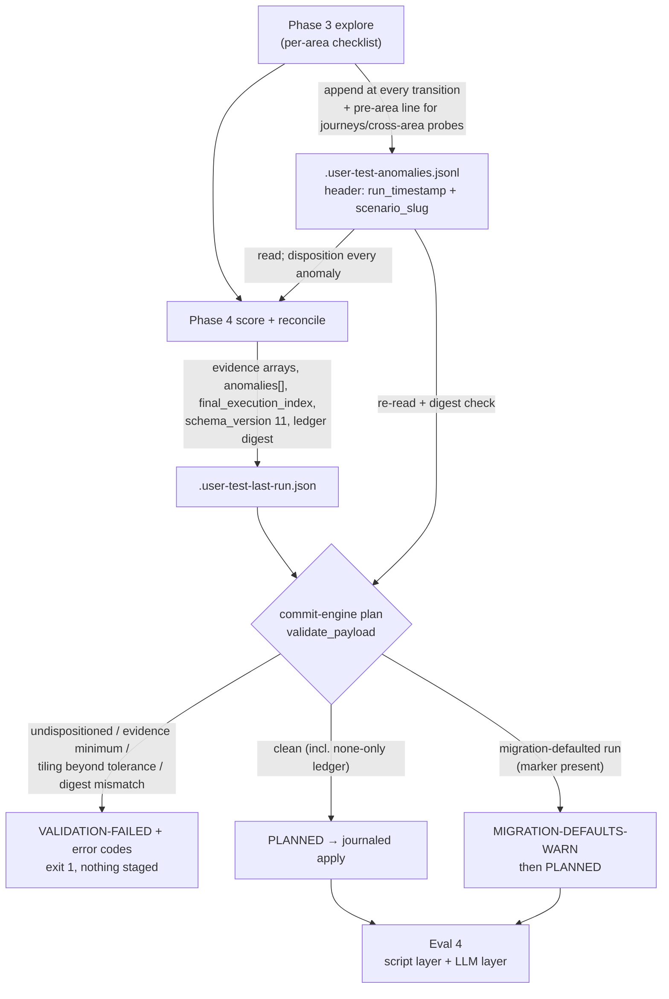

# feat: ce-user-test anomaly ledger + evidence arrays (v11 schema)

## Summary

Add two coupled artifacts to ce-user-test as one v11 schema bump: a per-run anomaly ledger (`.user-test-anomalies.jsonl`) the exploring agent appends to at every area transition, and an evidence array on every scored area in `.user-test-last-run.json`. Report generation reconciles the ledger into dispositioned entries, the commit engine refuses to apply an unreconciled or under-evidenced run, and a new Eval 4 grades ledger-to-report coverage. An anomaly noticed in Phase 3 can no longer silently vanish by Phase 4, and an unevidenced score can no longer reach the report.

---

## Problem Frame

The skill's founding purpose is finding rough spots, and most rough spots are incidental — noticed en route to a goal, not at it. GUITester (arXiv 2601.04500) names Goal-Oriented Masking as a top agent-tester failure mode, and the skill's own dispatch format structurally rewards it: "Sections with no items are omitted" (`skills/ce-user-test/SKILL.md:227`) means silence is indistinguishable from vigilance. There is today no side-channel for incidental observations anywhere in the skill — a grep for anomaly/incidental/evidence concepts comes up empty except for verification's exact-counts rule.

Scores have the same accountability gap. The rubric declares scores absolute, but nothing ties a "4/5" to what the agent observed. Verification already records exact counts (`skills/ce-user-test/references/verification-patterns.md:18`); UX and Quality scores record nothing, which blocks cross-run comparability and the planned calibration deck.

---

## Key Technical Decisions

- **Ephemeral ledger, reset per run.** The ledger's job is intra-run reconciliation between Phase 3 and Phase 4. It joins the gitignored ephemeral tier alongside `.user-test-last-run.json`; anything durable graduates into the report, `bugs.md`, or `explore_next_run` via disposition. Reset happens immediately before the first Phase 3 action — never earlier — so an abort in Phase 1/2 cannot destroy a prior run's ledger while that run's JSON is still uncommitted.

- **Run identity without cross-run identity.** The run JSON gains a `schema_version` field (written at Phase 4 under v11) and the ledger opens with a header line binding `run_timestamp` + `scenario_slug`. Without the version field, a v11 run that omits evidence would be laundered into the migration-defaults warning path (`migrate-run-json` runs unconditionally on the standalone commit path only; the engine's plan step reads the marker from the on-disk run JSON rather than relying on the migrator having run); without the header, a stale ledger from a crashed run could gate the wrong run. Neither field creates longitudinal identity — no run IDs, dedup, or pruning.

- **Execution-index tiling makes "none" non-vacuous.** Every ledger line — anomaly or none — carries the inclusive execution-index range it vouches for; ranges must be disjoint and gap-free across the run, ending at `final_execution_index`. A rote `none` must still stake a claim over a specific span of actions, which is mechanically checkable and cross-checkable against verification results inside that span. Tolerance is two-layered: width-1 gap or overlap at a boundary shared by adjacent lines is normalized away before the check (fencepost forgiveness — the dominant error source for an LLM-maintained inclusive counter), and interior gap width up to the run's recorded disconnect count passes (the counter drifts ±1 per retried call); anything beyond fails the gate.

- **Reconciliation is judgment-routed, not auto-fed.** Each anomaly gets an agent-chosen disposition (filed, noted-in-area, explore-next-run, or dismissed with reason). No mechanical injection into probes or Explore Next Run in v1. Scripts count coverage; the agent decides routing — the Judgment payload boundary holds.

- **Enforcement is runtime-first, eval-second; failures ride the existing sentinel shape.** Hard failures are new error codes under the existing `VALIDATION-FAILED` sentinel (JSON error array with `code` fields, `commit-engine.py:1353`), not new top-level failure sentinels. One new warning sentinel, `MIGRATION-DEFAULTS-WARN`, prints with JSON detail before `PLANNED` and does not block — unlike `STALE-WARN`, it needs no acknowledge flag. Eval 4 grades the artifacts after the fact, covering the semantic parts a script can't check.

- **Validation logic has one canonical home.** The commit engine owns every mechanical check (tiling, disposition coverage, evidence minimums, digest). SKILL.md and reference files name the error codes and describe what the agent must supply; they never restate the validation rules — dual homes drift (`docs/solutions/2026-02-26-monolith-to-skill-split-anti-patterns.md`).

- **Explicit-none is a valid terminal state.** A ledger of only `none` lines with clean tiling passes the gate and produces an empty anomalies list — it must not look failure-shaped, or agents will route around the ledger (`docs/solutions/skill-design/git-workflow-skills-need-explicit-state-machines.md`).

- **One evidence entry contract shared by both features.** Evidence entries have the same shape (type, ref, note) in an area's evidence array and in a ledger line's evidence field. v1 types: `action`, `dom`, `timing`, `count`. `screenshot` is deferred — the skill never persists screenshots to disk, so every ref would dangle by design.

- **Crash-safety split.** Evidence arrays, reconciled anomalies, `final_execution_index`, and `schema_version` live inside `.user-test-last-run.json`, which already rides the journaled pipeline as a staged file. Ledger appends happen during Phase 3, before the engine runs, as direct JSONL appends — crash-tolerant by format (a truncated trailing line is treated as absent). Phase 4 records a ledger digest (line count + SHA-256) in the run JSON; the plan step re-reads the ledger and rejects on mismatch, closing the edit-between-reconcile-and-commit window.

- **Eval 4's mechanical layer is the eval skill's first bundled script.** It drives the real fixtures and artifacts rather than reimplementing engine logic, grades a binary outcome, and is self-contained inside `skills/ce-user-test-eval/` — shared protocol names are duplicated, never imported, and pinned by an anti-drift test.

---

## High-Level Technical Design

The prose in Key Technical Decisions and the Requirements below is authoritative; the diagram orients.

---

## Requirements

**Evidence array**

- R1. Every scored area in `.user-test-last-run.json` carries an evidence array; each entry names a type (`action`, `dom`, `timing`, or `count`), a ref appropriate to that type (execution index, selector/value, or seconds), and a short note stating what the entry supports.
- R2. Every assigned, non-null score dimension (UX always; Quality when the area has scored output) has at least one evidence entry; skipped and disconnect-nulled dimensions are exempt.
- R3. Action-driving scores — either dimension at 2 or below, or a drop of one or more points from the prior run's same dimension — have at least two entries, at least one with a concrete ref rather than prose alone.
- R4. The report links each score to its evidence compactly (a count or index refs); full evidence stays in the run JSON, not the report.

**Anomaly ledger**

- R5. At every area transition the exploring agent appends to `.user-test-anomalies.jsonl`: one line per anomaly noticed en route (area, description, evidence entries per R1's contract) or one explicit `none` line.
- R6. Every ledger line carries the inclusive execution-index range it vouches for; a completed run's ranges are disjoint and gap-free from 0 through `final_execution_index`, within the disconnect-bounded tolerance of R18.
- R7. The ledger is gitignored ephemeral, reset immediately before the first Phase 3 action, same tier as `.user-test-last-run.json`.

**Reconciliation and report**

- R8. Report generation copies every ledger anomaly into a top-level anomalies list in the run JSON, each with a disposition: filed, noted-in-area, explore-next-run, or dismissed with a stated reason.
- R9. The commit engine's plan step rejects with `VALIDATION-FAILED` error codes when any ledger anomaly lacks a disposition, a dismissal reason is empty, a scored area misses its evidence minimum, an action ref exceeds `final_execution_index`, tiling fails beyond tolerance, or the ledger digest mismatches; no files are staged or written. Exception mirroring R12: a run JSON carrying the migration-defaults marker commits with the non-blocking `MIGRATION-DEFAULTS-WARN` sentinel instead — but only when no header-matching ledger exists. A marker-stamped run accompanied by a header-matching live ledger fails with `marker_with_live_ledger`: the ledger proves a v11 run, so it cannot launder itself through the warn path. The hard gate applies to runs produced under v11 prose.
- R10. Anomalies render through existing dispatch sections via their dispositions — no new report section. The report header carries a noted/dispositioned count; dismissed anomalies appear in DETAILS only.

**Eval 4**

- R11. Eval 4 is a binary, artifact-only eval with a mechanical script layer (ledger exists and matches the run, index ranges tile within tolerance, every anomaly dispositioned, filed and explore-next-run dispositions map to a resolvable issue or explore_next_run item) and an LLM-graded layer (reworded report mentions match their anomaly semantically; `none` spans are spot-checked against verification results inside them).
- R12. Runs without a matching ledger or carrying the migration-defaults marker grade N/A on Eval 4, not fail.

**Migration and compatibility**

- R13. The v11 migration is one `MIGRATION_TABLE` row plus additive run-JSON defaults (empty evidence arrays, empty anomalies list, null `final_execution_index`) and the version constant bumped to 11 in both scripts, with zero new migration prose in SKILL.md (origin plan AE4).
- R14. Feature instructions live in reference files; SKILL.md changes are limited to the per-area checklist, scoring, reconciliation, and report/persistence steps that trigger them.
- R15. The run JSON carries `schema_version` (11) written at Phase 4; `migrate-run-json` stamps a migration-defaults marker only when that field is absent or below 11, and sets it to 11 after defaulting.

**Run binding and edge cases**

- R16. The ledger opens with a header line binding `run_timestamp` and `scenario_slug`. For marker-stamped runs, a mismatched or absent ledger routes to the migration-defaults path (warn / N/A). For marker-less v11 runs, an absent ledger fails `ledger_missing` and a header-mismatched ledger fails `ledger_foreign` — ignore-and-proceed is reserved for marker-stamped runs, so header corruption is never cheaper than compliance. The reconciled run JSON stays authoritative once written.
- R17. Pre-area Phase 3 work (journeys, cross-area probes) is covered by a dedicated pre-area ledger line starting at index 0; a transition that consumed no indices appends its line with the explicit empty-range marker — `index_range: null` plus a required `at_index` field carrying the counter value at the transition, which tiling treats as a zero-width marker at that boundary.
- R18. The agent writes `final_execution_index` into the Phase 4 run JSON; the tiling check asserts coverage through it, normalizing width-1 gap/overlap at shared adjacent-line boundaries, tolerating interior gap width up to the run's recorded disconnect count, and rejecting beyond that. The gate additionally fails `final_index_understated` when `final_execution_index` is below the maximum execution index appearing anywhere in the payload (probe indices, broad-exploration starts, action evidence refs, ledger range ends).
- R19. The execution-index counter continues monotonically across iterate-mode iterations (no per-iteration reset). Iterate mode reconciles each iteration's ledger into that iteration's run JSON before the ledger resets; the aggregate commit payload unions dispositioned anomalies across iterations and carries the final iteration's ledger digest plus the run-global `final_execution_index`. Digest and tiling gates apply to the final iteration's live ledger only; earlier iterations' anomalies, already validated at their own reconciliation, are exempt from ref re-validation.
- R20. Evidence minimums are validated against final Phase 4 scores; a score lowered past its evidence support is never replaced by the higher evidence-supported score — the agent re-opens the area to gather the missing evidence, or disconnect-nulls the dimension. Score maintenance must not be mechanically cheaper than honest degradation.
- R21. A filed disposition may reference a pre-existing issue; Eval 4 verifies the reference resolves, not that it was created this session.
- R22. The names shared across components — validation error codes, the warning sentinel, disposition values, evidence types — are pinned by a mechanical anti-drift test spanning both ce-user-test scripts, the Eval 4 script, and the schema references.

---

## Acceptance Examples

- AE1. **Covers R6, R11.** The agent explores navigation across execution indices 12–30 and appends `none` with range 12–30. A run whose ledger ranges cover 1–30 but skip 31–40 (no disconnects recorded) fails Eval 4's mechanical layer.
- AE2. **Covers R9.** The ledger holds three anomalies; the run JSON's anomalies list dispositions two. `plan` exits with `VALIDATION-FAILED` and an `anomaly_undispositioned` code, and stages nothing.
- AE3. **Covers R8, R11.** An anomaly "toast lingered ~8s after save" is dispositioned explore-next-run; the report's EXPLORE NEXT RUN says "notification toast overstays after save." Mechanical layer matches the explore_next_run item; LLM layer confirms the rewording — pass.
- AE4. **Covers R3, R9.** An area scored 2/5 with a single prose-only evidence entry fails plan-step validation with the evidence-minimum code.
- AE5. **Covers R12, R13, R15.** A pre-v11 run JSON passed through `migrate-run-json` gains empty evidence arrays, an empty anomalies list, `schema_version: 11`, and the migration-defaults marker; Eval 4 reports N/A for that run.
- AE6. **Covers R9, R15.** A pre-v11 run JSON migrated to v11 defaults is committed via standalone `/ce-user-test-commit`; the engine prints `MIGRATION-DEFAULTS-WARN` and proceeds to `PLANNED` rather than failing the evidence-minimum gate.
- AE7. **Covers R18.** Adjacent ledger lines meeting at a shared boundary (ranges 0–12 and 12–30) normalize cleanly and pass. A run recording 2 disconnects with interior gap width 2 passes the plan gate; the same run with interior gap width 3 rejects with the tiling code.
- AE8. **Covers R16.** A marker-stamped run whose ledger header names a different `scenario_slug` proceeds via the migration-defaults path. The same foreign-header ledger against a marker-less v11 run fails with `ledger_foreign`.
- AE9. **Covers R19.** A three-iteration iterate run logs one anomaly during iteration 2 (indices continuing monotonically across iterations); the aggregate committed run JSON contains that anomaly with a disposition, and its evidence refs validate without re-checking against the final iteration's ledger.
- AE10. **Covers R9, R15.** A run JSON carrying the migration-defaults marker while a header-matching live ledger exists fails with `marker_with_live_ledger` — the warn path is unreachable when ledger evidence proves a v11 run.
- AE11. **Covers R20.** In Phase 4 the agent lowers an area's UX score from 4 to 2 with only one prose-only evidence entry; the run is not writable with either score — the area is re-opened for evidence or the dimension disconnect-nulled, and the higher score is never silently restored.

---

## Implementation Units

### U1. v11 schema contracts: evidence entries, ledger protocol, run-JSON fields

- **Goal:** Pin the shared data contracts everything else builds on — the evidence entry shape, the ledger header/line format and range semantics, and the new run-JSON fields.
- **Requirements:** R1, R5, R6, R15, R16, R17
- **Dependencies:** none
- **Files:** `skills/ce-user-test/references/last-run-schema.md` (modify), `skills/ce-user-test/references/anomaly-ledger.md` (create)
- **Approach:** `last-run-schema.md` gains a "(v11 additions)" section in its existing heading + `| Field | Type | Default | Written by |` table convention: `areas[].evidence`, top-level `anomalies[]` (entry: ledger fields + `disposition` + optional `issue_ref`/`reason`), `final_execution_index`, `schema_version`, and the ledger-digest field. `anomaly-ledger.md` owns the ledger protocol: header line (`run_timestamp`, `scenario_slug`), line fields (`area`, `kind` anomaly|none, `what`, `evidence`, `index_range` inclusive `[start, end]`, or the empty-range marker: `index_range: null` + required `at_index`), the pre-area line, append timing (every transition + end of last area's verification), and reset timing. Field names in this unit are authoritative for all downstream units.
- **Patterns to follow:** `last-run-schema.md:123-154` per-version addition tables; reference-file conventions (kebab-case, linked inline from SKILL.md at the phase that needs them plus the Reference Files index).
- **Test scenarios:** Test expectation: none — documentation contracts; name-level integrity is enforced by U6's anti-drift test.
- **Verification:** Both references render; every field named in U3–U5 traces to a table row or protocol field here.

### U2. SKILL.md and reference prose: ledger appends, evidence collection, reconciliation

- **Goal:** Make the exploring agent produce the ledger and evidence, and Phase 4 reconcile — with minimal SKILL.md deltas and substance in references.
- **Requirements:** R2, R3, R4, R5, R7, R8, R10, R14, R17, R19, R20
- **Dependencies:** U1
- **Files:** `skills/ce-user-test/SKILL.md` (modify), `skills/ce-user-test/references/anomaly-ledger.md` (extend), `skills/ce-user-test/references/iterate-mode.md` (modify)
- **Approach:** Per-area checklist (`SKILL.md:107-119`) gains one step: ledger append at the area transition, as a load stub pointing to `anomaly-ledger.md`. Step 5 (Score) gains the evidence obligation: collect typed evidence per score dimension; before the Phase 4 run-JSON write, verify minimums against final scores (R20's reopen-or-null rule lives in `anomaly-ledger.md`, not inline — never substitute the higher evidence-supported score). Phase 4 gains a reconciliation step before Run Results Persistence: disposition every ledger anomaly, record `final_execution_index` and the ledger digest. Run Results Persistence (`SKILL.md:290-292`) bumps "(v10)" to "(v11)". Protected-artifacts list (`SKILL.md:26-31`) and the Phase 1 gitignore list (`SKILL.md:67-70`) gain `.user-test-anomalies.jsonl`. Commit mode names `MIGRATION-DEFAULTS-WARN` as expected non-blocking output — names only, no restated logic. Report section rules (`SKILL.md:259-269`) gain the header anomaly count and DETAILS placement for dismissed anomalies. `iterate-mode.md` gains per-iteration reconciliation before reset and aggregate-payload union (R19). No migration prose anywhere (R13).
- **Execution note:** Validate prose behavior via skill-creator injected subagents — in-session skill invocation tests cached pre-edit content.
- **Test scenarios:** (skill-creator evals, not bun) — 1. Covers AE1/AE3: paired old-vs-new blind injection on a scenario with a mid-area anomaly: old prose drops it, new prose ledgers and dispositions it. 2. Restraint negative: a clean scenario produces explicit `none` lines with sane ranges, not invented anomalies. 3. Covers AE9: iterate scenario where iteration 2's anomaly survives into the aggregate payload with monotonic indices. 4. Covers AE11: score-downgrade scenario — new prose re-opens the area or nulls the dimension; a silent keep of the higher score is a fail.
- **Verification:** Deletion-test-clean deltas; every executed script call added carries the inline `SKILL_DIR` anchor; validation rules appear nowhere in prose (names only).

### U3. migrate-test-file.py: v11 row, run-JSON defaults, migration-defaults marker

- **Goal:** One migration-table row plus additive run-JSON defaulting that stamps the marker the warning path keys on.
- **Requirements:** R13, R15
- **Dependencies:** U1
- **Files:** `skills/ce-user-test/scripts/migrate-test-file.py` (modify)
- **Approach:** `CURRENT_SCHEMA_VERSION` → 11; `MIGRATION_TABLE` gains `{"from_version": 10, "fills": [...]}` naming the run-JSON additions, plus terminal `{"from_version": 11, "fills": []}`. The markdown test file gains no v11 content — the v10→v11 fill function is a version-bump-only step. `normalize_last_run`: add `evidence: []` to `RUN_JSON_AREA_DEFAULTS`, `anomalies: []` to `RUN_JSON_ARRAY_DEFAULTS`, default `final_execution_index: null`; when incoming `schema_version` is absent or below 11, stamp the migration-defaults marker (field name per U1) and set `schema_version: 11`.
- **Patterns to follow:** existing table rows at `migrate-test-file.py:438-488`; hand-coded fill functions keyed on `from_version` at 549-556.
- **Test scenarios (tests/user-test-scripts.test.ts):** 1. v10 fixture → `MIGRATED 10 -> 11`, content survives byte-comparably outside the version line. 2. v11 fixture → `CURRENT`, byte-level no-op. 3. Covers AE5: pre-v11 run JSON through `migrate-run-json` gains all defaults, the marker, and `schema_version: 11`. 4. Run JSON already at `schema_version: 11` → no marker stamped, existing evidence/anomalies untouched. 5. Existing test literals updated (`MIGRATED 5 -> 10` expectations at `user-test-scripts.test.ts:51,55,148,151,183,186` and `user-test-aging.test.ts:469`).
- **Verification:** `bun test` green including the aging harness; migration of the v5 fixture now reports `5 -> 11`.

### U4. commit-engine.py: validation gates, warning sentinel, merge whitelist

- **Goal:** The runtime enforcement — reject unreconciled or under-evidenced runs before staging; warn-and-proceed on migration-defaulted runs; merge the new fields correctly.
- **Requirements:** R6, R8, R9, R15, R16, R18, R22 (names), AE2/AE4/AE6/AE7/AE8/AE10
- **Dependencies:** U1
- **Files:** `skills/ce-user-test/scripts/commit-engine.py` (modify)
- **Approach:** `CURRENT_SCHEMA_VERSION` → 11. `validate_payload` gains checks emitting `VALIDATION-FAILED` error codes: `anomaly_undispositioned`, `dismissal_reason_empty`, `evidence_minimum`, `evidence_ref_out_of_range`, `ledger_tiling`, `ledger_digest_mismatch`, `ledger_missing`, `ledger_foreign`, `marker_with_live_ledger`, `final_index_understated` (exact strings authoritative here; U6 pins them). The plan step reads the ledger and routes on the marker/ledger matrix: marker-stamped + no header-matching ledger → `MIGRATION-DEFAULTS-WARN` (JSON detail) then `PLANNED`; marker-stamped + header-matching live ledger → `marker_with_live_ledger`; marker-less + absent ledger → `ledger_missing`; marker-less + header-mismatched ledger → `ledger_foreign`; marker-less + matching ledger → full gates. Tiling: inclusive, disjoint, gap-free through `final_execution_index`, after normalizing width-1 gap/overlap at shared adjacent-line boundaries; interior tolerance = `disconnects.count`; `final_index_understated` cross-checks `final_execution_index` against the maximum index anywhere in the payload (probe indices, broad-exploration starts, action evidence refs, ledger range ends). Evidence minimums per R2/R3 against payload scores, exempting null dimensions; the R3 drop check reads the previous per-area score from `score-history.json` (`validate_payload` gains a project-read input; validation still runs before staging). Iterate aggregates: digest/tiling gates apply to the final iteration's live ledger only; anomalies carried from earlier iterations are exempt from ref re-validation (R19). `merge_last_run`: handle `anomalies` outside `RUN_JSON_ARRAY_KEYS` with payload-only sourcing (empty default, never falling back to the previous run's value), `evidence: []` to the engine's `RUN_JSON_AREA_DEFAULTS` copy, and set `final_execution_index`, `schema_version`, and the ledger digest from the payload alongside `run_timestamp` (`commit-engine.py:1285-1287`). Register the new sentinel in the header list (`commit-engine.py:16-30`).
- **Patterns to follow:** `validate_payload` error-object shape (`commit-engine.py:1353,1371-1380`); `STALE-WARN` for warning-sentinel plumbing (non-blocking here — no acknowledge flag); validate-before-stage ordering (`commit-engine.py:1409-1424`).
- **Test scenarios (tests/user-test-commit-engine.test.ts):** 1. Covers AE2: undispositioned anomaly → `VALIDATION-FAILED` + `anomaly_undispositioned`, snapshot unchanged, no journal. 2. Covers AE4: score 2 with one prose-only entry → `evidence_minimum`. 3. Empty dismissal reason → `dismissal_reason_empty`. 4. Action ref 57 with `final_execution_index` 40 → `evidence_ref_out_of_range`. 5. Covers AE7: shared-boundary ranges (0–12, 12–30) normalize and pass; interior gap width ≤ `disconnects.count` passes; width `count+1` → `ledger_tiling`. 6. Covers AE6: marker-stamped run with no matching ledger → `MIGRATION-DEFAULTS-WARN` then `PLANNED`, apply succeeds. 7. Covers AE8: foreign-header ledger against a marker-stamped run → warn path; against a marker-less v11 run → `ledger_foreign`. 8. None-only ledger with clean tiling → passes, empty anomalies list; an empty-range marker line (`index_range: null` + `at_index`) tiles cleanly. 9. Digest mismatch (ledger line appended after Phase 4) → `ledger_digest_mismatch`. 10. Marker-less run with no ledger → `ledger_missing`. 11. `anomalies` sources from the payload only — an omitting payload over a previous run JSON that contains anomalies commits an empty list, never inheriting. 12. Covers AE10: marker-stamped run + header-matching live ledger → `marker_with_live_ledger`. 13. `final_execution_index` 40 with a ledger range ending at 45 → `final_index_understated`. 14. R3 drop check: area scored 3 after a prior-run 4 in `score-history.json` with one evidence entry → `evidence_minimum`.
- **Verification:** Full commit-engine suite and 100-cycle aging harness green; a rejected plan provably touches nothing (snapshot equality).

### U5. Eval 4: ledger-to-report coverage check

- **Goal:** The enforcement half for rote-`none` and masked findings — mechanical script plus LLM-graded semantic layer, first bundled script in the eval skill.
- **Requirements:** R11, R12, R21, R22 (names)
- **Dependencies:** U1, U4
- **Files:** `skills/ce-user-test-eval/SKILL.md` (modify), `skills/ce-user-test-eval/scripts/eval4-ledger-coverage.py` (create)
- **Approach:** New `### Eval 4` section after the Eval 3 block, replacing the "candidate for a future Eval 4" scope note (`ce-user-test-eval/SKILL.md:73-75`). The script (stdlib Python, invoked with the `SKILL_DIR` anchor) performs the mechanical layer: ledger exists and header matches the run JSON, tiling within disconnect tolerance, every anomaly dispositioned, filed refs resolve against `bugs.md`, explore-next-run dispositions map to `explore_next_run` items — emitting a machine-readable pass/fail/NA plus an ambiguous-matches list. The LLM layer grades only what the script flagged ambiguous: reworded report mentions, and `none`-span spot-checks against `verification_results` inside those ranges. N/A when the ledger is absent/foreign or the migration-defaults marker is present. Update the "3 evals" literals (`SKILL.md:3, 9, 31, 98, 180`), the graduation message's "adding a 4th eval" suggestion (`SKILL.md:173` — reword to a 5th eval or drop the count), and the `skill-evals.json` shape (`SKILL.md:139-143`) to four. Self-containment: duplicated protocol-name constants, no imports from ce-user-test.
- **Execution note:** Validate the prose layer via skill-creator injection; the script layer is covered by bun tests in U6.
- **Test scenarios:** 1. Covers AE1: tiling-gap fixture (no disconnects) → mechanical FAIL. 2. Covers AE3: reworded mention fixture → script marks ambiguous, LLM layer instruction confirms match. 3. Covers AE5: marker-stamped run → N/A. 4. Dispositioned-as-filed anomaly whose `issue_ref` is absent from `bugs.md` → FAIL. 5. None-only clean run → PASS (restraint: not failure-shaped).
- **Verification:** Eval run against a real v11 run artifact set completes with a definite verdict; summary line reads `<N>/4`.

### U6. Fixtures, migration/gate tests, and the protocol-name anti-drift test

- **Goal:** Regression coverage for the whole bump and a mechanical guard that the shared names can't drift between components.
- **Requirements:** R13, R22; test-side coverage of AE1–AE9
- **Dependencies:** U3, U4, U5
- **Files:** `tests/fixtures/user-test/current-v11.md` (create), `tests/fixtures/user-test/v10.md` (rename from `current-v10.md`), `tests/fixtures/user-test/last-run-v11.json` + ledger fixtures (create), `tests/user-test-scripts.test.ts` (modify), `tests/user-test-commit-engine.test.ts` (modify), `tests/user-test-aging.test.ts` (modify), `tests/user-test-protocol-names.test.ts` (create)
- **Approach:** Fixture set follows the established `tempFixture` pattern: the new current fixture at `schema_version: 11`, the old current kept as the v10→v11 migration source, plus run-JSON/ledger fixture pairs for the gate scenarios (clean, undispositioned, tiling-gap, foreign-header, none-only, marker-stamped). The anti-drift test parses the error-code / sentinel / disposition / evidence-type name sets out of `commit-engine.py`, `eval4-ledger-coverage.py`, and the U1 references, and asserts set equality — the cross-component contract cannot diverge with tests green. Aging harness payloads gain evidence arrays and ledger writes so the 100-cycle and crash-injection paths exercise the new fields.
- **Patterns to follow:** `tempFixture`/`makeProject`/`basePayload`/`snapshot` helpers (`user-test-commit-engine.test.ts:84-246`); validation-loop pattern at `:334-413`; `CRASH_AFTER_FILE` injection (`user-test-aging.test.ts:444`).
- **Test scenarios:** The unit IS the test work — the per-scenario lists live in U3–U5; this unit additionally covers: 1. Anti-drift: mutate one code string in a scratch copy → set-equality assertion fails. 2. Aging: 100 cycles with evidence/anomalies present keep caps and digests consistent. 3. Crash injection between staged files leaves the run resumable with anomalies intact.
- **Verification:** `bun test` green across all four suites; no fixture asserts a stale `schema_version: 10` or `MIGRATED 5 -> 10` literal.

### U7. Docs and glossary sync

- **Goal:** Keep the user-facing skill docs and the shared vocabulary consistent with the shipped behavior.
- **Requirements:** R14 (docs half); AGENTS.md plugin-maintenance convention
- **Dependencies:** U2, U5
- **Files:** `docs/skills/ce-user-test.md` (modify), `docs/skills/ce-user-test-eval.md` (modify, if present), `CONCEPTS.md` (verify)
- **Approach:** Skill pages gain the ledger/evidence mechanics and Eval 4 in their existing shape. `CONCEPTS.md`'s Anomaly ledger and Evidence array entries already match this plan (the Evidence array entry's type list was corrected to `action, dom, timing, count` when `screenshot` was deferred) — verify, don't re-edit. Run `bun run release:validate` if any skill description changed.
- **Test scenarios:** Test expectation: none — documentation.
- **Verification:** `bun run release:validate` passes; docs pages mention Eval 4 and the ledger.

---

## Scope Boundaries

- Calibration deck and blind proficiency seeds (ideation idea 3) — evidence arrays are its enabler, not its delivery.
- Persistent cross-run anomaly history — the ledger is per-run; durable observations graduate via dispositions.
- Mechanical auto-generation of probes or Explore Next Run items from anomalies — v1 routing is agent judgment only.
- Retroactive evidence for pre-v11 runs — migration adds empty defaults, nothing is back-filled.
- New report sections — anomalies and evidence render inside the existing dispatch format.
- The `screenshot` evidence type — deferred until the skill has a screenshot persistence directory; every ref would dangle today.
- Cross-skill protected-path registration — ce-code-review's Protected Artifacts list covers `docs/` directories only; the ledger registers in ce-user-test's own two lists.
- Concurrent-run isolation beyond detectability — the ledger header makes cross-contamination detectable (R16); dedicated per-run paths are follow-up work, matching the run JSON's existing limitation.

---

## Risks & Dependencies

- **Incomplete runs rely on existing aborts.** Commit mode already refuses `completed: false` runs and Eval 4's Phase 1 aborts on them, so the new gates never see incomplete runs. This is a load-bearing reliance — do not "fix" those aborts without revisiting R9/R11.
- **Byte-duplicated constants.** `RUN_JSON_AREA_DEFAULTS` exists in both scripts with slightly different sibling key sets; v11 fields must land in both copies, and the U6 anti-drift test is the guard.
- **Per-transition overhead.** The ledger append adds one small write per area; if real runs show friction, the mitigation is batching appends per transition, never dropping the explicit `none`.
- **Grader variance in Eval 4's LLM layer.** Ambiguous rewording fixtures are where rubrics coin-flip; measure run-to-run variance during U5 validation, not just pass rate (`docs/solutions/skill-design/safe-auto-rubric-calibration.md`).

---

## Open Questions

**Deferred to implementation**

- Exact JSON payload fields inside each new validation error object (beyond the pinned `code` strings).
- Exact rendering of the report-header anomaly counter and the score→evidence link format (count vs index refs) within the dispatch format's line budget.
- Eval 4 LLM-layer rubric wording and the ambiguous-match handoff format between script and grader.
- Whether ledger reset deletes or truncates the file.

---

## Sources

- `skills/ce-user-test/SKILL.md:227` — dispatch format's "sections with no items are omitted"; per-area checklist at 107–119; report rules 259–269; persistence at 278–292; commit mode at 294–424.
- `skills/ce-user-test/references/last-run-schema.md` — per-version addition tables; no evidence array, anomalies list, run-global index, or version field exists today.
- `skills/ce-user-test/scripts/migrate-test-file.py:438-488` — `MIGRATION_TABLE`; `normalize_last_run` at 681–704 stamps no marker today; `RUN_JSON_*` defaults at 642–660.
- `skills/ce-user-test/scripts/commit-engine.py` — sentinels at 16–30; error-object shape at 1353/1371–1380; `RUN_JSON_ARRAY_KEYS`/`RUN_JSON_AREA_DEFAULTS` at 1228–1248; `merge_last_run` at 1279–1306; validate-before-stage at 1409–1424.
- `tests/user-test-scripts.test.ts`, `tests/user-test-commit-engine.test.ts` (helpers at 84–246, validation loop at 334–413), `tests/user-test-aging.test.ts` (aging at 409, crash injection at 444) — black-box test conventions and the stale-literal sites.
- `skills/ce-user-test-eval/SKILL.md:73-75` — the Eval 4 scope note; eval JSON shape at 139–143; "3 evals" literals at 3, 9, 31, 98, 180.
- `skills/ce-user-test-commit/SKILL.md` — thin wrapper; AE6 behavior lands in ce-user-test commit mode and the engine.
- `docs/plans/2026-07-01-001-refactor-user-test-deterministic-core-plan.md` — AE4 acceptance bar; v11 named as the migration table's first consumer.
- `CONCEPTS.md:57-58` and `docs/solutions/2026-02-26-agent-guided-state-and-mcp-resilience-patterns.md` — the judgment/mechanical boundary the gates observe; `docs/solutions/2026-02-26-monolith-to-skill-split-anti-patterns.md` — single canonical validation home; `docs/solutions/skill-design/script-first-skill-architecture.md` — tiling/counting is script work; `docs/solutions/skill-design/git-workflow-skills-need-explicit-state-machines.md` — none-only as valid terminal state; `docs/solutions/skill-design/paired-old-vs-new-injection-skill-evals.md` and `docs/solutions/skill-design/fake-cli-harness-for-skill-judgment-evals.md` — Eval 4 and U2 validation design; `docs/solutions/skill-design/bundled-script-path-resolution-across-harnesses.md` — `SKILL_DIR` anchor.
- GUITester (arXiv 2601.04500) — Goal-Oriented Masking; UXBench (arXiv 2606.16262) — evidence-grounded UX scores.
