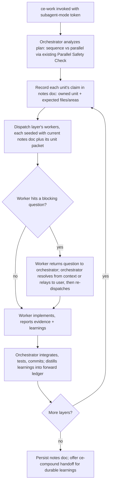
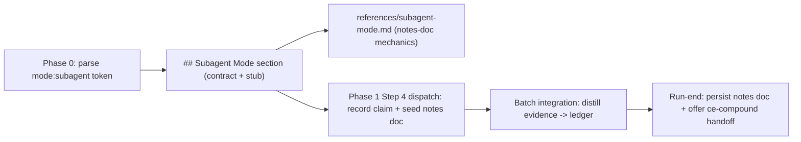

# ce-work Subagent Execution Mode - Requirements

## Goal Capsule

- **Objective:** Add a strict, opt-in subagent execution mode to `ce-work` where every implementation unit runs in a subagent, the main loop only orchestrates and talks to the user, and subagents coordinate through a shared notes document that carries claims and learnings forward across the run.
- **Product authority:** The Product Contract below. Product behavior, scope boundaries, and success signals were resolved in brainstorm dialogue.
- **Readiness:** `implementation-ready` — Product Contract (WHAT) preserved from the brainstorm; Planning Contract and Implementation Units (HOW) added below. Ready for `ce-work`.
- **Execution profile:** Skill-prose work — markdown authoring in `skills/ce-work/SKILL.md` plus one new `references/` file and doc-page updates. Behavioral validation runs through `skill-creator` evals, not `bun test` alone; `bun test` + `bun run release:validate` guard the mechanical surface (frontmatter, counts, parse).
- **Stop conditions:** Surface rather than guess if the notes-doc seeding measurably re-bloats worker context (curation discipline failing its purpose), or if enforcing subagents for trivial work proves to conflict with an existing Phase 0 triage path in a way not anticipated here.
- **Open blockers:** None. The brainstorm's deferred planning questions are resolved in Key Technical Decisions below.

---

## Product Contract

### Summary

A strict **subagent execution mode** for `ce-work`, invoked explicitly, in which every implementation unit runs in a subagent and the main loop only orchestrates, integrates, commits, reviews, and talks to the user.
Subagents coordinate through a shared **notes document** — declared claims up front plus a forward ledger of conventions, gotchas, and decisions — so later workers stop re-deriving test setup and re-fixing bugs earlier workers already solved.
At run end the distilled learnings persist to an inspectable location, and `ce-work` offers to graduate the durable ones into `docs/solutions/` via `ce-compound`.

### Problem Frame

`ce-work` already prefers subagents for structured multi-unit plans and already decides sequence vs parallel via its Parallel Safety Check. But each subagent works from a fresh, bounded context with no knowledge of what its peers or predecessors did. In practice this means workers repeatedly re-derive the same test setup and project conventions, and independently hit — and re-troubleshoot — the same bugs. They also have no awareness of what other workers are doing, are about to do, or have already done, so ownership overlaps surface only at integration time.

Separately, when the main orchestration loop does some implementation inline (trivial work, mid-flight interactive work), its context accumulates implementation detail across a long run, which is the same context-bloat pressure that motivated subagents in the first place.

### Actors

- A1. Orchestrator (main loop): analyzes the plan, records claims, dispatches workers, integrates results, stages and commits, dispatches review, curates the notes doc, and owns all user interaction.
- A2. Subagent worker: executes one implementation unit in a fresh context, receives the seeded notes doc, and reports evidence, learnings, and any blocking questions back to the orchestrator.
- A3. User: invokes the mode, answers questions the orchestrator relays, and accepts or declines the end-of-run learnings handoff.
- A4. `ce-compound` (downstream skill): invoked at the optional end-of-run handoff to persist durable learnings into `docs/solutions/`.

### Key Flows

- F1. **Layered subagent execution with forward-carried learnings.**
  - **Trigger:** `ce-work` invoked in subagent mode against an implementation-ready plan.
  - **Actors:** A1, A2.
  - **Steps:** Orchestrator uses the existing sequence-vs-parallel analysis to form dependency layers; records each unit's claim in the notes doc; dispatches the layer's workers, each seeded with the current notes doc; on completion, integrates and commits, then distills each worker's report into the forward ledger before dispatching the next layer.
  - **Outcome:** Later workers reuse earlier setup, conventions, and fixes; the main loop holds only orchestration state.
  - **Covered by:** R2, R5, R6, R7, R8, R9, R10, R11.
- F2. **Blocking question relay.**
  - **Trigger:** A worker cannot resolve a genuine ambiguity from its unit packet and the notes doc.
  - **Actors:** A2, A1, A3.
  - **Steps:** Worker returns the question instead of guessing; orchestrator resolves it from context or relays it to the user; orchestrator re-dispatches with the resolved answer.
  - **Outcome:** The user interacts only with the main loop; no subagent talks to the user.
  - **Covered by:** R3, R4.
- F3. **End-of-run learnings handoff.**
  - **Trigger:** A subagent-mode run completes with durable learnings in the ledger.
  - **Actors:** A1, A3, A4.
  - **Steps:** Orchestrator persists the notes doc to an inspectable location; surfaces the distilled durable learnings; offers a `ce-compound` handoff; on acceptance, the appropriate learnings graduate into `docs/solutions/`.
  - **Outcome:** Per-run coordination state becomes compounding institutional knowledge.
  - **Covered by:** R12, R13.

### Requirements

**Mode invocation and enforcement**

- R1. `ce-work` gains a distinct, explicitly-invoked subagent execution mode, triggered by a leading mode token consistent with the existing `mode:return-to-caller` convention. When the token is absent, default `ce-work` behavior is unchanged.
- R2. In this mode every implementation unit runs in a subagent — including trivial 1-2 file changes that default `ce-work` would run inline. The main loop performs no implementation itself.
- R3. The main loop retains orchestration, integration, staging and committing, review dispatch, and all user interaction. The existing contract that the orchestrator owns commits and authoritative test runs is unchanged.
- R4. Subagents never interact with the user directly. A worker that hits a genuine ambiguity or blocking question returns it to the orchestrator, which resolves it from context or relays it to the user before re-dispatching. Clarification is front-loaded before dispatch wherever possible.

**Shared notes document**

- R5. A single shared notes document is maintained per run as the coordination artifact between subagents, holding two parts: declared claims and a forward ledger.
- R6. Claims: at dispatch, each worker's intended scope — the unit it owns and the files or areas it expects to touch — is recorded in the notes doc so peers in the same layer and workers in later layers can see intended ownership up front.
- R7. Forward ledger: durable, reusable learnings captured from completed work — test setup and project conventions discovered, gotchas and bugs already solved, and decisions made — so later workers do not re-derive setup or re-troubleshoot the same failures.
- R8. The notes doc is orchestrator-curated, not a free-form append log. The orchestrator distills each worker's returned report into terse ledger entries, harvesting from the existing worker evidence-return channel rather than adding a parallel reporting mechanism, keeping the doc small enough that seeding it into each worker does not recreate the context bloat subagents exist to avoid.
- R9. Each dispatched worker is seeded with the current notes doc (claims + ledger) as part of its bounded unit packet, alongside the plan-unit content it already receives.

**Coordination model**

- R10. Coordination is claims-plus-forward-flow, not live peer visibility: within a parallel layer, workers see claims declared at dispatch but do not observe each other mid-flight. New learnings and decisions become visible only after a layer completes and the orchestrator folds them into the ledger before the next layer.
- R11. The mode reuses `ce-work`'s existing sequence-vs-parallel analysis (Parallel Safety Check and dependency-layer batching) to decide what runs in sequence vs parallel; it introduces no separate orchestration engine. The claims in R6 draw on the same file/unit mapping the Safety Check already produces.

**Learnings afterlife**

- R12. The notes doc persists to an inspectable location after the run rather than being discarded, so the user can review what workers claimed, learned, and decided.
- R13. At run end, `ce-work` surfaces the distilled durable learnings and offers to graduate the appropriate ones into `docs/solutions/` via `ce-compound`. The handoff is offered, never automatic.

### Acceptance Examples

- AE1. **Covers R2.** Given a trivial 1-2 file plan in subagent mode, when `ce-work` executes, then even that change runs in a dispatched subagent and the main loop performs no direct edits.
- AE2. **Covers R4.** Given a worker encounters a genuine ambiguity mid-unit that it cannot resolve from its packet, when it needs an answer, then it returns the question to the orchestrator rather than guessing, and the orchestrator resolves or relays it before re-dispatching.
- AE3. **Covers R7, R9.** Given an early-layer worker discovers the project's test harness requires a specific setup step, when a later worker is dispatched, then it receives that learning in its seeded notes doc and does not re-derive the setup.
- AE4. **Covers R6, R10.** Given two workers run in the same parallel layer, when they are dispatched, then each one's claimed scope is recorded in the notes doc at dispatch, but neither sees the other's in-progress work until the layer completes.
- AE5. **Covers R8.** Given a worker returns a verbose report, when the orchestrator updates the notes doc, then it records a distilled terse entry rather than the raw report, keeping the seeded doc compact.
- AE6. **Covers R1.** Given `ce-work` is invoked without the mode token, when it runs, then default behavior (prefer-subagents-but-inline-trivial) is unchanged.
- AE7. **Covers R13.** Given a subagent-mode run produced durable learnings, when the run ends, then `ce-work` offers a `ce-compound` handoff for the appropriate learnings and writes nothing to `docs/solutions/` unless the user accepts.

### Success Criteria

- Within a run, the same test-setup discovery or bug fix does not recur across workers — later workers demonstrably reuse what earlier workers learned.
- The main loop's context stays focused on orchestration; long multi-unit runs no longer degrade from orchestrator implementation-detail bloat.
- A downstream reader (or `ce-plan`) can tell exactly how the mode is invoked, what the notes doc contains, and where the sequence-vs-parallel decision comes from, without inventing behavior.
- Durable learnings from a run are inspectable and can flow into `docs/solutions/` with a single accepted handoff.

### Scope Boundaries

- Real-time messaging or live shared state between concurrent workers — not attemptable in current harnesses; coordination is claims + forward flow only.
- A new sequence-vs-parallel analysis engine — the mode reuses the existing Parallel Safety Check and dependency-layer batching.
- Changes to Return-to-Caller / `lfg` tail ownership or the existing orchestrator commit/integration contract.
- Extending the notes-doc ledger to default (non-mode) `ce-work` runs — kept mode-only for v1.
- A general cross-skill or cross-run worker-messaging framework beyond this single run-scoped notes doc.
- Automatic (non-offered) writing of learnings into `docs/solutions/`.

### Key Decisions

- **Distinct invocable mode over changing defaults.** Keeps default `ce-work` behavior intact and makes strict subagent execution an opt-in, matching the existing mode-token pattern.
- **Orchestrator-curated notes over free append.** Prevents the shared doc from recreating the context bloat subagents are meant to avoid.
- **Claims + forward flow over live peer visibility.** A deliberate accommodation of the harness constraint that concurrent subagents have no live channel to each other.
- **Harvest learnings from the existing evidence-return channel.** Reuse the reporting subagents already do rather than adding a parallel mechanism.
- **Persist + offer `ce-compound` handoff over ephemeral scratch.** Turns per-run coordination state into compounding knowledge, consistent with the plugin's philosophy.
- **Strict enforcement including trivial work.** Accepts dispatch overhead on small changes to keep the main loop uniformly clean.

### Dependencies / Assumptions

- Depends on `ce-work`'s existing subagent dispatch, Parallel Safety Check, and worker evidence-return channel (Phase 1 Step 4 / Phase 2) — verified present in `skills/ce-work/SKILL.md`.
- Depends on `ce-compound` for the learnings handoff — verified present as a skill.
- Assumes the host harness provides a subagent/worker mechanism; where none exists, the mode cannot honor its enforcement guarantee (see Outstanding Questions).
- The notes-doc persistence location follows the repo's scratch conventions (per-run reusable scratch vs `.context/`); the exact path is a planning decision.

### Outstanding Questions

The brainstorm's deferred planning questions are now resolved — see Key Technical Decisions (KTD1–KTD4) in the Planning Contract below.

---

## Planning Contract

### Key Technical Decisions

- **KTD1 — Mode token is `mode:subagent <plan-path>` (resolves brainstorm R1 question).** Mirrors the existing `mode:return-to-caller` leading-token convention parsed in Phase 0 Input Triage. No flag alias for v1 — a single token keeps parsing one-shaped and matches the only existing precedent. A token with no following path is an error, same as `mode:return-to-caller`.
- **KTD2 — Notes doc persists at `/tmp/compound-engineering/ce-work/<run-id>/notes.md` (resolves brainstorm R12 question).** This is the AGENTS.md "cross-invocation reusable" scratch tier — a stable, user-inspectable path (not `mktemp`), so the user can grep/inspect it and the end-of-run `ce-compound` handoff can read it. Not `.context/` — the notes doc is not repo-and-branch-inseparable and is not a durable deliverable; it is run-scoped coordination state that happens to survive the run for inspection. `<run-id>` is a per-run identifier so concurrent `ce-work` runs don't collide. Format: markdown with a `## Claims` table and a `## Ledger` grouped by category (conventions/setup, gotchas/bugs, decisions).
- **KTD3 — No subagent mechanism ⇒ degrade to normal `ce-work` with an explicit warning (resolves brainstorm R2 question).** When Phase 1 Step 4's subagent-capability probe finds no worker mechanism, subagent mode cannot honor its enforcement guarantee. It states this plainly and falls back to the standard inline engine rather than hard-erroring — a hard error would strand a user whose harness simply lacks isolation, and normal `ce-work` is a correct (if non-strict) execution. The warning names that the strict-subagent and notes-doc guarantees are not in effect.
- **KTD4 — Ledger curation: orchestrator distills, terse entries, soft cap ~15 ledger lines (resolves brainstorm R8 question).** The orchestrator writes ledger entries from each worker's existing evidence-return report (no new worker output channel). Each entry is one line: `- [category] terse learning`. A soft cap (~15 lines) forces distillation — when exceeded, the orchestrator consolidates or drops the lowest-value entries rather than growing unbounded, because the whole point is that seeding the doc into each worker must stay cheap. Claims are pruned once their unit is integrated (a claim is live-coordination state, not a durable learning).

### High-Level Technical Design

*This illustrates the intended approach and is directional guidance for review, not implementation specification. The implementing agent should treat it as context, not code to reproduce.*

The change is entirely skill-prose. Nothing executes new code; the behavior lives in how `ce-work`'s SKILL.md instructs the orchestrating agent. Structurally:

- **Phase 0 (Input Triage)** learns one more leading token (`mode:subagent`) — a peer of `mode:return-to-caller`.
- **A new top-level `## Subagent Mode` section** carries the enforcement contract (all implementation in subagents incl. trivial; main loop orchestrates + owns all user interaction; workers return questions upward), modeled structurally on the existing `## Return-to-Caller Mode` section. Its detailed mechanics are extracted to a reference (per AGENTS.md "Extract Conditional and Late-Sequence Blocks" — the notes-doc machinery is conditional on the mode and a meaningful share of content).
- **`references/subagent-mode.md`** (new) holds the notes-doc schema, the claim/ledger protocol, the seeding-into-worker-packets rule, persistence (KTD2), curation (KTD4), and the end-of-run `ce-compound` handoff.
- **Phase 1 Step 4 + the parallel-batch integration steps** get the connective wiring: record a claim at dispatch, seed the current notes doc into each worker packet, and distill returned evidence into the ledger before the next layer. This reuses the existing dispatch packet and evidence-return channel rather than adding new machinery.

---

## Implementation Units

### U1. Phase 0 mode-token parsing for `mode:subagent`

- **Goal:** Teach Phase 0 Input Triage to recognize and strip a leading `mode:subagent` token, set Subagent Mode for the run, and classify the remaining plan path with existing rules.
- **Requirements:** R1. (KTD1)
- **Dependencies:** none.
- **Files:** `skills/ce-work/SKILL.md` (Phase 0: Input Triage).
- **Approach:** Extend the existing leading-token parse that already handles `mode:return-to-caller` / `mode:caller-owned-tail` / `caller:lfg`. Add `mode:subagent` as a peer token: strip it, mark the run as Subagent Mode, then classify the stripped remainder as a plan path exactly as today. A `mode:subagent` with no following path is an error, matching the existing token's error rule. Point the reader to the new `## Subagent Mode` section for what the mode does.
- **Patterns to follow:** the `mode:return-to-caller` sentence in Phase 0 and its "token with no following path is an error" rule.
- **Test scenarios:** `Test expectation: none -- skill-prose parsing instruction; validated via skill-creator eval that dispatches ce-work with a `mode:subagent <path>` input and confirms the token is stripped, the mode is engaged, and the path classifies normally; and that a bare `mode:subagent` reports an error.`
- **Verification:** The Phase 0 prose lists `mode:subagent` alongside the existing mode token with matching strip/classify/error handling, and references the `## Subagent Mode` section.

### U2. `## Subagent Mode` section: the enforcement contract

- **Goal:** Add a top-level section stating the mode's contract and stubbing to the mechanics reference.
- **Requirements:** R2, R3, R4, R10, R11.
- **Dependencies:** U1.
- **Files:** `skills/ce-work/SKILL.md` (new `## Subagent Mode` section, placed near `## Return-to-Caller Mode`).
- **Approach:** Author the contract inline (load-bearing, must fire): every implementation unit runs in a subagent including trivial 1-2 file work (R2); the main loop performs no implementation and retains orchestration, integration, staging/committing, review dispatch, and ALL user interaction (R3); a worker that hits a blocking question returns it upward rather than guessing, and the orchestrator resolves-or-relays before re-dispatching, with clarification front-loaded before dispatch (R4); coordination is claims + forward flow, not live peer visibility (R10); sequence-vs-parallel reuses the existing Parallel Safety Check and dependency-layer batching — no new engine (R11). State the KTD3 degrade-with-warning fallback when no subagent mechanism exists. Then a 1-3 line stub instructing the agent to load `references/subagent-mode.md` for the notes-doc mechanics — inline the trigger, not the content (AGENTS.md).
- **Patterns to follow:** the shape and altitude of `## Return-to-Caller Mode`; the "Inline the Trigger, Not the Content" rule in AGENTS.md for the stub.
- **Test scenarios:** `Test expectation: none -- skill-prose contract; validated via skill-creator eval that runs a trivial plan in subagent mode and confirms the trivial unit is still dispatched to a subagent (AE1), that a worker's blocking question is relayed by the orchestrator rather than answered by the worker (AE2), and that default (no-token) ce-work behavior is unchanged (AE6).`
- **Verification:** The section states all five requirement behaviors and the KTD3 fallback, and ends with a load-instruction-only stub to `references/subagent-mode.md` (no paraphrased summary of the reference).

### U3. `references/subagent-mode.md`: notes-doc mechanics

- **Goal:** Author the reference carrying the notes-doc schema, claim/ledger protocol, seeding, persistence, curation, and the `ce-compound` handoff.
- **Requirements:** R5, R6, R7, R8, R9, R12, R13. (KTD2, KTD4)
- **Dependencies:** U2.
- **Files:** `skills/ce-work/references/subagent-mode.md` (new).
- **Approach:** Document, as an on-demand reference: the notes-doc structure (`## Claims` table = unit + owner + expected files/areas; `## Ledger` grouped by category) (R5, R6, R7); the persistence path and format per KTD2 (R12); that each worker packet is seeded with the current notes doc alongside its existing unit packet (R9); the curation protocol per KTD4 — orchestrator distills from the existing evidence-return report into terse one-line entries under a soft cap, claims pruned after integration (R8); and the end-of-run step: persist the notes doc, surface the distilled durable learnings, and OFFER (never automatic) a `ce-compound` handoff to graduate durable ones into `docs/solutions/` (R13). Keep every line behavior-changing per AGENTS.md "Writing Skill Instructions."
- **Patterns to follow:** existing `skills/ce-work/references/*.md` (e.g., `execution-engines.md`, `shipping-workflow.md`) for reference altitude and format; `ce-compound` invocation shape.
- **Test scenarios:** `Test expectation: none -- reference prose; validated via skill-creator eval covering: a later worker receiving an earlier worker's setup learning in its seeded packet and not re-deriving it (AE3); parallel-layer claims recorded at dispatch with no mid-flight peer visibility (AE4); a verbose worker report distilled to a terse ledger entry (AE5); and an end-of-run ce-compound handoff offered but not auto-written (AE7).`
- **Verification:** The reference fully specifies notes-doc schema, seeding, curation (with the soft cap), persistence path, and the offered `ce-compound` handoff; SKILL.md reaches it only via the U2 stub.

### U4. Wire notes-doc coordination into the dispatch loop

- **Goal:** Connect claim-recording, notes-doc seeding, and ledger-distillation into the existing Phase 1 Step 4 dispatch and parallel-batch integration steps, scoped to Subagent Mode.
- **Requirements:** R6, R8, R9, R10.
- **Dependencies:** U3.
- **Files:** `skills/ce-work/SKILL.md` (Phase 1 Step 4 "Dispatch" and "After a parallel batch" / "After each serial unit" steps).
- **Approach:** Add mode-scoped instructions at the existing seams: at dispatch, record each unit's claim in the notes doc and include the current notes doc in the worker's bounded packet (R6, R9); at integration (after each serial unit / after a parallel batch), distill the worker's already-required evidence return into the ledger and prune the integrated unit's claim before the next layer (R8, R10). Keep these as short additions that reference `references/subagent-mode.md` for the protocol rather than restating it — the dispatch section already carries the evidence-return contract these hook into. Guard the additions so they apply in Subagent Mode without changing default behavior.
- **Patterns to follow:** the existing "Dispatch" bullet list and the "After a parallel batch — the orchestrator integrates" numbered steps in Phase 1 Step 4.
- **Test scenarios:** `Test expectation: none -- skill-prose wiring; validated via the U3 skill-creator evals (AE3, AE4, AE5) which exercise the dispatch->integrate->distill loop end to end, plus a check that a non-subagent-mode run shows no claim/ledger behavior (AE6).`
- **Verification:** In Subagent Mode the dispatch and integration seams record claims, seed the notes doc, and distill the ledger; default-mode runs are unaffected.

### U5. Doc page and registration sync

- **Goal:** Reflect the new mode in the `ce-work` doc page and confirm the mechanical release surface stays consistent.
- **Requirements:** R1-R13 (documentation-completeness), packaging conventions in AGENTS.md.
- **Dependencies:** U2, U3, U4.
- **Files:** `docs/skills/ce-work.md` (novel-mechanics + Reference/FAQ), `README.md` (only if its `ce-work` row/among modes needs the mention), `docs/skills/README.md` (only if its `ce-work` catalog row needs updating).
- **Approach:** Add a short "Subagent mode" entry to the ce-work doc page's novel-mechanics list and a Reference-table row for the `mode:subagent` argument, plus an FAQ line ("What is subagent mode?"). `ce-work` already exists in all inventories and the skill count is unchanged, so no `tests/release-metadata.test.ts` count bump. Run `bun run release:validate` to confirm no release-owned descriptions/counts drifted.
- **Patterns to follow:** the existing Reference argument table and "What Makes It Novel" section in `docs/skills/ce-work.md`.
- **Test scenarios:** `Test expectation: none -- doc prose. Mechanical gate: bun test stays green and bun run release:validate reports consistent.`
- **Verification:** The doc page documents `mode:subagent`; `bun test` and `bun run release:validate` pass.

---

## Verification Contract

- **Mechanical (automated):** `bun test` green and `bun run release:validate` reports plugin/marketplace consistency — guards frontmatter, skill counts, and parse. These do not exercise LLM behavior.
- **Behavioral (skill-creator evals, per AGENTS.md "Validating Agent and Skill Changes"):** the LLM-driven behavior of this change is validated via `skill-creator`, which injects the edited SKILL.md/reference at dispatch time (in-session plugin caching means typed-agent dispatch would test pre-edit content). Eval scenarios map to the Acceptance Examples:
  - AE1 — trivial plan in subagent mode still dispatches a subagent (U2).
  - AE2 — worker blocking question is relayed by the orchestrator, not answered by the worker (U2).
  - AE3 — later worker reuses an earlier worker's seeded learning (U3, U4).
  - AE4 — parallel-layer claims recorded at dispatch; no mid-flight peer visibility (U3, U4).
  - AE5 — verbose worker report distilled to a terse ledger entry (U3, U4).
  - AE6 — no-token invocation leaves default behavior unchanged (U1, U2, U4).
  - AE7 — end-of-run `ce-compound` handoff offered, not auto-written (U3).

---

## Definition of Done

- Phase 0 recognizes and strips `mode:subagent <plan-path>`, with the no-path error case (U1).
- A `## Subagent Mode` section states the full enforcement contract and stubs to the mechanics reference without paraphrasing it (U2).
- `references/subagent-mode.md` fully specifies the notes-doc schema, seeding, curation with soft cap, persistence path, and the offered `ce-compound` handoff (U3).
- The dispatch and integration seams record claims, seed the notes doc, and distill the ledger in Subagent Mode, with default behavior unchanged (U4).
- The `ce-work` doc page documents the mode; `bun test` and `bun run release:validate` pass (U5).
- The change touches only `skills/ce-work/` and its doc page — no other skill directories referenced (AGENTS.md self-contained-skill rule).

---

## Sources

- Origin brainstorm: this document's Product Contract (`product_contract_source: ce-brainstorm`).
- `skills/ce-work/SKILL.md` — Phase 0 Input Triage, Phase 1 Step 4 dispatch/integration, `## Return-to-Caller Mode` (structural model for the new mode section).
- `AGENTS.md` — "Writing Skill Instructions", "Inline the Trigger, Not the Content", "Extract Conditional and Late-Sequence Blocks", "Specialist Prompt Assets in Skills", "File References in Skills", "Validating Agent and Skill Changes", Scratch-Space conventions.
- `docs/skills/ce-work.md` — doc-page structure for the U5 update.
