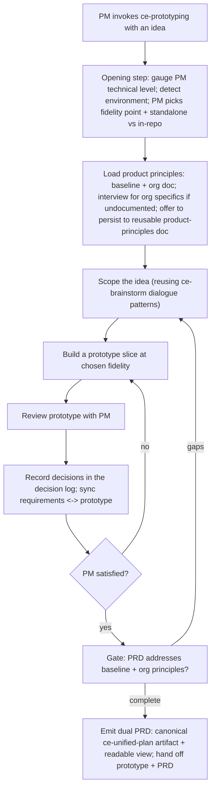
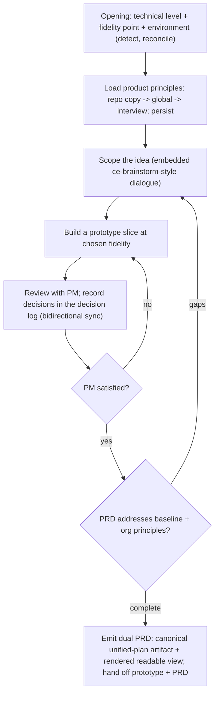

# ce-prototyping Skill - Requirements

## Goal Capsule

- **Objective:** Ship a new `ce-prototyping` skill that lets a product manager of any technical level turn a product idea into a working prototype and a highly complete, validated PRD for engineering handoff — closing the product-to-engineering intent gap.
- **Product authority:** The Product Contract below. Product behavior, scope boundaries, and success signals were resolved in brainstorm dialogue.
- **Readiness:** `implementation-ready` — Product Contract (WHAT) preserved from the brainstorm; Planning Contract and Implementation Units (HOW) added below. Ready for `ce-work`.
- **Execution profile:** Greenfield skill authoring — a new `skills/ce-prototyping/` directory (SKILL.md + references) plus registration touchpoints (README inventory, docs/skills catalog + page, release-metadata skill count). Behavioral validation runs through `skill-creator` evals; `bun test` + `bun run release:validate` guard the mechanical surface (new skill count, frontmatter, parse).
- **Stop conditions:** Surface rather than guess if the self-contained-skill constraint (no cross-skill file references) makes reusing `ce-brainstorm`'s scoping dialogue impractical to embed at acceptable size, or if the cross-repo product-principles persistence has no portable home that respects the plugin's platform-agnostic constraints.
- **Open blockers:** None. The brainstorm's deferred planning questions are resolved in Key Technical Decisions below.

---

## Product Contract

### Summary

A new `ce-prototyping` skill for product managers of any technical level. It turns a product idea into a working prototype and a highly complete, validated PRD for engineering.
The flow opens by adapting to the PM's technical level and having them choose a point on a fidelity spectrum (UI-only demo to full production app in a codebase) plus the environment, then co-evolves the prototype and requirements in a loop, with a running decision log keeping the two in sync.
PRD completeness is gated on product principles — a shipped baseline plus org-specific principles interviewed once and persisted to a reusable, cross-repo product-principles doc. The PM leaves with a runnable prototype plus a dual PRD: a canonical `ce-unified-plan` artifact engineering runs `/ce-plan` on, and a readable rendered view.

### Problem Frame

Today, product intent reaches engineering through a game of telephone. A PM describes what they want in a doc, a mockup, or a conversation; engineering interprets it; and the gap between what was meant and what was understood surfaces only after code is written. The cost is twofold: teams build the wrong thing on the first pass, and product and engineering burn cycles in back-and-forth clarifying intent that was never captured completely or unambiguously in the first place.

Existing tools split the problem in ways that let intent leak. Design tools produce a mockup but not a complete, decision-backed spec; PRDs get written blind and fall apart on contact with a real build; and where both exist, the mockup and the written spec drift apart, so engineering cannot tell what is decided versus decorative. Nothing gives the PM a single, validated artifact of intent — a working reference plus a complete requirements record — that engineering can act on without guessing.

### Actors

- A1. Product manager (any technical level): brings the idea, chooses fidelity and environment, drives the co-evolution loop, answers the product-principles interview, and leaves with the prototype and PRD.
- A2. `ce-prototyping` skill (orchestrator): adapts to the PM, builds and refines the prototype, maintains the decision log, gates PRD completeness on product principles, and emits the dual PRD.
- A3. Engineering team (downstream consumer): receives the prototype plus the dual PRD and continues via `/ce-plan` on the canonical artifact, or reads the rendered PRD.
- A4. `ce-plan` / `ce-work` (downstream skills): consume the canonical unified-plan artifact to plan and build the real product.

### Key Flows



- F1. **Prototype-and-PRD co-evolution.**
  - **Trigger:** PM invokes `ce-prototyping` with a product idea.
  - **Actors:** A1, A2.
  - **Steps:** Establish fidelity, environment, and PM technical level; load/interview product principles; scope the idea; build a prototype slice; review it with the PM; record decisions in the decision log and sync them into the requirements; repeat build-review-sync until the PM is satisfied; gate on product principles; emit the dual PRD.
  - **Outcome:** A working prototype and a validated PRD whose requirements were discovered against a real artifact.
  - **Covered by:** R1, R2, R3, R4, R6, R7, R8, R9, R10.
- F2. **Product-principles capture and reuse.**
  - **Trigger:** The flow needs product principles and org specifics are not already documented.
  - **Actors:** A1, A2.
  - **Steps:** Load the shipped baseline; check for an existing product-principles doc; if absent or incomplete, interview the PM for org-specific principles; offer to persist them to a reusable, cross-repo product-principles doc; later runs read that doc instead of re-interviewing.
  - **Outcome:** A durable, reusable set of org principles that gate PRD completeness across projects.
  - **Covered by:** R11, R12, R13.
- F3. **Engineering handoff.**
  - **Trigger:** The PM finalizes the prototype and PRD.
  - **Actors:** A1, A3, A4.
  - **Steps:** Emit the canonical `ce-unified-plan` requirements artifact and the readable rendered PRD; hand off both plus the prototype; engineering continues by running `/ce-plan` on the artifact or by reading the rendered PRD.
  - **Outcome:** Engineering receives an unambiguous, validated ask and can proceed without a clarification round-trip.
  - **Covered by:** R5, R14, R15.

### Requirements

**Opening setup and adaptation**

- R1. The flow opens by establishing three things before building: the PM's technical capability (to adapt interaction and language), the target fidelity, and the environment. It detects what is available and lets the PM choose rather than assuming.
- R2. Fidelity is a spectrum, from a UI-only demo through to a full production-level app in a codebase; the PM chooses where to land, and the skill adapts the build accordingly.
- R3. Environment is chosen at the same step: a zero-setup self-contained runnable artifact (no repo required) or an in-repo build. Production-level fidelity requires a real repo/stack; if the PM picks it with no repo detected, the opening step reconciles the mismatch (offer to scaffold, or downgrade fidelity) rather than failing.
- R4. The skill adapts its interaction to the PM's technical level — plain, jargon-free collaboration for non-technical PMs; deeper technical detail available for technical PMs — without changing the deliverables.

**Prototype and requirements co-evolution**

- R5. The durable deliverables are a runnable prototype at the chosen fidelity and a highly complete PRD; the prototype de-risks and validates intent but is not itself the shipped product.
- R6. The prototype and requirements co-evolve in a loop: build a slice, review it with the PM, let what they see refine the requirements, and repeat until the PM is satisfied before finalizing.
- R7. A decision log is maintained throughout the flow. Every decision made while reviewing the prototype is recorded and reflected in the PRD, and every requirement decision is reflected in the prototype, so the two cannot silently diverge (bidirectional sync).
- R8. The scoping portion of the flow reuses `ce-brainstorm`'s dialogue patterns rather than reinventing scoping dialogue; the net-new behavior is the prototype-driven refinement loop, the decision log, the product-principles gate, and the dual output.

**PRD output**

- R9. The canonical PRD is a `ce-unified-plan` requirements artifact (the same contract `ce-brainstorm` emits), so engineering can run `/ce-plan` on it directly. It is the single source of truth.
- R10. A human-readable PRD view is rendered from the canonical artifact (not authored separately), so the two cannot drift. A non-plugin engineering team can read the PRD view without the pipeline.
- R14. The prototype is attached to / referenced by the PRD as validating evidence of intent.

**Product principles**

- R11. The skill ships a baseline set of product principles that every PRD must address to count as complete: data capture, measurability, success metrics, target user and problem clarity, explicit non-goals, edge/error states, and privacy/data-handling.
- R12. Where org-specific principles are not already documented, the skill interviews the PM for them, then offers to persist them to a reusable product-principles doc usable across repos. Later runs read that doc instead of re-interviewing.
- R13. PRD completeness is gated on baseline plus org principles: the flow does not finalize the PRD until each applicable principle is addressed, surfacing the gaps when they are not.

**Packaging**

- R15. Ships as a standard plugin skill: registered in the README inventory, the `docs/skills/` catalog and a skill page, and the release-metadata skill count, per repo conventions.

### Acceptance Examples

- AE1. **Covers R3.** Given a PM chooses production-level fidelity but no repo is detected, when the opening step runs, then the skill reconciles by offering to scaffold a repo or to downgrade fidelity — it does not proceed as if a repo exists and does not silently fail.
- AE2. **Covers R7.** Given the PM changes a decision while reviewing the prototype, when the loop continues, then that decision appears in the decision log and is carried into the PRD, and no PRD requirement contradicts a logged decision.
- AE3. **Covers R9, R10.** Given a finalized run, when the PRD is produced, then the canonical `ce-unified-plan` artifact and the readable PRD view are both emitted, and the readable view reflects the artifact's content rather than a separately authored copy.
- AE4. **Covers R13.** Given a PRD that does not state how success will be measured, when the flow reaches the completeness gate, then it flags the missing measurability principle and does not finalize until it is addressed.
- AE5. **Covers R11, R12.** Given no product-principles doc exists for the org, when the flow needs principles, then it applies the shipped baseline, interviews the PM for org specifics, and offers to persist them to a reusable cross-repo doc; on a later run with that doc present, it reads the doc instead of re-interviewing.
- AE6. **Covers R4.** Given a non-technical PM, when the skill interacts, then it collaborates in plain language without requiring code or stack knowledge, while still producing the same prototype and PRD deliverables.
- AE7. **Covers R5, R6.** Given a UI-only demo fidelity choice, when the loop runs, then the prototype is a runnable UI demo that validates intent, and the requirements are refined from reviewing it — the demo is not mistaken for shippable product code.

### Success Criteria

- Engineering can act on the handoff without a clarification round-trip — the ask is complete and unambiguous enough to build from directly.
- Teams report building closer to the right thing on the first pass, and product↔engineering back-and-forth on intent measurably drops.
- The prototype and PRD tell the same story — a reader can trace every logged decision into the PRD and see it reflected in the prototype.
- A PM of any technical level can complete the flow and leave with both a runnable prototype and a validated PRD.
- Org product principles are captured once and reused across projects rather than re-elicited each time.

### Scope Boundaries

#### Deferred for later

- Design-tool (e.g., Figma) import/export.
- A multi-stakeholder PRD review/sign-off/approval workflow.
- Broad cross-skill consumption of the product-principles doc — v1 creates and consumes it within `ce-prototyping`; other skills reading it is a later step.

#### Outside this product's identity

- Owning the real build — shipping production code stays `ce-plan` → `ce-work`. The prototype de-risks intent; it is not the product, and even a production-seed is engineering's starting point, not a finished deliverable.
- Real backend/data infrastructure for prototypes — lower-fidelity prototypes fake data and logic by design; standing up real services is out of scope for the prototype itself.
- Replacing `ce-brainstorm` — `ce-prototyping` reuses its scoping dialogue and adds the prototype loop; it does not supersede brainstorming for non-prototype work.

### Key Decisions

- **Fidelity is a PM-chosen spectrum, not fixed tiers.** UI-only demo through full production app; the skill adapts the build to the chosen point and reconciles it against the detected environment.
- **Adapt to the PM's technical level.** Same deliverables regardless; interaction language and depth flex to the person.
- **Canonical artifact + rendered view for the PRD.** The `ce-unified-plan` artifact is the source of truth so it plugs into `ce-plan`/`ce-work`; the readable PRD renders from it to stay in sync and serve non-plugin teams.
- **Co-evolution loop with a bidirectional decision log.** The prototype is a requirements-discovery tool; the decision log guarantees demo decisions and PRD requirements stay synchronized.
- **Opinionated product-principles gate.** A shipped baseline plus org-specific principles gate PRD completeness — the skill encodes product rigor rather than emitting a free-form template.
- **Reusable cross-repo product-principles doc.** Interview once, persist, reuse — org principles compound across projects instead of being re-elicited per run.
- **Reuse `ce-brainstorm` scoping over forking it.** The net-new surface is the prototype loop, decision log, principles gate, and dual output.

### Dependencies / Assumptions

- Depends on the `ce-unified-plan` requirements contract and `ce-plan` for downstream continuation — verified present in the repo.
- Depends on `ce-brainstorm` dialogue patterns for scoping and on the plugin's frontend/design and self-contained-artifact conventions for building prototypes — `ce-brainstorm` and `ce-frontend-design` verified present as skills.
- Assumes a prototype build capability appropriate to the chosen fidelity is available in the environment (e.g., a way to run/preview a self-contained artifact, or a repo/stack for in-repo builds).
- Assumes the readable PRD view can be rendered from the canonical artifact using the plugin's existing output-rendering approach (the same idea `ce-plan`'s HTML output mode uses).

### Outstanding Questions

The brainstorm's deferred planning questions are now resolved — see Key Technical Decisions (KTD1–KTD5) in the Planning Contract below.

---

## Planning Contract

### Key Technical Decisions

- **KTD1 — Embed scoping as local skill content; do not invoke `ce-brainstorm` (resolves R8 question).** AGENTS.md "File References in Skills" forbids a skill from referencing another skill's files, and the converter copies each skill directory in isolation — so `ce-prototyping` cannot depend on `ce-brainstorm`'s dialogue files. It carries its own compact scoping-dialogue reference that mirrors `ce-brainstorm`'s discipline (one question at a time, blocking-question tool, rigor probes), tuned for a PM audience. This is pattern reuse, not code reuse.
- **KTD2 — Product-principles doc: repo copy primary, user-global store for cross-repo reuse (resolves R12 question).** The active, gating copy is repo-committed at `.compound-engineering/product-principles.md` (versioned, travels with the repo, shareable with the team). Cross-repo reuse comes from a user-global store at `~/.config/compound-engineering/product-principles.md` (fall back to `$HOME/.compound-engineering/product-principles.md` when `XDG_CONFIG_HOME`/`~/.config` is unavailable). Read order: repo copy → global store → interview. On capture, write the repo copy and offer to update the global store. Platform-agnostic — uses `$HOME`/XDG only, no agent-platform env var (per AGENTS.md "Platform-Specific Variables in Skills").
- **KTD3 — Prototype build mechanism scales with the chosen fidelity (resolves R2/R3 question).** UI-only demo and presentation mockup → a self-contained single-file artifact following the plugin's existing self-contained-artifact invariants (single file, inline CSS/JS, no external hosts), built to the `ce-frontend-design` quality bar. Mid-fidelity → a runnable local app scaffold in a throwaway directory. Production-seed → built in the repo's actual stack. The skill drives the build with its normal implementation capability; it ships no bundled build script (nothing to anchor via `SKILL_DIR`).
- **KTD4 — Readable PRD is rendered from the canonical artifact, reusing the plugin's HTML-output approach (resolves R10 question).** The canonical `ce-unified-plan` requirements markdown is the source of truth; the readable PRD is generated from it at handoff (a self-contained HTML view following the same invariants the plugin's `output-html` mode already uses), never separately authored — so the two cannot drift.
- **KTD5 — Baseline principles are a single list for v1 (resolves R11 question).** Data capture, measurability, success metrics, target user/problem clarity, explicit non-goals, edge/error states, and privacy/data-handling apply to every PRD; the interview layers org- and product-specific principles on top. Per-prototype-type variation of the baseline is deferred (see Scope Boundaries).

### High-Level Technical Design

*This illustrates the intended approach and is directional guidance for review, not implementation specification.*

`ce-prototyping` is a new self-contained skill. SKILL.md carries the always-on trigger and phase routing; conditional/late-phase substance (scoping dialogue, per-fidelity build guidance, principles interview + persistence, decision-log schema, dual-PRD output) is extracted to `references/` per AGENTS.md "Extract Conditional and Late-Sequence Blocks." The flow is a loop with a persistent decision log as connective tissue:



### Output Structure

```
skills/ce-prototyping/
  SKILL.md                       # workflow: opening, loop, decision log, principles gate, dual-PRD handoff
  references/
    opening-setup.md             # fidelity spectrum, environment detect+reconcile, technical-level adaptation
    scoping-dialogue.md          # embedded ce-brainstorm-style scoping (KTD1)
    prototype-build.md           # per-fidelity build guidance (KTD3)
    product-principles.md        # baseline set + interview + cross-repo persistence + completeness gate (KTD2, KTD5)
    decision-log.md              # decision-log schema + bidirectional prototype<->PRD sync
    prd-output.md                # canonical unified-plan artifact + rendered readable view (KTD4) + handoff
docs/skills/ce-prototyping.md    # skill doc page
```

The per-unit `**Files:**` sections are authoritative; the tree is a scope declaration.

---

## Implementation Units

### U1. Skill scaffold and opening setup

- **Goal:** Create the skill directory, SKILL.md frontmatter and top-level workflow, and the opening step that establishes technical level, fidelity, and environment.
- **Requirements:** R1, R2, R3, R4.
- **Dependencies:** none.
- **Files:** `skills/ce-prototyping/SKILL.md` (create), `skills/ce-prototyping/references/opening-setup.md` (create).
- **Approach:** SKILL.md frontmatter: `name: ce-prototyping`, a description matching the AGENTS.md description discipline, and an `argument-hint`. Inline the always-on trigger (the opening step) and phase routing; stub to `references/opening-setup.md` for detail. opening-setup.md specifies: adapt interaction to PM technical level (R4); present the fidelity spectrum UI-only-demo → production app (R2); detect the environment and let the PM choose standalone vs in-repo, reconciling a production-seed choice with no detected repo by offering to scaffold or downgrade (R3). Use the platform blocking-question tool for the choices.
- **Patterns to follow:** `skills/ce-explain/SKILL.md` and `skills/ce-pov/SKILL.md` for a recent skill's SKILL.md shape and reference-stub style; AGENTS.md "Writing Skill Instructions", "Inline the Trigger, Not the Content".
- **Test scenarios:** `Test expectation: none -- skill-prose. skill-creator eval: production-seed chosen with no repo detected triggers the scaffold/downgrade reconciliation (AE1); a non-technical PM is met in plain language (AE6).`
- **Verification:** `skills/ce-prototyping/SKILL.md` parses with valid frontmatter; the opening step covers all three axes and reconciles the production-seed/no-repo case.

### U2. Scoping dialogue and co-evolution loop with decision log

- **Goal:** Author the scoping front and the build↔review↔refine loop, with a decision log that keeps prototype and requirements in bidirectional sync.
- **Requirements:** R6, R7, R8.
- **Dependencies:** U1.
- **Files:** `skills/ce-prototyping/SKILL.md` (loop + decision-log phases), `skills/ce-prototyping/references/scoping-dialogue.md` (create), `skills/ce-prototyping/references/decision-log.md` (create).
- **Approach:** scoping-dialogue.md embeds a compact `ce-brainstorm`-style dialogue tuned for PMs (one question per turn, blocking-question tool, rigor probes) — pattern reuse per KTD1, not an invocation. SKILL.md drives the loop: build a prototype slice, review with the PM, refine requirements, repeat until satisfied (R6). decision-log.md defines the log schema and the bidirectional-sync rule: every decision made reviewing the prototype lands in the PRD, and every requirement decision is reflected in the prototype (R7).
- **Patterns to follow:** `skills/ce-brainstorm/SKILL.md` interaction rules for dialogue discipline (as a pattern to mirror, not a file to reference); decision-log parallels the notes-doc pattern in `skills/ce-work/references/` for a curated running artifact.
- **Test scenarios:** `Test expectation: none -- skill-prose. skill-creator eval: a decision changed while reviewing the prototype appears in the decision log and is carried into the PRD with no contradicting requirement (AE2).`
- **Verification:** The loop and decision-log phases are present; sync is bidirectional and specified; scoping is self-contained (no reference to `ce-brainstorm` files).

### U3. Per-fidelity prototype build guidance

- **Goal:** Specify how the prototype is built at each fidelity point.
- **Requirements:** R2, R3, R5.
- **Dependencies:** U2.
- **Files:** `skills/ce-prototyping/references/prototype-build.md` (create), `skills/ce-prototyping/SKILL.md` (loop references it).
- **Approach:** Per KTD3: UI-only demo / presentation mockup → self-contained single-file artifact (inline CSS/JS, no external hosts) at the `ce-frontend-design` quality bar; mid-fidelity → runnable local scaffold in a throwaway dir; production-seed → the repo's actual stack. Make clear the prototype validates intent and is not the shipped product (R5), and that lower-fidelity prototypes fake data/logic by design.
- **Patterns to follow:** the plugin's self-contained-artifact invariants (as used by `output-html` mode and `ce-explain`'s HTML artifact); `ce-frontend-design` quality expectations.
- **Test scenarios:** `Test expectation: none -- skill-prose. skill-creator eval: a UI-only demo choice yields a runnable UI demo used to refine requirements, not shippable product code (AE7).`
- **Verification:** prototype-build.md covers all fidelity points and the standalone/in-repo split.

### U4. Product principles: baseline, interview, persistence, gate

- **Goal:** Ship the baseline principles, the org-specific interview, the reusable cross-repo doc, and the PRD-completeness gate.
- **Requirements:** R11, R12, R13.
- **Dependencies:** U1.
- **Files:** `skills/ce-prototyping/references/product-principles.md` (create), `skills/ce-prototyping/SKILL.md` (gate wiring).
- **Approach:** Baseline list per KTD5 (R11). Where org specifics are undocumented, interview the PM, then persist per KTD2: active copy at `.compound-engineering/product-principles.md`, user-global store at `~/.config/compound-engineering/product-principles.md` (with `$HOME` fallback); read order repo → global → interview; later runs read the doc instead of re-interviewing (R12). SKILL.md gates PRD finalization: do not finalize until each applicable principle is addressed, surfacing gaps (R13).
- **Patterns to follow:** AGENTS.md "Platform-Specific Variables in Skills" (use `$HOME`/XDG, no platform env var); a durable user-authored artifact like `STRATEGY.md`'s role as a persisted, reused doc.
- **Test scenarios:** `Test expectation: none -- skill-prose. skill-creator evals: missing measurability blocks finalization until addressed (AE4); no principles doc -> baseline + interview + offer to persist, and a later run reads the doc instead of re-interviewing (AE5).`
- **Verification:** product-principles.md specifies the baseline, interview, persistence (repo + global), read order, and the gate; the gate is wired into finalization.

### U5. Dual PRD output and handoff

- **Goal:** Emit the canonical `ce-unified-plan` artifact plus a rendered readable PRD, with the prototype attached as evidence, and hand off to engineering.
- **Requirements:** R9, R10, R14; F3.
- **Dependencies:** U2, U4.
- **Files:** `skills/ce-prototyping/references/prd-output.md` (create), `skills/ce-prototyping/SKILL.md` (finalization phase).
- **Approach:** The canonical PRD is a `ce-unified-plan` requirements artifact (same contract `ce-brainstorm` emits), so engineering runs `/ce-plan` on it (R9). Render a readable HTML view from that artifact per KTD4 (R10). Attach/reference the prototype as validating evidence (R14). Finalization: emit both and present the handoff (F3), noting engineering continues via `/ce-plan`.
- **Patterns to follow:** `ce-brainstorm`'s requirements-only unified-plan frontmatter and section shape (as the artifact contract to produce); the plugin's `output-html` self-contained render for the readable view.
- **Test scenarios:** `Test expectation: none -- skill-prose. skill-creator eval: a finalized run emits both the canonical unified-plan artifact and a readable view that reflects it rather than a separately authored copy (AE3).`
- **Verification:** prd-output.md specifies the canonical artifact, the rendered view, and the handoff; SKILL.md finalization emits both.

### U6. Registration, docs, and metadata sync

- **Goal:** Register the new skill across all inventories and keep the mechanical release surface consistent.
- **Requirements:** R15.
- **Dependencies:** U1, U2, U3, U4, U5.
- **Files:** `docs/skills/ce-prototyping.md` (create), `README.md` (two inventory tables), `docs/skills/README.md` (catalog row), `tests/release-metadata.test.ts` (skill count 29 → 30).
- **Approach:** Create the doc page following the shape of `docs/skills/ce-explain.md` (purpose, novel mechanics, when to use, chain position). Add a `ce-prototyping` row to both README inventory tables and to the right category in `docs/skills/README.md` (a PM-facing prototyping skill fits the On-Demand or a clearly-labeled placement). Bump the asserted skill count from 29 to 30 in `tests/release-metadata.test.ts`. Run `bun run release:validate`; if it reports drift in release-owned counts/descriptions, run `bun run release:sync-metadata --write` and re-validate. Do not hand-edit release-owned versions or `CHANGELOG.md`.
- **Patterns to follow:** `docs/skills/ce-explain.md` (a recent new-skill doc page) and the AGENTS.md "Plugin Maintenance" checklist.
- **Test scenarios:** `Test expectation: none for prose. Mechanical gate: bun test green (including the updated count assertion = 30) and bun run release:validate consistent.`
- **Verification:** The skill appears in both README tables, the docs/skills catalog, and has a doc page; `bun test` and `bun run release:validate` pass.

---

## Verification Contract

- **Mechanical (automated):** `bun test` green — including the `tests/release-metadata.test.ts` skill-count assertion updated to 30 — and `bun run release:validate` reporting consistency. These guard packaging, frontmatter, and parse; they do not exercise LLM behavior.
- **Behavioral (skill-creator evals, per AGENTS.md "Validating Agent and Skill Changes"):** validate the flow by injecting the SKILL.md/references at dispatch. Eval scenarios map to the Acceptance Examples:
  - AE1 — production-seed with no repo triggers scaffold/downgrade reconciliation (U1).
  - AE2 — a prototype-review decision lands in the decision log and the PRD (U2).
  - AE3 — finalization emits the canonical artifact and a readable view rendered from it (U5).
  - AE4 — missing measurability blocks PRD finalization until addressed (U4).
  - AE5 — no principles doc → baseline + interview + persist; later run reads the doc (U4).
  - AE6 — a non-technical PM is met in plain language, same deliverables (U1).
  - AE7 — a UI-only demo validates intent and is not mistaken for shippable code (U3).

---

## Definition of Done

- `skills/ce-prototyping/SKILL.md` plus the six `references/` files exist and specify the full flow: opening setup, scoping, co-evolution loop, decision log, per-fidelity build, product-principles gate, and dual-PRD handoff (U1–U5).
- The skill is self-contained — SKILL.md references only files within `skills/ce-prototyping/` (AGENTS.md "File References in Skills").
- Product principles persist to a repo copy and a user-global store using `$HOME`/XDG only, no platform env var (U4, KTD2).
- The canonical PRD is a `ce-unified-plan` artifact and the readable PRD is rendered from it (U5).
- The skill is registered in both README tables, the `docs/skills/` catalog and page, and the release-metadata count is 30 (U6).
- `bun test` and `bun run release:validate` pass (U6).

---

## Sources

- Origin brainstorm: this document's Product Contract (`product_contract_source: ce-brainstorm`).
- `AGENTS.md` — "Writing Skill Instructions", "Inline the Trigger, Not the Content", "Extract Conditional and Late-Sequence Blocks", "File References in Skills", "Platform-Specific Variables in Skills", "Plugin Maintenance", "Specialist Prompt Assets in Skills", Scratch-space conventions.
- `skills/ce-explain/`, `skills/ce-pov/`, `skills/ce-brainstorm/` — recent skill shapes, dialogue discipline (pattern reuse), and the unified-plan artifact contract.
- `README.md`, `docs/skills/README.md`, `tests/release-metadata.test.ts` — registration surfaces for U6.
