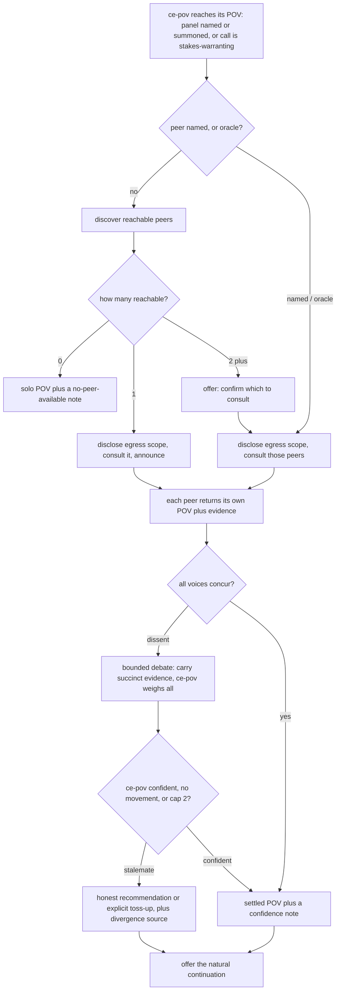
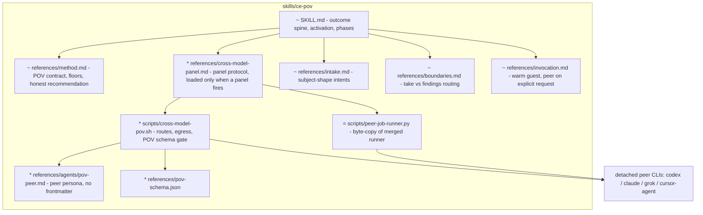

# ce-pov Cross-Model Panel - Plan

## Goal Capsule

- **Objective:** Expand `ce-pov` in two connected ways: generalize its output from an adoption-verdict to a **point of view** (a graded adopt/reject call is one shape; a textured take on a document, an approach set, or a direction is another), and let that point of view be independently checked and debated by one or more different-model peers — without losing any of ce-pov's current single-model behavior.
- **Product authority:** the Product Contract below (user-confirmed through brainstorm, multi-persona review, and planning synthesis). A live user instruction overrides; repo conventions in the project's instruction files govern where this plan is silent.
- **Stop conditions:** surface and stop rather than guess when (a) a change would alter the existing adoption-verdict contract for solo runs (violates R22), (b) satisfying the panel would require modifying the merged review skills' cross-model assets beyond adding parity-test entries, (c) byte-parity between the duplicated assets cannot hold, or (d) a behavioral eval shows the offer/count protocol failing on either evaluated host and the fix needs a design change rather than prose tightening.
- **Execution profile:** one feature branch, one PR (repo merge policy: all changes via PR). Deterministic guards land in `bun test`; behavioral evidence via skill-creator evals is best-effort local evidence, not CI.
- **Open blockers:** none.

---

## Product Contract

### Summary

ce-pov becomes the "what do we think?" engine: it forms a decisive, project-grounded **point of view** on a subject — an adoption question, a plan document, a set of competing approaches — and, on consequential calls, convenes a cross-model **panel**: different-model peers each independently form their own point of view, then ce-pov (the decision-maker) debates them across bounded rounds to drive genuine convergence. It reports a settled POV when it reaches a confident call; on a real stalemate it recommends where it has a basis to, honestly says "either is viable" where it does not, and always discloses the divergence and its source. The panel is offered, named, or summoned by an `oracle` shorthand; it never fires silently and never blocks a POV.

### Problem Frame

ce-pov's moat is a point of view earned against the project's own context — not generic research. Today it is written as if the only POV shape is an adoption grade (Adopt / Reject / Hold / Trial), which reads the skill's name too literally: users also want its point of view on a plan document ("get Codex and Cursor to review this, reconcile, converge") or on competing approaches ("have three models each take a position, then converge") — textured takes, not yay/nay. And in every shape, the reasoning runs on a single model, so on a high-stakes call a blind spot goes unchallenged exactly where being wrong costs the most. A *different* model, reasoning independently on the same verified facts, can catch it — and where the models still disagree, the disagreement itself is signal. One caveat the design carries honestly: peers can share a *correlated* blind spot, so concurrence raises confidence without guaranteeing independence.

### Key Decisions

- **The output is a point of view, not only an adoption grade** (session-settled: user-directed — corrects an over-literal reading of the existing contract): for adopt/migrate/compare questions the POV is the existing graded verdict, unchanged; for a document or an approach set it is a decisive, textured assessment with a bottom line. Same skill, same grounding discipline, output shape follows the question.
- **ce-pov's contract ends at the converged POV; continuation is a follow-up, not the deliverable** (session-settled: user-approved): skills are playbooks in one agent, so after the POV lands, the same agent offers the natural next step (apply the doc edits, proceed with the winning approach, take it to `ce-plan`) per ce-pov's existing follow-up phase. Applying or generating is never part of the POV contract itself.
- **Offer-first, not auto** (session-settled: user-directed — chosen over the review skills' auto-fire): an unnamed request never triggers the panel silently. ce-pov weighs the task's stakes and proactively *offers* the cross-check. This keeps ce-pov an opt-in utility, deliberately unlike ce-doc-review / ce-code-review.
- **ce-pov is the decision-maker; peers carry strong weight** (session-settled: user-directed — chosen over a democratic equal-vote panel): someone must decide, and that is ce-pov. Peers are not token input — ce-pov genuinely reconsiders on their reasoning and evidence and will move when warranted — but it is never mechanically outvoted.
- **Honest recommendation, never forced** (session-settled: user-directed): ce-pov recommends whenever it has a real basis to prefer — the common case — and when options are genuinely viable either way it says so with the pros and cons instead of manufacturing a preference. A neutral no-recommendation scoreboard and a forced pick on a true toss-up are both non-goals.
- **Independent POV by default, skeptic on request** (session-settled: user-directed): each peer forms its own POV to compare; a skeptic-against-the-POV mode is available when asked.
- **Hybrid grounding** (session-settled: user-directed): each peer reasons on ce-pov's verified *project* floor (shared) plus its own *external* check. Because the external checks are independent, divergence can be evidence-rooted, not only judgment-rooted — so the debate carries evidence, not just conclusions (R11, R15).
- **Bounded, genuine convergence** (session-settled: user-directed): dissent opens a multi-round debate that really tries to converge, stopping on the first of — ce-pov reaches a confident POV, a round moves no voice, or a two-exchange cap. Only a genuine stalemate surfaces to the user.
- **Discovery-driven, count-decides selection** (session-settled: user-directed): a fast reachability check drives selection — one reachable peer runs with a plain announcement, two or more trigger a concrete confirm, zero degrades to solo. Named peers and `oracle` skip the offer.
- **Additive, non-regressive** (session-settled: user-directed): both expansions are conditional extensions of ce-pov's existing outcome. Every current behavior runs unchanged on an adoption question with no peer consulted.
- **Author per the portable-skill field guide, rewriting the skill around a fresh outcome spine if warranted** (session-settled: user-directed): this is a material revision whose *outcome* changed (adoption verdict → point of view), so authoring starts from the spine — result, next consumer, done condition, non-obvious intent — restated for the generalized output, with the activation contract (name/description) recast to route all three subject shapes and the panel triggers. A larger rewrite of `SKILL.md` and `references/method.md` is explicitly in scope over bolting the panel onto the verdict-shaped structure.

### Requirements

**POV subjects and output shape**

- R1. ce-pov accepts three subject shapes and produces a decisive point of view for each: an **external-adoption question** (existing behavior — the graded Adopt/Reject/Hold/Trial verdict, unchanged); a **document** (a holistic take on a plan, spec, or brainstorm — the strengths, the risks, the bottom line); and an **approach set** (competing options the conversation or the user supplies — which one and why, or an honest "either is viable" with the tradeoff).
- R2. Every POV shape keeps ce-pov's grounding discipline: a POV must be earned against verified project facts. The external floor applies in full to external-adoption subjects; for documents and approach sets it applies to whatever external claims are load-bearing in the subject, and the project floor always applies.
- R3. ce-pov remains read-only and its contract ends at the delivered POV plus recommendation. Continuations — applying edits a document POV implies, proceeding with a winning approach, planning an adoption — are offered through ce-pov's existing follow-up phase and run as ordinary same-agent work or via the owning skill, never as part of the POV itself.

**Activation and selection**

- R4. A named peer is a **cross-check on ce-pov's own POV, never a substitute for it**: ce-pov always forms its own point of view and consults the named peer(s) to compare. "compare / cross-check with X" is the canonical framing; "check with X" and "also check with X" are synonyms that all resolve to this cross-check behavior. Named peers ("compare with Grok", "cross-check with Codex and Composer") are consulted directly, with no confirmation step, honored exactly as given and **uncapped** — naming three peers runs all three.
- R5. An `oracle` shorthand (bare `oracle`, or "check with the oracle") fans the request out to reachable different-model peers **up to the 2-peer panel cap**, with no confirmation step.
- R6. When no peer is named **and no cross-check was explicitly requested**, ce-pov never consults a peer silently and applies the R7 count rule: on a stakes-warranting call (per R18's correction-cost gate) it offers when two or more peers are reachable and announces (no question) when exactly one is; below the stakes threshold it engages nothing. An explicit unnamed request ("get other models' takes") routes per R18's bypass, not this gate.
- R7. Peer selection is driven by a fast reachability discovery (installed CLI, non-host provider, egress-allowlisted). Zero reachable → no panel, with a note why; one reachable → consult and announce, no question; two or more → a concrete confirm naming the reachable peers, defaulting to a 2-peer panel (naming which two when more are reachable) and allowing a subset or skip.
- R8. Named peers ride the same per-provider fallback chain as the review skills (for example, Grok via `grok-cli`, falling through to `grok-cursor`); a named peer that cannot run is reported, never silently dropped.

**The panel and peer POVs**

- R9. Each consulted peer independently produces its own point of view in the same shape as ce-pov's (a grade for adoption subjects; an assessment with a bottom line for documents and approach sets), on the hybrid grounding (shared project floor plus the peer's own external check).
- R10. A peer with no reachable external-research capability degrades to the shared floor alone and self-reports the reduced grounding; it is not dropped. On request, a peer runs as a skeptic against ce-pov's POV instead of forming its own — a critique fold-in, not a competing POV, which does not enter the convergence loop.

**Convergence and disclosure**

- R11. When any voice materially dissents (a different grade, or a materially different bottom line on a document or approach set), ce-pov opens a bounded debate: each dissenting voice reconsiders given the other voices' positions, reasoning, **and a succinct summary of the disconfirming evidence each surfaced** — enough context to update on a fact a voice lacked, and enough for ce-pov to later frame the source of the debate for the user, without dumping full research.
- R12. The panel spans ce-pov plus one or more peers. ce-pov is the decision-maker: it strongly weighs every voice but is never mechanically outvoted, and the debate runs across all participating voices, not only pairwise.
- R13. The debate stops on the first of — ce-pov reaches a POV it is confident in after weighing all voices (ideally with the voices aligned); a round changes no voice; or two reconcile-exchanges have run since the initial dissent. Convergence is ce-pov's confident decision, not a vote tally, so a three-voice, three-position split has a defined outcome (ce-pov weighs, converges, and either decides or surfaces).
- R14. On a confident POV, ce-pov reports it, noting whether the voices aligned. When the voices *concurred*, the confidence note states that concurrence raises but does not eliminate correlated-model error — a unanimous panel is not read as fully independent confirmation.
- R15. On a genuine stalemate (no confident convergence by the stop rule), ce-pov discloses the divergence — each voice's position and the *source* of the disagreement, distinguishing a resolvable evidence gap ("the voices differ on facts — Grok found X that Codex did not") from a genuine judgment difference — and applies its honest-recommendation rule: recommend with reasoning when it has a basis to prefer; when the options are genuinely viable either way, say so and lay out the pros and cons instead of forcing a pick. ce-pov never mutates anything after delivering the POV; the calling host acts on it.
- R16. Every voice's position is attributed to the model that actually served it (verified where a served-model receipt exists, labeled unverified otherwise); ce-pov never attributes a position to a model that did not run.

**Availability and non-blocking**

- R17. A peer never blocks a POV. A mid-debate peer timeout or failure drops only that voice — the debate continues with the surviving voices — and ce-pov collapses to its own solo POV with a plain "cross-model check unavailable or incomplete" note only when no peer remains. Both surviving-voice results and any dropped voice are reflected in the disclosure, preserving the "always returns a point of view" guarantee.
- R18. The proactive offer is gated on **correction cost, not binary reversibility** — the gate asks how much work will build on this take before a wrong call surfaces, and what correcting it costs then. No offer when the take is informational or a later correction is just an edit; offer when meaningful downstream work will build on it (a plan about to be implemented, an approach choice that gets built) or it feeds a shared, public, security, or data commitment. For adoption subjects this is the existing reversibility tiering read as correction cost (Tier 2/3 offer-eligible, Tier 1 not). **The gate governs only the proactive offer:** an explicit user request for other models' points of view — named or not — bypasses it entirely, on any subject shape. Warm mid-session invocations stay a lightweight guest and consult a peer only on explicit request.

**Cost control and output**

- R19. When ce-pov must infer the question (no explicit prompt), it succinctly confirms the inferred framing with the user before spending on grounding, web research, or peers.
- R20. Every user-facing message — the offer, which-model announcements, the divergence disclosure, and the recommendation — reads in plain, human-friendly language and does not expose the routing, fallback, or job-lifecycle machinery. Egress content-scope (R21) is user privacy information, not machinery, and is surfaced rather than hidden.
- R21. Before any project context egresses, ce-pov discloses in plain language what is being sent — its verified project-floor grounding, and for document subjects the document itself — which may contain proprietary code and architecture facts, and to which third-party provider(s), so consent is informed about *what* leaves, not only *which* model runs. When a named peer's fall-through changes the actual egress target or intermediary (for example `grok-cli` falling through to `grok-cursor`), ce-pov discloses the actual target before content egresses.

**Non-regression and authoring**

- R22. All existing ce-pov behavior is preserved unchanged on an external-adoption question with no peer consulted: the two-floor gate, the graded verdict contract, reversibility tiering, cold and warm invocation, the grounding scouts, the follow-up handoff, the optional full write-up, and the compound capture.
- R23. The panel and the POV-shape generalization are authored per `docs/solutions/skill-design/portable-agent-skill-authoring.md`, starting from a restated **outcome spine** (result: a decisive project-grounded POV in the subject's shape; next consumer: the user or calling skill acting on it; done: POV delivered with attribution and disclosure, or an explicit blocker; intent: a POV must be earned, never generic) and a recast **activation contract** covering all three subject shapes, the panel triggers (named / `oracle` / offer), and adjacent negatives (findings review routes to ce-doc-review; option generation routes to ce-ideate/ce-brainstorm). A larger rewrite of `SKILL.md` and `references/method.md` around that spine is in scope when bolting on would blur it. Protocol (subject shapes, activation rules, the stop-rule enum, disclosure fields, degradation branch) stays falsifiable with local quantifiers beside the actions they govern; every route ends in a delivered POV or an explicit blocker; peer CLIs are named as adapters behind the capability ("obtain an independent different-model POV"), with degradation paths per R17. The merged peer-job runner is reused under the repo's byte-duplication plus parity-test convention.

### Key Flows

F1. **Cross-model panel on a point of view.**

- **Trigger:** ce-pov reaches its POV phase and either a panel is named or summoned (any stakes) or the call is stakes-warranting (any subject shape).
- **Resolve participation:** named peers or `oracle` → consult those directly (R4, R5); otherwise run reachability discovery and apply the count rule (R7) — offer when two or more, announce when one, degrade when zero. Before content egresses, disclose the egress content-scope (R21).
- **Consult:** dispatch each participating peer as a detached read-only job (reusing the merged runner); collect each peer's own POV and its disconfirming evidence (R9, R11).
- **Debate:** all voices concur → confident settled POV plus a confidence note (with the correlated-blind-spot caveat, R14), and the flow ends. Any material dissent → run the bounded debate carrying succinct evidence (R11, R13).
- **Resolve:** ce-pov reaches a confident POV → settled POV (R14); genuine stalemate → honest recommendation (or an explicit "either is viable" with tradeoffs) plus a framed divergence disclosure (R15). A mid-debate peer failure drops that voice and the debate continues (R17).
- **Follow-up:** ce-pov offers the natural continuation (apply the document edits, proceed with the chosen approach, take the adoption to `ce-plan`) per its existing follow-up phase (R3).
- Throughout: attribute every position to its actual serving model (R16) and render all of it in plain language (R20).

### Visualization

Panel lifecycle for F1 (complements the flow prose; the requirements above stand alone without it):

### Acceptance Examples

- AE1. **Covers R4.** "ce-pov — should we adopt Biome? Check with Codex." → ce-pov forms its OWN verdict and cross-checks it against Codex directly, with no confirm — "check with Codex" is a cross-check, not a hand-off.
- AE2. **Covers R6, R7, R21.** A Tier-3 adopt question, no peer named, two peers reachable → ce-pov offers in plain language and, on accept, discloses that its project grounding will be sent to Codex and Grok before consulting them.
- AE3. **Covers R7.** As AE2 but only one peer reachable → ce-pov consults it and says so, with no question.
- AE4. **Covers R5.** "ce-pov oracle: is it time to drop Webpack for Vite?" → ce-pov fans out to reachable peers up to the 2-peer cap, with no confirmation.
- AE5. **Covers R11, R13, R14.** ce-pov grades Adopt; a peer grades Hold citing a migration cost ce-pov underweighted → ce-pov weighs it, the debate carries the peer's evidence, ce-pov moves to Trial with the peer aligned → confident settled POV reported (ce-pov moving here is convergence working, not a violation of its decision-maker role).
- AE6. **Covers R13, R15.** After two exchanges ce-pov holds Adopt and a peer holds Reject with neither moving → ce-pov reports its recommendation (Adopt, with reasoning) *and* discloses the divergence and whether it is an evidence gap or a judgment difference; it applies no change and hands to the caller.
- AE7. **Covers R1, R3, R11.** "Get Codex and Composer's take on this plan doc, reconcile with yours, and converge." → each voice independently assesses the document, ce-pov debates the material disagreements carrying succinct evidence, delivers the converged take, and *offers* to apply the changes it implies — the edits happen as follow-up work, not inside the POV.
- AE8. **Covers R1, R15.** Three approaches to a design problem are on the table; ce-pov and two peers each independently take a position → two voices back approach A for simplicity, one backs B for extensibility, and after the debate ce-pov judges both genuinely viable → it says exactly that, lays out the tradeoff, and recommends nothing rather than manufacturing a preference.
- AE9. **Covers R17.** A three-voice panel mid-debate where one peer times out → the debate continues with ce-pov and the surviving peer; only if the last peer also fails does ce-pov fall back to its solo POV with an "incomplete cross-model check" note.
- AE10. **Covers R19.** A bare link with no stated question, on a stakes-warranting subject → ce-pov confirms the inferred framing in one line before fanning out to peers or web research.
- AE11. **Covers R4, R18.** A Tier-1 (low correction-cost) question where the user says "get Grok's and Codex's take too" → the stakes gate is bypassed because the request is explicit; both named peers run.

### Scope Boundaries

- **ce-pov gives the take; ce-doc-review finds and fixes the defects.** A document POV is a holistic, decisive assessment ("here's what we think of this plan and the bottom line"), not a structured multi-persona findings review with per-finding walk-throughs — that remains `ce-doc-review`.
- The panel weighs in on the **point of view only**, not on ce-pov's grounding scouts — grounding stays ce-pov's.
- ce-pov does not generate the approach sets it judges — options come from the conversation, the user, or a generation skill (`ce-ideate`, `ce-brainstorm`); ce-pov takes a position on them. A "ground it like ce-pov, but let a named peer render the POV alone" **delegate mode** is also out of scope — a named peer is a cross-check (R4), not a replacement.
- Reuses the merged detached-peer infrastructure and its provider set (codex / claude / grok / composer, with the `grok-cli` → `grok-cursor` fallback). No new lifecycle or runner is built here.
- New harnesses or models beyond that set (for example, CoPilot) are a later addition, out of scope now.
- ce-pov does **not** adopt the review skills' auto-fire posture; the panel is offer-first by design.
- ce-pov's position may move through the bounded debate (convergence), but it is never mechanically outvoted and never mutates anything after the POV is delivered; continuations are follow-up work the same agent offers (R3).

### Dependencies / Assumptions

- Depends on the detached peer-job infrastructure merged for ce-doc-review / ce-code-review (runner lifecycle, host attestation, candidate walk with cross-provider fallback, model-identity receipts, quota/skip legibility). The runner is domain-agnostic (runs an arbitrary worker and publishes a caller-declared artifact), so a POV-shaped return needs no new lifecycle machinery; the findings-coupled `cross-model-*.sh` orchestration layer needs a POV-shaped sibling (U3).
- Assumes the peer contract generalizes from the review skills' findings-shaped return to a POV-shaped return (position, reasoning, succinct evidence, external-check note) without new lifecycle machinery — verified at planning time against the merged runner (it runs an arbitrary argv and publishes a caller-declared result path).

---

## Planning Contract

**Product Contract preservation:** resolved the formerly-deferred oracle/offer cost cap into R5 and R7 (2-peer cap when ce-pov selects; named peers uncapped in R4), resolved R18's stakes gate to the correction-cost rubric (governing only the proactive offer), updated AE4/AE11 accordingly, and narrowed R6 during plan review to carve out explicit unnamed requests (R18 consistency) — all session-confirmed resolutions of items the contract explicitly deferred. All other Product Contract text preserved.

### Key Technical Decisions

- **Panel cap: at most 2 peers when ce-pov selects; named peers uncapped** (session-settled: user-directed — chosen over "all reachable"): `oracle` and the proactive offer clamp to 2 (matching the review skills' `CROSS_MODEL_MAX_PEERS` posture); an explicit list of named peers is honored exactly, however many. The confirm prompt picks which 2 when 3+ are reachable.
- **Stakes gate = correction cost, governing only the proactive offer** (session-settled: user-directed — chosen over binary reversibility, which under-fires in software where almost everything is technically reversible): the gate asks how much work builds on the take before a wrong call surfaces and what correction costs then; explicit requests bypass it entirely. Adoption subjects keep the existing tier machinery, read as correction cost.
- **Byte-duplication with parity tests for every shared asset** (session-settled: user-approved — surfaced in the planning synthesis; forced by the repo's skill self-containment rule, which forbids cross-skill imports): `peer-job-runner.py` byte-identical across ce-doc-review / ce-code-review / ce-pov (extend `tests/peer-job-runner-parity.test.ts`); the model-receipt shell kernel byte-identical across the three worker scripts (extend `tests/cross-model-receipt-parity.test.ts`).
- **`oracle` is the fan-out keyword** (session-settled: user-directed — user-proposed; no better candidate surfaced).
- **POV worker script is an adapted sibling, not a reuse, of the review workers:** `cross-model-adversarial-review.sh` is findings-coupled (hardcodes the findings schema, validates `.findings|type=="array"`, composes from the adversarial persona). U3 creates `skills/ce-pov/scripts/cross-model-pov.sh` with the same route adapters, egress allowlist, `set -m` group lifecycle, heartbeat, skip-evidence, and receipt kernel — but a POV-shaped schema gate (require a top-level `position` field) and a POV persona. Route/flag semantics are copied from the review workers so their route-safety tests port over.
- **Reconcile rounds are fresh detached dispatches with re-seeded prompts:** workers run with no session persistence, so each debate round re-dispatches through the runner with the **full original subject payload** (framed question + project-floor summary + document/approach content + schema) plus the reconcile delta — the other voices' positions, key reasoning, and up to ~5 succinct evidence bullets per voice. The succinct budget bounds the delta, never the subject: a session-free peer cannot re-assess a subject it can no longer see.
- **Peer POV schema mirrors the findings-schema conventions:** one JSON object with `reviewer`-equivalent voice identity, `position` (grade for adoption subjects; bottom line for document/approach subjects; `blocked` with the reason in `reasoning` when the peer cannot ground — the shape-neutral analogue of the gate's Blocked returns), `reasoning`, `evidence` (array of succinct strings, **each carrying source attribution** — a url, `file:line`, or named document section — so another voice can verify a claim rather than repeat it), `external_check` (ran / unavailable, per R10), a `mode` field (`independent` default; `skeptic` — where `position` carries the critique's verdict on ce-pov's POV: stands, or a named fatal flaw, with the critique in `reasoning`/`evidence`), and the receipt fields `cross_model_route` / `model_requested` / `model_actual` exactly as the review artifacts carry them (R16).
- **Subject shapes extend the existing intake intents, not a new gate:** `references/intake.md` gains Document-take and Approach-set intents beside Adopt/Migrate/Compare/Exposure/Explainer, and the frame gate's existing propose-never-guess behavior plus R19's confirm-before-spend cover the inferred-question case.
- **Routing line for document subjects** (Product Contract Scope Boundaries, instantiated in `references/boundaries.md`): "what do you think of this doc" → ce-pov holistic take; "review this doc / find the issues" → route to `ce-doc-review`; when ambiguous, one clarifying line, not a guess.
- **Tier-2-equivalents stay offer-eligible:** the correction-cost gate naturally includes bounded-but-real correction cost; the offer is one line and declining is free, so gating tighter would under-serve the blind-spot goal.

### High-Level Technical Design

Asset topology — what gets created (`*`) vs. edited (`~`) vs. byte-copied (`=`), and how the pieces talk at runtime:

Runtime sequence (per F1): orchestrator resolves participation → composes the peer payload (framed question + project-floor summary + document/approach content per subject shape + `pov-schema.json`) → `start`s one runner job per peer via `cross-model-pov.sh` → polls with bounded `wait` while continuing its own POV → folds peer POVs in → on dissent, composes reconcile prompts (the full subject payload plus each voice's position, reasoning, and succinct evidence) and re-dispatches up to the 2-exchange cap → decides, discloses, offers the continuation.

Sequencing: U1 and U3 have no interdependency and can proceed in parallel; U2 follows U1; U4 needs U1 and U3; U5 needs U1–U4; U6 needs U1–U4; U7 (evals) runs last against the assembled skill.

---

## Implementation Units

### U1. Generalize the contract: outcome spine in SKILL.md and the POV contract in method.md

- **Goal:** ce-pov's always-loaded prose states the generalized outcome (a decisive project-grounded POV in the subject's shape) and `method.md` defines the POV contract for all three subject shapes, with the adoption verdict contract preserved verbatim in behavior.
- **Requirements:** R1, R2, R3, R15 (honest recommendation), R22, R23.
- **Dependencies:** none.
- **Files:** `skills/ce-pov/SKILL.md`, `skills/ce-pov/references/method.md`.
- **Approach:** Rewrite `SKILL.md` from the outcome spine per the field guide: result, next consumer, done condition, intent first; recast the frontmatter `description` to route all three subject shapes plus the panel triggers and name the adjacent negatives (findings review → ce-doc-review, option generation → ce-ideate/ce-brainstorm); keep the phase structure (Frame → Ground → Verify → POV → Follow-up) and the Model Tiers section. In `method.md`: keep the four steps, the two-floor gate, and the grade vocabulary untouched for adoption subjects; add the two new POV shapes (document take, approach-set position) with their output contracts (bottom line + strengths/risks for documents; chosen option or honest toss-up with tradeoffs for approach sets); scope the external floor per R2 (full for adoption; load-bearing-external-claims only for documents/approach sets, project floor always); add the honest-recommendation rule (recommend on a real basis; explicit "either is viable" + pros/cons otherwise; never a forced pick, never a scoreboard); define shape-neutral gate-failure returns for the new subjects — "Blocked — insufficient project grounding" / "Blocked — external evidence unavailable" (the R23 explicit-blocker shape) with the same numbered what-to-inspect list, keeping the two Hold subtypes untouched for adoption subjects. The rewrite preserves in behavior the Phase 1 repo-profile-cache protocol (the SKILL_DIR anchor block, get/HIT/MISS/NO-CACHE/put flow, cache-scoped scout dispatch) alongside the phases and Model Tiers.
- **Patterns to follow:** the outcome-spine ordering and prose-admission rules in `docs/solutions/skill-design/portable-agent-skill-authoring.md`; the existing method.md's plain-language grade rendering ("render the grade so the reader never has to decode it") extends to all POV shapes.
- **Test scenarios:** deterministic guards land in U5 (greppable: the three subject shapes named in SKILL.md; method.md carries the honest-recommendation rule, the unchanged grade vocabulary, and the Blocked gate-failure returns; SKILL.md still invokes `scripts/repo-profile-cache.py`). Behavioral: U7 evals cover non-regression (adoption verdict unchanged solo) and subject-shape routing.
- **Verification:** the adoption-verdict contract text (grade vocabulary, two-floor gate, schema fields) survives verbatim or stronger; a reader can trace each of R1's three shapes to an explicit output contract in method.md.

### U2. Intake, boundaries, and invocation updates for subject shapes

- **Goal:** the frame gate recognizes document and approach-set subjects, the routing table separates a take from a findings review, and warm invocations gain peer-on-explicit-request.
- **Requirements:** R1, R18 (warm guest), R19, R4 (cross-check framing).
- **Dependencies:** U1.
- **Files:** `skills/ce-pov/references/intake.md`, `skills/ce-pov/references/boundaries.md`, `skills/ce-pov/references/invocation.md`.
- **Approach:** `intake.md`: add **Document-take** and **Approach-set** intents to the Step 2 list, each with a one-line discriminator; extend Step 1 orientation ("a document path → read its headings; an approach set → identify the options on the table"); the existing propose-never-guess flow plus R19's confirm-before-spend need no structural change. `boundaries.md`: add the take-vs-findings routing row ("review this doc / find the issues" → `ce-doc-review`; "what do you think of this doc" → ce-pov) and an approach-set row (options supplied → ce-pov judges; options to invent → `ce-ideate`). `invocation.md`: one addition to the warm guest contract — a peer is consulted only on explicit request, and the guest output stays a POV block.
- **Patterns to follow:** the existing routing-table shape in `boundaries.md`; intake's existing intent-list voice.
- **Test scenarios:** U5 pins the routing tokens (boundaries.md names `ce-doc-review` on the findings row; intake.md lists the two new intents). Behavioral: U7 evals include one adjacent-negative activation case ("review this doc" routes away).
- **Verification:** the frame gate proposes sensible framings for a bare document path; the boundaries table answers take-vs-findings without ambiguity.

### U3. Panel execution assets: runner byte-copy, POV worker script, schema, peer persona

- **Goal:** ce-pov can dispatch detached, read-only, egress-disclosed peer POV jobs with the same lifecycle guarantees as the review skills.
- **Requirements:** R8, R9, R10, R16, R17, R21 (mechanics), R23 (adapters).
- **Dependencies:** none (parallel with U1).
- **Files:** `skills/ce-pov/scripts/peer-job-runner.py` (byte-copy), `skills/ce-pov/scripts/cross-model-pov.sh` (new), `skills/ce-pov/references/pov-schema.json` (new), `skills/ce-pov/references/agents/pov-peer.md` (new), `tests/peer-job-runner-parity.test.ts`, `tests/cross-model-receipt-parity.test.ts`.
- **Approach:** Copy `peer-job-runner.py` byte-identically from the review skills and add ce-pov to the runner parity test. Author `cross-model-pov.sh` as an adapted sibling of `cross-model-doc-review.sh`: identical route adapters (read-only flags per route, egress allowlist, `grok-cli`→`grok-cursor` fallback, `set -m` provider-group lifecycle with the completion-path group reap, heartbeat, peer-skip-evidence for stdout and stderr) and a byte-identical receipt kernel (extend the receipt parity test to three scripts); differences: composes from `pov-peer.md` + `pov-schema.json` + a caller-supplied subject payload file (composed to exclude obvious credentials and secret-bearing file contents — the project-floor summary carries architectural facts, never raw secrets), and the usable-output gate requires a string-typed, non-empty top-level `position` plus non-empty `reasoning` (the POV analogue of the findings-array gate). `pov-schema.json` per the Planning Contract schema KTD. `pov-peer.md`: a persona brief (no frontmatter) instructing the peer to form its own decisive POV in the subject's shape on the supplied grounding, run its own external check when tools allow and self-report when not, and return only schema-shaped JSON.
- **Patterns to follow:** `skills/ce-doc-review/scripts/cross-model-doc-review.sh` (route adapters, lifecycle, receipt kernel — copy the route/flag semantics verbatim); `skills/ce-doc-review/references/findings-schema.json` (schema conventions); the persona-brief voice in `skills/ce-doc-review/references/personas/`.
- **Execution note:** copy the route adapters and lifecycle blocks from the doc-review worker rather than re-deriving them — every deviation from the review workers' flags is a review finding waiting to happen; the deltas are exactly four: the schema gate, the persona, the payload composition, and **per-route web-search enablement for the peer's own external check** (grok: drop `--disable-web-search`; claude: allow only the web-search/fetch tools rather than disabling all tools; codex/cursor-agent: verify sandbox network posture at implementation, degrading to R10's self-reported floor-only where denied). Every file-read/write/exec denial stays intact, and the loosened-but-bounded flag set is pinned in the U3/U5 route suite.
- **Test scenarios:** (mirroring `tests/skills/ce-doc-review-cross-model-routes.test.ts` in a new `tests/skills/ce-pov-cross-model-routes.test.ts`) every route carries read-only / least-privilege flags and no NEVER-use flag; codex/claude/grok/composer adapters carry their route-specific flags (including the bounded web-enablement delta); adapters target an empty per-peer workspace — never the repo root or the shared run dir (the payload is embedded; peers get no repo path handle); a stub provider emitting valid JSON without a `position` field, with an empty-string `position`, or without `reasoning` is treated as no-usable-output and falls through to the next candidate; a stub emitting a quota-style error yields `peer skip evidence` (stdout and stderr variants); byte-parity: runner identical across three skills, receipt kernel identical across three workers.
- **Verification:** route suite green; both parity suites green with the third copies added; a live smoke against one real peer (as #1135 did) produces a schema-valid POV artifact with receipt fields populated.

### U4. Panel protocol reference and SKILL.md wiring

- **Goal:** the orchestrator-facing panel protocol exists as a conditional reference, and SKILL.md loads it exactly when a panel can fire.
- **Requirements:** R4–R7, R11–R17, R20, R21 (protocol), R23 (extraction + falsifiable protocol).
- **Dependencies:** U1, U3.
- **Files:** `skills/ce-pov/references/cross-model-panel.md` (new), `skills/ce-pov/SKILL.md` (load pointer).
- **Approach:** Author the panel protocol with the field guide's protocol discipline — every rule falsifiable, local quantifiers beside the actions: participation resolution (named = uncapped exact honor; `oracle` = up-to-2; unnamed = correction-cost gate → count rule with the 2-peer default confirm); egress content-scope disclosure before dispatch (R21 wording — naming what egresses, each participating provider's **full candidate chain including any intermediary** such as Grok-via-Cursor since the fallback decides inside the detached worker, and that **a debate round additionally shares each voice's position, reasoning, and evidence summaries with the other named providers**); dispatch/poll/reap via the runner (bounded waits, the aggregate deadline pattern from the review skills); fold-in with receipt attribution (R16, never label unverified as verified); the debate loop (**material dissent** = a different grade for adoption subjects, a different chosen option for approach sets, or bottom lines implying different reader actions for documents — proceed vs revise-first vs reject, or a risk one voice rates fatal and another acceptable; wording and emphasis differences are concurrence; reconcile payload = the full subject payload plus each voice's position, reasoning, and ≤5 evidence bullets; stop-rule enum: confident / no-movement / cap-2); decision + disclosure composition (concur → confidence note with correlated-blind-spot caveat; stalemate → honest recommendation or explicit toss-up + evidence-gap-vs-judgment framing); degradation branches (zero peers, mid-debate drop, all-fail → solo + plain note); skeptic mode (critique fold-in via the schema's `mode: skeptic` variant, no convergence loop — a landed critique makes ce-pov reconsider and possibly revise before delivery, with the critique's influence disclosed under R16 attribution); cleanup (after fold-in or deadline reaping, delete consumed job dirs and payload files — peer reasoning and project context must not outlive their use). SKILL.md gets a 2-3 line conditional pointer at the POV phase ("when a panel is named, summoned, or offered-and-accepted, read `references/cross-model-panel.md` and follow it"), not an inline summary.
- **Patterns to follow:** `skills/ce-doc-review/references/cross-model-review.md` (host attestation, candidate ordering, announce/disclose rules, fold-in and skip-classification discipline — adapt, don't copy: the panel is offer-first and debate-bearing where the review pass is auto and additive).
- **Test scenarios:** U5 pins the stop-rule enum (the three stop conditions named), the 2-peer cap token, the named-peers-uncapped rule, the material-dissent criterion, and the egress-disclosure requirement (including the reconcile-round and candidate-chain scope) in the panel reference. Behavioral: U7 evals cover offer restraint, count rule, and stalemate disclosure shape.
- **Verification:** the reference reads as a complete protocol without SKILL.md context (a fresh subagent could follow it); no load-bearing rule exists only in SKILL.md prose.

### U5. Deterministic guards in bun test

- **Goal:** every greppable invariant this plan introduces is pinned mechanically so drift fails CI.
- **Requirements:** R23 (falsifiable protocol), plus the specific tokens from U1–U4.
- **Dependencies:** U1, U2, U3, U4.
- **Files:** `tests/skills/ce-pov-cross-model-routes.test.ts` (new; the U3 scenarios), `tests/peer-job-runner-parity.test.ts`, `tests/cross-model-receipt-parity.test.ts`, `tests/review-skill-contract.test.ts` or a new `tests/pov-skill-contract.test.ts` (agent's call at implementation — group ce-pov guards where they read best).
- **Approach:** Implement the U3 route suite; extend both parity suites to three copies; add contract guards pinning the smallest falsifiable units: SKILL.md names the three subject shapes; the panel reference carries the stop-rule enum, the 2-peer cap, named-uncapped, and the egress-disclosure token; boundaries.md carries the take-vs-findings row; the worker's usable-output gate requires string-typed non-empty `position` plus `reasoning`; method.md carries the honest-recommendation rule, the unchanged grade vocabulary, and the Blocked gate-failure returns; intake.md lists the Document-take and Approach-set intents; the panel reference carries the material-dissent criterion; SKILL.md still invokes `scripts/repo-profile-cache.py`. No whole-body snapshots — tokens and enums only, per the repo's right-size-guards rule.
- **Patterns to follow:** `tests/review-skill-contract.test.ts` (producer/consumer token pinning); `tests/skills/ce-doc-review-cross-model-routes.test.ts` (sandbox construction, interpreter-shim resolution — reuse its `resolveInterpreter` approach).
- **Test scenarios:** the guards *are* the scenarios; each new test fails when its pinned token is removed from the source file (spot-verify by temporary mutation for the route-gate and one parity case, as the #1135 tests did).
- **Verification:** full `bun test` green; each new guard demonstrated to fail on the regressing edit at least once during development.

### U6. Documentation sync

- **Goal:** the plugin's user-facing docs describe the expanded ce-pov.
- **Requirements:** R22 (docs must not promise removed behavior), repo plugin-maintenance convention.
- **Dependencies:** U1–U4.
- **Files:** `docs/skills/ce-pov.md`, `docs/skills/README.md` (catalog row), `README.md` (inventory row).
- **Approach:** Update the ce-pov docs page: purpose (point of view, three subject shapes), the panel (offer-first, named/oracle, debate + honest recommendation), when to use vs ce-doc-review, chain position unchanged. Update the README inventory row's one-liner and the `docs/skills/README.md` catalog row, whose one-liner still describes the graded-verdict-only contract. Do not hand-bump versions or counts (skill count unchanged).
- **Test expectation:** none — documentation-only unit; `bun run release:validate` confirms metadata consistency.
- **Verification:** `release:validate` and `plugin:validate` green; docs page matches the shipped SKILL.md description.

### U7. Behavioral evals via skill-creator (Claude and Codex)

- **Goal:** the judgment-layer behavior — offer restraint, count rule, subject-shape routing, non-regression — is evidenced on both default hosts before ship.
- **Requirements:** R1, R4–R7, R18, R22; the cross-host eval default.
- **Dependencies:** U1–U4 (assembled skill).
- **Files:** none in-repo (eval evidence recorded in the PR body per repo convention).
- **Approach:** Use the skill-creator eval workflow (fresh-context injection, since plugin skills cache at session start) with a targeted fixture pack aimed at this change's biggest portability risks: (1) non-regression — a plain adoption question with no peer mention runs the classic verdict with no panel machinery mentioned, and a warm mid-session invocation stays a guest (verdict block only, no capture offer); (2) offer restraint — a low-correction-cost question does not get an offer; (3) count rule, all three branches — two stub-reachable peers on a consequential question → the offer names both and defaults to 2 (AE2); exactly one reachable → consult-and-announce, no question (AE3); zero reachable → solo POV with the no-peer note; (4) explicit-bypass — "get Grok's take too" on a trivial question consults without gating (AE11); (5) adjacent negative — "review this doc" routes toward ce-doc-review; (6) named-uncapped — three named peers are all honored (R4); (7) oracle — an `oracle` invocation fans out to at most 2 peers with no confirm (AE4); (8) document take — a "get the panel's take on this plan doc" run produces a converged take and offers the continuation (AE7); (9) dissent-converge — a stub peer's dissent carries evidence and ce-pov moves with the peer aligned (AE5); (10) stalemate — stub dissent survives two exchanges → recommendation with reasoning plus a divergence disclosure distinguishing evidence gap from judgment difference (AE6). Run each on Claude Code and Codex per the cross-host default; grade against the plan's AEs.
- **Execution note:** evals are best-effort local evidence, not CI — findings route back into prose fixes at the owning layer per the repo's applying-feedback rules, with one line per item in the PR body.
- **Test scenarios:** the ten eval cases above, mapped as listed — R22 (case 1), R18 (case 2), AE2/AE3 + zero-peer degradation (case 3), AE11 (case 4), the take-vs-findings boundary row (case 5), R4 (case 6), AE4 (case 7), AE7 (case 8), AE5 (case 9), AE6 (case 10).
- **Verification:** each eval case produces the AE-expected behavior on both hosts, or its failure is fixed and re-run; results summarized in the PR body.

---

## Verification Contract

| Gate | Command / method | Proves |
|---|---|---|
| Full test suite | `bun test` | Route safety, three-way byte-parity (runner + receipt kernel), POV-shape gate, contract token guards, no regression in existing suites |
| Release metadata | `bun run release:validate` | Skill inventory/description consistency (skill count unchanged) |
| Plugin schema | `bun run plugin:validate` | Marketplace + plugin manifest still valid with `--strict` |
| Behavioral evals | skill-creator fixture pack (U7) on Claude Code and Codex | Offer restraint, count rule (0/1/2+ branches), explicit-bypass, named-uncapped, oracle fan-out, adjacent-negative routing, document take, dissent convergence, stalemate disclosure, non-regression (cold + warm) |
| Live smoke | one real peer POV run via the runner (as PR #1135 validated its workers) | End-to-end detached lifecycle with a real CLI; receipt fields populated |

---

## Definition of Done

- All seven units landed on one branch; PR open with eval evidence in the body.
- `bun test`, `bun run release:validate`, and `bun run plugin:validate` green.
- Byte-parity holds: `peer-job-runner.py` identical across the three skills; the receipt kernel identical across the three worker scripts.
- U7's ten eval cases pass (or their fixes are applied and re-run) on both Claude Code and Codex.
- The adoption-verdict path is behaviorally unchanged for solo cold and warm runs (the non-regression eval cases), and `docs/skills/ce-pov.md`, the `docs/skills/README.md` catalog row, and the root README row describe the shipped behavior.
- Live smoke complete: one real peer POV run through the runner produced a schema-valid POV artifact with receipt fields populated.
- No abandoned experimental code, stray scratch files, or dead references remain in the diff.
