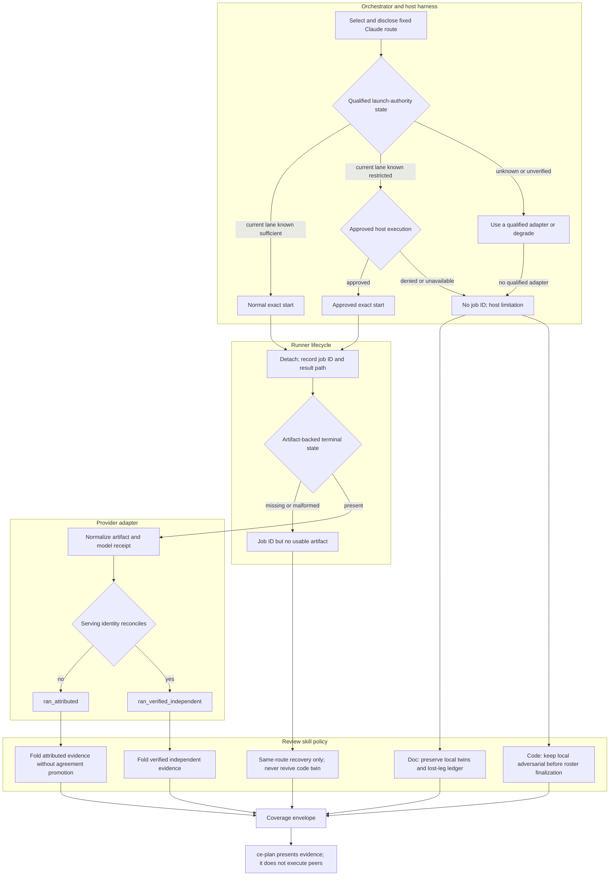

# Cross-Model Claude Sandbox Dispatch - Plan

## Goal Capsule

- **Objective:** Make Compound Engineering's native cross-model review produce a verified Claude artifact when a Codex task restricts subprocess credential or network access and the host permits approved execution; otherwise return an environment-scoped local-only result, while preserving the existing recipient, egress, isolation, and reviewer-independence boundaries.
- **Authority:** The confirmed session scope governs product behavior; repository instructions and existing cross-model contracts govern implementation; this plan's KTDs govern unresolved technical choices.
- **Execution profile:** One plugin PR spanning `ce-doc-review`, `ce-code-review`, the `ce-plan` handoff contract, deterministic tests, fresh-context skill evals, and a real restricted-Codex canary.
- **Stop conditions:** Stop if the implementation requires copying credentials, weakening provider CLI permissions, silently changing recipients, bypassing a denied host policy, modifying the shared runner without bringing `ce-pov` into parity, or claiming success without a verified artifact.
- **Tail ownership:** The implementation owner carries the change through focused checks, the full plugin validation suite, live canaries, PR review, and merge-ready evidence.

---

## Product Contract

### Summary

Add a host-aware execution boundary around native cross-model launches so a restricted Codex task can request approved host execution for the already-sanctioned peer command before detachment. An ownership-checked, schema-valid normalized artifact proves the critique ran; reconciliation with its route/model receipt is additionally required to call it verified independent. `ce-plan` must propagate that evidence level or an environment-scoped degradation instead of inferring that the user is globally logged out.

### Problem Frame

The Claude CLI is authenticated and succeeds from an unrestricted host, but a Codex Desktop task configured with `workspace-write`, network disabled, and `approval_policy: on-request` launched the same route inside its restricted command sandbox. `peer-job-runner.py` inherited that launch context, Claude returned `Not logged in`, and the review produced no artifact. The task then described the account as logged out even though only the child execution context had failed.

PR #1175 fixed a different boundary: Claude's `--bare` mode had suppressed normal OAuth/keychain behavior, so the adapters moved to `--safe-mode`. The current adapters are correct. This incident is outside them: Codex applies its sandbox to spawned commands, and the detached worker cannot grant itself network or credential access after launch.

The completion contract is also too weak. Current review references omit `--result-path`, so runner state `done` proves that the wrapper exited, not that a critique artifact exists. The worker intentionally exits cleanly on skips and unusable output. That is safe for the overall review, but it is not evidence that Claude reviewed the document or diff.

### Requirements

#### Host execution boundary

- R1. Before detaching a credential-sensitive native peer route, the orchestrator must distinguish host identity from the current command execution capability.
- R2. When the current Codex command sandbox blocks network or credential access, the orchestrator must request the harness's approved host-execution capability for the exact sanctioned runner-start command before creating a job.
- R3. The host-execution request must preserve the fixed target, concrete route, recipient allowlist, disclosed egress, document/diff scope, working directory, peer CLI flags, model selection, and aggregate deadline.
- R4. A denied, unavailable, or policy-forbidden host capability creates no peer job and triggers the existing local coverage path; neither the runner nor provider worker may attempt to bypass that decision.
- R5. An unrestricted execution context uses the normal launch path without an unnecessary escalation request.

#### Artifact-backed completion

- R6. Every detached review start must declare its deterministic expected fold-in file as the runner result path.
- R7. A cross-model leg counts as successful only after the runner reaches a successful artifact-backed state, the result is read through the ownership-checked runner interface, the complete fold-in contract validates, and route/model provenance reconciles.
- R8. A valid artifact with an empty `findings` array means the critique ran and found no additional issues; a job ID, wrapper exit, `done` without an artifact, raw CLI output, or auth-status preflight does not.
- R9. A Claude artifact without a usable Claude route/model receipt may remain attributed review evidence under existing rules, but it must not be described as a verified independent Claude critique or receive agreement promotion.

#### Diagnostics and caller propagation

- R10. Authentication wording must describe the execution context that produced the evidence. A restricted child failure cannot support a global `Claude is not logged in` conclusion.
- R11. Only an authentication failure observed through the resolved host execution capability may prompt the user to run Claude login; denial or absence of that capability must be reported as a host execution limitation.
- R12. The headless `ce-doc-review` envelope must carry stable cross-model coverage for each expected leg: target/route, host execution outcome, terminal state, artifact verification, identity verification, and an environment-scoped reason when degraded.
- R13. `ce-plan` must consume that coverage when summarizing its mandatory Markdown document review, distinguishing verified cross-model review, local-only completion, host-policy denial, true route authentication failure, timeout/quota, and unusable output.

#### Parity and scope

- R14. `ce-doc-review` and `ce-code-review` must share the same host-capability, artifact-success, and diagnostic semantics while preserving their different lens and fallback policies.
- R15. `ce-doc-review` remains additive: in-process twins continue, and loss of the untwinned whole-document sweep is named. `ce-code-review` remains exclusive: a no-job preflight failure retains the in-process adversarial fallback, while a post-job peer failure follows the existing same-route recovery and degradation rules.
- R16. `ce-plan` itself does not gain a second cross-model implementation. Its existing mandatory Markdown `ce-doc-review` invocation remains the only review path.
- R17. Plan Critic MCP, Doppler credentials, Claude account configuration, `ce-pov`, MyEarnings application code, provider substitution, and changes to the inner Claude safe-mode flags remain out of scope.

#### Security invariants

- R18. Approved host execution must be one-shot and bound to canonical runner/script paths, fixed argv, fixed working directory, fixed route, fixed input digest, fixed result path, and an allowlisted environment delta; it must not install a broad reusable approval prefix or alter global sandbox/network policy.
- R19. The host lane must not forward the ambient host environment wholesale. Pass only route-qualified operational discovery variables; never copy or serialize token/key values. A route that only works by forwarding a secret environment variable remains unsupported until separately authorized.
- R20. Artifact acceptance must reconcile the job ID, runner metadata, non-empty input digest, expected result path, terminal state, normalized artifact, and route/model receipt. An owner-matching stale or substituted file is not sufficient.
- R21. Peer scratch creation must fail closed. If the isolated workspace cannot be created, invoke no provider and write no critique artifact; never fall back to the shared run directory or repository.
- R22. Provider failures must enter logs, coverage, and PR evidence through an allowlisted diagnostic taxonomy with redaction for credentials, bearer material, signed URLs, headers, and sensitive host paths. Bounded truncation alone is not redaction.

### Key Flows

- F1. Restricted Codex, approved host execution
  - **Trigger:** A Codex-hosted review selects the native Claude route while the command sandbox lacks network or credential access.
  - **Steps:** Resolve and disclose the fixed route; request approved host execution for the exact runner start; detach the worker from that execution context; collect and validate the expected artifact and receipt; fold it into review and propagate verified coverage to `ce-plan`.
  - **Outcome:** Claude actually reviews the input, and the caller can prove it from the artifact.
- F2. Restricted Codex, host execution denied or unavailable
  - **Trigger:** The same route is selected, but host policy does not authorize execution outside the child sandbox.
  - **Steps:** Start no peer job; preserve local review coverage; record a host-execution degradation; do not retry inside the known-bad context or suggest login.
  - **Outcome:** Review completes honestly without claiming a Claude pass.
- F3. Host-capable route is genuinely unauthenticated
  - **Trigger:** Claude authentication fails after the exact route runs through the resolved host execution context.
  - **Steps:** Record the route-level auth failure, keep existing local coverage, and prompt the user to log in before a future retry.
  - **Outcome:** Login guidance is based on host-context evidence rather than a sandbox artifact.
- F4. Worker terminates without a usable artifact
  - **Trigger:** The runner returns a job ID, but the worker times out, exits after a clean skip, writes malformed output, or omits the expected artifact.
  - **Steps:** Runner result-path validation prevents a false success state; existing same-route recovery rules apply where eligible; coverage names the actual loss.
  - **Outcome:** No caller can report that the critique ran merely because the wrapper completed.

### Acceptance Examples

- AE1. Given Codex `workspace-write` with network disabled and `on-request` approval, when approved host execution starts the fixed Claude peer, then the detached job publishes a schema-valid Claude artifact with a reconciled model receipt and `ce-plan` reports verified cross-model coverage.
- AE2. Given the same restricted task, when host execution is denied or unavailable, then zero peer jobs start, local review continues, and output names the host restriction without saying the user is logged out.
- AE3. Given unrestricted Codex, when the native Claude peer starts, then it uses the normal runner path and still must publish the same verified artifact before success is claimed.
- AE4. Given a host-capable Claude route that is genuinely unauthenticated, when the route returns its auth error, then the output may prompt login and records that no Claude artifact exists.
- AE5. Given a verified Claude artifact whose `findings` array is empty, when synthesis runs, then coverage says the cross-model pass ran with no additional issues.
- AE6. Given runner `done` but a missing, malformed, or receipt-incomplete artifact, when synthesis runs, then the leg is degraded and never described as a verified Claude critique.
- AE7. Given a restricted `ce-code-review` preflight that cannot obtain host execution, when its roster is finalized, then the in-process adversarial reviewer remains selected; a post-job failure never dispatches both versions of the same brief.
- AE8. Given a Markdown `ce-plan` output that activates a judgment lens, when mandatory headless document review completes, then its handoff line reflects the cross-model artifact state rather than only document-finding counts.

### Scope Boundaries

#### In scope

- Host-aware launch contracts for `ce-doc-review` and `ce-code-review`.
- Artifact-backed runner completion using the existing runner capability.
- Environment-scoped failure taxonomy and headless coverage propagation into `ce-plan`.
- Deterministic parity tests, fresh-context skill evals, and real restricted/unrestricted Claude canaries.
- Public skill documentation and the institutional learning that previously left default-sandboxed Codex unverified.

#### Deferred to Follow-Up Work

- Applying the same presence-keyed completion contract to `ce-pov`, unless implementation proves a shared-runner change unavoidable.
- Qualifying named escalation adapters on harnesses that cannot be executed during this work; unsupported harnesses must degrade explicitly until verified.

#### Outside this product's identity

- Copying OAuth tokens, reading keychain material directly, or converting user OAuth into plugin-managed credentials.
- Weakening the peer's tool restrictions, read scope, fixed-route discipline, or recipient disclosure.
- Silently changing providers to avoid a host policy or route authentication failure.

---

## Planning Contract

### Key Technical Decisions

- KTD1. Resolve privilege at the outer host command boundary. `(session-settled: user-approved — chosen over detection-only skipping: the requested fix must make Claude produce a critique when the host policy permits it.)` The runner inherits its launch context and cannot self-elevate, so host capability resolution must precede `peer-job-runner.py start`.
- KTD2. Use an evidence lattice rather than one overloaded success receipt. `(session-settled: user-approved — chosen over trusting job completion or raw CLI output: the user explicitly requires the Claude critique to have run.)` Host-lane evidence proves where launch was attempted and controls diagnostic wording; a job ID plus artifact-backed terminal state proves the detached lifecycle completed; the ownership-checked schema-valid normalized artifact proves the critique ran; and a reconciled route/model receipt proves serving identity and independence. A valid artifact with unverified serving identity is `ran_attributed`; a valid artifact with reconciled identity is `ran_verified_independent`.
- KTD3. Author capability-first and bind harness adapters empirically. The portable contract is “run this exact sanctioned command in a host execution context that can access the selected CLI's credentials and provider.” Codex approved outside-sandbox execution is the first adapter; other harnesses keep their normal path unless a real probe proves they need and support an equivalent.
- KTD4. Preserve the existing inner isolation boundary. Claude stays on `--safe-mode`; doc review remains tool-less in empty scratch; code review keeps read-only in-tree context. Outer host execution grants the command network/keychain reach, not broader peer tools or mutation rights.
- KTD5. Use the runner's existing `--result-path` contract rather than changing the byte-duplicated runner. This makes missing output terminally visible without expanding scope to `ce-pov` or introducing a second lifecycle implementation.
- KTD6. Resolve one wave-level launch-authority decision without assuming an approval token is reusable. Record `normal`, `approved-host`, `denied`, or `unavailable`, then apply the empirically qualified execution lane to each concrete start. For Codex, qualify either one elevated batch containing every disclosed start or separately elevated starts; do not imply approval reuse without evidence. Maintain a per-leg ledger of authorization outcome, job ID or no-job, and expected result path; anchor the aggregate deadline before the initial attempt and retry only missing or failed legs without resetting it.
- KTD7. Keep execution-context evidence separate from account state. Environment markers identify risk; they do not prove elevation or logout. Only the real host-context route result can justify login guidance, and only the artifact can justify a review-success claim.
- KTD8. Make caller propagation part of the fix. `ce-plan` currently consumes finding counts but not cross-model coverage. The headless envelope and handoff summary must carry the artifact truth so the original misleading statement cannot recur one layer above the review skill.

### High-Level Technical Design

The diagram assigns authority resolution to the orchestrator, detached lifecycle proof to the runner, normalization and identity to the provider adapter, fallback policy to each review skill, and presentation to `ce-plan`. A document-review wave keeps a per-leg ledger and preserves already-started jobs; code review finalizes its exclusive roster only after job-ID versus no-job is known. Host execution changes only the outer launch lane; provider selection, peer isolation, and local reviewer policy remain downstream.

### Sequencing

U1 establishes the shared launch and authority contract. U2 makes document-review completion and coverage artifact-backed. U3 applies the same semantics while preserving code-review's exclusive roster. U4 propagates the result into `ce-plan`. U5 locks behavior with tests, live canaries, and documentation; it is merge-blocking because earlier work planned but did not execute the restricted-Codex proof.

---

## Implementation Units

### U1. Define the authorized host-execution contract

- **Goal:** Resolve a usable host execution lane before any credential-sensitive peer detaches, with capability-first language and a verified Codex adapter.
- **Requirements:** R1-R5, R14, R17-R19, R21; KTD1, KTD3, KTD4, KTD6.
- **Dependencies:** none.
- **Files:** `skills/ce-doc-review/SKILL.md`, `skills/ce-doc-review/references/cross-model-review.md`, `skills/ce-doc-review/references/cross-model-eval.md`, `skills/ce-code-review/SKILL.md`, `skills/ce-code-review/references/cross-model-review.md`, `skills/ce-code-review/references/cross-model-eval.md`.
- **Approach:** Add the invariant beside each launch point: assess the current command context; if it is restricted for the selected native route, request one-shot host execution for a canonicalized, immutable launch tuple. Keep the detailed adapter and denial behavior in each cross-model reference, while the SKILL stubs retain the load-bearing requirement to resolve capability before roster/wave dispatch. Sanitize the launch environment to a route-qualified operational allowlist, fail closed when isolated scratch cannot be created, and record the capability outcome in working state. Resolve authority once per document wave without assuming approval reuse; account for partial starts without duplicating completed legs.
- **Patterns to follow:** `docs/solutions/skill-design/cross-harness-cross-model-tool-invocation.md` for capability-first adapters; `docs/solutions/skill-design/dispatch-script-failure-degrade-outcome-not-boundary.md` for same-route recovery; existing fixed-route disclosure in both cross-model references.
- **Test scenarios:**
  - Restricted Codex plus approved host execution launches the exact fixed route outside the child sandbox.
  - Restricted Codex plus denied or unavailable capability launches no peer and selects the skill-specific local degradation path.
  - Unrestricted Codex launches normally without escalation.
  - A partially-started doc-review wave preserves its authority decision and per-leg ledger, does not assume approval-token reuse, does not duplicate started legs, and names any lost whole-document sweep.
  - A retry cannot change route, recipient, scope, model family, or peer CLI permissions.
  - A seeded ambient secret is absent from the peer environment, artifact, logs, coverage envelope, and evidence; forced scratch failure starts no provider.
- **Verification:** Fresh-context eval transcripts show the host capability is resolved before detach on both skills and that unsupported or denied execution stops at the policy boundary.

### U2. Make document-review completion artifact-backed

- **Goal:** Give `ce-doc-review` a deterministic success receipt and a headless coverage contract that distinguishes verified Claude review from every degraded state.
- **Requirements:** R6-R13, R15, R20, R22; KTD2, KTD5, KTD7.
- **Dependencies:** U1.
- **Files:** `skills/ce-doc-review/references/cross-model-review.md`, `skills/ce-doc-review/references/synthesis-and-presentation.md`, `skills/ce-doc-review/references/cross-model-eval.md`, `tests/skills/ce-doc-review-cross-model-routes.test.ts`, `tests/review-skill-contract.test.ts`.
- **Approach:** Pass the deterministic `<reviewer>-<target>.json` path to each runner start. Retrieve by job ID and reconcile runner metadata, non-empty input digest, terminal state, expected path, complete normalized contract, and model receipt before fold-in. Extend the headless envelope with compact per-leg coverage sufficient for callers to distinguish host-execution denial, authentic route logout, quota/timeout, missing or malformed/stale artifact, unverified identity, verified empty review, and verified findings. Route diagnostics through an allowlisted, redacted taxonomy. Keep local twins and existing agreement/autofix rules unchanged.
- **Patterns to follow:** Existing runner result-path lifecycle in `skills/ce-doc-review/scripts/peer-job-runner.py`; requested-versus-verified identity in `docs/solutions/skill-design/requested-vs-verified-model-identity.md`; the current interactive Coverage vocabulary in `skills/ce-doc-review/references/review-output-template.md`.
- **Test scenarios:**
  - Valid Claude artifact with verified identity and zero findings is a successful no-issues peer review.
  - Worker exit without the expected artifact cannot reach `done` or a success claim.
  - Malformed findings or missing required provenance remains degraded and cannot promote agreement.
  - Restricted-context `Not logged in` maps to execution-context authentication failure, not global logout.
  - Host-context `Not logged in` maps to an unauthenticated route and permits login guidance.
  - Timeout, quota, approval denial, and missing capability remain distinct headless coverage reasons.
  - An owner-matching artifact is rejected when the job is not done, metadata names another path, or its input digest does not match.
  - Seeded secrets and sensitive host paths never reach `out.log`, the artifact, coverage, or PR evidence while safe auth/quota classification remains usable.
- **Verification:** Deterministic tests validate artifact-presence and classification contracts; fresh-context eval parses the headless envelope and proves a verified artifact is required for the success wording.

### U3. Preserve code-review's exclusive fallback with the same evidence rules

- **Goal:** Apply the host-execution and artifact-success contract to `ce-code-review` without dispatching both adversarial reviewers or weakening its in-tree boundary.
- **Requirements:** R1-R11, R14-R15; KTD1-KTD7.
- **Dependencies:** U1.
- **Files:** `skills/ce-code-review/SKILL.md`, `skills/ce-code-review/references/cross-model-review.md`, `skills/ce-code-review/references/cross-model-eval.md`, `tests/skills/ce-code-review-cross-model-routes.test.ts`, `tests/review-skill-contract.test.ts`.
- **Approach:** Resolve host execution before Stage 3d finalizes the exclusive roster. Declare `adversarial-<target>.json` as the expected runner result. If no job starts because capability is denied or unavailable, retain the in-process adversarial reviewer. If a job ID was returned, preserve PR #1187's same-route hand-recovery and never revive the local twin late. Scope all auth wording to the attempted execution lane.
- **Patterns to follow:** Existing no-job versus job-started split in `skills/ce-code-review/references/cross-model-review.md`; `docs/solutions/skill-design/dispatch-script-failure-degrade-outcome-not-boundary.md` for degradation semantics.
- **Test scenarios:**
  - Capability denial before a job ID retains the in-process adversarial reviewer.
  - Successful artifact-backed peer start removes the local twin and folds one verified adversarial artifact.
  - Job-ID-then-missing-artifact performs only bounded same-route recovery and never dispatches the local twin.
  - A restricted child auth error cannot be rendered as account logout.
  - Artifact and receipt validation match doc review while code review retains `testing_gaps` and in-tree read scope.
- **Verification:** Contract and fresh-context evals prove exactly one adversarial brief runs and that coverage cannot claim a peer without the expected artifact.

### U4. Propagate cross-model truth through ce-plan

- **Goal:** Ensure `ce-plan`'s mandatory Markdown review summary tells the user whether the Claude pass actually ran.
- **Requirements:** R12-R13, R16; KTD8.
- **Dependencies:** U2.
- **Files:** `skills/ce-plan/references/plan-handoff.md`, `skills/ce-doc-review/references/synthesis-and-presentation.md`, `skills/ce-doc-review/references/cross-model-eval.md`, `tests/review-skill-contract.test.ts`.
- **Approach:** Extend the captured headless envelope and handoff summary rules to include cross-model coverage separately from document-finding counts. A clean local document review must not collapse into “cross-model clean.” Render concise states for verified Claude review, local-only review after host denial, true Claude route logout, and started-but-unusable peer output. Keep `ce-plan`'s existing cross-skill invocation and post-generation menu unchanged.
- **Patterns to follow:** Existing synthetic skip envelopes and summary-line branching in `skills/ce-plan/references/plan-handoff.md`.
- **Test scenarios:**
  - Markdown plan with a verified Claude artifact reports that independent cross-model review completed.
  - Markdown plan with local-only findings and denied host execution reports document review completion plus cross-model degradation.
  - A clean document with a missing peer artifact cannot produce a globally clean cross-model claim.
  - HTML and `skill_unreachable` branches retain their current wording and do not acquire irrelevant peer fields.
- **Verification:** A fresh-context `ce-plan` canary on a fixture that activates a judgment lens consumes the headless artifact coverage and renders the matching handoff line.

### U5. Lock parity, live proof, and documentation

- **Goal:** Prevent regression through deterministic parity guards and the real sandboxed-host proof that prior lifecycle work left unexecuted.
- **Requirements:** R14-R22; AE1-AE8.
- **Dependencies:** U2-U4.
- **Files:** `tests/review-skill-contract.test.ts`, `tests/skills/ce-doc-review-cross-model-routes.test.ts`, `tests/skills/ce-code-review-cross-model-routes.test.ts`, `skills/ce-doc-review/references/cross-model-eval.md`, `skills/ce-code-review/references/cross-model-eval.md`, `docs/skills/ce-doc-review.md`, `docs/skills/ce-code-review.md`, `docs/solutions/skill-design/detached-job-lifecycle-for-delegated-work.md`, `docs/solutions/skill-design/dispatch-script-failure-degrade-outcome-not-boundary.md`.
- **Approach:** Add mechanical guards for matching host-capability, result-path, input-binding, redaction, and failure-taxonomy invariants across the two skills. Expand both eval specs with restricted, denied, unrestricted, authentic-logout, empty-artifact, missing/stale-artifact, secret-sentinel, and scratch-failure cases. Run a paired control with the same non-sensitive, uniquely marked Claude input: the restricted normal lane must fail without an artifact, then one-shot approved host execution must succeed with a matching launch tuple, runner metadata, input digest, artifact, and identity receipt. Prove denial creates no job/provider invocation, no reusable approval is installed, global policy is unchanged, and inner tool restrictions remain fixed. Then run a real Markdown `ce-plan` fixture through mandatory headless doc review. Update docs and institutional learning only with behavior actually demonstrated.
- **Execution note:** Treat the restricted-Codex canary as a merge-blocking behavioral gate. Fake CLIs and prose assertions cannot substitute for it.
- **Patterns to follow:** Repository skill-creator guidance in `AGENTS.md`; route sandbox fixtures in both cross-model test files; empirical qualification discipline in `docs/solutions/skill-design/cross-harness-cross-model-tool-invocation.md`.
- **Test scenarios:**
  - Both references contain parity-protected capability, result-path, and environment-scoped diagnostic contracts.
  - Stubbed Claude auth failures produce no artifact and cannot satisfy success wording.
  - Real unrestricted Codex produces a verified Claude artifact without escalation.
  - Real restricted Codex with approved host execution produces an equivalent verified Claude artifact.
  - Restricted Codex with denied capability produces no job and an explicit local-only result.
  - Forced private-scratch failure invokes no provider and never substitutes the run directory or repository.
  - Seeded ambient secrets are absent from the worker environment, artifact, durable log, headless envelope, and recorded evidence.
  - Claude Code safe-mode OAuth canary remains green, proving the outer fix did not regress PR #1175.
  - Full plugin conversion and release validation remain green without modifying release-owned versions.
- **Verification:** All deterministic gates pass; live canary evidence includes route, requested and actual model, artifact path/read result, independence status, and `ce-plan` handoff output.

---

## System-Wide Impact

- **Security and authority:** Invocation already sanctions the configured peer recipient and disclosed content egress, but it does not override Codex's host policy. The new path asks the host to authorize one exact command; denial is terminal for that peer attempt.
- **Credentials:** No credential data enters plugin state. The native CLI continues to own OAuth/keychain access; the outer lane uses a route-qualified operational environment allowlist and never treats ambient environment copying as authentication.
- **Process lifecycle:** Detachment, deadlines, process-group reaping, private scratch, and byte-identical runner copies remain unchanged. The aggregate deadline is anchored before the first launch attempt; partial wave starts are recorded per leg, reaped, and never duplicated by recovery.
- **Review semantics:** Cross-model findings remain additive and never gain silent-apply authority alone. Identity receipt failures continue to block independence promotion.
- **Caller behavior:** `ce-plan` gains evidence about review coverage, not a new review engine. Existing HTML and pipeline routing remain intact.
- **Maintainers:** Contributors must run both deterministic tests and fresh-context/live capability checks because host tool behavior cannot be proved by repository tests alone.

### Risks and Mitigations

- **Risk:** Capability prose assumes a harness adapter that does not exist. **Mitigation:** Bind named adapters only after executed probes; unsupported harnesses degrade explicitly.
- **Risk:** Outside-sandbox execution is mistaken for permission to relax the inner peer. **Mitigation:** Keep the command, route, working directory, and CLI safety flags byte-for-byte equivalent; parity tests prohibit broader permissions.
- **Risk:** The elevated launch inherits ambient secrets or creates reusable authority. **Mitigation:** Bind a one-shot canonical launch tuple, allowlist only operational environment variables, reconcile it with runner metadata, and prove no secret sentinel or persistent approval survives.
- **Risk:** An owner-matching stale artifact is substituted for the current review. **Mitigation:** Retrieve by job ID and reconcile terminal state, metadata result path, non-empty input digest, normalized artifact, and identity receipt.
- **Risk:** Raw provider failures leak credentials or sensitive host paths through durable logs or review evidence. **Mitigation:** Use an allowlisted diagnostic taxonomy and redact sensitive material before persistence; test with seeded sentinels.
- **Risk:** Failed private-scratch creation falls back to a broader workspace once host execution is available. **Mitigation:** Fail the peer leg closed before provider invocation and cover forced scratch failure deterministically.
- **Risk:** Headless mode suppresses an approval boundary. **Mitigation:** Define headless as document-interaction behavior only; platform approval may still surface, and denial produces a local-only result.
- **Risk:** A valid-looking but incomplete artifact creates a false Claude claim. **Mitigation:** Validate the full fold-in and provenance contract, reconcile the receipt, and distinguish attributed evidence from verified independence.
- **Risk:** `ce-code-review` dispatches both adversarial paths after recovery. **Mitigation:** Preserve the no-job versus job-started branch and test the roster invariant explicitly.
- **Risk:** A runner edit unintentionally expands the change to `ce-pov`. **Mitigation:** Use existing `--result-path`; if implementation proves a runner change necessary, stop and re-scope before editing the parity-guarded copies.

---

## Verification Contract

| Gate | Applies to | Done signal |
|---|---|---|
| `bun test tests/review-skill-contract.test.ts tests/skills/ce-doc-review-cross-model-routes.test.ts tests/skills/ce-code-review-cross-model-routes.test.ts` | U1-U4 | Host-capability, result-path, classification, roster, and caller-propagation cases pass without live model calls. |
| `bun test` | U1-U5 | Full repository suite passes with no runner or unrelated skill regression. |
| `bun run release:validate` | U5 | Plugin and marketplace metadata remain consistent without hand-versioning. |
| `bun run plugin:validate` | U5 | Claude plugin and marketplace schemas remain valid. |
| `skill-creator` evals from both `cross-model-eval.md` specs | U1-U5 | Fresh agents on Codex and Claude Code preserve the dispatch, artifact, degradation, and exclusive-roster contracts. |
| Unrestricted Codex -> real Claude artifact canary | U2, U3, U5 | Native launch produces an ownership-checked normalized artifact with reconciled Claude identity. |
| Restricted Codex paired control -> approved host execution -> real Claude artifact canary | U1-U5 | The normal restricted lane produces no artifact; the one-shot approved lane matches its canonical launch tuple to runner metadata, input digest, artifact, and Claude identity while preserving inner tool policy and global host settings. |
| Restricted Codex denial canary | U1-U5 | No job directory or provider invocation appears; output is environment-scoped, local coverage remains correct, and host policy/config is unchanged. |
| Security-negative fixtures | U1, U2, U5 | Ambient secret sentinels are absent from peer state/output/evidence; stale or mismatched artifacts are rejected; private-scratch failure invokes no provider. |
| Markdown `ce-plan` -> headless `ce-doc-review` canary | U2, U4, U5 | A judgment-lens fixture reaches the Claude artifact path and the handoff line reports its verified or degraded state accurately. |

The restricted-host and `ce-plan` canaries are merge gates. Record the environment posture and artifact receipt in the PR evidence so a passing fake-CLI suite cannot mask another untested host boundary.

---

## Definition of Done

- The outer runner start uses approved host execution when a restricted Codex task cannot reach the native Claude route.
- Denied or unavailable host execution starts no peer, preserves the correct local reviewer policy, and never claims global logout.
- Every doc-review and code-review peer declares an expected result path; missing or malformed output cannot appear as successful completion.
- A verified Claude critique requires an ownership-checked normalized artifact and reconciled identity receipt; empty findings are recognized as a successful no-issues review.
- `ce-doc-review` headless output carries stable cross-model coverage, and `ce-plan` renders it separately from document-finding counts.
- `ce-code-review` still runs exactly one adversarial brief and retains its no-job versus job-started recovery invariant.
- Fixed recipient, egress disclosure, read scope, model family, safe-mode/read-only flags, deadline, and independence rules remain unchanged.
- Host execution is one-shot and tuple-bound, forwards no ambient secrets, creates no reusable approval, and leaves global host policy unchanged.
- Artifacts are bound to job metadata and the reviewed input digest; stale or substituted same-owner files cannot prove success.
- Private-scratch failure is fail-closed, and persisted diagnostics are taxonomy-limited and redacted.
- Targeted tests, the full suite, release validation, plugin validation, and fresh-context skill evals pass.
- Real unrestricted, restricted-approved, restricted-denied, Claude Code safe-mode, and Markdown `ce-plan` canaries produce the expected evidence.
- Public docs and institutional learning describe the verified outer-sandbox distinction; no release-owned version is changed manually.
- No abandoned adapter, temporary credential workaround, experimental route, or unrelated user change remains in the diff.

---

## Sources and Research

- `skills/ce-doc-review/references/cross-model-review.md` and `skills/ce-code-review/references/cross-model-review.md` — current host attestation, fixed-route, detached lifecycle, recovery, and fold-in contracts.
- `skills/ce-code-review/scripts/peer-job-runner.py` — detached workers inherit the launch environment; existing `--result-path` supplies artifact-presence completion without a runner change.
- `skills/ce-doc-review/scripts/cross-model-doc-review.sh` and `skills/ce-code-review/scripts/cross-model-adversarial-review.sh` — current Claude safe-mode/read-only adapters, normalization, receipts, and bounded failure evidence.
- `docs/solutions/skill-design/detached-job-lifecycle-for-delegated-work.md` — durable peer execution pattern and the previously unclosed default-sandboxed Codex verification gap.
- `docs/solutions/skill-design/dispatch-script-failure-degrade-outcome-not-boundary.md` — recover only the same route and degrade coverage rather than weakening boundaries.
- `docs/solutions/skill-design/cross-harness-cross-model-tool-invocation.md` and `docs/solutions/skill-design/portable-agent-skill-authoring.md` — capability-first portable contracts and executed harness qualification.
- [PR #1175: preserve Claude auth](https://github.com/EveryInc/compound-engineering-plugin/pull/1175) — fixed `--bare` versus `--safe-mode`; did not test the outer restricted Codex boundary.
- [PR #1187: recover dispatch-script crashes](https://github.com/EveryInc/compound-engineering-plugin/pull/1187) — established same-route recovery and skill-specific degradation invariants.
- [OpenAI Codex sandboxing](https://developers.openai.com/codex/concepts/sandboxing) — spawned commands inherit sandbox boundaries; approvals govern attempts to cross them.
- [OpenAI Codex approvals and security](https://developers.openai.com/codex/agent-approvals-security) — network access outside normal `workspace-write` boundaries requires an eligible approval path.
- [Anthropic Claude Code setup](https://docs.anthropic.com/en/docs/claude-code/getting-started) and [corporate proxy guidance](https://docs.anthropic.com/en/docs/claude-code/corporate-proxy) — Claude authentication and model processing require network access, and credentials remain native CLI-managed state.
