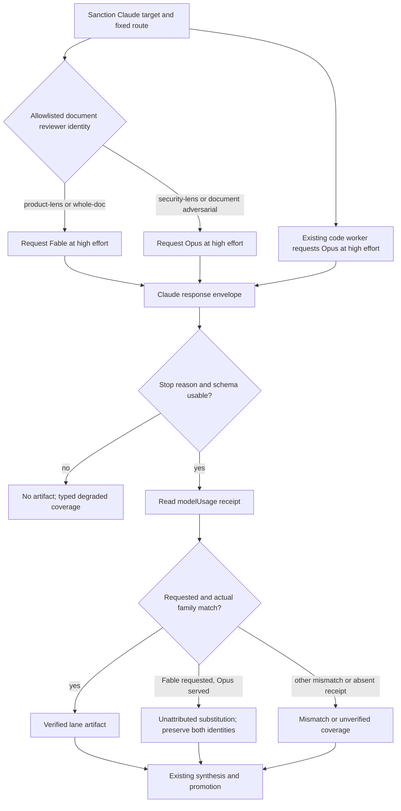

# Lane-Aware Fable 5 Anthropic Critique - Plan

## Goal Capsule

- **Objective:** Use Fable 5 at high effort for ordinary Anthropic document critiques while retaining Opus at high effort for every adversarial or security review lane.
- **Authority:** The Product Contract defines lane ownership; the Planning Contract defines routing, identity, evaluation, and rollout; existing cross-model route, egress, isolation, artifact, and synthesis contracts remain authoritative where this plan is silent.
- **Execution profile:** Replace `ce-doc-review`'s provider-wide Claude model constant with an allowlisted reviewer-to-model policy. Keep `ce-code-review` and `ce-pov` on Opus because their Claude work is adversarial or outside this migration.
- **Stop conditions:** Do not enable Fable for ordinary lanes unless route tests prove the guarded lanes remain Opus, ordinary-lane quality passes the scoped adoption gate, receipt reconciliation distinguishes documented safety routing from auth/quota failures, and production-shaped canaries finish within current deadlines.
- **Tail ownership:** The implementation owner updates routing, references, tests, benchmark evidence, and canaries as one change, then completes the repository's normal validation and release path.

---

## Product Contract

### Summary

Anthropic critiques will use a lane-aware model policy rather than one model for the entire provider. `product-lens` and `whole-doc` document reviews request Fable 5; `security-lens`, document `adversarial`, and code-review `adversarial` request Opus. All requests retain high effort and the existing fixed-route, least-privilege, schema, fold-in, and synthesis boundaries.

Fable's documented content classifier may serve Opus for some Fable requests, especially security-adjacent content. The system must preserve the actual Opus receipt and disclose the event as a Fable-to-Opus provider substitution consistent with Anthropic's documented safety routing. Unless the response exposes a machine-readable routing reason, the individual call must not claim why it was substituted. That event is not evidence of missing Claude authentication, exhausted credits, or a Fable quality result.

### Problem Frame

The current document worker owns one Claude model constant for all four cross-model reviewer identities. A direct `M_CLAUDE="fable"` change would therefore send security and adversarial lanes to a model whose documented safety routing may substitute Opus based on content. The stopped benchmark exposed a fixture-correlated pattern consistent with this boundary: its first three Opus receipts appeared on the SQL-injection fixture, not after a duration or credit threshold.

The existing code-review Claude peer is adversarial-only, so changing its default to Fable would contradict the desired policy. The document worker is the only production adapter that needs a default-routing change, but its reference contract, announcement text, override validation, receipt extraction, tests, and `ce-plan` integration all currently assume one model per provider.

The migration must therefore be evaluated on the ordinary document jobs that will actually change. Guarded lanes remain on Opus and need routing invariants rather than a Fable-vs-Opus quality contest. Any Fable-requested artifact served by Opus remains potentially usable when schema-valid and non-refusal, but it is labeled with its requested and actual identities, excluded from Fable quality evidence, and never diagnosed as an auth or credit failure without corresponding route evidence.

### Actors

- A1. **Review caller:** `ce-code-review`, direct `ce-doc-review`, or `ce-plan` invoking document review.
- A2. **Reviewer policy:** The allowlisted reviewer identity that selects the Claude model without accepting a free-form model from document content or caller-controlled paths.
- A3. **Critique worker:** The fixed-route shell adapter that applies model policy, high effort, isolation, schema capture, and normalization.
- A4. **Claude CLI and Anthropic backend:** The route that accepts the request and returns structured output plus serving-side model usage; it may perform documented content-based Fable-to-Opus safety routing.
- A5. **Review synthesizer:** The existing workflow that reconciles artifacts, model identity, coverage, independence, and agreement promotion.
- A6. **Maintainer:** The person approving evaluation spend, reviewing evidence, and releasing the change.

### Requirements

**Lane-aware routing**

- R1. The Claude route for `ce-doc-review` reviewer `product-lens` requests `fable` at `high` effort.
- R2. The Claude route for `ce-doc-review` reviewer `whole-doc` requests `fable` at `high` effort.
- R3. The Claude route for `ce-doc-review` reviewers `security-lens` and `adversarial` requests `opus` at `high` effort.
- R4. The Claude route for `ce-code-review` remains `opus` at `high` effort because its only cross-model peer is adversarial; `ce-pov` also remains Opus.
- R5. The model policy is derived only from the worker's existing allowlisted reviewer name. It does not add a recipient, caller-supplied persona path, general model-selection setting, or model choice inferred from document text.
- R6. `ce-plan` inherits the same document-review policy: ordinary activated lanes request Fable, guarded activated lanes request Opus, and the whole-document sweep remains Fable-requested even when another activated slice is guarded.

**Identity, safety routing, and outcomes**

- R7. Every Claude artifact records `model_requested` from the selected lane policy and derives `model_actual` only from an unambiguous `modelUsage` receipt. A receipt containing multiple model families is recorded as identity-ambiguous (`model_actual: unverified` plus all observed model IDs) unless the envelope provides an authoritative final-output model field; it cannot support Fable labeling or agreement promotion.
- R8. A Fable request served by Opus is surfaced as a Fable-to-Opus provider substitution consistent with documented safety routing when the artifact is otherwise schema-valid and non-refusal. It may fold in under the existing synthesis rules, but coverage names both identities, does not claim Fable served it, and does not assert a per-call cause without a machine-readable routing reason.
- R9. A Fable-requested/Opus-served artifact does not count toward Fable benchmark quality, Fable receipt success, or proof that the Fable lane ran. It remains Anthropic-family evidence for cross-provider independence when the host family is attested and different.
- R10. Authentication, quota, and availability diagnostics are based on their own CLI status/error signals. A successful schema-shaped Opus receipt behind a Fable request must not be labeled "not logged in," "out of credits," or availability fallback.
- R11. Explicit `stop_reason: refusal`, a missing/unknown stop reason, an invalid schema, or no artifact follows the existing degraded/no-fold-in path. No worker-level recipient retry or second model call is added.
- R12. A model override remains target-bound and lane-safe: it may adapt an unavailable model only within the selected lane's expected family and cannot collapse Fable ordinary lanes and Opus guarded lanes into one provider-wide model. Supporting a deliberate cross-lane model override is outside this change because the current override tuple carries no trustworthy provenance.

**Adoption evidence and documentation**

- R13. The adoption benchmark compares Fable/high with Opus/high only on `product-lens` and `whole-doc`, holding prompt, input, schema, effort, sandbox, orchestration, and timeout fixed.
- R14. Guarded-lane tests prove that code adversarial, document adversarial, and document security requests remain Opus; no Fable quality benchmark is required for lanes that do not migrate.
- R15. Production-shaped canaries cover code adversarial Opus, ordinary document Fable, guarded document Opus, and a mixed `ce-plan` document review with truthful requested-versus-served receipts.
- R16. Current reference prose and the stopped benchmark report explain the lane-aware policy and that the fixture-correlated substitution is consistent with documented content-based safety routing, without asserting an unattested per-call cause or rewriting raw counts, spend, or historical evidence.
- R17. Mixed document runs reconcile each worker call independently: usable artifacts survive, failures and substitutions remain attributed to their reviewer lanes, and aggregate coverage never implies complete Fable or Opus coverage when one lane degraded.
- R18. Benchmark trials are pre-registered and non-replaceable. Mismatched, unverified, refused, schema-invalid, auth/quota-failed, and timed-out trials remain in their original denominator, cannot be rerun selectively, and cannot count toward Fable quality scores.
- R19. Benchmark raw prompts, stdout/stderr, provider envelopes, and judge votes live only in a mode-700 per-run temporary directory, never enter commits or PR evidence, pass secret/path sentinels before aggregate export, and are removed or moved to an explicitly approved owner-only evidence location after verification. Tracked evidence contains only redacted receipts, fixture IDs/digests, and aggregate metrics.

### Key Flows

- F1. **Ordinary document critique**
  - **Trigger:** `product-lens` or `whole-doc` is dispatched to the sanctioned Claude route.
  - **Actors:** A1-A5
  - **Steps:** The worker derives `fable` from the allowlisted reviewer, requests high effort, normalizes the structured output, and reconciles the serving receipt.
  - **Outcome:** A matching `claude-fable-*` receipt yields a verified Fable artifact; other outcomes follow F4, F5, or F7.
  - **Covered by:** R1, R2, R5-R11

- F2. **Guarded document critique**
  - **Trigger:** `security-lens` or document `adversarial` is dispatched to Claude.
  - **Actors:** A1-A5
  - **Steps:** The same worker derives `opus` from reviewer identity and uses the unchanged high-effort route and artifact contract.
  - **Outcome:** Guarded content never relies on Fable availability or classifier behavior by default.
  - **Covered by:** R3, R5, R7, R11, R12

- F3. **Code adversarial critique**
  - **Trigger:** `ce-code-review` activates its Anthropic cross-model peer.
  - **Actors:** A1, A3-A5
  - **Steps:** The existing worker requests Opus/high and reconciles its Opus receipt.
  - **Outcome:** Code review is explicitly outside the Fable default migration.
  - **Covered by:** R4, R7, R14, R15

- F4. **Unattributed Fable-to-Opus provider substitution**
  - **Trigger:** An ordinary lane requests Fable but `modelUsage` reports `claude-opus-*` in a successful, schema-shaped response.
  - **Actors:** A3-A5
  - **Steps:** The worker preserves requested Fable and actual Opus, emits a bounded unattributed-substitution marker, and exposes the artifact with truthful identity for synthesis.
  - **Outcome:** The review may remain usable, but is neither called Fable nor confused with auth, quota, or availability failure; without a routing-reason field, its cause is described only as consistent with documented safety routing.
  - **Covered by:** R7-R10

- F5. **Refusal or unusable response**
  - **Trigger:** Claude reports refusal, an unknown stop reason, invalid schema, or no usable artifact.
  - **Actors:** A3-A5
  - **Steps:** The worker publishes no fold-in artifact and emits the appropriate bounded degradation evidence.
  - **Outcome:** Local review continues; the worker does not retry a recipient or launch a second model.
  - **Covered by:** R11

- F6. **Mixed `ce-plan` review**
  - **Trigger:** A plan activates one guarded judgment lens, one ordinary judgment lens, and the whole-document sweep.
  - **Actors:** A1-A5
  - **Steps:** The host sanctions Claude once; each worker call selects its model from reviewer identity; announcements and final coverage list the per-lane requested and actual identities.
  - **Outcome:** One provider/route can safely carry multiple lane-specific model requests without changing recipients. Each artifact or degradation remains role-specific, and valid artifacts survive a sibling lane's failure.
  - **Covered by:** R3, R6-R12, R15, R17

- F7. **Mismatched, ambiguous, or absent identity receipt**
  - **Trigger:** A schema-valid, non-refusal response has a non-Opus mismatch, multiple model families without final-output attribution, or no authoritative receipt.
  - **Actors:** A3-A5
  - **Steps:** The worker preserves all observed identity evidence, records actual identity as mismatched or unverified/ambiguous, and exposes any otherwise usable artifact under the existing coverage rules.
  - **Outcome:** Coverage never claims the requested model served the review, and model-dependent agreement promotion and Fable benchmark credit are withheld.
  - **Covered by:** R7-R9, R17, R18

### Acceptance Examples

- AE1. **Product lens uses Fable**
  - **Given:** Claude is the sanctioned target and `product-lens` is activated.
  - **When:** The document worker builds its adapter arguments.
  - **Then:** The request contains `--model fable --effort high`, and a matching Fable receipt is recorded without a mismatch warning.
  - **Covers:** R1, R5, R7

- AE2. **Guarded lenses use Opus**
  - **Given:** Claude is the sanctioned target and either `security-lens` or `adversarial` is activated.
  - **When:** The document worker builds its adapter arguments.
  - **Then:** The request contains `--model opus --effort high`; no shared Fable constant can override it.
  - **Covers:** R3, R5, R12

- AE3. **Code adversarial remains Opus**
  - **Given:** The Claude code-review peer runs after this migration.
  - **When:** Its adapter arguments and normalized artifact are inspected.
  - **Then:** It requests Opus/high and records a matching `claude-opus-*` receipt.
  - **Covers:** R4, R14

- AE4. **Documented Fable safety route**
  - **Given:** `whole-doc` requests Fable and the successful envelope contains only a `claude-opus-*` receipt.
  - **When:** The worker reconciles the artifact.
  - **Then:** The artifact records requested Fable and actual Opus, coverage describes a provider substitution consistent with documented safety routing without claiming its cause, and the run is excluded from Fable benchmark scoring without being called an auth or credit failure.
  - **Covers:** R7-R10

- AE5. **Mixed plan review**
  - **Given:** `ce-plan` activates `product-lens`, `security-lens`, and the whole-document sweep.
  - **When:** The Claude cross-model pass runs.
  - **Then:** Product and whole-document calls request Fable, security requests Opus, all use the same sanctioned Claude route, and the announcement makes the per-lane mapping visible before egress.
  - **Covers:** R1-R3, R6, R15

- AE6. **No hidden second call**
  - **Given:** A Fable request refuses or returns no usable artifact.
  - **When:** The worker exits.
  - **Then:** No fold-in artifact and no automatic Opus retry are produced; degraded coverage names the actual failure class.
  - **Covers:** R10, R11

- AE7. **Partial mixed-run degradation**
  - **Given:** A mixed `ce-plan` review returns valid product and security artifacts while the whole-document sweep times out.
  - **When:** Coverage and synthesis reconcile the run.
  - **Then:** The two valid artifacts remain available, the whole-document timeout is attributed to that lane, and aggregate coverage does not imply a complete Fable pass.
  - **Covers:** R17

- AE8. **Non-replaceable failed benchmark trial**
  - **Given:** A pre-registered Fable trial is refused, unverified, substituted to Opus, schema-invalid, auth/quota-failed, or timed out.
  - **When:** The harness computes the decision table.
  - **Then:** The trial remains in the original denominator, contributes no Fable quality success, and is not selectively rerun.
  - **Covers:** R18

- AE9. **Ambiguous multi-family receipt**
  - **Given:** A Claude envelope's `modelUsage` contains both Fable and Opus model IDs and no authoritative final-output model field.
  - **When:** The worker normalizes the artifact.
  - **Then:** It records every observed ID, sets actual identity to unverified/ambiguous, withholds Fable labeling and agreement promotion, and excludes the trial from the Fable quality numerator while retaining it in the denominator.
  - **Covers:** R7, R18

### Success Criteria

- Document `product-lens` and `whole-doc` request Fable/high; document `security-lens` and `adversarial`, code adversarial, and POV request Opus/high.
- Route tests cover all four document reviewer identities, lane-compatible override behavior, unambiguous Fable and Opus receipts, ambiguous multi-family receipts, provider substitution, refusal, auth/quota/transport failure, missing receipt, and invalid schema.
- The ordinary-lane benchmark passes its pre-registered non-inferiority rule using only outputs with matching Fable receipts in the Fable quality numerator while every pre-registered trial remains in the denominator.
- Production canaries prove ordinary, guarded, code, and mixed-plan routing without timeout expansion or a new recipient.
- `bun test`, `bun run plugin:validate`, and `bun run release:validate` pass without weakening validators or existing safety boundaries.

### Scope Boundaries

**Included now**

- Lane-aware Claude model selection inside `ce-doc-review`.
- Fable for product and whole-document critique; Opus retention for security and adversarial critique.
- Truthful classification of Fable-to-Opus provider substitution as consistent with Anthropic's documented safety routing, without inventing a per-call cause.
- Ordinary-lane benchmark scope, guarded-lane invariants, reference updates, and production-shaped canaries.

**Deferred**

- Prompt tuning for Fable-specific behavior, unless the scoped benchmark isolates a concrete prompt defect.
- A future policy for a dedicated non-adversarial code-review lane; none exists today.

**Excluded**

- Changing the code adversarial or POV default from Opus.
- New global model-selection configuration, provider discovery, recipients, or UI.
- A deliberate cross-lane user model override or new override-provenance channel.
- Inferring model policy from document contents or arbitrary persona paths.
- Worker-level retries, availability fallback configuration, or a second provider/model call after refusal or failure.
- Reclassifying historical provider spend or benchmark counts.

### Dependencies and Sources

- `skills/ce-doc-review/scripts/cross-model-doc-review.sh` owns the current provider-wide Claude model mapping and the four reviewer allowlist entries.
- `skills/ce-doc-review/references/cross-model-review.md` owns the one-model-per-provider, announcement, fixed-route, and fold-in contract that must become lane-aware for Claude only.
- `skills/ce-code-review/scripts/cross-model-adversarial-review.sh` and `skills/ce-code-review/references/cross-model-review.md` establish that code review's only cross-model peer is adversarial and therefore remains Opus.
- `docs/solutions/skill-design/requested-vs-verified-model-identity.md` requires requested and actual model identity to remain separate and receipt-backed.
- `docs/solutions/skill-design/benchmark-review-peer-model-and-reasoning-tier.md` requires evaluation on the exact changed job, with non-inferiority, multiple trials, and detection separated from assertion.
- `docs/plans/2026-07-21-fable-5-critique-benchmark-report.md` preserves the stopped run's counts and spend; its interpretation must be corrected from sustained-use substitution to fixture-correlated content safety routing.
- [Claude Code model configuration](https://code.claude.com/docs/en/model-config) documents content-based Fable fallback to Opus 4.8, trigger checking, and ask-before-switch behavior.
- [Anthropic: Redeploying Claude Fable 5](https://www.anthropic.com/news/redeploying-fable-5) explains classifier false positives on routine coding/debugging and Opus 4.8 routing for blocked Fable requests.
- [Anthropic: Claude Fable 5 and Mythos 5](https://www.anthropic.com/news/claude-fable-5-mythos-5) describes the safety classifiers covering cybersecurity and related domains.

---

## Planning Contract

### Key Technical Decisions

- KTD1. **Route by reviewer identity, not by provider alone.** The allowlisted reviewer name is already the trusted distinction between product, whole-document, security, and adversarial work. The Claude mapping becomes lane-aware while other providers retain their current one-model-per-provider policy. `(session-settled: user-directed — chosen over all-Fable critique routing because Fable's documented safety routing makes adversarial/security lanes unreliable as Fable-only workloads)`
- KTD2. **Define ordinary as `product-lens` and `whole-doc`; define guarded as all security/adversarial lanes.** `whole-doc` remains ordinary by role even when the document contains security material. If the provider routes such a call to Opus, receipt reconciliation records that runtime fact rather than pre-classifying document content locally.
- KTD3. **Keep code review and POV on Opus.** Code review exposes only an adversarial Claude peer, so there is no ordinary code lane to migrate. POV is outside the requested critique boundary.
- KTD4. **Preserve one sanctioned target and route while varying the Claude model per worker call.** Route selection, recipient allowlisting, and egress announcement remain host-owned. Lane-aware model choice does not authorize a second recipient or an internal retry.
- KTD5. **Treat Fable-to-Opus substitution as served-model truth, not route failure.** A schema-valid, non-refusal artifact served by Opus may fold in because the recipient and serving family remain Anthropic; its requested/actual mismatch is prominent, it does not count as Fable evidence, and it does not independently prove either the substitution's cause or authentication, quota, or availability trouble. Coverage may say the event is consistent with Anthropic's documented safety routing.
- KTD6. **Keep explicit failures distinct from unattributed substitution.** `stop_reason: refusal`, missing/unknown stop reason, invalid schema, auth failure, quota failure, and route unavailability retain separate bounded evidence. No prose classifier guesses among them or assigns a substitution cause from the served model alone.
- KTD7. **Constrain overrides by lane policy.** The default path derives Fable or Opus from reviewer identity. A stale compatibility override may replace only the selected lane's expected family. The current target/model tuple cannot prove user-intent provenance, so deliberate cross-lane overrides are excluded instead of being treated differently by an unenforceable rule.
- KTD8. **Benchmark only the jobs that migrate.** Compare Fable/high and Opus/high on product-lens and whole-doc. Retain route-invariant tests for guarded lanes. A separate security-adjacent characterization set may measure Fable-to-Opus substitution frequency, but substituted outputs are excluded from the Fable quality arm and no per-call cause is inferred.
- KTD9. **Retain the existing non-inferiority discipline at smaller scope.** For each ordinary lane, Fable's severity-weighted detection must be no more than 0.10 below Opus, the bootstrap lower bound must clear that margin, no P0/P1 ledger item may regress from detected to missed, noise may increase by at most 0.5 false findings per review, and schema/non-refusal/deadline success may not regress. Use at least five pre-registered, non-replaceable trials per arm and input, blinded three-vote judging, public or synthetic fixtures, and monetary cost plus median latency reporting. Every failed, substituted, or unverified trial stays in the denominator and contributes no Fable quality success.
- KTD10. **Correct the stopped report without erasing evidence.** Preserve 56 Anthropic calls, 3 mismatched receipts, zero judge calls, and recorded spend. Replace the unsupported sustained-usage conclusion with the observed fixture correlation and the documented content-safety explanation; mark it as a routing characterization, not a valid quality result.
- KTD11. **Keep prompt, response schema, topology, isolation, timeout, scoring, and synthesis stable.** Production behavior changes are limited to the Claude model selected for ordinary document reviewers and the normalized identity/coverage metadata necessary to report substitutions truthfully.
- KTD12. **Fail identity closed on multi-family receipts.** `modelUsage` proves which models participated, not necessarily which produced the final critique. A receipt with multiple families is ambiguous unless the envelope separately identifies the final-output model. Record all observed IDs, set actual identity to unverified/ambiguous, suppress model-dependent promotion, and keep the trial in the benchmark denominator without quality credit.
- KTD13. **Keep raw evaluation material ephemeral and owner-only.** The harness creates a mode-700 per-run directory, exports only redacted aggregate evidence after secret/path checks, prohibits raw prompts/envelopes/stdout/stderr/judge votes from commits and PR descriptions, and verifies cleanup at the end of every success, stop, or failure path.

### High-Level Technical Design

After reviewer validation, the document worker should capture one lane-specific `MODEL_REQUESTED` (or equivalent) and make adapter argv, receipt extraction, normalization, logging, and announcements consume that value. Do not put document-only reviewer logic inside the byte-identical `route_model`/receipt kernel shared by code review, document review, and POV. Other route mappings remain provider-wide. The adapter-introspection contract must either accept an allowlisted reviewer argument or the lane matrix must be tested through stubbed live invocations, because the current `--emit-adapter <route>` path runs before reviewer assignment.

### Sequencing and Stop Gates

1. Preserve and finish generic Fable receipt/refusal compatibility while all production defaults remain unchanged.
2. Add reviewer-aware Claude model selection and focused route tests; stop if any untrusted caller value can reach model or persona selection.
3. Update reference/announcement contracts so mixed document passes disclose lane-specific requested models and reconcile actual receipts.
4. Correct the stopped benchmark interpretation and narrow the future adoption corpus to ordinary lanes. Run offline verification before requesting any new provider spend.
5. Run the ordinary-lane paired benchmark only with explicit cost approval. Stop the Fable rollout if either lane fails KTD9; do not change guarded lanes.
6. Enable the ordinary-lane defaults, then run direct ordinary, guarded, code-adversarial, and mixed-`ce-plan` canaries followed by the full repository validation contract.

### System-Wide Impact

- **Routing:** `ce-doc-review` changes from one Claude model per provider to one Claude route with a reviewer-aware model. Codex, Grok, Cursor, and Composer mappings remain unchanged.
- **Call topology:** A mixed document review can issue Fable and Opus requests through the same sanctioned Claude route. Call count, reviewer activation, and whole-document sweep behavior remain unchanged.
- **Identity and coverage:** Requested model must be captured once per lane and passed consistently through invocation, receipt extraction, normalization, announcement, and synthesis coverage. Mixed-run coverage is per-call first and aggregate second, so one failed lane cannot erase valid siblings or imply complete coverage.
- **`ce-plan` integration:** Plans that activate product plus security review can legitimately produce mixed Fable/Opus Claude artifacts. A routine plan with no conditional judgment lens remains a no-call case.
- **Failure propagation:** Content-based Fable-to-Opus routing is a usable mismatch branch when schema and stop reason are valid; refusal, auth, quota, availability, schema, and timeout failures remain no-artifact branches.
- **Quality evidence:** The adoption benchmark shrinks from all critique roles to the two roles whose defaults change. Guarded roles are protected by deterministic route tests and live canaries.
- **Security and egress:** No new recipient, tool grant, prompt surface, or document-content classifier is introduced. Anthropic remains the only recipient on the Claude route; benchmark judging still uses only public/synthetic fixtures with disclosed OpenAI egress.

### Risks and Mitigations

| Risk | Mitigation |
|---|---|
| A provider-wide constant accidentally routes guarded reviewers to Fable | Make reviewer identity an explicit input to the model mapping and test all four allowlisted document reviewers plus code adversarial. |
| Receipt extraction recomputes a different model than the invocation used | Select the requested model once per call and pass it into invocation, extraction, normalization, and stored metadata. |
| A security-heavy whole-document sweep is served by Opus | Preserve actual Opus identity, label the substitution as consistent with documented safety routing without claiming cause, accept only schema-valid/non-refusal artifacts, and exclude it from Fable quality evidence. |
| A mismatch is misdiagnosed as auth or exhausted credits | Require auth/quota labels to come from explicit CLI status/error evidence; add negative tests for a successful Opus-served envelope. |
| A general override collapses lane protections | Validate compatibility overrides against the selected lane and exclude deliberate cross-lane overrides until a trustworthy provenance contract exists. |
| The old 260-call benchmark is rerun despite most lanes no longer migrating | Replace its adoption manifest/report contract with an ordinary-only corpus and require a fresh offline call inventory plus explicit spend approval. |
| Mixed-model announcements overclaim what served | Announce requested model per lane before egress and reconcile actual receipt afterward; never convert a request into a serving claim. |
| Changes drift across copied receipt kernels | Keep the generic receipt kernel byte-identical across code review, document review, and POV; isolate lane routing outside the shared block. |
| A multi-family envelope falsely attributes the final critique | Treat it as identity-ambiguous unless an authoritative final-output field disambiguates it; record all observed IDs and withhold Fable credit and agreement promotion. |
| Raw benchmark content leaks through tracked evidence or failed cleanup | Use mode-700 per-run scratch, secret/path sentinels, aggregate-only export, commit/PR exclusion, and cleanup assertions on every exit. |

---

## Implementation Units

### U1. Complete shared Fable identity and refusal compatibility

- **Goal:** Ensure all existing Claude adapters can recognize Fable receipts and reject explicit refusal-shaped responses without changing code-review or POV defaults.
- **Requirements:** R7-R11
- **Dependencies:** None.
- **Files:** Modify the receipt/refusal blocks in `skills/ce-code-review/scripts/cross-model-adversarial-review.sh`, `skills/ce-doc-review/scripts/cross-model-doc-review.sh`, and the parity-required receipt block in `skills/ce-pov/scripts/cross-model-pov.sh`; extend the three focused route suites, `tests/cross-model-receipt-parity.test.ts`, and the sanitized refusal fixture under `tests/fixtures/cross-model/`.
- **Approach:** Keep Fable and Opus prefix recognition generic and byte-identical. Inspect the Claude envelope's top-level stop reason before publishing an artifact. Keep lane policy outside the copied kernel. Preserve requested and actual identities independently. Accept a receipt as verified only when all observed model IDs are one expected family or an authoritative final-output field selects that family; otherwise record every observed ID and mark identity unverified/ambiguous.
- **Test scenarios:** Matching Fable and Opus single-family receipts; multiple IDs from one expected family; Fable-plus-Opus receipt without final-output attribution becomes ambiguous; an authoritative final-output field disambiguates when supported; non-matching receipt; absent receipt; explicit refusal produces no artifact; `end_turn` with schema-valid empty findings remains usable; POV and code-review still request Opus.
- **Verification:** Run `bash -n` on all three workers, their focused route suites, and receipt parity; verify one benign Fable envelope exposes `end_turn` and `claude-fable-*` without changing a production default.

### U2. Reframe the benchmark and preserve stopped-run truth

- **Goal:** Produce an adoption gate that measures only ordinary document lanes and correct the prior run's diagnosis without losing its evidence.
- **Requirements:** R9, R13, R14, R16, R18, R19
- **Dependencies:** U1.
- **Files:** Modify `scripts/evals/fable-critique-benchmark.ts`, `tests/fixtures/fable-critique-benchmark/manifest.json`, related public/synthetic document fixtures, verifier tests, and `docs/plans/2026-07-21-fable-5-critique-benchmark-report.md`.
- **Approach:** Remove code-adversarial, document-security, and document-adversarial roles from the Fable adoption comparison. Retain representative seeded and clean fixtures for product-lens and whole-doc with at least five pre-registered trials per arm/input. Add an optional, separately reported security-adjacent routing-characterization set whose Fable-to-Opus receipts are measured but never judged as Fable quality. Keep every mismatch, ambiguous/unverified receipt, refusal, schema failure, auth/quota failure, and timeout in the original denominator; prohibit selective replacement runs. Create a mode-700 per-run scratch directory, run secret/path sentinels before exporting redacted receipts and aggregate metrics, forbid raw prompts/envelopes/stdout/stderr/judge votes from tracked or PR evidence, and verify cleanup on every exit. Recompute the provider-call inventory and cost gate before any paid run. Amend the stopped report's interpretation while preserving counts, spend, and stop metadata.
- **Test scenarios:** Matching, unambiguous Fable outputs enter the candidate quality numerator; Fable-requested/Opus-served and multi-family ambiguous outputs remain in the denominator and are reported without invented attribution; refused, unverified, schema-invalid, auth/quota-failed, and timed-out trials remain in the denominator without rerun; a guarded role in the adoption manifest fails preflight; insecure scratch permissions, sentinel hits, raw-content export, and cleanup failure stop the harness; quality regression, P0/P1 loss, noise excess, schema/refusal failure, and deadline failure all stop adoption; report verification preserves the historical call/spend ledger.
- **Verification:** `--preflight` prints the narrowed lane inventory and zero provider calls; the report verifier recomputes both the historical stopped state and any new ordinary-lane decision table; no paid run starts without the exact updated call-count and cost confirmations.

### U3. Implement lane-aware Claude routing in document review

- **Goal:** Request Fable for ordinary document critique and Opus for guarded critique without changing route ownership or other providers.
- **Requirements:** R1-R8, R11, R12, R16, R17
- **Dependencies:** U1 and U2's offline corpus/preflight changes; the paid benchmark portion of U2 must pass before enabling the ordinary defaults.
- **Files:** Modify `skills/ce-doc-review/scripts/cross-model-doc-review.sh`, `skills/ce-doc-review/references/cross-model-review.md`, `tests/skills/ce-doc-review-cross-model-routes.test.ts`, `tests/review-skill-contract.test.ts`, and `docs/solutions/skill-design/requested-vs-verified-model-identity.md` where current-state examples assume one Claude model.
- **Approach:** Derive the Claude request model from the already-validated reviewer name: `product-lens|whole-doc -> fable`, `security-lens|adversarial -> opus`. Capture it once per call outside the shared receipt kernel and reuse it for argv, receipt prefix, normalized metadata, and announcements. Preserve provider-wide mappings for all non-Claude routes. Make compatibility overrides lane-aware and reject cross-lane overrides. Extend adapter introspection with the same reviewer allowlist or test the matrix through stubbed live invocations. Update the reference from "one model per provider" to the narrower rule and describe mixed-model announcements plus provider-substitution reconciliation.
- **Test scenarios:** Each of the four document reviewer identities emits the correct model/high-effort pair through a reviewer-aware test path; other provider argv is unchanged; target-bound lane-compatible override succeeds; cross-lane override fails; matching receipts normalize correctly; product/whole-doc Fable-to-Opus receipt is preserved, described without an unattested cause, and not labeled auth/quota failure; refusal, auth failure, quota/rate-limit failure, and transport failure each produce typed degraded coverage, no artifact, and no second call; partial mixed runs retain valid sibling artifacts.
- **Verification:** Focused route and contract suites prove the matrix, the shared receipt parity test remains green, and diff review finds no prompt, schema, reviewer activation, recipient, isolation, timeout, scoring, or synthesis change.

### U4. Prove guarded lanes and end-to-end mixed routing

- **Goal:** Verify the final policy through direct skills and `ce-plan`, then complete release validation.
- **Requirements:** R3-R6, R10-R18
- **Dependencies:** U2 passes KTD9 and U3 is complete.
- **Files:** No new production files expected; retain bounded aggregate canary evidence with the implementation handoff or PR, and update only current behavioral-eval references that pin the old provider-wide model assumption.
- **Approach:** Run four production-shaped canaries through the real Claude route with no implicit override: code adversarial (Opus), ordinary document product/whole-doc (Fable requested), guarded document security/adversarial (Opus), and a mixed `ce-plan` review. Use a benign ordinary fixture for the matching-Fable proof and deterministic sanitized fixtures for provider-substitution/refusal branches rather than trying to induce live classifier behavior. Inspect argv, receipt, normalized artifact, coverage, and call count.
- **Test scenarios:** Code adversarial and guarded document canaries request/serve Opus; benign ordinary canary requests/serves Fable; mixed plan maps each activated reviewer correctly and preserves valid artifacts when one lane degrades; a provider-substitution fixture records requested Fable/actual Opus without unattested cause, auth, or credit wording; explicit auth, quota/rate-limit, and transport fixtures remain distinct no-artifact states; no-lens plan remains a valid no-call case.
- **Verification:** Run every gate in the Verification Contract and inspect the final diff for unrelated model, routing, or lifecycle changes.

---

## Verification Contract

| Gate | Command or evidence | Proves |
|---|---|---|
| Shell syntax | `bash -n skills/ce-code-review/scripts/cross-model-adversarial-review.sh skills/ce-doc-review/scripts/cross-model-doc-review.sh skills/ce-pov/scripts/cross-model-pov.sh` | All edited workers parse. |
| Code guarded lane | `bun test tests/skills/ce-code-review-cross-model-routes.test.ts` | Code adversarial remains Opus and generic receipt/refusal handling stays correct. |
| Document routing matrix | `bun test tests/skills/ce-doc-review-cross-model-routes.test.ts` | Product/whole-doc request Fable; security/adversarial request Opus; reviewer-aware introspection/stubbed invocation, overrides, receipts, substitution, typed failures, partial mixed runs, and no-retry behavior are correct. |
| POV boundary | `bun test tests/skills/ce-pov-cross-model-routes.test.ts` | Shared Fable receipt compatibility does not change POV's Opus default. |
| Receipt parity | `bun test tests/cross-model-receipt-parity.test.ts` | The copied generic receipt kernels remain byte-identical and fail identity closed on ambiguous multi-family receipts. |
| Review contracts | `bun test tests/review-skill-contract.test.ts` | References, announcements, activation, and lane-aware policy agree. |
| Benchmark offline gate | `bun run scripts/evals/fable-critique-benchmark.ts --preflight` | Only ordinary lanes enter adoption scoring; recipients, fixtures, call inventory, scratch permissions, sentinels, cleanup policy, and spend gate are valid before egress. |
| Benchmark report | `bun run scripts/evals/fable-critique-benchmark.ts --verify-report docs/plans/2026-07-21-fable-5-critique-benchmark-report.md` | Historical stopped evidence and the ordinary-lane decision table are internally consistent. |
| Model quality | The ordinary `product-lens` and `whole-doc` tracks satisfy KTD9 using matching Fable receipts only | The changed defaults are evidence-backed on their exact jobs. |
| Real routes | Four canary groups described in U4 | Installed Claude, lane selection, schemas, receipt capture, mixed-plan topology, and deadlines work together. |
| Full suite | `bun test` | No repository regression. |
| Plugin metadata | `bun run plugin:validate` | Plugin manifests remain valid. |
| Release contract | `bun run release:validate` | Shipped plugin structure and generated contracts remain valid. |

The paid benchmark and real-route canaries are blocking gates for enabling Fable ordinary defaults. If the ordinary benchmark fails, retain only independently useful generic receipt/refusal compatibility and the corrected stopped-run documentation; keep every production lane on its current model. If guarded-lane tests fail, stop regardless of ordinary-lane quality.

---

## Definition of Done

- R1-R19 are each satisfied by an implementation unit and a named verification gate.
- U1 verifies Fable and Opus receipts, preserves copied-kernel parity, and separates refusal from legitimate empty findings without changing code-review or POV defaults.
- U2 narrows paid adoption evidence to product and whole-document lanes, keeps substituted and ambiguous outputs in the denominator without Fable credit, protects raw evaluation material, and corrects the prior report without altering its historical counts or spend.
- U3 implements the four-row document reviewer matrix: product/whole-doc Fable; security/adversarial Opus. Other providers and every route/egress boundary remain unchanged.
- U4 proves code adversarial Opus, guarded document Opus, ordinary document Fable, and mixed `ce-plan` routing through production-shaped canaries with truthful requested/actual identity.
- A successful Fable-requested/Opus-served envelope is described as provider substitution consistent with documented safety routing, never assigned an unattested per-call cause or called an authentication/credit failure without independent error evidence.
- No new recipient, general model configuration, content classifier, prompt, schema, reviewer topology, automatic retry, timeout expansion, scoring rule, or synthesis authority enters the production diff.
- All focused, full-suite, plugin, and release validation gates pass.
- Experimental harness files, temporary canary inputs, raw provider content, and abandoned implementation attempts are removed before completion. Any explicitly approved retained evidence is owner-only, redacted, sentinel-checked, and excluded from commits and PR descriptions.
