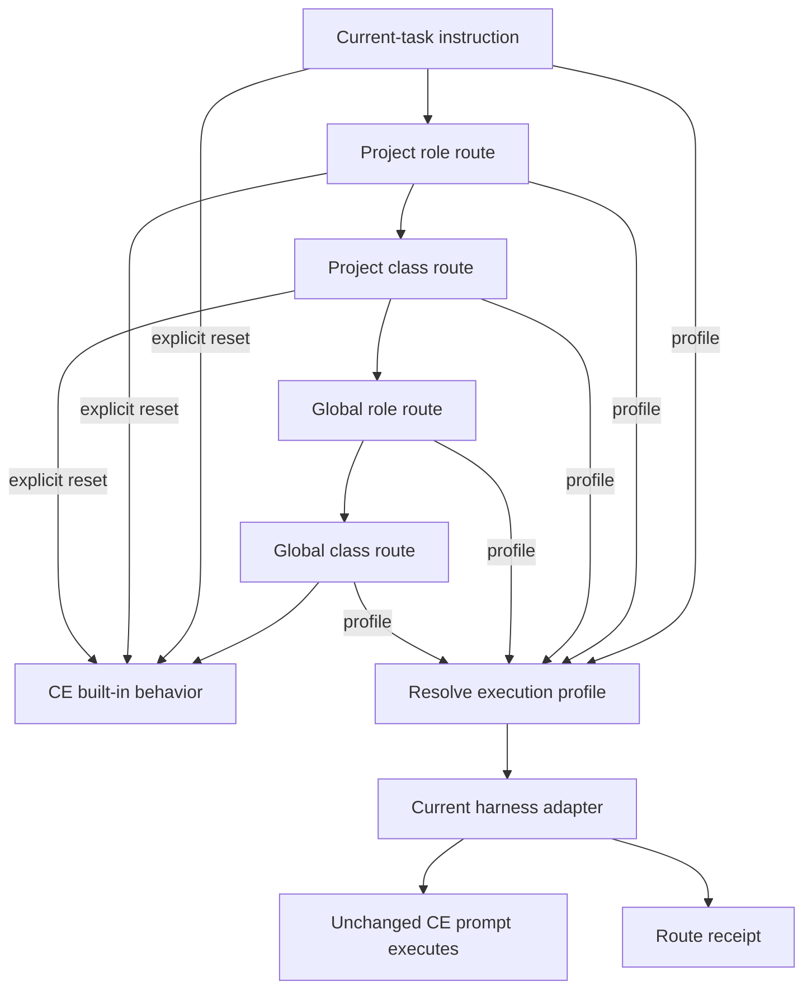
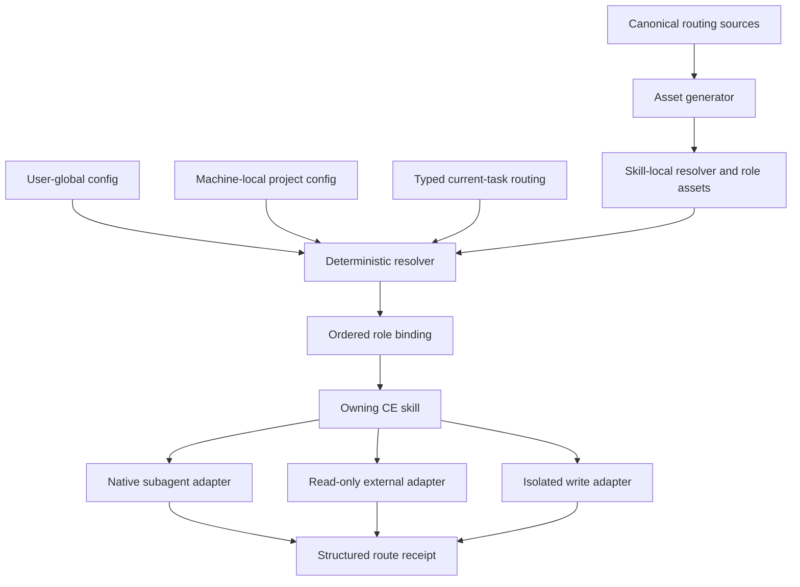
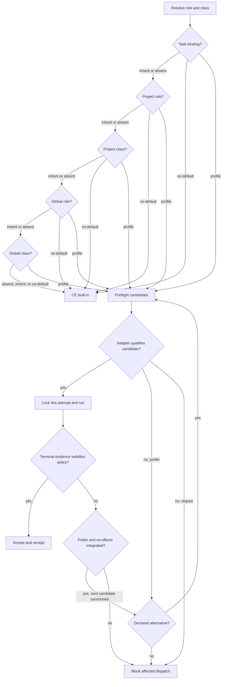
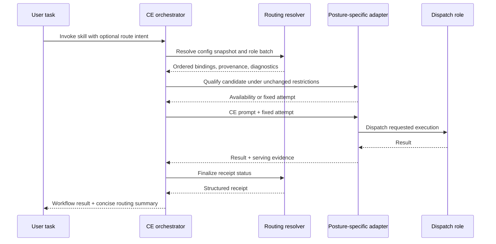

# Compound Engineering Routing and Global Settings - Plan

## Goal Capsule

- **Objective:** Add cross-harness execution routing and shared global settings while preserving Compound Engineering's ownership of prompts, personas, workflow decisions, and safety boundaries.
- **Authority:** The Product Contract governs behavior, the Planning Contract governs implementation, and repository instructions override execution mechanics. Higher-priority host permissions and egress restrictions always constrain configured routes.
- **Stop conditions:** Stop when a proposed route would broaden a role's prompt, tools, permissions, mutation posture, or recipient authority; when a Product Contract change is required; or when served identity cannot satisfy a required route.
- **Execution profile:** Characterize v3.20.0 behavior first, then land the deterministic resolver and coverage guards before migrating dispatch consumers by execution posture.
- **Tail ownership:** The `compound-engineering` repository owns product code, tests, and durable documentation. The MkChad coordination workspace records only the tested child revision after child changes are committed.
- **Open blockers:** None. Implementation targets branch `configurable-routing`, based on upstream tag `compound-engineering-v3.20.0`.

---

## Product Contract

### Summary

Provide a shared Compound Engineering configuration layer and deterministic execution routing for CE-owned personas and workflow workers.
Users configure broad route classes once, apply optional role-specific exceptions, and retain selective project and task overrides without changing CE prompts.

### Problem Frame

Compound Engineering provides strong prompts, planning, review, and hands-off plan execution, but its model and dispatch policies are distributed across owning skills.
Some work inherits the active session model while other work uses skill-specific model tiers, so a high-capability `ce-work` session cannot apply one global policy that reserves cheaper models for implementation and stronger models for review.
Its current configuration is checkout-local, which repeats the same preferences across projects and linked worktrees.

Sprint Loop demonstrated the useful separation between role instructions and configured models: Builder and CI Fixer roles could target medium models while Auditor targeted a stronger model.
The replacement should preserve that separation without carrying forward Sprint Loop's controller, persistence, or fixed three-role workflow.

### Key Decisions

- **Preserve CE content authority.** Routing controls execution only; CE continues to own prompts and decide which personas run. (session-settled: user-directed — chosen over prompt or persona-selection overrides: Compound Engineering's existing prompt quality should remain authoritative.)
- **Use CE-owned route classes with role exceptions.** CE classifies its dispatch roles into a small stable taxonomy, while users map classes to profiles and override individual roles when needed. (session-settled: user-directed — chosen over user-defined groups and capability-rule matching: users should not maintain CE's large and changing persona catalog.)
- **Share one cross-harness global configuration.** One CE-owned global layer supplies defaults to every supported harness and checkout, with host-specific routes where capabilities differ. (session-settled: user-directed — chosen over OpenCode-only and per-harness configuration: the policy should remain portable without duplicated settings.)
- **Merge narrower settings over broader defaults.** Project settings selectively override global settings, and an explicit current-task route has highest authority. (session-settled: user-directed — chosen over global-only policy and complete project replacement: most projects should need no local file while retaining exceptions.)
- **Keep routing deterministic and non-interactive.** Each route declares whether it is required, preferred with fallback, or inherited; route resolution never asks the user to continue or choose a substitute. (session-settled: user-directed — chosen over adaptive budget routing and interactive fallback: predictable usage and hands-off execution are primary goals.)
- **Allow an explicit CE-default reset.** A project or task may stop inheritance and restore the owning skill's built-in behavior without deleting a broader global route. (session-settled: user-directed — chosen over inheritance-only routing: projects need a precise escape hatch from global policy.)
- **Require verified serving identity for strict routes.** A `require` route rejects an execution whose requested model or effort cannot be verified from serving evidence. (session-settled: user-directed — chosen over accepting unverified strict execution: a strict budget or quality route must prove what ran.)

Product Contract changed: R26-R27, F6-F7, AE11-AE12, and related decision, flow, and source clarifications were added after the user confirmed explicit CE-default reset behavior and verified identity for required routes; all prior requirements and stable IDs are unchanged.

<!-- ce-section: work-relationships -->
### How This Work Fits Together

This plan owns Compound Engineering execution routing and global configuration.
The broader breakdown is the current understanding, not a committed roadmap.

- **Sprint Loop retirement**
  - **Depends on:** validating the replacement routing behavior in normal CE planning, implementation, and review workflows.
  - **Can proceed independently of:** later refinements to the route-class catalog once the initial replacement is proven.
  - **Will own:** archival or removal of Sprint Loop repositories, submodules, sprint documents, agents, commands, and user configuration.

### Actors

- A1. **Configuring user:** Defines global execution profiles and optional project or task exceptions.
- A2. **CE orchestrator:** Selects a CE-owned persona or workflow worker, supplies its prompt and constraints, and requests execution through a route.
- A3. **Dispatch role:** Performs implementation, review, reasoning, research, or verification work using CE-owned instructions.
- A4. **Host harness:** Resolves a supported model, effort, and execution route, then reports verified serving evidence or an explicit unverified status.

### Requirements

**Configuration scope and precedence**

- R1. Compound Engineering must support one user-level global configuration that is independent of any project checkout and shared across supported harnesses.
- R2. The global layer must provide defaults for all CE settings, including existing planning, brainstorming, work-engine, output, and cross-model preferences, rather than routing alone.
- R3. Project configuration must merge selectively over global configuration without replacing unspecified global settings.
- R4. Route resolution must use explicit current-task routing, project role overrides, project class routes, global role overrides, global class routes, and CE defaults in that order.
- R5. Existing narrow CE settings must remain valid and take precedence over a broader class default at the same configuration layer.
- R6. A checkout with no project CE configuration must receive the global defaults without setup or generated local files.

**Route identity and policy**

- R7. Every CE-created model dispatch must have a stable dispatch-role identifier and one CE-owned route class, whether the work uses a named persona or a generic workflow worker.
- R8. The initial taxonomy must distinguish implementation, review, planning or reasoning, research, and verification work without requiring users to enumerate every dispatch role.
- R9. CE must own route-class membership alongside its prompt assets and must classify new dispatch roles as the catalog evolves.
- R10. Users must be able to define reusable execution profiles that select a model, supported effort level, execution route, and host-specific alternative where needed.
- R11. Users must be able to map a route class to a profile and override an individual dispatch role, with the role-specific route winning over its class route within the same configuration layer.
- R12. Routing must not replace, edit, or broaden the CE-owned prompt, persona selection rule, tool posture, permissions, or mutation boundary.

**Resolution and execution behavior**

- R13. Routing must apply to work that CE dispatches or elevates and must not silently replace the model running the active top-level session.
- R14. An `inherit` route must continue to the next applicable configuration layer and ultimately preserve CE's built-in behavior when no configured route applies.
- R15. A `prefer` route must use its configured alternatives in deterministic order and may fall back only as declared by that route.
- R16. A `require` route must stop the affected dispatch with an actionable error when its requested execution cannot be served.
- R17. Route resolution, fallback, and failure must remain non-interactive in attended and headless workflows.
- R18. A malformed profile, unknown configured role, or unavailable required model must not be silently ignored before the affected model invocation.
- R19. A fallback must never broaden the dispatch role's CE-owned permissions, tools, or mutation authority.

**Transparency and compatibility**

- R20. Each routed dispatch must produce a concise receipt identifying the role, route class, selected profile, configuration source, requested execution, and served execution or unverified status.
- R21. A fallback receipt must state why the preferred route was unavailable and which declared alternative ran.
- R22. Users must be able to inspect effective global and project settings, resolved class and role routes, invalid references, and unclassified dispatches without running a full workflow.
- R23. The same logical routing policy must work across supported harnesses while allowing each harness to resolve a different concrete route from the same profile.
- R24. With no global or project routing configuration, existing CE workflows must retain their upstream behavior and must not require migration.
- R25. Configuration validation must detect any built-in dispatch role that lacks a class so new upstream personas cannot silently bypass routing policy.
- R26. A project or current task must be able to stop route inheritance and select CE's built-in dispatch behavior explicitly without changing broader configuration.
- R27. A `require` route that requests a concrete model or effort must reject missing or mismatched serving evidence rather than accept an unverified execution.

### Key Flows



- F1. **Global default resolution:** A1 configures shared profiles and class routes once; A2 opens a project with no local CE settings; the global policy routes work without creating project configuration.
- F2. **Cost-separated plan execution:** A1 invokes `ce-work` from a high-capability top-level session; A2 retains that session for orchestration and sends implementation workers through the configured implementation profile.
- F3. **Strong review with an exception:** A2 maps ordinary reviewers through the review class profile and applies a stronger role-specific profile to a configured high-stakes reviewer such as security review.
- F4. **Selective project override:** A project changes one class or role route; every unrelated route and CE setting continues to inherit from the global layer.
- F5. **Unavailable route:** A4 cannot serve the requested route; `prefer` uses its next declared alternative and reports it, while `require` stops before dispatch without prompting.
- F6. **Restore built-in behavior:** A project or task selects the explicit CE-default reset; resolution stops before lower route layers and the owning skill uses its built-in dispatch behavior.
- F7. **Strict identity check:** A4 accepts a required request but provides no matching serving evidence; A2 rejects the result and reports the required route as unsatisfied.

### Acceptance Examples

- AE1. **Covers R1-R6.** Given global CE settings and no project CE file, when any supported checkout starts a CE workflow, then the global defaults apply without local setup.
- AE2. **Covers R3-R5, R11.** Given a global review route and a project override for implementation, when both roles run, then implementation uses the project route and review retains the global route.
- AE3. **Covers R4, R20.** Given global and project routes, when the current task explicitly requests another valid profile, then that profile wins and the receipt identifies the task instruction as its source.
- AE4. **Covers R7-R13.** Given `ce-work` runs in a maximum-effort session and implementation maps to an economy profile, when implementation workers launch, then the top-level session remains unchanged and the workers use the economy route.
- AE5. **Covers R8-R12.** Given review maps to a strong profile and the security-review role maps to a stronger exception, when code review runs, then CE selects and prompts its normal reviewers while execution follows the class and role routes.
- AE6. **Covers R15, R17, R19-R21.** Given a preferred model is unavailable and a declared alternative is available, when the role dispatches, then the alternative runs without a question, preserves the role's CE-owned permissions, tools, and mutation authority, and the receipt discloses the fallback.
- AE7. **Covers R16-R18.** Given a required model is unavailable or its profile is invalid, when the role would dispatch, then no model invocation occurs and the workflow reports an actionable routing failure.
- AE8. **Covers R14, R24.** Given no routing settings at any layer, when an existing CE workflow runs, then its upstream dispatch behavior remains unchanged.
- AE9. **Covers R20, R23.** Given one shared profile has host-specific routes, when the same role runs on two supported harnesses, then each harness serves its declared route and reports the concrete result.
- AE10. **Covers R22, R25.** Given a configuration names an unknown role or a new built-in role lacks a class, when configuration health is inspected, then the issue is visible before routine workflow execution.
- AE11. **Covers R14, R26.** Given a global implementation route, when one project selects the CE-default reset, then implementation uses built-in behavior in that project while the global route remains active elsewhere.
- AE12. **Covers R16, R20, R27.** Given a required route requests a concrete model or effort, when the harness returns no matching serving evidence, then CE rejects the execution and the receipt reports unverified or mismatched identity.

### Success Criteria

- A user can configure implementation on a lower-cost model and review on a stronger model once, then observe that split in a project with no local CE settings.
- A high-effort top-level session can complete a structured plan through weaker implementation workers without silently spending the top-level model on those workers.
- Required routes never substitute or accept an unverified model, and preferred routes never use an undeclared fallback.
- Existing CE users with no global or project routing configuration retain upstream behavior; configured legacy `work_engine_mode: require` users receive the documented non-interactive blocker and migration diagnostic.
- Every routed dispatch can be traced to the requested and served execution or an explicit unverified receipt.

### Scope Boundaries

- This work does not replace, edit, extend, or select CE persona prompts.
- This work does not meter tokens, estimate cost, enforce quotas, or change routes dynamically in response to usage.
- This work does not silently change the active top-level session model.
- This work does not guarantee that every harness can serve every model, effort level, or execution route; route policy governs capability gaps.
- This work does not recreate Sprint Loop's workflow controller, persistent state machine, Git ownership, CI loop, or fixed Builder/Auditor/CI Fixer lifecycle.
- This work does not retire Sprint Loop repositories, submodules, sprint artifacts, commands, or user configuration.
- This work does not require users to classify every current or future CE persona themselves.

### Dependencies And Assumptions

- The fork retains CE's skill-local prompt assets and generic subagent strategy while adding stable routing metadata at dispatch boundaries.
- Supported harnesses can either accept a concrete model or route override or report that the requested route is unavailable.
- Some preferred routes may permit missing serving evidence when clearly marked unverified; required routes do not.
- Upstream CE may add or rename dispatch roles, so route coverage and compatibility checks remain part of fork maintenance.
- Native skill execution assumes the repository's current Unix-like shell and Python 3 baseline; native Windows skill runtime remains outside current repository support.

### Sources And Research

- `docs/skills/configuration.md` documents checkout-local settings and current model or execution preferences.
- `skills/ce-code-review/references/dispatch-reviewers.md` shows current skill-owned model-tier choices for reviewer personas.
- `skills/ce-work/references/execution-engines.md` defines current task, session, caller, project, and native execution-routing inputs.
- `skills/ce-plan/references/reasoning-elevation.md` defines current read-only model elevation and its requested-versus-served receipt behavior.
- `skills/ce-optimize/SKILL.md` and `skills/ce-optimize/references/optimize-spec-schema.yaml` define isolated experiment, judge, measurement, checkpoint, and backend policy that generalized routing must not collapse into ordinary implementation dispatch.
- `tests/real-plugin-conversion.test.ts` and `src/utils/files.ts` show that implemented target writers already copy complete skill directories recursively, so distribution work should prove generated sidecars survive conversion before changing writer code.
- `docs/plans/2026-03-25-002-refactor-config-storage-redesign-plan.md` and `docs/brainstorms/2026-03-25-config-storage-redesign-requirements.md` provide prior, partly superseded global/config-path analysis.
- [Sprint Loop V1 specification](https://github.com/krafczyk/opencode_sprint_loop/blob/main/docs/v1_final_software_specification.md) provides the historical role/model separation being retained without its controller.

---

## Planning Contract

### Key Technical Decisions

- KTD1. **Use one user-global path and the existing machine-local project path.** Resolve global configuration from `$COMPOUND_ENGINEERING_HOME/config.yaml` when the directory override is set, otherwise `${XDG_CONFIG_HOME:-$HOME/.config}/compound-engineering/config.yaml`; retain `.compound-engineering/config.local.yaml` as the project layer. Canonicalize and bound each read, reject symlinks, path escapes, non-regular files, unsafe ownership or write access, and any logically or physically tracked project source, then parse one stable byte snapshot. (session-settled: user-directed — chosen over OpenCode-only and per-harness global files: one CE-owned policy must work across checkouts and hosts.)
- KTD2. **Define a strict settings registry and merge algebra.** A canonical registry declares every existing key's type, default, merge behavior, writer, and whether it carries standing authority. Missing values inherit; scalars and lists replace; mappings merge by named key; profile definitions replace atomically; explicit null masks a broader non-routing setting; duplicate keys, YAML aliases, tags, unknown route fields, and unsafe model tokens are invalid. Approval-bearing values become authority only from a trusted user-owned source at that scope, and narrower layers may revoke but never manufacture broader approval.
- KTD3. **Use a dependency-free resolver with generated skill-local copies.** Keep the canonical Python resolver, settings registry, role catalog, routing protocol, and generator under `scripts/routing/`; generate committed runtime copies into every catalog-declared consuming skill and enforce byte parity. Resolver execution is a narrowly authorized local control-plane read at the owning skill boundary, not a worker permission, root-only helper, or converter-only runtime.
- KTD4. **Give every active dispatch a stable skill-qualified role.** Use lowercase ASCII `<owning-skill>.<logical-role>` identifiers, store dynamic instance metadata separately, assign exactly one of `implementation`, `review`, `reasoning`, `research`, or `verification`, and derive coverage from real callsites rather than prompt filenames. (session-settled: user-directed — chosen over user-defined groups and capability-rule matching: CE must own its changing role catalog.)
- KTD5. **Separate profiles from route bindings and lock each attempt.** Profiles contain ordered, data-only execution candidates; class and role bindings are either `inherit`, `ce-default`, or a profile plus `prefer`/`require`. The resolver returns ordered candidates, the posture adapter qualifies and locks one candidate before egress, and a preferred route may advance only after the attempt is terminal, has no integrated side effects, and the next declared candidate is newly sanctioned. A required mutation-capable route needs trusted pre-dispatch identity or an isolated transaction whose output remains unintegrated until serving evidence matches. (session-settled: user-directed — chosen over adaptive routing, implicit native fallback, and unverified strict execution: routing must be predictable and auditable.)
- KTD6. **Translate shipped narrow settings through one compatibility table.** `plan_model`, `brainstorm_model`, `cross_model_peer`, `work_engine_mode` plus `work_engine_preferences`, optimization task settings, and existing typed carriers retain their current scope. Legacy preferred routes synthesize their shipped built-in fallback explicitly; legacy required CE Work routes adopt the new non-interactive blocker behavior.
- KTD7. **Resolve centrally and execute in the owning skill.** The resolver owns path lookup, parsing, merge, validation, precedence, ordered candidate output, provenance, and receipt fields; the posture adapter owns capability qualification and execution. The resolver never selects personas, constructs prompts, invokes model tools, or launches model processes. (session-settled: user-directed — chosen over configurable prompts and persona selection: CE remains the content and workflow authority.)
- KTD8. **Preserve posture-specific adapters.** Native generic subagents, read-only elevation, read-only external review/POV, CE Work implementation, and isolated optimization experiments remain separate execution families. A route is unavailable when its adapter cannot preserve the existing tool, permission, egress, workspace, measurement, checkpoint, and recovery contract.
- KTD9. **Freeze an effective routing snapshot per top-level run.** Normalize live task intent, still-active session intent, provenance-bearing caller data, and applicable project instructions into one highest-authority task binding before applying the Product Contract's project/global/default order. A versioned routing context carries snapshot identity, ordered candidates, reset intent, source authority, and recovery reuse through nested handoffs without entering feature prose, persona prompts, settled decisions, or plan content.
- KTD10. **Extend host-owned receipts instead of replacing them.** Preserve current requested/served model, route, fallback, and independence fields while adding role, class, profile, source layer, policy, effort, ordered attempts, and terminal status. Emit one redacted record per dispatch; persist it only where the owning workflow already has durable state, otherwise retain it only long enough to produce the grouped user-facing summary.
- KTD11. **Treat configuration as narrowing data under one egress envelope.** Route profiles propose recipients; a separate authorization gate approves every target and intermediary, the exact material/read scope, and a credential-minimized environment before egress. Trusted user-global or machine-local project provenance may supply standing recipient approval where an existing adapter permits it, while tracked or untrusted project data cannot. System, user, project-instruction, permission, mutation, concurrency, and independence gates remain higher authority; fallback may only preserve or narrow them.
- KTD12. **Keep global writes explicit and project writers local.** `ce-setup` alone creates or edits global defaults after explicit global-scope intent. Product Pulse, Sweep, Promote, and other existing setup writers continue changing only the project-local file and never materialize inherited global values locally.
- KTD13. **Make the populated role catalog the generation and coverage authority.** Inventory current callsites before generating assets. CI rejects an active dispatch without a registered role and class, an orphan catalog entry, an unknown configured role, a stale generated copy, or a converted install missing runtime routing assets.
- KTD14. **Migrate in dependency order.** Characterize v3.20.0 and populate the role catalog first; land schema, resolver, and coverage; migrate non-routing settings readers; integrate native dispatch; adapt specialized read-only routes; migrate CE Work and optimization adapters; then run cross-harness behavior checks and documentation validation.

### High-Level Technical Design







The configuration grammar below is directional contract guidance; implementation may adjust field spelling without changing the semantics pinned by KTD2 and KTD5.

```yaml
routing:
  profiles:
    economy:
      candidates:
        - harness: opencode
          model: provider/economy-model
          effort: low
        - harness: claude
          model: economy-alias
  classes:
    implementation:
      profile: economy
      policy: prefer
    review:
      profile: strong
      policy: require
  roles:
    ce-code-review.security-reviewer:
      profile: strongest
      policy: require
```

Bindings may also be `inherit` or `ce-default` instead of a profile object.
An explicit `ce-default` candidate may terminate a preferred candidate list; no undeclared native fallback exists.

| Contract | Required fields | Owner |
|---|---|---|
| Routing snapshot | Protocol version, opaque snapshot ID, stable source revisions, normalized task binding with provenance, resolved role/class bindings, and parent snapshot ID when nested | Resolver |
| Candidate | Profile, policy, harness, model, effort, route, source layer, source authority, and deterministic ordinal | Resolver |
| Attempt lock | Snapshot ID, role, candidate ordinal, adapter family, authorized recipient/intermediary, material scope, mutation posture, and attempt state | Owning adapter |
| Adapter report | Typed preflight status or terminal serving evidence, independence evidence where applicable, integration status, and retry-safety status | Owning adapter |
| Receipt | Role, class, profile, source layer, policy, effort, requested and served execution, ordered attempts, identity status, source/provenance summary, fallback reason, terminal status, and redacted diagnostics | Resolver from adapter report |

Task/session/caller carriers may reference this envelope but may not redefine it in free-form feature prose. Unknown protocol versions, stale source revisions, conflicting equal-authority task bindings, and a nested context that does not match its parent snapshot fail before dispatch.

| Adapter family | Existing examples | Route eligibility | Invariant |
|---|---|---|---|
| Native generic subagent | Planning scouts, local reviewers, implementation workers | Host exposes a callable subagent primitive and any requested selector | Keep CE prompt, selection, permission mode, and concurrency behavior unchanged |
| Read-only elevation | Plan and brainstorm reasoning elevation | Native override or qualified read-only CLI route | No write or shell authority; mismatch is not accepted as requested identity |
| Read-only external peer | Code review, document review, POV | Existing egress and independence gates pass | Keep no-prompt/read-only flags and separate independence from model identity |
| Write-capable isolated implementation | CE Work cross-model execution | Existing controller, workspace, and recipient authorization pass | Host retains integration, verification, commits, and shipping tail |
| Isolated optimization experiment | CE Optimize worktree and Codex experiment backends | Measurement, checkpoint, task-spec security, and workspace contracts remain enforceable | General routing may narrow but never override experiment backend security or judge separation |

### Implementation Constraints

- The runtime resolver must use only dependencies already guaranteed by native skill execution; do not require Bun, `node_modules`, or `js-yaml` in installed skills.
- The strict YAML subset must reject duplicate keys, aliases, tags, executable values, unsafe tokens, and ambiguous structures rather than guess.
- Config discovery must reject unsafe symlinks, path escapes, non-regular files, untrusted ownership/write access, tracked project sources, oversized input, and file replacement during a read.
- Every skill remains self-contained. Runtime prose and scripts may reference only files inside that skill directory.
- Generated runtime assets are committed, reproducible, and validated against canonical sources; contributors edit canonical sources rather than copies.
- Restrictive skills may authorize only the co-located resolver command needed for deterministic local control-plane reads; worker tools and mutation authority remain unchanged.
- Prompt assets remain frontmatter-free and byte-stable unless a separate product change requires content edits.
- Do not add standalone CE agents, typed `subagent_type` dispatch, or provider-specific role IDs.
- Do not infer permissions or mutation posture from route class. The owning callsite and adapter remain authoritative.
- A route candidate locks before egress. Started work cannot switch provider, model, intermediary, tools, or mutation authority internally.
- A preferred route may try another declared candidate only after the prior attempt is terminal and no side effect has been integrated; required mutation-capable work without pre-dispatch identity proof must remain isolated until receipt validation.
- Existing model-independence and recipient allowlist checks remain separate from requested-versus-served identity.
- External adapters must authorize target, intermediary, material scope, and a credential-minimized environment independently of profile selection, then redact sensitive values from receipts and diagnostics.
- Active project config remains gitignored and machine-local. Durable team guidance stays in normal project instructions.
- Global config writes must use no-overwrite/atomic-replacement behavior and preserve unrelated recognized settings.
- Global and project config writers must compare the stable source revision they read before replacement; a changed revision is a conflict, not permission to overwrite newer data.
- Do not hand-bump release-owned versions or write release notes for this feature.

### Sequencing

1. Characterize current no-config behavior, every shipped narrow setting, every config consumer, and every active dispatch callsite.
2. Freeze global path, strict schema, merge/reset semantics, populated role catalog, receipt schema, routing-context envelope, and compatibility mappings.
3. Implement the pure resolver and generated skill-local asset pipeline.
4. Annotate and classify every inventoried dispatch, then make coverage enforcement release-blocking.
5. Move non-routing config readers and setup diagnostics to the effective merged view.
6. Integrate normalized bindings into native generic subagent callsites without changing prompts or selection.
7. Adapt reasoning elevation and read-only peer routes while preserving their specialized egress and receipt contracts.
8. Adapt CE Work write-capable routes, replacing interactive required-route weakening with actionable blockers while preserving transaction and recovery contracts.
9. Adapt CE Optimize experiment and judge routes without weakening task-spec, isolation, measurement, checkpoint, or backend-security contracts.
10. Verify native and converted installs, run targeted fresh-context behavior evaluations, and finish user documentation.

### System-Wide Impact

- **Skill runtime:** Every model-dispatching skill gains a stable role boundary and an effective-routing read before dispatch.
- **Configuration:** Existing keys remain valid, but every consumer reads a merged global/project view and can report value provenance.
- **Security:** Route data can select an external recipient only through existing sanctioned adapters and cannot broaden prompt or tool authority.
- **Authority-bearing settings:** Global values such as feedback-source approval remain effective only with trusted same-scope provenance; narrower layers may revoke them.
- **Distribution:** Generated routing assets must survive native plugin installs and every converted/copy-based target without a root-relative runtime dependency.
- **User experience:** Normal successes are summarized by profile, while fallbacks, mismatches, unverified identity, and failures remain individually visible.
- **Fork maintenance:** Upstream dispatch additions fail coverage until assigned a stable role and class, making routing review part of every upstream sync.

### Risks And Dependencies

- **Parser and path drift:** A hand-built YAML subset or unsafe path lookup can diverge from documented examples or read attacker-controlled bytes. One canonical resolver, bounded stable-file reads, fixture corpus, and generated parity checks contain that risk.
- **Incomplete callsite inventory:** Inline or dynamic workers can bypass routing if coverage relies on prompt-file discovery. Coverage must scan real dispatch contracts and reject orphan catalog entries.
- **Authority regression:** A universal launcher could accidentally grant review workers implementation tools. Posture-specific adapters and permission-invariance tests prevent this.
- **Egress and secret exposure:** A valid profile could still propose an unauthorized intermediary or expose ambient credentials. Independent recipient/scope authorization and credential-minimized environments prevent profile data from becoming egress authority.
- **Receipt gaps:** Native hosts may accept a selector without proving served identity. Preferred routes may disclose unverified execution; required routes must block.
- **Prompt bloat:** Repeating routing policy in every `SKILL.md` would consume context and drift. Keep only load stubs at dispatch boundaries and move mechanics into generated local references/scripts.
- **Global-setting surprise:** Product, feedback, and path settings can affect unrelated projects when set globally. Documentation and effective-source inspection must make that scope visible before writes.
- **Compatibility:** Existing `work_engine_mode: require` changes from interactive weakening to non-interactive failure by design; migration diagnostics must name the behavior change.
- **Unsafe retry:** A provider failure after work has started can duplicate writes or expose material to a second recipient. Attempt locks, terminal-state evidence, integration-state checks, and fresh authorization for each alternative prevent fallback from becoming mid-flight rerouting.
- **Optimization contamination:** Treating experiments or judges as ordinary workers can mutate the baseline, leak immutable inputs, change the measurement backend, or let the candidate judge itself. A dedicated optimization adapter keeps worktree, judge-separation, checkpoint, and measurement contracts authoritative.
- **Cross-harness claims:** Static tests cannot prove every host's live model selector or receipt behavior. Keep deterministic default tests credential-free and make live adapter checks explicit opt-in evidence.

### Sources And Research

- `AGENTS.md` defines self-contained skills, generated-copy parity precedent, and mandatory cross-model skill evaluation rules.
- `CONCEPTS.md` defines Skill, Agent, Specialist prompt asset, Model tier, and Model identity receipt.
- `docs/solutions/skill-design/portable-agent-skill-authoring.md` requires the smallest portable protocol, deterministic mechanical checks, and targeted fresh-context evaluations.
- `docs/solutions/skill-design/script-first-skill-architecture.md` supports executable machinery for deterministic protocol instead of repeated model interpretation.
- `docs/solutions/integrations/native-plugin-install-strategy.md` explains why converter-only runtime behavior misses native skill installs.
- `docs/solutions/skill-design/requested-vs-verified-model-identity.md` distinguishes requested identity from serving evidence.
- `docs/solutions/integrations/colon-namespaced-names-break-windows-paths.md` supports dot-qualified ASCII role identifiers rather than colon namespaces.
- `tests/reasoning-elevation-parity.test.ts`, `tests/cross-model-receipt-parity.test.ts`, and `tests/peer-job-runner-parity.test.ts` provide generated or byte-identical asset patterns.

---

## Implementation Units

### U1. Configuration and routing contracts

- **Goal:** Freeze the public paths, strict settings grammar, merge/reset behavior, populated role inventory, compatibility map, routing-context envelope, and receipt contract before runtime migration.
- **Requirements:** R1-R27; F1-F7; AE1-AE12; KTD1-KTD2, KTD4-KTD6, KTD9-KTD11, KTD13.
- **Dependencies:** None.
- **Files:** `scripts/routing/settings-schema.json` (new), `scripts/routing/dispatch-roles.json` (new), `scripts/routing/protocol-schema.json` (new), `tests/routing-config-contract.test.ts` (new), `tests/fixtures/routing/config/` (new), `docs/skills/configuration.md`, `skills/ce-setup/references/config-template.yaml`, `.compound-engineering/config.local.example.yaml`, `CONCEPTS.md`.
- **Approach:** Inventory every active dispatch and config consumer, then add characterization fixtures for every current key and narrow routing surface. Define the global path chain, secure read boundary, field and authority types, atomic profile semantics, scalar/list/map merge rules, null masking, `inherit`, `ce-default`, per-attempt fallback, strict identity, versioned routing context, and old-key normalization. Keep the template and example byte-identical.
- **Patterns:** Follow `skills/ce-setup/scripts/check-health` for current validation vocabulary, `docs/plans/2026-03-25-002-refactor-config-storage-redesign-plan.md` for prior path analysis, and `docs/solutions/skill-design/requested-vs-verified-model-identity.md` for identity status.
- **Test scenarios:** Cover absent global and project files; `COMPOUND_ENGINEERING_HOME`, XDG, and home fallback paths; no-repository invocation; sparse project-over-global merge; project role over project class; project class over global role; explicit null for a non-routing setting; `inherit`; `ce-default`; atomic profile replacement; list replacement; shipped flow-style `feedback_sources`; approval provenance and narrower denial; duplicate keys; YAML aliases/tags; config and parent-directory symlinks; path escape; non-regular and oversized files; unsafe ownership or mode; tracked logical or resolved project paths; replacement during read; unknown fields, profiles, roles, classes, harnesses, and unsafe model or effort tokens; conflicting live/session/caller sources; nested routing-context forwarding; snapshot recovery; every existing key's documented default; and legacy setting normalization.
- **Verification:** Contract tests pin one unambiguous settings and protocol grammar and prove the two distributed config examples remain identical and complete.

### U2. Deterministic resolver and generated runtime assets

- **Goal:** Implement one pure config/routing engine and reproduce it inside every independently invocable consumer without introducing a root runtime dependency.
- **Requirements:** R1-R6, R10-R18, R20-R24, R26-R27; F1, F4-F7; AE1-AE3, AE6-AE9, AE11-AE12; KTD2-KTD3, KTD5, KTD9-KTD10.
- **Dependencies:** U1.
- **Files:** `scripts/routing/config-resolver.py` (new), `scripts/routing/sync-assets.ts` (new), `package.json`, generated `skills/*/scripts/ce-routing.py` (new), generated `skills/*/references/ce-routing-schema.json` (new), generated `skills/*/references/ce-routing-protocol.json` (new), generated `skills/*/references/execution-routing.md` (new), `tests/routing-resolver.test.ts` (new), `tests/routing-assets-parity.test.ts` (new), `tests/fixtures/routing/resolver/` (new).
- **Approach:** Build a dependency-free Python entry point that reads bounded stable file snapshots, parses the strict subset, resolves and freezes effective settings, validates profile references, and returns ordered role candidates plus provenance. The owning adapter reports typed availability and serving evidence back for receipt finalization or the next sanctioned attempt. Generate only into catalog-declared consumer skills; use the TypeScript synchronizer in write and check modes so CI can reject stale copies.
- **Patterns:** Follow `tests/reasoning-elevation-parity.test.ts` and `tests/cross-model-receipt-parity.test.ts` for independently installed copies, and derive local data paths from the runtime script's own directory.
- **Test scenarios:** Cover each U1 fixture through the executable; deterministic output ordering; field-level and authority provenance; stable snapshot revision; batch resolution against one snapshot; current-task carrier precedence; malformed input on stdout/stderr boundaries; explicit reset; preflight unavailability; terminal unintegrated retry; integrated or in-flight attempt refusing recipient change; required missing/mismatched/unverified evidence; resolver invocation from a copied restrictive skill without a prompt; stale generated copies; and paths containing spaces.
- **Verification:** Focused tests prove the canonical source and every generated runtime copy return byte-equivalent decisions without Bun or third-party Python packages.

### U3. Dispatch-role catalog and coverage enforcement

- **Goal:** Materialize the U1 role inventory at every active callsite and make omissions, stale generated assets, and dead catalog entries fail CI.
- **Requirements:** R7-R9, R11-R13, R22, R25; F2-F3; AE4-AE5, AE10; KTD4, KTD7, KTD13.
- **Dependencies:** U1-U2.
- **Files:** `scripts/routing/dispatch-roles.json`, generated `skills/*/references/dispatch-roles.json` (new), active dispatch callsites under `skills/*/SKILL.md` and `skills/*/references/`, `tests/routing-role-coverage.test.ts` (new), `tests/skill-agent-ce-prefix.test.ts`, `tests/skill-conventions.test.ts`, `tests/path-sanitization.test.ts`.
- **Approach:** Annotate the inventoried native, inline, external, and dynamic callsites with their dot-qualified role ID, one class, built-in model tier, execution posture, and owning prompt asset when applicable. Keep review persona instances and implementation unit IDs as instance metadata rather than distinct catalog roles. Exclude sibling skill calls and non-model data-source fan-out.
- **Patterns:** Follow `skills/ce-code-review/references/persona-catalog.md` for explicit selection metadata and `docs/solutions/skill-design/beta-promotion-orchestration-contract.md` for atomic caller updates.
- **Test scenarios:** Cover duplicate and normalization-colliding IDs; colon or provider-qualified IDs; a dispatch without a role; a role without exactly one class; an orphan entry; an inactive prompt asset; inline workers with no prompt file; dynamic reviewer instances sharing one logical role; peer-only compatibility roles; sibling skill invocations excluded from the catalog; and an upstream-added callsite that has not been classified.
- **Verification:** The coverage test maps every active model dispatch to exactly one registered role and class and fails on both bypasses and dead catalog entries.

### U4. Global setup, effective inspection, and non-routing settings

- **Goal:** Make setup, inspection, output preferences, and other non-routing settings honor the merged global/project view while preserving explicit project-local writer ownership.
- **Requirements:** R1-R6, R18, R22-R24; F1, F4; AE1-AE3, AE8, AE10; KTD1-KTD3, KTD6, KTD12.
- **Dependencies:** U1-U3.
- **Files:** `skills/ce-setup/SKILL.md`, `skills/ce-setup/scripts/check-health`, `skills/ce-setup/references/config-template.yaml`, `.compound-engineering/config.local.example.yaml`, `skills/ce-plan/SKILL.md`, `skills/ce-brainstorm/SKILL.md`, `skills/ce-ideate/SKILL.md`, `skills/ce-commit-push-pr/SKILL.md`, `skills/ce-product-pulse/SKILL.md`, `skills/ce-sweep/SKILL.md`, `skills/ce-promote/references/spiral-cli.md`, `docs/skills/configuration.md`, `tests/skills/ce-setup-check-health.test.ts`, `tests/skills/ce-plan-output-mode.test.ts`, `tests/skills/ce-brainstorm-output-mode.test.ts`, `tests/skills/ce-ideate-output-mode.test.ts`.
- **Approach:** Replace model-read and AWK-owned non-routing config interpretation with resolver output at each independent entry. Extend `ce-setup` to create, validate, and inspect global config only after explicit global intent; show effective values, authority provenance, source revisions, and route coverage. Keep Product Pulse, Sweep, Promote, and other feature interviews writing only project-local keys and never copy inherited values into a checkout. Routing keys migrate later at their owning adapter seams.
- **Patterns:** Preserve the current health report's diagnostic categories and the feature-specific writers' unrelated-key preservation contract.
- **Test scenarios:** Cover global-only settings in a project with no local file; project override of one key while unrelated global values survive; clearing a global scalar; invalid global versus invalid project diagnostics; global setup outside a repository; local writers with inherited global settings; concurrent or interrupted global write using source revision; project config not gitignored; tracked project data unable to authorize external writes; global feedback approval with trusted provenance; project denial overriding global approval; retired keys; all non-routing settings; and health output for effective source, profile, role, class, authority, unclassified role, and host-specific route.
- **Verification:** Existing output/config suites and setup health tests prove non-routing settings resolve globally without creating local files, approval-bearing values fail closed without trusted provenance, and all writers mutate only their authorized layer.

### U5. Routing context and native subagent integration

- **Goal:** Route native generic subagents across implementation, review, reasoning, research, and verification classes without changing CE selection or prompt behavior.
- **Requirements:** R7-R27; F2-F7; AE3-AE12; KTD3-KTD5, KTD7, KTD9-KTD13.
- **Dependencies:** U2-U4.
- **Files:** `skills/lfg/SKILL.md`, generated `skills/*/references/execution-routing.md` (new), native-dispatch sections in `skills/ce-plan/SKILL.md`, `skills/ce-brainstorm/SKILL.md`, `skills/ce-ideate/SKILL.md`, `skills/ce-code-review/SKILL.md`, `skills/ce-code-review/references/dispatch-reviewers.md`, `skills/ce-doc-review/SKILL.md`, `skills/ce-pov/SKILL.md`, `skills/ce-simplify-code/SKILL.md`, `skills/ce-debug/SKILL.md`, `skills/ce-sweep/SKILL.md`, `skills/ce-explain/SKILL.md`, `skills/ce-compound/SKILL.md`, `skills/ce-compound-refresh/SKILL.md`, `skills/ce-resolve-pr-feedback/SKILL.md`, `tests/skills/ce-routing-native-dispatch.test.ts` (new), `tests/skill-agent-ce-prefix.test.ts`, `tests/skills/ce-work-outcome-spine.test.ts`.
- **Approach:** Add a minimal load stub and narrowly authorized co-located resolver call at each dispatch boundary, resolve all selected roles as a batch from one snapshot, and pass only supported model/effort/route arguments to the existing host primitive. Carry normalized task, session, caller, and project-instruction intent through the versioned context envelope without leaking carriers into product text. If a host lacks a selector, apply policy rather than rewriting the prompt or choosing a typed agent.
- **Patterns:** Preserve bounded foreground fan-out, asynchronous full-roster collection, backpressure handling, and omission of permission mode from current native dispatch contracts.
- **Test scenarios:** Capture dispatch arguments with and without routing; prove persona roster and prompt bytes are identical; economy implementation under a high-capability parent; strong review plus security role override; reasoning/research/verification class separation; same logical profile on OpenCode, Claude, Codex, and Cursor fakes; a host with no model selector; current-task context propagation through LFG; conflicting task/session/caller sources; same snapshot reused on recovery; incidental model text ignored; no carrier leakage; restrictive headless skill resolver startup without a prompt; grouped high-fan-out receipts; mandatory versus additive role failure; and selector changes that leave the owning native dispatch's tools, permission mode, mutation posture, and concurrency unchanged.
- **Verification:** Fake-host tests show only execution selectors and receipts change, while prompts, selection, tools, permissions, concurrency, and top-level orchestration remain identical to v3.20.0.

### U6. Specialized read-only elevation and peer routes

- **Goal:** Apply generalized routing to read-only reasoning and cross-model review paths while retaining egress, identity, and independence guarantees.
- **Requirements:** R10-R21, R23-R24, R26-R27; F3, F5-F7; AE5-AE9, AE11-AE12; KTD5-KTD11.
- **Dependencies:** U5.
- **Files:** `skills/ce-plan/references/reasoning-elevation.md`, `skills/ce-brainstorm/references/reasoning-elevation.md`, `skills/ce-plan/scripts/elevation-dispatch.sh`, `skills/ce-brainstorm/scripts/elevation-dispatch.sh`, `skills/ce-code-review/references/cross-model-review.md`, `skills/ce-doc-review/references/cross-model-review.md`, `skills/ce-pov/SKILL.md`, `skills/ce-pov/references/cross-model-panel.md`, `skills/ce-code-review/scripts/cross-model-adversarial-review.sh`, `skills/ce-doc-review/scripts/cross-model-doc-review.sh`, `skills/ce-pov/scripts/cross-model-pov.sh`, `tests/reasoning-elevation-parity.test.ts`, `tests/cross-model-receipt-parity.test.ts`, `tests/skills/elevation-dispatch.test.ts`, `tests/skills/ce-code-review-cross-model-routes.test.ts`, `tests/skills/ce-doc-review-cross-model-routes.test.ts`, `tests/skills/ce-pov-cross-model-routes.test.ts`.
- **Approach:** Migrate `plan_model`, `brainstorm_model`, and `cross_model_peer` to the merged settings view at their owning seams, then resolve generalized role/class bindings before existing route qualification. Retain each script's least-privilege flags and receipt parsing, keep cross-model independence separate from serving identity, and advance a preferred route only after a terminal unintegrated attempt and fresh recipient sanction.
- **Patterns:** Extend current model-identity receipt kernels and detached runner contracts rather than replacing them.
- **Test scenarios:** Cover native override, authenticated read-only CLI, inline CE-default, declared preferred alternatives, preflight rejection before material leaves the host, a terminal unintegrated failure followed by a newly authorized alternative, refusal to switch an in-flight recipient, strict route with no receipt, mismatched family, model alias normalization, effort evidence, read-only flag preservation, target/intermediary/material-scope denial, credential-minimized environment, peer route that must not activate an unselected persona, independence false despite a verified different model, discarded output from a failed preferred attempt, stalled and failed detached jobs, and unchanged legacy behavior when generalized routing is absent.
- **Verification:** Existing parity and route suites plus new strict-identity cases prove no read-only route gains write/shell authority and no unverified result is labeled as satisfying `require`.

### U7. Write-capable CE Work routing and non-interactive failure

- **Goal:** Route implementation workers and external authors through the generalized policy while preserving workspace transactions, host-owned integration, and shipping-tail ownership.
- **Requirements:** R7-R21, R23-R24, R26-R27; F2, F5-F7; AE4, AE6-AE9, AE11-AE12; KTD5-KTD11, KTD14.
- **Dependencies:** U5-U6.
- **Files:** `skills/ce-work/SKILL.md`, `skills/ce-work/references/execution-engines.md`, `skills/ce-work/references/cross-model-execution.md`, `skills/ce-work/scripts/cross-model-work.sh`, `skills/ce-work/scripts/unit-workspace.py`, `skills/ce-work/scripts/unit_workspace_lifecycle.py`, `skills/ce-work/scripts/unit_workspace_state.py`, `skills/ce-work/scripts/unit_workspace_transaction.py`, `docs/skills/ce-work.md`, `tests/skills/ce-work-outcome-spine.test.ts`, `tests/skills/ce-work-cross-model-routes.test.ts`, `tests/skills/ce-work-unit-workspace.test.ts`.
- **Approach:** Normalize existing live intent, caller bindings, project/global routes, and built-in execution into one fixed implementation-role binding before any write. Persist the routing snapshot and attempt lock with unit recovery state. Preserve unit packets, worktree isolation, transaction state, same-recipient recovery, recipient/material authorization, credential-minimized egress, and return-to-caller boundaries. Remove or bypass `CHOICE_REQUIRED` and native-confirmation paths for required routes; an unavailable or unverifiable required route returns an actionable blocker without prompting or integrating partial output.
- **Patterns:** Keep the current host as canonical integrator and reuse the existing controller's requested/actual route receipts and durable recovery state.
- **Test scenarios:** Cover native subagent economy route under a maximum-effort host; cross-model implementation; project and role overrides; CE-default reset; same-host/default collapse; ordered preferred candidates; no undeclared fallback; preflight unavailable candidate; terminal failed attempt before integration; no retry after commit, cherry-pick, or other integrated effect; required unavailable, mismatched, and unverified routes; prompt-free attended and headless failure; interruption before and after dispatch; recovery with the original snapshot and frozen recipient; stale config during recovery; target/intermediary/material-scope denial; ambient credential stripping; worker receipt forgery; permission and workspace invariance; mutation-capable `require` leaving the canonical tree unchanged when trusted pre-dispatch identity is absent or terminal evidence mismatches; partial worker output quarantined from integration; and unchanged no-routing shipping tail.
- **Verification:** CE Work suites prove implementation can use weaker workers without changing the active orchestrator, and no route can bypass isolation, verification, commit, or caller-owned shipping boundaries.

### U8. Distribution, documentation, and cross-harness evaluation

- **Goal:** Ship routing assets and user guidance consistently across native and converted installs, then validate the highest-risk behavior in fresh contexts.
- **Requirements:** R1-R27; F1-F7; AE1-AE12; KTD1-KTD14.
- **Dependencies:** U1-U7, U9.
- **Files:** `AGENTS.md`, `README.md`, `CONCEPTS.md`, `docs/skills/configuration.md`, affected pages under `docs/skills/`, `tests/real-plugin-conversion.test.ts`, `tests/opencode-writer.test.ts`, `tests/codex-writer.test.ts`, `tests/pi-writer.test.ts`, `tests/antigravity-writer.test.ts`, `tests/release-metadata.test.ts`, `tests/fixtures/routing/behavioral/` (new); only if a failing copy proof exposes a target gap, `src/utils/files.ts` or the owning file under `src/targets/`.
- **Approach:** First extend real-plugin conversion tests to assert byte-identical generated routing scripts and references inside representative skill directories for every implemented target. Rely on the existing recursive `copySkillDir` path when that proof passes; change a writer only for a demonstrated target-specific copy gap. Document global setup, precedence, profiles, reset, compatibility behavior, receipts, trust boundaries, and host capability differences. Build a small fresh-context evaluation pack for economy implementation, strong review, isolated optimization, strict unavailable identity, no-selector degradation, and prompt/permission invariance.
- **Patterns:** Follow `docs/solutions/skill-design/portable-agent-skill-authoring.md`; keep deterministic checks in `bun test` and run reasoning evaluations through `skill-creator` rather than the authoring session's cached skill copy.
- **Test scenarios:** Prove the native Claude package and converted OpenCode, Codex, Pi, and Antigravity trees contain the same generated resolver/settings/protocol/catalog bytes for sampled consumer skills; verify no root-relative runtime dependency; check global config discovery from each supported host adapter; preserve generated files and manifests across reinstall; prove no writer source changes when recursive copying already satisfies the contract; run positive and adjacent-negative routing prompts; exercise weakest supported model behavior, strong-model regression, no-subagent host degradation, strict receipt rejection, isolated optimization, and user-visible grouped receipts.
- **Verification:** Full conversion, release, plugin validation, and targeted fresh-context evidence support the documented compatibility claims; unavailable live hosts remain explicit opt-in gaps rather than silently claimed coverage.

### U9. Isolated CE Optimize experiment and judge routing

- **Goal:** Route optimization experiments and semantic judges through generalized profiles without turning backend selection, measurement policy, or experiment state into generic worker routing.
- **Requirements:** R1-R27; F1, F4-F7; AE1-AE3, AE6-AE12; KTD4-KTD11, KTD14.
- **Dependencies:** U5-U7.
- **Files:** `skills/ce-optimize/SKILL.md`, `skills/ce-optimize/references/optimize-spec-schema.yaml`, `skills/ce-optimize/references/example-hard-spec.yaml`, `skills/ce-optimize/references/example-judge-spec.yaml`, `skills/ce-optimize/references/experiment-prompt-template.md`, `skills/ce-optimize/references/judge-prompt-template.md`, `skills/ce-optimize/references/experiment-log-schema.yaml`, `skills/ce-optimize/scripts/experiment-worktree.sh`, `skills/ce-optimize/scripts/parallel-probe.sh`, `docs/skills/ce-optimize.md`, `tests/skills/ce-optimize-routing.test.ts` (new), `tests/skills/ce-optimize-isolation.test.ts` (new).
- **Approach:** Assign separate stable roles to experiment authors and judges, with implementation and verification classes respectively, and freeze both from one routing snapshot per optimization run. Treat the optimization spec's backend, mutable/immutable scope, measurement command, judge separation, concurrency, security posture, and stopping criteria as higher-authority task constraints. A route may choose a model only through an eligible existing backend; it cannot switch worktree versus Codex execution, weaken sandbox flags, let an experiment judge itself, or bypass checkpoint and measurement ownership. For a configured route, do not expose automatically copied `.env*` files or ambient credentials to a newly selected recipient; admit only canonical, in-scope, explicitly sanctioned shared inputs and environment keys. Preserve no-routing adapter behavior, and keep required-route output isolated until identity evidence passes.
- **Patterns:** Preserve `ce-optimize`'s append-before-display checkpoints, result-marker recovery, bounded dispatch/backpressure, experiment worktrees, immutable measurement harness, and judge-versus-author separation.
- **Test scenarios:** Cover weaker experiment workers under a stronger orchestrator; stronger judge profile; distinct author/judge identities; legacy judge model normalization; CE-default reset; no selector on the configured backend; profile targeting a harness incompatible with the spec backend; required unavailable, mismatched, and unverified author or judge; preferred alternative only after terminal unintegrated experiment output; no recipient change after a result marker, commit, merge, or checkpoint integration; resume with the frozen routing snapshot; altered config during resume; mutable/immutable path escape and symlink input; undeclared shared input; no automatic `.env*` exposure or ambient credential forwarding to a newly routed recipient; explicitly sanctioned input forwarding; Codex sandbox guard and security posture unchanged; measurement and stopping criteria unchanged; judge cannot inspect or mutate hidden reference answers; and no-routing behavior matching v3.20.0.
- **Verification:** Focused optimization tests prove routing changes author/judge execution identity only, while backend, isolation, measurement, checkpoint, recovery, egress, and result-integration contracts remain authoritative.

---

## Verification Contract

### Focused Mechanical Gates

| Gate | Applies to | Success signal |
|---|---|---|
| `bun test tests/routing-config-contract.test.ts tests/routing-resolver.test.ts tests/routing-assets-parity.test.ts tests/routing-role-coverage.test.ts` | U1-U3 | Paths, schema, merge, resolver, generated parity, and complete role coverage pass |
| `bun test tests/skills/ce-setup-check-health.test.ts tests/skills/ce-plan-output-mode.test.ts tests/skills/ce-brainstorm-output-mode.test.ts tests/skills/ce-ideate-output-mode.test.ts` | U4 | Global/project settings and inspection preserve existing config behavior |
| `bun test tests/skills/ce-routing-native-dispatch.test.ts tests/skill-agent-ce-prefix.test.ts tests/skill-conventions.test.ts` | U3, U5 | Native routing changes execution metadata only and preserves skill conventions |
| `bun test tests/reasoning-elevation-parity.test.ts tests/cross-model-receipt-parity.test.ts tests/skills/elevation-dispatch.test.ts` | U6 | Generated read-only engines and receipt kernels remain aligned |
| `bun test tests/skills/ce-code-review-cross-model-routes.test.ts tests/skills/ce-doc-review-cross-model-routes.test.ts tests/skills/ce-pov-cross-model-routes.test.ts` | U6 | Peer routing preserves egress, identity, and independence contracts |
| `bun test tests/skills/ce-work-outcome-spine.test.ts tests/skills/ce-work-cross-model-routes.test.ts tests/skills/ce-work-unit-workspace.test.ts` | U7 | Implementation routing preserves transaction, recovery, and tail ownership |
| `bun test tests/skills/ce-optimize-routing.test.ts tests/skills/ce-optimize-isolation.test.ts` | U9 | Experiment and judge routing preserves backend, isolation, measurement, checkpoint, and identity boundaries |
| `bun test tests/real-plugin-conversion.test.ts tests/opencode-writer.test.ts tests/codex-writer.test.ts tests/pi-writer.test.ts tests/antigravity-writer.test.ts` | U8 | Native/copied targets include byte-equivalent self-contained routing assets without unnecessary writer changes |

### Repository Gates

- `bun test` passes the complete deterministic suite.
- `bun run release:validate` passes plugin, marketplace, metadata, generated-asset, and inventory consistency checks.
- `bun run plugin:validate` passes strict marketplace and plugin validation with the repository-pinned Claude CLI.
- `git diff --check` reports no whitespace errors.
- The root `CLAUDE.md` remains a symlink to `AGENTS.md`.
- Config template/example, generated runtime assets, role catalogs, and duplicated receipt kernels pass their parity checks.
- Default automated tests require no provider credentials or live external model calls.

### Behavioral Gates

- Fresh-context `skill-creator` evaluations prove a high-capability `ce-work` session routes implementation workers through the configured economy profile while retaining orchestration and shipping ownership.
- Review evaluations prove CE selects the same roster and prompt bytes while class and role routes change only model, effort, or execution route.
- Required-route evaluations stop without prompting on unavailable, mismatched, or unverified identity.
- Preferred-route evaluations traverse only declared candidates and disclose every skipped route and final execution.
- Optimization evaluations keep experiment authors and judges distinct, preserve the selected measurement backend and immutable scope, and refuse any required result whose identity cannot be verified before integration.
- No-config evaluations match v3.20.0 behavior for planning, review, implementation, and optimization entry points.
- OpenCode, Claude Code, Codex, and Cursor receive targeted live or harness-faithful evidence for the selector and receipt capabilities claimed in documentation; other supported targets prove deterministic unsupported-capability handling.

### Parent Workspace Gate

- Commit and push child changes before updating the MkChad parent gitlink.
- The parent workspace records the tested `compound-engineering` revision and does not mix Sprint Loop retirement into this feature change.

---

## Definition of Done

| Unit | Completion evidence |
|---|---|
| U1 | Public configuration, route/protocol grammar, merge/reset semantics, role inventory, compatibility mappings, and fixture corpus are complete and internally consistent |
| U2 | The dependency-free resolver and generated skill-local copies pass functional and parity tests from copied install layouts |
| U3 | Every active CE model dispatch has exactly one stable role and class, with bypass and orphan detection enforced in CI |
| U4 | Every existing non-routing setting can inherit globally, project overrides remain selective, and setup/inspection/writer ownership is deterministic |
| U5 | Native generic dispatches honor class and role routes without changing prompts, selection, permissions, concurrency, or top-level model |
| U6 | Read-only elevation and peer adapters honor generalized policy while preserving egress, receipt, and independence contracts |
| U7 | CE Work honors deterministic implementation routes and fails required-route gaps without prompts or unsafe partial integration |
| U8 | Native and converted installs include byte-equivalent routing assets, user docs match behavior, and targeted fresh-context evaluations support portability claims |
| U9 | CE Optimize routes experiment authors and judges independently without weakening backend, isolation, measurement, checkpoint, recovery, or integration contracts |

- The Product Contract remains unchanged except for the user-confirmed explicit reset and strict serving-identity additions recorded in its preservation note.
- All implementation units satisfy their cited requirements, flows, acceptance examples, and KTDs.
- Every Verification Contract gate passes or an explicitly optional live-host check is recorded with its unavailable precondition.
- Global settings work in a checkout with no project config, and no inherited value is materialized locally without explicit user intent.
- Authority-bearing settings act only with trusted provenance, narrower denial wins, and stale source revisions cannot overwrite newer configuration.
- Required routes never accept unverified identity; preferred routes never use undeclared fallback; CE-default reset stops inheritance.
- Every fallback occurs between terminal unintegrated attempts, and every new recipient, intermediary, material scope, and environment is independently sanctioned.
- Persona prompts, roster selection, tool posture, mutation authority, and workflow tail remain CE-owned and regression-covered.
- No standalone CE agents, provider-specific role IDs, root-only runtime dependency, dynamic budget logic, or Sprint Loop retirement enters the diff.
- User-facing documentation explains global scope, project-local trust, compatibility behavior, receipts, and host capability limits.
- Abandoned approaches, stale generated copies, temporary fixtures, debug output, and experimental code are absent from the final diff.
- Child changes are committed before the parent workspace gitlink is updated.
