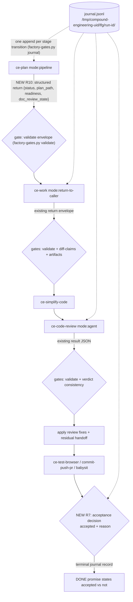

# SSSF Factory Patterns Adoption - Plan

## Goal Capsule

- **Objective:** Adopt six "software factory" patterns from SSSF (Super Simple Software Factory) into this plugin's skills: deterministic configured quality commands, claim-verification gate scripts, an accepted-vs-phases-passed completion contract in `lfg`, a per-run phase journal, structured handoff validation at pipeline seams, and a docs-only SSSF-alongside-CE integration recipe.
- **Authority hierarchy:** The repo's active instructions (`AGENTS.md`) > this plan's scope and design decisions > SSSF source semantics. The plan specializes repo rules but never overrides working-agreement, release, or portability rules; where they conflict at execution time, the repo's current instructions win and the conflict is surfaced to the user. Where SSSF semantics conflict with this repo's cross-harness portability rules, this repo's rules win — the adaptations are prose-plus-script mechanisms, never a Python control plane.
- **Execution profile:** Six independently landable slices (see Phased Delivery). Each slice is a normal feature branch + PR through CI; no direct pushes to `main`.
- **Stop conditions:** Stop and surface to the user if (a) a change would require a `BREAKING CHANGE` marker, (b) `tests/pipeline-review-contract.test.ts` cannot be updated without changing the meaning of an existing seam contract, or (c) a gate script cannot be made to pass its own execution tests on both ubuntu and windows CI runners.
- **Tail ownership:** Executor owns implementation, tests, and local verification per unit. Shipping (commit/PR) follows the repo working agreement; upstream (original compound-engineering repo) PRs are a follow-up outside this plan's Definition of Done.

---

## Product Contract

### Summary

Bring SSSF's "agent proposes, code disposes" discipline into the plugin's judgment-layer skills: known commands run as code, agent claims get mechanically verified, `lfg`'s DONE separates acceptance from stage completion, runs leave a queryable journal, seam envelopes get schema validation, and users who want the full factory get a verified recipe for running SSSF as the control plane with CE judgment inside its prompts.

### Problem Frame

The compound-engineering pipeline is prose-driven: subagents rediscover the project's test runner every run, the orchestrator trusts self-reported file lists and verdicts, `lfg`'s DONE means "the stages ran" rather than "the outcome was accepted", and a failed run leaves only a transcript to read. SSSF demonstrates cheap, portable mechanisms for each gap — deterministic quality phases, post-hoc claim gates, `run.finish(accepted=)`, and a live trace — but ships them as a Python control plane this cross-harness plugin cannot adopt wholesale. Research confirmed the gaps are real in the current skills: `ce-work`'s shipping workflow literally says "use project's test command" with no configured source; `ce-work` prose already mandates "inspect the actual tree, not reported paths" with no mechanism; `ce-code-review` has no check tying its verdict enum to its findings; `lfg` persists nothing per-run and has no acceptance decision point.

### Requirements

**Deterministic quality commands (adopts SSSF "a known command is code, not an agent")**

- R1. `ce-work` (orchestrator and its shipping/verification steps) runs the project's test, lint, typecheck, and build commands from configuration as single argv-style shell calls, interpreting exit status as data, instead of having agents rediscover the commands each run.
- R2. When no quality commands are configured, behavior is unchanged from today: commands are discovered from the project's active instructions and context. Configured commands never override a more specific instruction; the existing precedence (task instruction > session/project instructions > checkout config) is preserved.
- R3. The config surface change updates all four owning surfaces in one change — `skills/ce-setup/references/config-template.yaml`, its byte-identical `.compound-engineering/config.local.example.yaml` copy, `docs/skills/configuration.md`, and consumer skill docs — and deliberately amends the `docs/skills/configuration.md` line "Do not put credentials, CLI commands, or harness flags in this file" to carve out quality commands (see KTD2).

**Claim-verification gates (adopts SSSF "gates verify claims, not guesses")**

- R4. A bundled deterministic script verifies agent claims after the fact: (a) declared artifact paths exist and are non-empty; (b) claimed changed files match actual `git status`/diff state (files claimed but untouched, and touched files outside claim + plan scope, are both reported); (c) a review result is self-consistent — a `Ready to merge` verdict with open P0/P1 actionable findings, or a `Not ready` verdict with zero actionable findings and no stated reason, is flagged as a contradiction; (d) `lfg`'s terminal acceptance record is consistent with its machine-readable inputs — `accepted: true` alongside any red structured input (failed verification evidence, `Not ready` verdict, flagged verdict-consistency, failed babysit status) is flagged as a contradiction routed through R5's degrade semantics.
- R5. Gate failure degrades the outcome, never the boundary: a failed check marks the specific claim unverified (or the verdict contradicted) in the consuming skill's output; an infrastructure failure (script never ran) triggers bounded recovery and is reported as "unverified — gate unavailable". Skill prose never re-derives the result the script was supposed to check. Noise policy for `diff-claims`: claimed-but-untouched files always degrade the affected claim to unverified; touched-but-unclaimed files inside plan scope are reported informationally without degrading the outcome; only unclaimed changes outside plan scope mark the run's change-claim unverified.
- R6. The script is byte-duplicated into each consumer skill (`ce-work` canonical, `lfg`, `ce-code-review`) with a parity test, per the repo's no-cross-skill-references rule.

**Accepted vs phases-passed (adopts SSSF `run.finish(accepted=)`)**

- R7. `lfg` decides acceptance in exactly one place, immediately before its DONE promise: `accepted` (boolean) with a one-line reason, derived from the review verdict and applied-fix state, verification evidence, residual durability, and babysit outcome. The final report always states both stage completion and acceptance; a run whose stages all completed but whose outcome was not accepted says so explicitly instead of an unqualified DONE.

**Per-run phase journal (adapts SSSF's trace, minus the SQLite/UI stack)**

- R8. `lfg` appends one JSON line per pipeline stage transition (stage name, status, ISO timestamps, key artifact paths, one-line detail) to a journal file under the per-UID scratch root; the acceptance decision from R7 is the journal's terminal record. `ce-work` appends unit-level records (unit start, verification result, integration result) to the same journal when a caller passes a journal path, and to its own journal in standalone runs.
- R9. The journal is best-effort observability: a journal write failure never fails or blocks the pipeline. Any flow that reads a journal back into agent context applies the scratch-root ownership check (treat mismatch as a miss).

**Structured seam envelopes (adopts SSSF typed envelopes, as validation of existing contracts)**

- R10. The `ce-plan` -> `lfg` seam returns a structured completion record (status, plan path, artifact readiness, doc review state) in pipeline mode, bringing the thinnest seam up to parity with the `ce-work` and `ce-code-review` seams, which already return structured envelopes.
- R11. The seam envelope shapes consumed by `lfg` are pinned as JSON Schema files and mechanically validated by the gate script at each seam; a validation failure routes through R5's degrade semantics (one evidence-reconciliation recovery, then blocked — matching `lfg`'s existing recovery pattern).

**SSSF integration recipe (docs-only)**

- R12. A documentation guide explains running SSSF as the control plane with CE judgment content slotted into SSSF's stamped `prompt_engineering/{agent}/` files: which files to edit (system.md `## Instructions`, user.md `## Task`), what must not change (the synced triad, the three literal `{{placeholders}}`, the reviewer's `status`-vs-`approved` split, `writes:` boundaries when output paths move), mandatory `quality.py` wiring, and the install/smoke checklist. No plugin skill content changes.

**Validation**

- R13. Deterministic pieces (script behavior, parity, config-template/example byte-identity, seam token pins) are covered by `bun test`, with new script tests executing the real script on both ubuntu and windows CI runners. Prose-behavior changes (when skills run the gates, how they react to failures, acceptance judgment) are validated with skill-creator evals, not CI.

### Scope Boundaries

- **Out:** Porting SSSF's Python control plane, ADW scripts, SQLite trace, or visualizer into the plugin. The plugin stays a prose-skill judgment layer with small bundled scripts.
- **Out:** Enforcing SSSF's `writes:` boundary / rollback semantics — the harness permission system owns write boundaries; the diff-vs-claims gate (R4b) is the portable substitute.
- **Out:** Changing `ce-code-review`'s report-only default or `lfg`'s review-fix flow semantics — the verdict-consistency gate flags contradictions; it never rewrites verdicts or applies fixes.
- **Out:** Upstream (original repo) PR submission — this plan lands the changes in the fork; upstream contribution follows the fork owner's issue-first process afterward.
- **Deferred to Follow-Up Work:** journal support in other skills (`ce-debug`, `ce-babysit-pr`); a journal-reading "explain this run" surface; SSSF `claude_code` coding-agent support in the recipe (SSSF v1 is Pi-only); extending quality-command keys to per-directory or monorepo-scoped commands.

---

## Planning Contract

### Key Technical Decisions

- KTD1. **Adopt by modifying this fork's skills, sliced for later per-pattern upstream PRs.** (session-settled: user-approved — chosen over using the stock plugin unchanged or per-repo SSSF integration alone: the patterns live in skill content and bundled scripts, which only a fork edit can change.) Each slice keeps a narrow conventional-commit scope (`ce-work`, `lfg`, `ce-code-review`, `configuration`) — never scope `compound-engineering`; no `!`/`BREAKING CHANGE` markers.
- KTD2. **Quality commands are config keys, read by the canonical pattern.** A `quality_commands:` map (`test`, `lint`, `typecheck`, `build` — each a single command string run as one argv-style shell call) in `.compound-engineering/config.local.yaml`, documented as commented examples in the template. Consumers use the existing canonical read: `git rev-parse --show-toplevel`, native file-read of `config.local.yaml`, only active (non-commented) keys count, silent fall-through when absent. (session-settled: user-approved — chosen over putting commands only in the project's agent-instructions file: config gives one greppable slot per checkout; the instructions-precedence rule in R2 keeps agent-instructions authoritative when both exist.) This requires amending the `docs/skills/configuration.md` "no CLI commands" policy sentence to scope it to credentials/harness flags with an explicit quality-commands carve-out — a deliberate policy change, called out in the PR body.
- KTD3. **One bundled Python script, subcommand per gate, canonical in `ce-work`.** `scripts/factory-gates.py` with subcommands `artifacts` (R4a), `diff-claims` (R4b), `verdict` (R4c), `validate` (R11, JSON-Schema check of an envelope file against a schema file), and `journal` (R8, append one validated JSON line). Python 3 stdlib only; no `fcntl`/locking; text I/O with explicit `encoding="utf-8"`, `newline=""` where it matters (Windows text-mode trap). Invoked via the tier-3 `SKILL_DIR` anchor with the interpreter probe (`for c in python3 python py; do ...` — never bare `python3`). Byte-duplicated to `skills/lfg/scripts/` (its first `scripts/` dir) and `skills/ce-code-review/scripts/`, guarded by a new parity test modeled on `tests/settled-decisions-parity.test.ts` (byte-equality across copies plus a content pin on the canonical copy).
- KTD4. **Gate failure semantics follow `docs/solutions/skill-design/dispatch-script-failure-degrade-outcome-not-boundary.md`.** Route-level failure (script ran, check failed) degrades the outcome: the claim is reported unverified / the contradiction is surfaced, and the consuming skill's existing recovery paths (e.g. `lfg`'s single evidence-reconciliation re-invocation) handle it. Infrastructure failure (script never ran: interpreter missing, non-zero from the harness) gets one bounded retry, then the output states "unverified — gate unavailable". No prose fallback re-derives a check.
- KTD5. **Journal is append-only JSONL under the scratch root, one file per run, no sibling status file.** Path: `/tmp/compound-engineering-<uid>/lfg/<run-id>/journal.jsonl` (standalone `ce-work` runs: `/tmp/compound-engineering-<uid>/ce-work/<run-id>/journal.jsonl`, beside the existing cross-model run state). (session-settled: user-approved — chosen over in-repo `.context/`: AGENTS.md routes run-scoped checkpoints to the per-UID scratch root; the path is user-inspectable by design.) Record shape: `{ts, run_id, skill, phase, status, detail, artifacts}` with `status` one of `started|completed|failed|skipped|accepted|not-accepted`. The acceptance record is the single terminal record — never a separate flag file (two-state-file anti-pattern from the detached-job learning). Writes go through the `journal` subcommand so shape validation is deterministic; a failed append is logged in one line and ignored (R9).
- KTD6. **Acceptance is a single decision point in `lfg`, not a distributed judgment.** A short "acceptance decision" block inserted before step 10's DONE promise reads: review verdict + whether apply-eligible findings were applied, `ce-work`'s `verification_evidence`, residual durability, babysit `status`. Output: `accepted: true|false` + one-line reason, echoed in the DONE block and written as the journal terminal record. `tests/pipeline-review-contract.test.ts` pins the new tokens (tighten the existing guard, not a new suite).
- KTD7. **Seam envelopes are pinned as draft-07-clean JSON Schema files.** New schema files live beside the consuming prose (in `skills/lfg/references/`), following the `skills/ce-work/references/implementation-result-schema.json` precedent: `additionalProperties: false`, standard `description` annotations only, no custom extension members (`_meta`/`x-*` rejected by strict validators — per `docs/solutions/integration-issues/portable-structured-output-schemas-across-model-clis.md`). Scope: the `ce-work` return envelope, the `ce-code-review` `mode:agent` result, and the new `ce-plan` pipeline return (R10). The recursive draft-07 keyword guard in `tests/review-skill-contract.test.ts` extends to cover the new schema files.
- KTD8. **The SSSF recipe is a standalone docs guide at `docs/integrations/sssf-control-plane.md`.** (session-settled: user-approved — chosen over a `docs/solutions/integrations/` entry: this is a how-to guide for plugin users, not a solved-problem record; `docs/solutions/` frontmatter and category semantics fit retrospective learnings.) The doc pins the SSSF revision it was verified against and states its verification date, since SSSF is an external moving target.
- KTD9. **Item 6 makes zero plugin changes.** (session-settled: user-approved — chosen over shipping an SSSF-style deterministic-runner skill: that would re-ship SSSF; MIT-licensed SSSF installs alongside CE and its stamped prompts are designed to be replaced.)
- KTD10. **Add a config template/example byte-parity test.** Research found the byte-identical pairing of `skills/ce-setup/references/config-template.yaml` and `.compound-engineering/config.local.example.yaml` is convention-only (verified identical today, no test). U1 adds `tests/config-template-parity.test.ts` so the four-surface rule in R3 gains a mechanical guard for the two byte-coupled surfaces.

### High-Level Technical Design

Where the new mechanisms attach to the existing `lfg` pipeline (stages abbreviated; unchanged stages dimmed to context):



Inside `ce-work`, two attach points: the quality commands (R1) slot into the existing per-unit implementation loop and shipping workflow where prose currently says "use project's test command"; the `diff-claims` gate mechanizes the existing post-batch rule "inspect the actual tree, not reported paths" and runs before the return envelope's `verification_evidence` is assembled. Inside `ce-code-review`, the `verdict` gate runs at finish-review, after the report JSON exists and before it is returned.

Gate subcommand contract (directional, not implementation specification):

```
factory-gates.py artifacts   --claims <json-file>            -> {ok, checks:[{item, ok, note}]}
factory-gates.py diff-claims --claims <json-file> --repo <dir> -> {ok, unclaimed_changes:[], missing_claims:[], checks:[...]}
factory-gates.py verdict     --report <json-file>            -> {ok, contradictions:[]}
factory-gates.py verdict     --acceptance <json-file>        -> {ok, contradictions:[]}   (R4d: accepted vs structured inputs)
factory-gates.py validate    --schema <file> --envelope <file> -> {ok, errors:[]}
factory-gates.py journal     --file <path> --record <json>   -> {ok}   (append-only; never fails the caller)
```

Every subcommand exits 0 when it ran and produced a result (even a failing check — mirroring SSSF's "the runner did its job; the CODE is what failed"), non-zero only for infrastructure failure. The distinction is what makes KTD4's two failure classes mechanically distinguishable.

### Assumptions

- The four `quality_commands` keys cover the near-term need; per-directory/monorepo scoping is deferred (Scope Boundaries).
- `lfg` remains Claude-Code-centric enough that its journal/gate wiring can assume a POSIX-ish shell via the existing scratch-root preamble; the script itself still must pass Windows execution tests because `ce-work`/`ce-code-review` run cross-platform.
- SSSF's `example` branch semantics match the skill-branch templates read during research (recipe content is grounded in the skill branch only).

### Sequencing and Phased Delivery

Each phase is one PR-sized slice; later phases depend on earlier ones only where stated.

| Phase | Units | Scope label | Depends on |
|---|---|---|---|
| 1 | U1, U2 | `configuration` / `ce-work` — quality commands | — |
| 2 | U3 | `ce-work` — gate script + parity + tests | — |
| 3 | U4, U5 | `ce-work` / `ce-code-review` — gate wiring | Phase 2 |
| 4 | U6, U7 | `lfg` — acceptance contract + journal | Phases 2-3 |
| 5 | U8 | `lfg` / `ce-plan` — seam envelope schemas | Phases 2, 4 |
| 6 | U9 | `docs` — SSSF recipe | — (any time) |
| 7 | U10 | eval evidence + doc sync | Phases 1-5 |

---

## Implementation Units

Unit Index:

| U-ID | Title | Key files | Depends on |
|---|---|---|---|
| U1 | Quality-commands config surface | `skills/ce-setup/references/config-template.yaml`, `.compound-engineering/config.local.example.yaml`, `docs/skills/configuration.md`, `tests/config-template-parity.test.ts` | — |
| U2 | `ce-work` consumes quality commands | `skills/ce-work/SKILL.md`, `skills/ce-work/references/implementation-loop.md`, `skills/ce-work/references/shipping-workflow.md`, `docs/skills/ce-work.md` | U1 |
| U3 | `factory-gates.py` script + duplication + parity | `skills/ce-work/scripts/factory-gates.py`, `skills/lfg/scripts/factory-gates.py`, `skills/ce-code-review/scripts/factory-gates.py`, `tests/factory-gates.test.ts`, `tests/factory-gates-parity.test.ts` | — |
| U4 | Wire claims gates into `ce-work` | `skills/ce-work/SKILL.md`, `tests/skills/ce-work-outcome-spine.test.ts` | U3 |
| U5 | Wire verdict gate into `ce-code-review` | `skills/ce-code-review/references/finish-review.md`, `skills/ce-code-review/SKILL.md`, `tests/review-skill-contract.test.ts` | U3 |
| U6 | `lfg` acceptance contract + seam gate wiring | `skills/lfg/SKILL.md`, `tests/pipeline-review-contract.test.ts` | U3, U4, U5 |
| U7 | Phase journal in `lfg` + `ce-work` | `skills/lfg/SKILL.md`, `skills/ce-work/SKILL.md`, `tests/pipeline-review-contract.test.ts` | U3, U6 |
| U8 | Seam envelope schemas + `ce-plan` pipeline return | `skills/lfg/references/` (new schemas), `skills/ce-plan/SKILL.md`, `tests/pipeline-review-contract.test.ts`, `tests/review-skill-contract.test.ts` | U3, U6 |
| U9 | SSSF control-plane integration recipe | `docs/integrations/sssf-control-plane.md`, `docs/skills/README.md` (cross-link), `README.md` | — |
| U10 | Behavioral eval evidence + doc sync | skill-creator eval artifacts, `docs/skills/lfg`-adjacent docs | U2, U4-U8 |

### U1. Quality-commands config surface

- **Goal:** Add the `quality_commands` keys to the config surfaces and amend the configuration policy line, with a new byte-parity guard.
- **Requirements:** R2, R3 (advances R1).
- **Dependencies:** none.
- **Files:** `skills/ce-setup/references/config-template.yaml`, `.compound-engineering/config.local.example.yaml`, `docs/skills/configuration.md`, `tests/config-template-parity.test.ts` (new), `docs/skills/ce-setup.md` (only if it enumerates keys).
- **Approach:**
  1. Add a commented `quality_commands:` block (`test`, `lint`, `typecheck`, `build`) to the template with a header comment stating: single command strings, run as one argv-style call each, exit status is data, commented-out means unset (per KTD2).
  2. Mirror byte-identically into `.compound-engineering/config.local.example.yaml`.
  3. `docs/skills/configuration.md`: add Options-table rows (consumer: `ce-work`; `lfg` indirectly), and rewrite the "Do not put credentials, CLI commands, or harness flags in this file" sentence to scope the prohibition to credentials and harness flags, with quality commands as the sanctioned exception and one sentence of why (deterministic verification).
  4. New `tests/config-template-parity.test.ts`: byte-equality of the two files plus a content pin asserting the `quality_commands` block exists and is commented in both.
- **Patterns to follow:** existing commented option blocks in `config-template.yaml` (e.g. `plan_output`, `work_engine_mode`); parity-test mechanism from `tests/settled-decisions-parity.test.ts`.
- **Test scenarios:**
  - Parity test fails when one byte differs between template and example copy (verify by temporary mutation during development, not committed).
  - Content pin fails when the `quality_commands` block is missing from either file.
  - Content pin fails when a `quality_commands` sub-key is active (uncommented) in the shipped template — shipped defaults must be unset.
- **Verification:** `bun test tests/config-template-parity.test.ts` green; `bun run release:validate` green; the amended policy sentence appears exactly once in `docs/skills/configuration.md`.

### U2. `ce-work` consumes quality commands

- **Goal:** Replace `ce-work`'s "use project's test command" discovery prose with a configured-commands-first protocol.
- **Requirements:** R1, R2.
- **Dependencies:** U1.
- **Files:** `skills/ce-work/SKILL.md`, `skills/ce-work/references/implementation-loop.md`, `skills/ce-work/references/shipping-workflow.md`, `docs/skills/ce-work.md`, `tests/skills/ce-work-outcome-spine.test.ts` (or the narrowest existing contract test that pins verification prose).
- **Approach:**
  1. Extend the existing engine-gate config read (SKILL.md already reads `.compound-engineering/config.local.yaml`) to also capture active `quality_commands` keys — one read, no second config pass.
  2. In `implementation-loop.md` (per-unit verification) and `shipping-workflow.md` (full-suite/lint step): when a matching key is configured, run it verbatim as a single shell call and treat exit status as the result; when unset, keep today's discovery wording. State the R2 precedence explicitly once (owning statement here; other mentions cite it).
  3. Dispatch packets to worker subagents include the configured commands, so workers stop rediscovering them.
- **Execution note:** Prose admission rules apply — each added line must be a falsifiable constraint; no motivational rationale.
- **Patterns to follow:** the engine-gate read at `skills/ce-work/SKILL.md` (route resolution); single argv-style command convention from `ce-commit`.
- **Test scenarios:**
  - Contract test pins the token `quality_commands` in both `implementation-loop.md` and `shipping-workflow.md` (the two drift points).
  - Contract test asserts the fallback wording ("project's active instructions" discovery) still present — configured commands must not become mandatory.
  - Skill-creator eval (U10): with `quality_commands.test` configured, a `ce-work` run invokes exactly that command for suite verification and does not ask a subagent to find the test runner; with it unset, behavior matches baseline.
- **Verification:** `bun run test` green; eval evidence recorded in U10.

### U3. `factory-gates.py` script, duplication, parity, and execution tests

- **Goal:** Ship the deterministic gate script with all five subcommands, byte-duplicated to the three consumer skills, with cross-platform execution tests.
- **Requirements:** R4, R6, R13 (mechanism for R5, R8, R11).
- **Dependencies:** none (wiring comes later).
- **Files:** `skills/ce-work/scripts/factory-gates.py` (canonical), `skills/lfg/scripts/factory-gates.py`, `skills/ce-code-review/scripts/factory-gates.py`, `tests/factory-gates.test.ts` (new), `tests/factory-gates-parity.test.ts` (new), `.github/workflows/ci.yml`.
- **Approach:**
  1. Python 3 stdlib only; subcommands per the Planning Contract sketch; JSON in/out; exit 0 = ran (even with failing checks), non-zero = infrastructure failure (KTD4's mechanical split).
  2. `diff-claims` shells out to `git` (`status --porcelain`, `diff --name-only`) via `subprocess` argv lists — no shell strings; it reports both directions (claimed-but-untouched, touched-but-unclaimed) and never mutates the repo.
  3. `verdict` reads the `ce-code-review` `mode:agent` JSON shape: verdict enum vs `actionable_findings` severities, plus SSSF's `verdict_consistent` triad adapted: approval with blocking-severity findings; rejection with nothing named; (review-specific) `Ready with fixes` with zero suggested fixes. Its `--acceptance` mode implements R4d: it reads a JSON file holding the acceptance record plus its structured inputs (review verdict and verdict-consistency flag, verification-evidence status, babysit status) and flags `accepted: true` with any red input as a contradiction.
  4. `journal` validates the KTD5 record shape, appends one line (`open(..., "a", encoding="utf-8")`, single `write` of one line), exits 0 even when the append fails after retry — it prints the failure as a note (R9).
  5. `validate` uses a minimal hand-rolled subset validator — stdlib-only rules out the `jsonschema` dependency. Supported keywords: `type` (including type-arrays for nullable fields), `required`, `properties`, `additionalProperties`, `enum`, `items`, `oneOf`. An unknown keyword in a schema is an infrastructure failure (non-zero exit), never a silent no-op — this keeps the subset honest as schemas evolve.
  6. Windows care: no `fcntl`, no `os.replace` over open handles, explicit encodings; per `docs/solutions/architecture-patterns/posix-process-supervision-on-native-windows.md`.
  7. `tests/factory-gates.test.ts` executes the real script (interpreter probe in the test, mirroring `tests/scratch-root-preamble-executes.test.ts`'s execute-don't-shape-check principle) against fixtures in a `mktemp` dir. Ubuntu coverage comes from `bun run test`; Windows coverage requires an explicit named step added to the existing `windows-native` job in `.github/workflows/ci.yml` (that job runs only enumerated steps — it is not a full-suite matrix). Follow that job's existing conventions (LF checkout, `python` launcher probing).
  8. `tests/factory-gates-parity.test.ts`: byte-equality across the three copies + canonical content pin (subcommand names present).
- **Patterns to follow:** `skills/ce-code-review/scripts/review-scope.py` (stdlib Python bundled script, fail-closed semantics); `tests/settled-decisions-parity.test.ts` (parity mechanism); AGENTS.md tier-3 invocation anchor.
- **Test scenarios:**
  - `artifacts`: all claimed files exist and non-empty -> `ok: true` with per-item notes; one missing -> `ok: false` naming exactly that path; empty file -> flagged distinct from missing; claims list empty -> `ok: true` with zero checks (vacuous pass is explicit).
  - `diff-claims`: claimed file untouched in git -> listed in `missing_claims`; modified file absent from claims -> listed in `unclaimed_changes`; untracked new file claimed and present -> ok; run outside a git repo -> infrastructure failure (non-zero), not a false pass.
  - `verdict`: `Ready to merge` + open P0 actionable finding -> contradiction; `Not ready` + zero actionable findings and empty residual_risks -> contradiction; `Ready with fixes` + consistent findings -> ok; malformed report JSON -> infrastructure failure.
  - `verdict --acceptance`: `accepted: true` with failed verification evidence -> contradiction naming the red input; `accepted: true` with all inputs green -> ok; `accepted: false` with all inputs green -> ok (conservative acceptance is never a contradiction); missing structured-input fields -> infrastructure failure.
  - `validate`: envelope matching schema -> ok; missing required field -> named error; extra property under `additionalProperties: false` -> named error; null value against a type-array allowing null -> ok; schema containing a keyword outside the supported subset -> infrastructure failure naming the keyword.
  - `journal`: append creates parent dir and file on first write; two sequential appends yield two parseable JSONL lines; record missing `status` -> rejected with `ok: false` but exit 0; unwritable path -> exit 0 with failure note (never blocks caller).
  - Parity: any byte drift across the three copies fails.
  - All of the above pass on windows-latest CI (execution, not shape-check).
- **Verification:** `bun test tests/factory-gates.test.ts tests/factory-gates-parity.test.ts` green locally; ubuntu suite and the explicit `windows-native` job step both green in CI; script runs under `python3`, `python`, and `py` launchers.

### U4. Wire claims gates into `ce-work`

- **Goal:** Mechanize `ce-work`'s "inspect the actual tree, not reported paths" rule and gate the return envelope on verified claims.
- **Requirements:** R4a-b, R5.
- **Dependencies:** U3.
- **Files:** `skills/ce-work/SKILL.md` (post-batch integration protocol; return-envelope assembly), `tests/skills/ce-work-outcome-spine.test.ts` or `tests/pipeline-review-contract.test.ts` (whichever pins the touched prose).
- **Approach:**
  1. Post-batch integration: after each worker batch, run `diff-claims` with the workers' reported paths; discrepancies route to the existing integration-protocol handling (reported paths already "a hint" — now the hint is checked mechanically).
  2. Return-envelope assembly: before reporting `status: complete`, run `artifacts` + `diff-claims` against the envelope's changed-files list; failed checks mark the affected entries unverified in `verification_evidence`, which triggers the caller's existing evidence-reconciliation path. Infrastructure failure -> "unverified — gate unavailable" wording (KTD4).
  3. Invocation is the tier-3 `SKILL_DIR` anchor + Python probe, single pinned command per call.
- **Patterns to follow:** `review-scope.py` invocation block in `ce-code-review/SKILL.md` (anchor + probe + fail-closed); dispatch-script-failure learning for the two failure classes.
- **Test scenarios:**
  - Contract test pins `factory-gates.py` + `diff-claims` tokens in the post-batch section and the envelope-assembly section (two drift points, both pinned).
  - Contract test pins the "unverified — gate unavailable" degrade wording.
  - Skill-creator eval (U10): a worker report claiming an untouched file produces a mismatch note in the orchestrator's integration handling rather than silent acceptance; gate script deleted from disk -> run completes with "gate unavailable" wording, no prose re-derivation.
- **Verification:** `bun run test` green; eval evidence in U10.

### U5. Wire verdict-consistency gate into `ce-code-review`

- **Goal:** Close the verdict-vs-findings gap: no report leaves finish-review with a self-contradictory verdict unflagged.
- **Requirements:** R4c, R5.
- **Dependencies:** U3.
- **Files:** `skills/ce-code-review/references/finish-review.md`, `skills/ce-code-review/SKILL.md` (only if the invocation belongs at the SKILL.md stage list), `docs/skills/ce-code-review.md`, `tests/review-skill-contract.test.ts`.
- **Approach:**
  1. At finish-review, after the report JSON exists: run `verdict` on it. A contradiction does not rewrite the verdict (Scope Boundaries); it appends a named `verdict_consistency` warning to the report and, in `mode:agent`, a field on the result JSON so `lfg` (U6) can weigh it in acceptance.
  2. Report-only default unchanged; the gate is additive.
- **Patterns to follow:** existing finish-review "Report completion gate" (mechanical presence checks) — this extends the same checklist; `findings-mechanics.py` invocation shape.
- **Test scenarios:**
  - Contract test pins the `verdict` subcommand token and the `verdict_consistency` field name in `finish-review.md`.
  - Draft-07 keyword guard still green after any result-shape documentation change.
  - Skill-creator eval (U10): a seeded contradictory report (Ready to merge + open P0) yields a flagged result, not a silently passed one.
- **Verification:** `bun run test` green; eval evidence in U10.

### U6. `lfg` acceptance contract and seam gate wiring

- **Goal:** Add the single acceptance decision point and run the claim/validation gates at `lfg`'s seams.
- **Requirements:** R7, R5 (consumes R4, R11 mechanisms).
- **Dependencies:** U3, U4, U5 (the step-4 gate reads the `verdict_consistency` field U5 introduces).
- **Files:** `skills/lfg/SKILL.md`, `tests/pipeline-review-contract.test.ts`.
- **Approach:**
  1. Step-2 gate: after `ce-work` returns, run `validate` (against the U8 schema once it lands; until then `artifacts`/`diff-claims` on the envelope's changed files). Failures route through the existing one-recovery-then-blocked path.
  2. Step-4 gate: run `validate` + read the `verdict_consistency` field from U5.
  3. New "Acceptance decision" block immediately before the DONE promise (KTD6): derive `accepted` + reason from the four inputs, then run `verdict --acceptance` (R4d) on the assembled record before emitting it — a flagged contradiction forces `accepted: false` with the contradiction as reason. The DONE block renders both states ("DONE — accepted" vs "DONE — completed, not accepted: <reason>").
  4. Update `tests/pipeline-review-contract.test.ts` in the same change: pin `Acceptance decision`, `accepted`, and the two DONE variants.
- **Execution note:** This is `lfg`'s first bundled-script usage; the scratch-root preamble and anchor block must be added to `lfg` following the pinned house pattern, not paraphrased.
- **Patterns to follow:** `lfg`'s existing structured-return gates (step 2's receipt-field checklist) — the acceptance block is the same checklist style; SSSF's `run.finish(accepted=)` for the semantic.
- **Test scenarios:**
  - Contract test: DONE promise text cannot appear without the acceptance tokens in the same section (pin adjacency, not just presence).
  - Contract test: acceptance inputs list names all four sources (review verdict/fixes, verification evidence, residual durability, babysit status).
  - Skill-creator eval (U10): a run with red verification evidence but all stages completed ends "completed, not accepted" with the evidence named; a fully green run ends "accepted".
- **Verification:** `bun run test` green (notably the updated pipeline contract test); eval evidence in U10.

### U7. Phase journal in `lfg` and `ce-work`

- **Goal:** Every `lfg` run leaves a stage-by-stage JSONL journal; `ce-work` contributes unit-level records.
- **Requirements:** R8, R9.
- **Dependencies:** U3, U6.
- **Files:** `skills/lfg/SKILL.md`, `skills/ce-work/SKILL.md` (journal-path parameter in the return-to-caller contract + standalone journal), `tests/pipeline-review-contract.test.ts`.
- **Approach:**
  1. `lfg` opening: mint run-id, create `/tmp/compound-engineering-<uid>/lfg/<run-id>/` via the scratch preamble, append a `started` record; append one record per stage transition; the U6 acceptance record is terminal (KTD5).
  2. Pass the journal path to `ce-work` alongside `implementation_run` so unit records land in the same file; standalone `ce-work` runs journal under their own skill dir.
  3. All appends go through `factory-gates.py journal`; the R9 never-block rule is stated once at the journal's introduction, other mentions cite it.
  4. Surface the journal path in `lfg`'s final report so the user can inspect it.
- **Patterns to follow:** scratch preamble pinned by `tests/scratch-root-contract.test.ts`; `ce-code-review`'s run-dir + `metadata.json` reporting; detached-job atomic-terminal-record rule.
- **Test scenarios:**
  - Contract test pins the journal path shape and the `journal` subcommand token in both skills (each stated drift point).
  - Contract test asserts the never-block sentence exists exactly once in each skill (owner + citation discipline).
  - Skill-creator eval (U10): after a pipeline run, the journal contains one record per executed stage in order, with the terminal acceptance record; killing a stage mid-run leaves prior records intact and parseable.
- **Verification:** `bun run test` green; manual smoke: run `lfg` on a trivial task, `cat` the journal, verify parseable JSONL and terminal record.

### U8. Seam envelope schemas and `ce-plan` pipeline return

- **Goal:** Pin the three seam envelopes as schema files, validate them mechanically, and give the `ce-plan` seam a structured return.
- **Requirements:** R10, R11.
- **Dependencies:** U3, U6 (U8 rewires the `lfg` step gates U6 introduces).
- **Files:** `skills/lfg/references/ce-work-return-schema.json`, `skills/lfg/references/review-result-schema.json`, `skills/lfg/references/plan-return-schema.json` (all new), `skills/lfg/SKILL.md`, `skills/ce-plan/SKILL.md` (pipeline-mode return block), `tests/pipeline-review-contract.test.ts`, `tests/review-skill-contract.test.ts`.
- **Approach:**
  1. Author the three schemas from the current prose contracts (fields verified in research: `ce-work`'s receipt field list; `ce-code-review`'s `mode:agent` minimum shape; new plan return `{status, plan_path, artifact_readiness, doc_review_state}` per R10). All three schemas use `additionalProperties: false`, consistent with KTD7 and the existing `skills/ce-work/references/implementation-result-schema.json` pattern; nullable fields use type-arrays (e.g. a value that is a string or null).
  2. `ce-plan` pipeline mode: emit the structured return at the existing return-control point (markdown-forced pipeline runs only; no interactive-mode change).
  3. `lfg` step gates (U6) switch from field-checklist prose to `validate` against these schemas; the prose checklist remains as the human-readable statement, citing the schema file as owner.
  4. Extend the recursive draft-07 keyword guard to glob the new schema files.
- **Patterns to follow:** `skills/ce-work/references/implementation-result-schema.json`; portable-structured-output learning (no custom members).
- **Test scenarios:**
  - Schema files pass the draft-07 keyword guard (no unknown keywords, no `_meta`/`x-*`).
  - Every shipped seam schema uses only keywords the U3 `validate` subset supports (a fixture-backed test that fails when a schema introduces an unsupported keyword).
  - Fixture envelopes: current documented `ce-work` return example validates; an envelope missing `unit_receipts` fails with that field named; a plan return with `artifact_readiness: requirements-only` validates structurally (the readiness *gate* stays `lfg` prose, not schema).
  - Contract test: `lfg`'s gate sections cite the schema filenames; `ce-plan`'s pipeline block pins the return field names.
  - Skill-creator eval (U10): pipeline `ce-plan` run produces the structured return; `lfg` consumes it without re-deriving the plan path from prose.
- **Verification:** `bun run test` green; schemas hand-validated against one real captured envelope from a live pipeline run.

### U9. SSSF control-plane integration recipe

- **Goal:** Ship the verified docs-only guide for SSSF-as-control-plane with CE judgment in its prompts.
- **Requirements:** R12.
- **Dependencies:** none.
- **Files:** `docs/integrations/sssf-control-plane.md` (new dir + page), `README.md` (one pointer line), `docs/skills/README.md` (cross-link only if a natural slot exists).
- **Approach:** Structure the guide as: (1) when to choose this setup vs plugin-only; (2) install checklist condensed from SSSF's cookbook (prereqs `uv`/`pi`/`sqlite3`, `.env` keys per roster `provider/model-id` prefixes, git repo requirement, `just demo` smoke test); (3) the prompt-swap map — CE plan-quality standards into planner `system.md ## Instructions`, CE review severity/verdict rubric into reviewer `system.md`, task shaping into `user.md ## Task`; (4) the do-not-touch list — the synced triad (Pydantic type / `## Report` JSON example / `output_type=`), the three literal placeholders (`{{prompt}}`, `{{previous_envelope}}`, `{{context_handoff_dir}}` — literal string replace, typos ship raw text silently), reviewer `status`-vs-`approved` split (`status: fail` kills the phase), `writes:` three-place edit when output paths move, no git commands in prompts, `quality.py` wiring as a mandatory step (placeholders exit 0 green-but-fake), `--force` clobbers customized prompts; (5) pinned SSSF revision + verification date (KTD8).
- **Test scenarios:** Test expectation: none — docs-only page; correctness is covered by the manual verification below.
- **Verification:** Every claim in the do-not-touch list traces to a file/line in the pinned SSSF revision (recheck against the repo at write time, not from this plan); `bun run release:validate` green (no manifest impact); no skill-count change.

### U10. Behavioral eval evidence and doc sync

- **Goal:** Produce the skill-creator eval evidence for the prose-behavior changes and finish the documentation sweep.
- **Requirements:** R13 (and eval scenarios named in U2, U4-U8).
- **Dependencies:** U2, U4, U5, U6, U7, U8.
- **Files:** eval artifacts per skill-creator's workflow; `docs/skills/ce-work.md`, `docs/skills/ce-code-review.md`, `docs/skills/lfg.md`, `docs/skills/configuration.md` (final consistency pass). `docs/skills/lfg.md` documents the largest user-facing change — the acceptance decision, DONE variants, and journal path surface.
- **Approach:** Run skill-creator's eval workflow (subagent injection — required because in-session plugin skills are cached at session start) for the six named eval scenarios: U2 (configured-command use + unset fallback), U4 (mismatch surfaced; gate-unavailable degrade), U5 (contradictory verdict flagged), U6 (not-accepted vs accepted DONE), U7 (journal completeness), U8 (structured plan return consumed). Record evidence per the repo's PR-evidence convention; both failure directions guarded where the strong-model-masking learning applies (run at least one eval on a mid-tier model).
- **Test scenarios:** Test expectation: none — this unit produces eval evidence, not code; the scenarios themselves are enumerated in U2/U4-U8.
- **Verification:** Each of the six scenarios has recorded evidence with pass outcome or a filed follow-up; `bun run test`, `bun run release:validate`, `bun run plugin:validate` all green at the end of the phase.

---

## Verification Contract

| Check | Command | Applies to |
|---|---|---|
| Full test suite (CI-identical) | `bun run test` | every unit; must stay green per slice |
| New script execution tests (both OSes) | `bun test tests/factory-gates.test.ts` (ubuntu suite + explicit `windows-native` job step) | U3 |
| Parity guards | `bun test tests/factory-gates-parity.test.ts tests/config-template-parity.test.ts` | U1, U3 |
| Release/plugin consistency | `bun run release:validate` and `bun run plugin:validate` | U1, U9, and any slice touching skill inventory or manifests |
| Seam contract pins | `bun test tests/pipeline-review-contract.test.ts` | U4, U6, U7, U8 — updated in the same PR as the prose it pins |
| Behavioral evals | skill-creator eval workflow (not CI) | U10's six scenarios |

Quality gates: no new test file may push CI's slowest-single-file bound (do not add scenarios to `tests/skills/ce-work-unit-workspace.test.ts`); long-running script tests set `setDefaultTimeout` rather than relying on worker-count changes; every new mechanical guard executes the shipped block rather than shape-checking it.

---

## Definition of Done

- All of R1-R13 implemented and traced: each requirement is cited by at least one landed unit.
- `bun run test`, `bun run release:validate`, `bun run plugin:validate` green on `main` after the final slice.
- The six U10 eval scenarios have recorded evidence; any failed eval has a filed follow-up issue rather than silent omission.
- The three `factory-gates.py` copies are byte-identical and the parity + template-parity tests are in CI.
- A live smoke: one real `lfg` run on a trivial task in this repo produces a parseable journal with a terminal acceptance record, and its DONE block states acceptance explicitly.
- `docs/integrations/sssf-control-plane.md` exists, pins an SSSF revision, and its do-not-touch claims were re-verified against that revision at write time.
- No abandoned experimental code in any slice's diff; no hand-bumped release-owned versions; every commit uses a narrow scope (never `compound-engineering`).

---

## Risks & Dependencies

- **`tests/pipeline-review-contract.test.ts` churn.** Four units touch prose this 40K test pins; each slice must update pins in the same PR or CI blocks. Mitigation: treat the test as the seam's source of truth and extend it (tighten-existing-guard rule), never fork a parallel suite.
- **Policy amendment visibility (KTD2).** Relaxing the "no CLI commands in config" line is a real policy change; if unstated it looks like drift. Mitigation: call it out in the U1 PR body and keep the credentials/harness-flags prohibition intact.
- **Windows portability of the gate script.** The named traps (text-mode I/O, no `fcntl`, launcher probing) are known learnings; the execute-on-windows CI test is the guard, not code review.
- **Session caching during development.** Edited skills do not reload in an open session; all behavioral iteration goes through skill-creator injection (repo rule), or a fresh session for the final smoke.
- **SSSF drift (U9).** The recipe documents an external repo that will change. Mitigation: pinned revision + verification date in the doc; re-verification is part of U9's Definition of Done, not assumed from this plan's research.
- **Upstream contribution gates.** If the fork owner is not a maintainer of the upstream repo, upstream PRs need a linked issue first; this plan's scope ends at the fork, so no unit depends on upstream acceptance.

---

## Sources & Research

- SSSF semantics: `.claude/skills/sssf/` in the SSSF repo — `SKILL.md` hard rules 1-10; `templates/adws/adw_modules/{data_types,gates,quality,agents,prompts}.py`; `references/{handoff,config}.md`; `cookbooks/install.md`. Envelope/gate/quality mechanics and the fourteen sharp edges for U9 were read directly from these files (2026-08-05, skill branch).
- Current-skill ground truth (verified 2026-08-05, `main` @ `6a2a0f99`): `skills/lfg/SKILL.md` ten-step pipeline and receipt-field gate; `skills/ce-work/SKILL.md` engine-gate config read, post-batch "inspect the actual tree" rule, return-envelope field list, `references/implementation-result-schema.json`; `skills/ce-code-review/references/finish-review.md` result shape and completion gate; `skills/ce-setup/references/config-template.yaml` key inventory (no quality keys today; byte-identical example copy verified via `cmp`).
- Institutional learnings shaping KTDs: `docs/solutions/skill-design/dispatch-script-failure-degrade-outcome-not-boundary.md` (KTD4), `docs/solutions/skill-design/detached-job-lifecycle-for-delegated-work.md` + `docs/solutions/best-practices/predictable-tmp-cache-ownership-check.md` (KTD5, R9), `docs/solutions/integration-issues/portable-structured-output-schemas-across-model-clis.md` (KTD7), `docs/solutions/workflow/reviewing-byte-duplicated-shared-assets.md` (KTD3), `docs/solutions/conventions/resolve-python-interpreter-not-python3.md` + `docs/solutions/conventions/shell-primitives-must-be-executed-not-shape-checked.md` + `docs/solutions/architecture-patterns/posix-process-supervision-on-native-windows.md` (U3), `docs/solutions/skill-design/strong-models-mask-defensive-skill-fixes.md` (U10).
