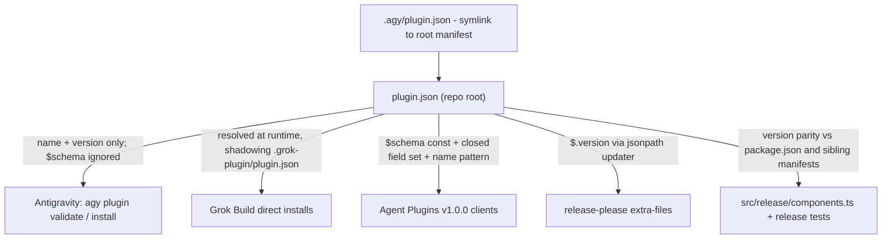

# Agent Plugins v1.0.0 Manifest Conformance - Plan

## Goal Capsule

- **Objective:** Make the repo-root plugin package conform to the [Agent Plugins v1.0.0 specification](https://agent-plugins.org/specification) at the manifest level, guard that conformance in CI, and document the compatibility posture — without changing skill behavior on any current harness.
- **Authority:** This plan governs scope and sequencing. The project's active instructions override on mechanics (commit format, guard placement, release ownership).
- **Stop conditions:** Stop and surface instead of guessing if (1) release automation ownership of `plugin.json` `$.version` would be disturbed, or (2) any change would require editing skill frontmatter keys. If a harness validator (`agy`, `grok`) rejects the updated manifest, that is not a guessing situation: execute the Verification Contract's pre-approved failure path (revert the `$schema` swap, record the incompatibility), then surface the conflict.
- **Tail ownership:** Standalone run — implementation ends with commits, a PR, and the Verification Contract green.

---

## Product Contract

### Summary

A 2026-08-06 audit against the Agent Plugins v1.0.0 spec found this repo already matches the portable package shape — root `plugin.json` plus `skills/` at the fixed discovery location — but a conformant client must reject the whole plugin because the manifest declares Antigravity's `$schema` instead of the required canonical identifier. This plan swaps the manifest to the Agent Plugins schema, mirrors the permitted metadata fields, adds a CI guard so the manifest cannot silently regress, and records the remaining skill-frontmatter gap as a deliberate, documented posture.

### Problem Frame

Agent Plugins v1.0.0 is an open, vendor-neutral packaging standard (initial TSC: Amazon, Cursor, Microsoft, OpenAI, Vercel) that fixes component locations (`skills/`, `mcp.json`) around a closed root `plugin.json` manifest. Root `plugin.json` in this repo was added for Antigravity (`agy`) native installs (PR #1034) and declares `https://antigravity.google/schemas/v1/plugin.json` — a URL that returns 404 and that `agy` never required (its verified minimal manifest is `{name, version}`; see `docs/specs/antigravity.md`). Agent Plugins §5.2 requires `$schema` to be exactly `https://agent-plugins.org/schemas/1.0.0/plugin.schema.json` and mandates plugin rejection on unrecognized values, so the current file blocks every conformant client at the door.

A second, separate gap: 28 of 32 skills carry Claude Code frontmatter keys (`argument-hint` in 27, `disable-model-invocation` in 8) outside the Agent Skills spec's allowed set, and the Agent Skills reference validator treats unknown keys as errors. A strict Agent Plugins client would skip those skills. That gap is a spec-vs-runtime tension — the keys are load-bearing on Claude Code — and is handled here by documented posture and deferred converter work, not by editing skills.

No shipping conformant Agent Plugins client is known as of 2026-08-06; the swap is a low-cost defensive bet on a TSC-backed standard plus cleanup of a dead `$schema` URL, not a response to observed breakage.

### Requirements

**Manifest conformance**

- R1. Root `plugin.json` validates against the Agent Plugins 1.0.0 `plugin.schema.json`: `$schema` is the canonical identifier, `name` satisfies the §5.5 constraints, and only permitted top-level fields are present.
- R2. The manifest carries the plugin's public metadata (`author`, `homepage`, `repository`, `license`, `keywords`) consistent with `.claude-plugin/plugin.json`.

**Compatibility preservation**

- R3. Existing root-manifest consumers keep working: `agy plugin validate` accepts the updated manifest from the repo root and through `.agy/`, and Grok Build direct installs — which resolve the root manifest at runtime, shadowing `.grok-plugin/plugin.json` per `src/release/metadata.ts` — remain functional.
- R4. Release automation keeps sole ownership of `$.version` in root `plugin.json`; this change never hand-bumps it.

**Guarding and documentation**

- R5. CI fails if root `plugin.json` regresses from Agent Plugins manifest conformance.
- R6. The Agent Plugins compatibility posture — including the skill-frontmatter gap and its rationale — is recorded as a target spec under `docs/specs/`.

### Scope Boundaries

**Deferred to Follow-Up Work**

- An `agent-plugins` packaging/converter target in the CLI that emits fully conformant packages (relocating `argument-hint` / `disable-model-invocation` at emission time), following the repo's new-target-provider checklist.
- Upstream engagement: proposing the two Claude Code frontmatter fields for adoption in the Agent Skills / Agent Plugins spec discussions.
- `mcp.json` authoring — the plugin ships no MCP servers on any surface, and absence is valid under the spec.

**Outside this product's identity**

- Editing skill frontmatter in source to satisfy strict Agent Skills validation. `argument-hint` and `disable-model-invocation` are consumed at the top level by Claude Code, which installs this repo root directly; relocating them under `metadata:` would regress auto-invocation gating for 8 skills and drop slash-command argument hints for 27.

---

## Planning Contract

### Key Technical Decisions

- KTD1. **Root `plugin.json` becomes the Agent Plugins manifest.** Swap `$schema` to `https://agent-plugins.org/schemas/1.0.0/plugin.schema.json`. Basis: the Agent Plugins schema pins `$schema` as a `const` and conformant clients must reject unrecognized values, while Antigravity's validator requires only `name` + `version` and never validated the `$schema` field (empirically verified against `agy` v1.0.10, per `docs/specs/antigravity.md`). One file can serve both consumers.
- KTD2. **Skill frontmatter stays as-is; the gap is documented, not fixed.** Strict Agent Plugins clients may skip the 28 skills carrying the two Claude Code keys; the 4 clean skills (`ce-commit`, `ce-proof`, `ce-riffrec-feedback-analysis`, `ce-worktree`) still load. Chosen over source relocation (a Claude Code behavior regression — see Scope Boundaries) and over immediate converter-layer emission (a full new-target effort, deferred). This is a deliberate product call: accept-but-degraded on strict clients beats today's clean rejection during the standard's adoption window, provided the degraded state is disclosed on a user-facing surface (U3's compatibility note), because a user who installs and silently gets 4 of 32 skills — with every flagship workflow skill among the skipped — would otherwise read the product as broken rather than partially compatible.
- KTD3. **The CI guard covers the manifest only.** No Agent Skills frontmatter validation is added — it would fail by design under KTD2. The guard pins the smallest falsifiable units: the `$schema` const, the name pattern, the closed field set, and the field-shape checks (author-object shape and permitted-field value types).
- KTD4. **The guard lands by tightening existing release checks, not a new suite.** `src/release/components.ts` and `tests/release-metadata.test.ts` already own root-manifest invariants (version parity), and the repo's guard-sizing rule prefers widening an existing guard. A small dedicated test file is the fallback only if the release suite's scope genuinely does not fit.

### High-Level Technical Design

Consumers of root `plugin.json` and what each actually reads — the change is invisible to every consumer except Agent Plugins clients, for whom it flips reject to accept:

### Assumptions

- `agy plugin validate` accepts a manifest whose `$schema` names the Agent Plugins identifier: its verified minimal manifest is `{name, version}` and additional fields were optional. The empirical probe (`docs/specs/antigravity.md`) never tested a *foreign* `$schema` value specifically, which is exactly why the Verification Contract's manual gate exists; a gate failure triggers the pre-approved revert path.
- Grok Build tolerates the updated manifest: Grok support was verified (PR #1086) while the root manifest already carried the foreign Antigravity `$schema`, and the mirrored metadata fields (`author`, `homepage`, `repository`, `license`, `keywords`) all appear in Grok's own `.grok-plugin/plugin.json` format. The `grok plugin validate` gate below is belt-and-suspenders; whether Grok attributes plugin recognition to the root manifest or `.grok-plugin/plugin.json` is an open question inherited from the 2026-07-09 Grok plan.
- Scope inferred without user confirmation (headless run): metadata mirroring (R2), the CI guard (R5), and the `docs/specs/` page (R6) were inferred from the audit and repo conventions. Any of them can be dropped at review without affecting R1.

### Sources & Research

- Agent Plugins spec and canonical schema: [agent-plugins.org/specification](https://agent-plugins.org/specification), `https://agent-plugins.org/schemas/1.0.0/plugin.schema.json` (fetched 2026-08-06; `$schema` is a `const`, manifest is `additionalProperties: false`).
- Agent Skills spec and reference validator: [agentskills.io/specification](https://agentskills.io/specification); `skills-ref` validator rejects unknown frontmatter keys (`ALLOWED_FIELDS` in its `validator.py`).
- Antigravity ground truth: `docs/specs/antigravity.md` (empirical probe of `agy` v1.0.10), `docs/solutions/conventions/antigravity-target-empirical-format-verification.md` (verify against the binary, not docs).
- Release ownership: `.github/release-please-config.json` (extra-files jsonpath `$.version` on `plugin.json`), `src/release/components.ts` (version parity checks read only `version`).

---

## Implementation Units

### U1. Declare the Agent Plugins schema in the root manifest

- **Goal:** Root `plugin.json` is a conformant Agent Plugins v1.0.0 manifest.
- **Requirements:** R1, R2, R3, R4
- **Dependencies:** none
- **Files:** `plugin.json`
- **Approach:**
  1. Replace the `$schema` value with `https://agent-plugins.org/schemas/1.0.0/plugin.schema.json` (KTD1).
  2. Add `author`, `homepage`, `repository`, `license`, `keywords` mirrored from `.claude-plugin/plugin.json`; the `author` object may carry only `name`, `email`, `url` string fields.
  3. Leave `version` byte-identical — release-please owns it via jsonpath `$.version` (R4).
- **Patterns to follow:** field values in `.claude-plugin/plugin.json`. `.agy/plugin.json` is a symlink to this file and needs no edit.
- **Test scenarios:** covered by U2's guard against the real manifest.
- **Verification:** `bun run release:validate` passes; the diff shows no `version` change.

### U2. Guard manifest conformance in CI

- **Goal:** A regression to the `$schema`, name constraints, or field set fails the merge gate.
- **Requirements:** R1, R5
- **Dependencies:** U1
- **Files:** `tests/release-metadata.test.ts` (preferred placement per KTD4; fallback is a small dedicated test file)
- **Approach:** Assert against the repo's actual root manifest: (1) `$schema` equals the canonical Agent Plugins identifier; (2) `name` matches the §5.5 pattern (1-64 chars, lowercase alphanumeric plus `-` and `.`, alphanumeric ends, no `--` or `..`); (3) top-level keys are a subset of the ten permitted fields — `$schema`, `name`, `version`, `description`, `author`, `homepage`, `repository`, `license`, `keywords`, `extensions` (verified against the canonical `plugin.schema.json`, which is `additionalProperties: false`); (4) `author`, when present, is an object with only `name`/`email`/`url` string values; (5) present permitted fields carry the schema's value types — `version`, `description`, `homepage`, `repository`, `license` are strings and `keywords` is an array of strings — since under §5.2 a wrong-typed permitted field is a fatal whole-plugin rejection while an unknown extra key is merely report-and-ignore. Pin the rules locally — do not fetch the schema at test time (Agent Plugins clients also never retrieve schemas at load).
- **Patterns to follow:** existing root-manifest assertions in `tests/release-metadata.test.ts` and `tests/release-preview.test.ts`.
- **Test scenarios:**
  - Happy path: the current manifest passes all five assertions.
  - Regression: a fixture manifest carrying the old Antigravity `$schema` value fails the `$schema` assertion.
  - Edge: a fixture manifest with an unknown top-level field (e.g. `commands`) fails the closed-set assertion.
  - Edge: a fixture `author` object with an extra field (e.g. `twitter`) fails the author-shape assertion.
  - Edge: a fixture with a wrong-typed permitted field (e.g. an object-valued `repository`, npm-style `{type, url}`) fails the value-type assertion.
- **Verification:** `bun run test` is green; each fixture-based negative case fails when the guard is inverted.

### U3. Document the Agent Plugins posture

- **Goal:** The compatibility posture is durable, discoverable for future target work, and disclosed to users.
- **Requirements:** R6, R3
- **Dependencies:** U1
- **Files:** `docs/specs/agent-plugins.md` (new), `docs/specs/antigravity.md` (update), `README.md` (user-facing compatibility note)
- **Approach:**
  1. Write `docs/specs/agent-plugins.md` in the shape of the existing target specs: spec version and canonical schema identifiers, manifest rules, skills discovery rules, the 2026-08-06 audit findings (manifest conformant after U1; skill-frontmatter gap and rationale per KTD2), and the deferred converter-target follow-up. Record the spec's **Working Draft** status and the 2026-08-06 fetch date, with a note to re-verify the pinned `$schema` const, name pattern, and permitted field set when Agent Plugins 1.0.0 is finalized.
  2. Update `docs/specs/antigravity.md`'s open question about root `plugin.json` coexistence with other manifests: the root manifest now declares the Agent Plugins `$schema`, with the `agy` tolerance result and the `agy` version it was verified against.
  3. Add a short user-facing Agent Plugins compatibility note to `README.md` (per KTD2's disclosure requirement): the manifest is conformant, and strict clients that enforce Agent Skills frontmatter validation load 4 of 32 skills until the deferred converter target ships.
- **Patterns to follow:** `docs/specs/antigravity.md`, `docs/specs/cursor.md` (existing target-spec shape).
- **Test scenarios:** Test expectation: none — documentation-only unit.
- **Verification:** Both spec pages read accurately against the shipped manifest.

---

## Verification Contract

| Gate | Command / action | Applies to |
| --- | --- | --- |
| Full suite including the new guard | `bun run test` | U1, U2 |
| Release consistency | `bun run release:validate` | U1 |
| Claude marketplace + plugin schema | `bun run plugin:validate` (needs `claude` on PATH) | U1 |
| Antigravity acceptance (manual) | `agy plugin validate .` and `agy plugin validate ./.agy` on a machine with `agy` installed, per the verify-against-the-binary convention in `docs/solutions/conventions/antigravity-target-empirical-format-verification.md` | U1, R3 — before merge, or immediately after with revert readiness |
| Grok Build acceptance (manual, belt-and-suspenders) | `grok plugin validate .` on a machine with the `grok` CLI installed, under the same revert trigger as the `agy` gate (see the Grok-tolerance assumption in Planning Contract) | U1, R3 — same window as the `agy` gate |

If a harness gate fails: revert the `$schema` swap, record the incompatibility in `docs/specs/agent-plugins.md`, and take the conflict upstream. Do not ship a manifest that breaks existing installs.

---

## Definition of Done

- Root `plugin.json` passes the U2 guard, `bun run release:validate`, and `bun run plugin:validate`; `version` untouched by hand.
- `bun run test` is green with the new guard active.
- `docs/specs/agent-plugins.md` exists, `docs/specs/antigravity.md` reflects the new manifest posture, and the README compatibility note is in place.
- The manual harness gates (`agy`; `grok` where available) have a recorded outcome: pass, or documented failure plus revert.
- Nothing under `skills/` changed; no skill frontmatter edits.
- No abandoned experimental code remains in the diff.
