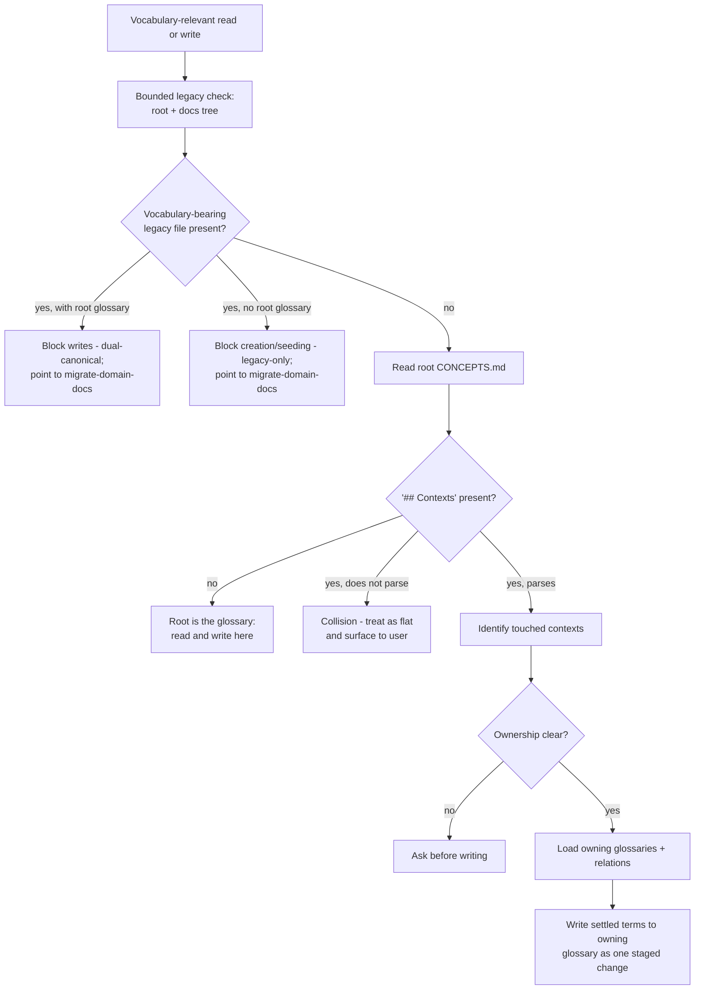
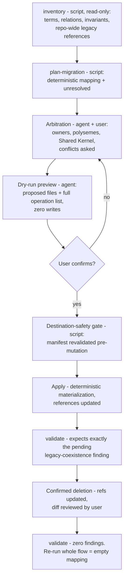

# Progressive Domain Vocabulary Protocol - Plan

## Goal Capsule

- **Objective:** Evolve the fork's `CONCEPTS.md` vocabulary substrate into one progressive protocol — flat root glossary by default, root index plus per-bounded-context glossaries when the domain requires it — with legacy `CONTEXT-MAP.md`/`CONTEXT.md` supported as import-only migration inputs, and the useful behaviors of Matt Pocock's `domain-modeling`/`grilling`/`grill-with-docs` absorbed into existing CE skills.
- **Authority hierarchy:** This plan > `docs/research/2026-08-09-domain-vocabulary-architecture.md` (verified hypothesis, corrected per Sources) > reviewer suggestions. Repo rules in `AGENTS.md` (Orca overlay, prose admission, CI gates) constrain every unit.
- **Stop conditions:** Stop and surface to the user if (a) an Orca hook anchor cannot be preserved without semantic loss, (b) the U9 eval thresholds in R17 cannot be met after two prose iterations, or (c) implementation shows a `session-settled:` decision is unworkable at invalidating grade.
- **Execution profile:** Fork-only changes. No end-user project migration (Powerlifting Lausanne explicitly out). No new public skill. Behavioral evals are PR evidence, not CI, but they gate the release (R17, U10).
- **Tail ownership:** Standalone `ce-work` run owns the shipping tail (branch, commits, PR).

---

## Product Contract

### Summary

The fork keeps `CONCEPTS.md` as the single entry point for domain vocabulary and makes it progressive: a repo with one coherent model keeps today's flat root glossary unchanged; a repo with several bounded contexts turns the root into a canonical index (contexts, ownership, relations, small shared vocabulary) pointing to per-context glossaries that follow the same entry rules. A structural sentinel — a parseable `## Contexts` section in the root file — switches behavior; no configuration key is added. `CONTEXT-MAP.md` and `CONTEXT.md` become importable legacy formats handled by an explicit, dry-run-first migration in `ce-compound-refresh`; a conflicting hybrid state blocks vocabulary writes. The lexical discipline worth keeping from Matt Pocock's skills (conflict detection, term sharpening, scenario pressure, code confrontation, ownership, settlement-gated capture, high ADR bar) is absorbed as behavior in `ce-brainstorm`, `ce-plan`, `ce-compound`, and `ce-compound-refresh` — without their nested orchestration, mandatory filenames, exhaustive interviewing, or incremental provisional writes.

### Problem Frame

Upstream's `CONCEPTS.md` system (unchanged through upstream 3.21.4) assumes one flat root glossary. That is correct until a project holds several legitimate models: then a single file either flattens polysemes into one wrong definition or grows ownership ambiguity that seeding and refresh cannot repair. Matt Pocock's skills carry the missing DDD discipline but as a parallel system with its own canonical files, which would make authority undecidable for agents. The fork currently has no resolver, no parity protection on the duplicated `concepts-vocabulary.md` rules, and no handling at all for `CONTEXT-MAP.md`/`CONTEXT.md`.

### Requirements

**Protocol**

- R1. The root `CONCEPTS.md` is always the entry point. When it has no parseable `## Contexts` section, it is the glossary to read and write — byte-for-byte today's structure and write target for existing CE projects.
- R2. When the root declares a parseable `## Contexts` section, it is an index carrying only: named contexts with links to their glossaries, one-line ownership per context, relations/dependency directions/translations, and an optional small `Shared vocabulary` section (Shared Kernel, governed, exception not default).
- R3. Context glossaries live at `<docs-root>/contexts/<context-slug>/CONCEPTS.md` (composing with the `docs_root` setting; default `docs/contexts/...`) and follow the same entry rules as the flat glossary. A context slug matches `^[a-z0-9]+(-[a-z0-9]+)*$`; a context name that cannot be slugified within that allowlist is never composed into a path.
- R4. Resolution rule for every vocabulary-relevant read or write: check for the legacy state per R5; read root; no parseable contexts section → root is the target; contexts declared → identify touched context(s) from focus, paths, and dialogue; load only their glossaries plus the relevant relations; a cross-boundary task loads both sides and their relation; ambiguous ownership → ask before writing (never infer an owner from mere presence of a term in a file); a new term is written to its owning context, never to the root as a catch-all.
- R21. The root declares its index in one canonical Markdown grammar (context entry shape, link form, ownership line, relation entry, `Shared vocabulary` subsection). A `## Contexts` section that does not parse as that grammar is a **collision, not an index**: readers and writers treat the root as a flat glossary and surface the collision to the user rather than reinterpreting the file. `validate` rejects a malformed or duplicate-entry index.
- R22. When the owning context is unambiguous but its glossary file does not exist, `ce-compound` and `ce-compound-refresh` create it at the composed path, seeded per `concepts-vocabulary.md` rules. `ce-brainstorm` and `ce-plan` never create it — brainstorm asks, plan gap-fill records the term under open questions.
- R23. The root `Shared vocabulary` section is the one governed exception to R4's no-root-writes rule. A term enters it only when contexts share its model, invariants, and governance; promotion requires explicit user approval; entries are written under the same settlement gate and transactional contract as context entries. A writer that cannot establish shared governance leaves the term in its owning context.
- R5. Legacy `CONTEXT-MAP.md`/`CONTEXT.md` are import-only formats. A legacy file is **vocabulary-bearing** when the inventory extractor yields at least one term definition from it; an empty scaffold, a headings-only file, or an unrelated project-notes file with the same name is not. Two blocked states follow, both pointing to the migration flow:
  - **Dual-canonical:** a vocabulary-bearing legacy file coexists with vocabulary-bearing `CONCEPTS.md` content → vocabulary writes are blocked with a message naming the conflict.
  - **Legacy-only:** a vocabulary-bearing legacy file exists and no root `CONCEPTS.md` does → glossary creation and seeding are also blocked, so no parallel canonical file is manufactured; any vocabulary-relevant flow surfaces a one-line pointer to the migration route instead of proceeding glossary-less.

  There is no permanent hybrid state and no configurable `concepts | context-map | hybrid` mode.

**Absorbed behaviors**

- R6. `ce-brainstorm` gains a domain tripwire with falsifiable triggers: a term used in a way that contradicts a loaded glossary entry; a vague or overloaded word carrying a decision; a new entity/process/status; a changed relation or invariant; a term crossing a declared context boundary. On trigger: surface the conflict or ambiguity immediately, propose a precise term with its owning context, and continue the dialogue.
- R7. When a relation or invariant carries product meaning, pressure-test the proposed definition with a concrete scenario or edge case before treating it as settled.
- R8. When the user asserts existing system behavior about a domain term, verify the claim against the code through the skill's existing research/validator mechanics (extended in scope to relations and boundaries, not a new mechanism).
- R9. Vocabulary capture happens only after settlement (post-Product-Contract in `ce-brainstorm`, post-plan in `ce-plan`, in Vocabulary Capture for `ce-compound`). A capture is one all-or-nothing staged change: when it spans two glossaries and the root relation, every target is validated before any is written, and a failure leaves every original file unchanged. No per-turn provisional writes to the source of truth.
- R10. An ADR is proposed only when all three hold: hard to reverse, surprising without context, real trade-off. The project's own ADR format and location are used; none is imposed.
- R11. Not absorbed, by decision: nested skill-to-skill orchestration, mandatory `CONTEXT*.md` filenames as canonical state, exhaustive decision-tree interviewing, and blocking all action until global confirmation. CE's right-sizing and gates stay authoritative.

**Migration**

- R12. `ce-compound-refresh` owns an explicit `migrate-domain-docs` flow with this canonical six-stage order:
  1. **inventory** (script, read-only): discover legacy files; extract contexts, terms, aliases, relations, and invariants; discover repo-wide references to the legacy files; detect duplicate and incompatible definitions and ownerless terms.
  2. **plan-migration** (script, read-only): deterministic mapping proposal; everything not unambiguous is emitted under `unresolved`.
  3. **arbitration** (agent + user): assign each term an owning context; keep polysemes as distinct context-qualified entries; promote to `Shared vocabulary` only per R23; unresolvable conflicts go to the user.
  4. **dry-run preview** (agent): render every proposed file plus the complete source-to-destination operation list, including reference updates and the deletions that would follow. No writes.
  5. **confirmed apply** (agent): after the destination-safety gate in R14 passes, materialize the arbitrated content deterministically and update references.
  6. **validate** (script): graph, path safety, intra-context uniqueness, invariant preservation, and legacy-reference completeness. The immediate post-apply run expects exactly the pending legacy-coexistence finding (deletion has not happened yet) and nothing else.

  After R13's confirmed deletion, a final `validate` reports zero findings. Idempotence is proven by re-running the whole flow: a second `plan-migration` on the migrated tree emits an empty mapping and an empty `unresolved` list, and a second apply mutates nothing.
- R13. Legacy files are deleted only after every discovered reference to them is updated and the user has reviewed the diff. Existing ADRs and their conventions are preserved.
- R14. Path safety throughout: repo-relative links only; reject absolute paths, traversal, and symlinks resolving outside the repo (lstat before trusting existence). Repository containment is not an authorization boundary — apply accepts only canonical glossary targets plus the explicitly enumerated, user-approved reference-update and deletion targets from the dry-run manifest, and revalidates that manifest immediately before each mutation. Every code path that can move or overwrite a user-authored legacy file is enumerated and guarded.
- R24. Legacy file content and everything extracted from it are **untrusted data, never instructions**. Arbitration and apply treat extracted text as values to place, and the dry-run shows the complete operation list for confirmation before any mutation or deletion.

**Mechanics and proof**

- R15. Mechanical work (locating files, parsing the R21 index grammar, enumerating glossary paths, validating the graph and links, detecting duplicates and both blocked states, proposing a deterministic migration mapping) is owned by one bundled script. Semantic judgments (which context owns a term, polyseme vs sloppy synonym, Shared Kernel promotion) are never made by the script.
- R16. The shared judgment rules live in one reference file duplicated byte-identically across the writer skills, protected by a parity test proven to fail on injected one-sided drift. The currently unprotected `concepts-vocabulary.md` pair gets the same protection.
- R17. Behavioral changes are evaluated with `skill-creator` fixtures covering: immediate conflict surfacing, edge-case scenario pressure, ambiguous-ownership ask, ADR gate accept and reject, routed write to a context glossary, both blocked states, flat-project non-regression, and restraint negatives (no tripwire on a plain small topic). Cross-host (Claude Code + Codex), at least 5 trials per scenario per host. **Thresholds gate the release:** correct-routing, blocked-state handling, and flat-project non-regression are zero-tolerance (no failure permitted); every other scenario needs at least 80% pass per host. Sub-threshold results block U10 and block retiring the legacy skills until remediated. Pass rates and trial counts are recorded in the PR body.

**Fork and compatibility**

- R18. Existing CE projects with a flat root `CONCEPTS.md` see zero change to glossary structure, file locations, and write targets until they opt into contexts by structure. No auto-migration, no forced split. The absorbed dialogue behaviors (R6-R10) apply to flat projects by design and are bounded by their own restraint rules; they are not gated on the sentinel.
- R19. Orca boundaries hold: upstream-owned skill files change only in upstream-contributable, cross-harness form; Orca hook anchors are preserved or updated together with `integrations/orca/upstream.json` and the parity tests; the Orca controller's write-ownership contract is extended to cover context glossary paths.
- R20. The design is upstream-shaped: a later upstream proposal to EveryInc must require no fork-specific carve-outs (the proposal itself is deferred follow-up work).

### Scope Boundaries

**In scope:** fork skill prose, skill-local references and script, tests, repo docs (`docs/skills/`, `AGENTS.md` row, this repo's own `CONCEPTS.md` entries), eval fixtures and eval evidence.

**Deferred to Follow-Up Work**

- Upstream PR to EveryInc (after fork validation; per R20 the design must already be contribution-clean). **If upstream declines,** the fork accepts permanent divergence across the four writer skills and the per-merge reconciliation cost that follows.
- Absorbing upstream 3.21.2–3.21.4 (orthogonal to vocabulary; normal upstream-merge process).
- Migrating Powerlifting Lausanne or any end-user project.
- A public `ce-domain-modeling` skill — only if evals later show frequent pure-modeling use without a requirements artifact.
- Retiring the locally installed Matt Pocock skills (user-machine action, gated on R17 thresholds; see Operational Notes).

**Outside this product's identity**

- A configurable vocabulary mode of any kind.
- Automatic Markdown merging of legacy files without arbitration.
- Script-decided term ownership.

---

## Planning Contract

### Key Technical Decisions

- KTD1. **Structural sentinel, not config.** A parseable `## Contexts` section in root `CONCEPTS.md` is the mode switch. Greppable, falsifiable, zero config surface. (session-settled: user-directed — chosen over a `domain_vocabulary_mode` config key: the fork has no central resolver a key could configure, and each option costs five synced surfaces per the `docs_root` precedent while permanently doubling behavioral test paths.)
- KTD2. **Per-context files, paths composed with `docs_root`.** `<docs-root>/contexts/<slug>/CONCEPTS.md`, not a literal `docs/contexts/...`. Separate files beat per-context sections in one root file because a task loads only the contexts it touches and each context's glossary carries its own change cycle — the same properties R2's split threshold is defined on. Root `CONCEPTS.md` stays at repo root (upstream contract).
- KTD3. **Two-layer mechanism, script in one skill only.** Layer 1: `references/domain-vocabulary.md` (resolution rule R4, index grammar R21, ownership, polysemy, Shared Kernel bar R23, write routing, R5 blocked states with the writers' own bounded legacy check) duplicated byte-identically into the four writer skills, canonical copy in `ce-compound-refresh`. Layer 2: one Python script `skills/ce-compound-refresh/scripts/domain-graph.py` for the mechanical work of R15. This diverges from the research note's "one script per consumer skill": the retired grounding-cache learning (`docs/solutions/skill-design/cross-skill-shared-cache-primitive.md`) shows per-skill machinery must beat the leanest correct alternative, and for writers outside refresh the leanest correct alternative is the prose resolution rule plus ordinary file reads.
- KTD4. **Readers get a two-line inline rule, not the reference.** `ce-explain`, `ce-ideate`, and the four `learnings-researcher` prompt assets extend their existing `CONCEPTS.md` grounding line with: if the root declares a parseable `## Contexts` section, also read the glossaries of the contexts the task touches. Reader failure is mild (missing vocabulary), writer failure is corruption (wrong-file writes); proportionality per the prose admission rules.
- KTD5. **Migration lives in `ce-compound-refresh` as an explicit request mode**, following that skill's existing triage-first, opt-in-headless design (`docs/solutions/skill-design/compound-refresh-skill-improvements.md`). The R5 blocked-state rules are owned by `domain-vocabulary.md` so every writer enforces them identically. `ce-compound-refresh` stays outside the Orca overlay (it carries no hooks today; none are added).
- KTD6. **The script proposes; the agent writes; validation is two-stage.** `domain-graph.py` subcommands: `inventory`, `validate`, `plan-migration` — all read-only, all emitting JSON to stdout, none writing repo files. Apply is the agent materializing arbitrated content under a **deterministic apply contract**: content is derived only from the arbitrated mapping (stable entry order, stable formatting), so re-applying the same mapping to the same tree is a no-op. Validation runs twice for different purposes — immediately post-apply it must report exactly the pending legacy-coexistence finding, and after R13's confirmed deletion it must report zero. Python with runtime interpreter probing (never bare `python3`), invoked via the tier-3 `SKILL_DIR` anchor with the load-bearing trailing `;`.
- KTD7. **Settlement-gated transactional capture is retained over Matt's incremental per-term writes.** Verified current behavior of `domain-modeling` is per-term write-on-resolution during the session — not per-turn provisional writes as the research note stated — but the divergence stands: CE's resolved-terms ledger writes once, post-settlement, as one all-or-nothing staged change (R9). (session-settled: user-directed — chosen over incremental in-session glossary writes: provisional terms must not touch the source of truth, and CE's pipeline/headless modes cannot assume an interactive session to repair them.)
- KTD8. **Absorb into existing skills; no new public skill.** (session-settled: user-directed — chosen over a standalone `ce-domain-modeling` skill: it would duplicate `ce-brainstorm`'s dialogue, grow the public inventory, and add a routing boundary — the exact nested-invocation weakness Matt's own docs report.)
- KTD9. **Anchor discipline for Orca.** The reworded regions of `ce-compound` must keep the recorded hook anchors (`"Launch research subagents."`, the Phase 2.5 heading, the grounding-validator seam) byte-stable, or update `integrations/orca/upstream.json` `hookAnchors` plus `tests/orca-native-parity.test.ts` in the same commit. The controller-ownership string in `skills/ce-compound/references/orca-read-analysis.md` (pinned by `tests/orca-native-parity.test.ts`) is extended to name context glossary writes; reference text and test pin change together.
- KTD10. **Base: `origin/main`, independent of the in-flight attestation branch.** The terminal-attestation work (root `CONCEPTS.md`, the `orca-routing.md` set, the Orca test files) sits on a separate unmerged branch. This plan branches from `origin/main` so its PR stays reviewable on its own; no unit may revert or re-edit those diffs, and U8's root `CONCEPTS.md` entries are appended in a distinct section so the two branches resolve trivially when both land.
- KTD11. **Attribution.** Behaviors are reimplemented in CE's own words; the PR body credits `mattpocock/skills` (MIT) as behavioral inspiration. If any substantial text is ever copied, its MIT notice is retained; none is planned. DDD claims cite Evans' DDD Reference (CC-BY 4.0) and Fowler's BoundedContext — not UbiquitousLanguage, which does not itself scope language to contexts.
- KTD12. **Build the migration half now, alongside the protocol half.** (session-settled: user-directed — chosen over deferring R5/R12-R14/U2-U3 to a later cycle triggered by a real legacy corpus: R5's blocked states are only honest if a migration route exists to point at, and the design is wanted complete now. Accepted cost, recorded so it is not rediscovered as a defect: the migration flow ships validated against synthetic fixtures until a real corpus is scheduled — see Open Questions.)

### Assumptions

- The plan artifact and all shipped prose are English per repo convention, though the driving analysis is French.
- Retirement of the locally installed `grilling`/`domain-modeling`/`grill-with-docs` skills is a user action on their machine, gated on R17's thresholds, and never a repo change.
- Upstream absorption of 3.21.2–3.21.4 proceeds independently; no unit here depends on it.
- The fork's own `CONCEPTS.md` and upstream's have no `## Contexts` section today (verified), so R21's collision branch protects end-user files rather than resolving a known conflict.

### Open Questions

- **Deferred (does not block implementation):** which real multi-context project validates split detection and the migration flow end-to-end. Powerlifting Lausanne is out of scope and unscheduled. Rollout step 4 blocks on naming one; until then the migration flow's real-corpus behavior is unproven and KTD12 records that as accepted.

### High-Level Technical Design

Resolution rule (R4/R5/R21) as every writer applies it:

Migration flow (R12) with its mechanical/judgment split:

Component ownership:

| Component | Owner | Consumers |
|---|---|---|
| `references/domain-vocabulary.md` (judgment contract) | canonical copy in `ce-compound-refresh` | duplicated into `ce-brainstorm`, `ce-plan`, `ce-compound` |
| `scripts/domain-graph.py` (mechanical resolver) | `ce-compound-refresh` only | migration + repo-wide audit flows |
| Inline two-line resolution rule | each reader skill | `ce-explain`, `ce-ideate`, 4× `learnings-researcher` assets |
| `concepts-vocabulary.md` (entry format, unchanged role, context-aware additions) | `ce-compound` + `ce-compound-refresh` pair | seeding/accretion, now parity-protected |

---

## Implementation Units

### U1. Shared judgment contract and parity protection

- **Goal:** Author `references/domain-vocabulary.md` and put all duplicated vocabulary references under proven parity tests.
- **Requirements:** R4, R5, R16, R21, R22, R23; KTD3.
- **Dependencies:** none.
- **Files:** `skills/ce-compound-refresh/references/domain-vocabulary.md` (canonical), copies in `skills/ce-brainstorm/references/`, `skills/ce-plan/references/`, `skills/ce-compound/references/`; `skills/ce-compound/references/concepts-vocabulary.md` + `skills/ce-compound-refresh/references/concepts-vocabulary.md` (context-qualified entry additions, kept byte-identical); `tests/domain-vocabulary-parity.test.ts` (new).
- **Approach:**
  1. Write the reference: the R21 canonical index grammar; the resolution rule (R4) including the writers' own bounded legacy check (repo root plus the docs tree and its contexts subtree, performed with ordinary file reads, no script); the R21 collision branch; write routing; the ownership ask-gate; polysemy as context-qualified entries; the R23 Shared Kernel bar and approval rule; R22 creation ownership; both R5 blocked states with their exact user-facing messages; the migration pointer. Falsifiable statements only, per the Skill Prose Admission Rules.
  2. Extend `concepts-vocabulary.md` minimally: entries may be context-qualified; a context glossary follows the same entry format; root-index entry types per R2/R21. Propagate byte-identically.
  3. Model the parity test on `tests/settled-decisions-parity.test.ts`: `SHARED_ASSETS` + consumer arrays, per-consumer `access()`, byte-parity loop, content-pinning on the canonical copy. Cover both `domain-vocabulary.md` (×4) and `concepts-vocabulary.md` (×2).
- **Patterns to follow:** `tests/settled-decisions-parity.test.ts`; `docs/solutions/workflow/reviewing-byte-duplicated-shared-assets.md` (edit canonical, `cp`-propagate, hash-verify).
- **Test scenarios:**
  - Byte-parity across all copies of both assets passes on the shipped tree.
  - A missing consumer copy fails the test.
  - Injected one-sided drift in any single copy fails the test (prove red once during development, per `docs/solutions/skill-design/paired-old-vs-new-injection-skill-evals.md`).
  - Content pin: canonical `domain-vocabulary.md` contains the index-grammar rule, the collision branch, the writers' bounded legacy-check procedure, and both blocked-state message tokens; removing any one fails.
- **Verification:** `bun test tests/domain-vocabulary-parity.test.ts` green; one recorded red run on injected drift.

### U2. Mechanical graph script and fixtures

- **Goal:** Ship `domain-graph.py` with deterministic tests for every mechanical guarantee.
- **Requirements:** R3, R5, R12 (mechanical stages), R14, R15, R21; KTD6.
- **Dependencies:** none (parallel with U1).
- **Files:** `skills/ce-compound-refresh/scripts/domain-graph.py`; `tests/domain-graph.test.ts` (new); fixtures under `tests/fixtures/domain-graph/` (new).
- **Approach:**
  1. Subcommands `inventory`, `validate`, `plan-migration`, each emitting JSON to stdout; no repo writes ever.
  2. Parsing: root `CONCEPTS.md` presence, the R21 index grammar, context links, glossary enumeration, term/alias/relation/**invariant** extraction, legacy file discovery, and **repo-wide discovery of references to legacy files**.
  3. Validation: index grammar conformance and duplicate entries; link targets exist and are repo-relative; reject absolute/traversal/symlink-escaping paths via lstat + realpath containment; duplicate canonical definitions within one context; both R5 blocked states; dangling context references; invariant preservation and legacy-reference completeness when a migration mapping is supplied.
  4. `plan-migration`: deterministic term→context mapping only where evidence is unambiguous (single legacy glossary, explicit map entries); everything else under `unresolved`. Emits the destination manifest the R14 gate revalidates. A context name that fails the R3 slug allowlist goes to `unresolved`, never into a path.
  5. Compose the docs-root-aware context path from an explicit `--docs-root` argument supplied by the calling skill (default `docs`); reject an absolute or `..`-containing value at argument parsing, mirroring the `ce-setup` `check-health` rules.
- **Execution note:** Test-first for the path-safety and slug rejections — these are the security-relevant surface.
- **Patterns to follow:** `tests/orca-config-resolution.test.ts` (subprocess + fixtures, `mkdtemp`, `afterEach` cleanup); `docs/solutions/conventions/resolve-python-interpreter-not-python3.md`; `docs/solutions/best-practices/prefer-python-over-bash-for-pipeline-scripts.md`; cross-file isolation rules in `AGENTS.md` CI section.
- **Test scenarios:**
  - Simple fixture (root glossary, no contexts): `inventory` lists terms; `validate` reports zero findings.
  - Multi-context fixture with the same term defined differently in two contexts: `validate` accepts (polysemy is legal across contexts).
  - Same term defined twice within one context: `validate` flags a duplicate.
  - Cross-context fixture: `inventory` exposes the relation entries the resolution rule needs.
  - Malformed `## Contexts` section (prose, not the R21 grammar): `validate` reports a collision finding and does not treat the file as an index.
  - Duplicate context entries in the index: `validate` flags them.
  - Root index linking `../outside/CONCEPTS.md`, an absolute path, and a symlink escaping the fixture root: `validate` rejects each with a distinct finding code.
  - A context name containing `/`, `..`, or uppercase/space characters: `plan-migration` emits it under `unresolved` and composes no path.
  - `--docs-root ../evil` and `--docs-root /etc`: rejected at argument parsing.
  - Dual-canonical fixture (`CONTEXT-MAP.md` + two `CONTEXT.md` + root `CONCEPTS.md` sharing terms): `validate` reports the dual-canonical state; `plan-migration` maps unambiguous terms and flags shared ones as `unresolved`.
  - Legacy-only fixture (legacy files, no root `CONCEPTS.md`): `validate` reports the legacy-only blocked state.
  - Non-vocabulary `CONTEXT.md` (project notes, no term definitions) beside a root glossary: `validate` reports **no** blocked state.
  - Invariants present in a legacy glossary appear in `inventory` output and are flagged missing by `validate` when a mapping drops them.
  - A repo file linking to `CONTEXT-MAP.md`: `inventory` reports it as a legacy reference; `validate` flags deletion-readiness as incomplete while it remains.
  - Post-apply state (migrated glossaries + legacy files still present): `validate` reports exactly the pending legacy-coexistence finding.
  - Fully migrated state (legacy removed): `validate` reports zero findings.
  - `plan-migration` on the migrated tree emits an empty mapping and an empty `unresolved` list — the R12 idempotence proof.
  - `inventory`, `validate`, and `plan-migration` leave the fixture tree byte-identical (no writes).
  - Windows-safe: assertions substring-based, no `\n`-anchored regexes (CRLF learning).
- **Verification:** `bun test tests/domain-graph.test.ts` green; script runs under a probed interpreter, not hardcoded `python3`.

### U3. `ce-compound-refresh`: graph audit, split detection, and migration mode

- **Goal:** Make `ce-compound-refresh` the single owner of repo-wide bootstrap, graph audit, split recommendation, and legacy migration.
- **Requirements:** R2, R12, R13, R14, R24; KTD5, KTD6.
- **Dependencies:** U1, U2.
- **Files:** `skills/ce-compound-refresh/SKILL.md`; `skills/ce-compound-refresh/references/domain-migration.md` (new — the flow is late-sequence, conditional, and a meaningful share of the skill, so it is extracted per the Skill Loading Supplements with a 1-3 line inline condition); `tests/skills/ce-compound-refresh-domain.test.ts` (new).
- **Approach:**
  1. Extend the bootstrap section (currently lines ~43-50): create flat form by default; recommend a split only on the semantic threshold (polysemy, divergent invariants, translation need, separate change cycles) — never on line count. Honor R5's legacy-only block before creating anything.
  2. Vocabulary audit (currently ~133-149) additionally runs `domain-graph.py validate` and reconciles findings: index-grammar collisions, intra-context duplicates, crushed polysemes in a flat glossary, Shared Kernel candidates reviewed against R23.
  3. New explicit request route `migrate-domain-docs` implementing R12's six stages in order, with the R14 destination-safety gate between confirmation and apply, and the R24 untrusted-data rule stated where arbitration reads legacy content. Headless mode follows the skill's existing opt-in `mode:headless` design and stops at the dry-run report (no writes without a user).
  4. Report enums extended (migration outcome line, graph-audit line) — keep the existing report token style so `tests/skills/ce-compound-headless-depth.test.ts` conventions carry over.
  5. Script invocations use the `SKILL_DIR` anchor with trailing `;`, one pinned command per call, with the `--docs-root` value quoted.
- **Patterns to follow:** the skill's own triage-first structure; `docs/solutions/best-practices/preserve-user-content-across-all-destructive-paths.md` (enumerate every path touching legacy files; the only deletion point is the user-confirmed step of R13).
- **Test scenarios:**
  - SKILL.md (or the extracted reference) contains the `migrate-domain-docs` route token and states the R24 untrusted-data rule.
  - The six stages appear in R12's canonical order (`indexOf` ordering across all six).
  - The destination-safety gate is stated between user confirmation and apply.
  - The two-stage validation is stated: post-apply expects the pending legacy-coexistence finding; post-deletion expects zero.
  - The legacy-deletion rule names both preconditions (references updated, user-reviewed diff).
  - The legacy-only block is stated in the bootstrap section (creation blocked, migration pointed to).
  - Headless mode stops at the dry-run report — pinned as a no-writes rule.
  - Bash blocks carrying the script call use the `SKILL_DIR` anchor with trailing `;` and a quoted `--docs-root` (flatten-safety check per `tests/orca-doc-contracts.test.ts` style).
  - `Test expectation` for prose judgment (split recommendation quality): none in CI — covered by U9 evals.
- **Verification:** `bun test tests/skills/ce-compound-refresh-domain.test.ts` green; `bun run test` green.

### U4. `ce-compound`: routed accretion and validated grounding

- **Goal:** Replace the fixed root write target with the resolved owning glossary across all of `ce-compound`'s vocabulary seams, keeping Orca anchors intact.
- **Requirements:** R4, R9, R19, R22; KTD9.
- **Dependencies:** U1.
- **Files:** `skills/ce-compound/SKILL.md` (Phase 2.4 ~377-397 plus the further seams at ~45-47, 75, 120-123, 171, 401, 417, 510-516, 556, 578-587, 652, 674-692, 733); `skills/ce-compound/references/grounding-validation.md`; `skills/ce-compound/references/orca-read-analysis.md`; `tests/orca-native-parity.test.ts`; `tests/skills/ce-compound-headless-depth.test.ts` (only if pinned report lines change).
- **Approach:**
  1. Phase 2.4 loads `references/domain-vocabulary.md` and writes to the resolved target; per R22 it may create a declared context's missing glossary; a learning crossing a boundary updates two glossaries and the root relation as one staged all-or-nothing change (R9), each change evidence-backed.
  2. Sweep every listed seam so no stray "root `CONCEPTS.md`" wording contradicts routing; the discoverability check (~510-516) covers context glossaries reachable via the root index.
  3. `grounding-validation.md`: validator scope explicitly includes entries written to context glossaries and root relation edits.
  4. `orca-read-analysis.md`: extend the controller-ownership sentence to context glossary writes; update the pinned `controllerAnchor` string in `tests/orca-native-parity.test.ts` in the same commit. Do not move the recorded hook anchors; if a rewording forces it, update `integrations/orca/upstream.json` `hookAnchors` and rerun `bun run orca:upstream-check`.
- **Patterns to follow:** existing Phase 2.4 wording style; the hook-seam expectations in `tests/orca-native-parity.test.ts:243-268`.
- **Test scenarios:**
  - `tests/orca-native-parity.test.ts` green with the updated controller anchor (and proven red if the reference text and test pin diverge).
  - `tests/skills/ce-compound-headless-depth.test.ts` green (report line either unchanged or pin updated with it).
  - `ce-compound` SKILL.md references `domain-vocabulary.md` in Phase 2.4 and states the all-or-nothing multi-file rule.
  - Negative: SKILL.md no longer instructs an unconditional root write in Phase 2.4.
- **Verification:** `bun test tests/orca-native-parity.test.ts tests/orca-upstream-parity.test.ts tests/skills/ce-compound-headless-depth.test.ts` green; `bun run orca:upstream-check` green.

### U5. `ce-brainstorm`: domain tripwire and routed capture

- **Goal:** Absorb the active lexical discipline into the brainstorm dialogue and route its post-settlement capture.
- **Requirements:** R6, R7, R8, R9, R10, R11, R22.
- **Dependencies:** U1.
- **Files:** `skills/ce-brainstorm/SKILL.md` (grounding ~220, Vocabulary Capture ~354-364, plus the dialogue/pressure-test sections that own the tripwire); `tests/skills/ce-brainstorm-domain-tripwire.test.ts` (new, minimal token pins).
- **Approach:**
  1. Add the tripwire as a compact block in the dialogue rules with the R6 trigger list verbatim as falsifiable conditions; on fire, follow the R6 sequence (surface → propose term + owner → scenario-test per R7 when a relation/invariant is in play → code-check per R8 when existing behavior is asserted). Reuse the existing one-question-at-a-time and research mechanics — add no second questioning protocol.
  2. Route Vocabulary Capture through `references/domain-vocabulary.md` (still gated on the glossary existing; per R22 brainstorm asks rather than creating a missing context glossary).
  3. Add the R10 ADR gate as a short heuristic at the settlement tail; project conventions decide format and location.
  4. Restraint is part of the contract: the tripwire block states when NOT to fire (no glossary in repo and no contradiction in play; casual synonym use with no decision riding on it).
- **Patterns to follow:** Skill Prose Admission Rules; keep the tripwire inline at its firing point (post-menu-routing learning).
- **Test scenarios:**
  - SKILL.md pins: tripwire trigger list present; restraint condition present; ADR gate names all three conditions on one line; capture section references `domain-vocabulary.md`.
  - Negative: no instruction to write vocabulary before the Product Contract.
  - Behavioral quality (does it fire correctly, does it hold back): U9 evals, not CI.
- **Verification:** new test green; `bun run test` green.

### U6. `ce-plan`: routed reads and ownership-safe gap-fill

- **Goal:** Make planning consume context vocabulary correctly and stop silent ambiguous-ownership writes.
- **Requirements:** R4, R9, R22.
- **Dependencies:** U1.
- **Files:** `skills/ce-plan/SKILL.md` (reader ~330, gap-fill ~755-756); copy of `references/domain-vocabulary.md` already landed by U1; `tests/skills/ce-plan-vocabulary.test.ts` (new, minimal pins).
- **Approach:**
  1. Reader line: load root; when a parseable contexts section is declared, read the glossaries of the contexts the plan touches and plan with their qualified terms.
  2. Gap-fill: resolve the owner via the reference before adding an entry; when ownership is ambiguous or the owning context's glossary does not exist, skip the write and record the term under the plan's open questions instead of asking mid-flow (gap-fill is a silent path today; keep it non-blocking).
  3. A code/model divergence identified upstream becomes explicit plan work only when in scope (already the skill's default; state the vocabulary case in one line).
- **Patterns to follow:** current gap-fill paragraph's compact style.
- **Test scenarios:**
  - Pin: gap-fill paragraph references `domain-vocabulary.md` and contains the ambiguous-ownership skip rule and the missing-glossary skip rule.
  - Negative: gap-fill no longer says to fill terms into the root unconditionally.
- **Verification:** `bun test tests/skills/ce-plan-vocabulary.test.ts` green; `bun run test` green.

### U7. Reader alignment: `ce-explain`, `ce-ideate`, learnings researchers

- **Goal:** Context-aware reading everywhere vocabulary grounds output, at minimal prose cost.
- **Requirements:** R4 (read half); KTD4.
- **Dependencies:** U1 (wording source).
- **Files:** `skills/ce-explain/SKILL.md` (~87); `skills/ce-ideate/SKILL.md` (~299-305); `skills/{ce-code-review/references/personas,ce-plan/references/agents,ce-ideate/references/agents,ce-optimize/references/agents}/learnings-researcher.md` (Step 0 blocks, ~18-22); extend `tests/domain-vocabulary-parity.test.ts` with a section-scoped parity check.
- **Approach:**
  1. Extend each grounding line with the two-line inline rule (KTD4). Identical wording everywhere it appears.
  2. The four learnings-researcher Step 0 blocks are today identical in wording but the files are not byte-identical overall; pin the shared Step 0 block with a section-scoped parity assertion (extract between stable markers, compare across the four), not whole-file parity.
- **Patterns to follow:** section-scoped assertion style from `tests/skills/*` (`indexOf` slicing).
- **Test scenarios:**
  - Section parity: the Step 0 grounding block is identical across the four learnings-researcher assets; one-sided drift fails.
  - Each reader file contains the contexts-aware clause exactly once.
- **Verification:** extended parity test green; `bun run test` green.

### U8. Repo docs and self-application

- **Goal:** Documentation reflects the protocol; this repo's own glossary stays exemplary.
- **Requirements:** R1-R5, R18, R21 (documentation).
- **Dependencies:** U3, U4, U5, U6 (documented behavior final).
- **Files:** `docs/skills/ce-compound.md` (update `CONCEPTS.md` side-effect section); `docs/skills/ce-compound-refresh.md`, `docs/skills/ce-brainstorm.md`, `docs/skills/ce-plan.md` (add the vocabulary/migration behavior each now carries — all three are silent on CONCEPTS today); `AGENTS.md` (directory-layout row ~73: one line on the progressive form); root `CONCEPTS.md` (new entries: Bounded context glossary, Context index, Shared vocabulary, Domain graph — following existing entry format).
- **Approach:** One focused pass; each page documents only its skill's own behavior and points migration to `ce-compound-refresh`. No inventory or count changes (no skill added/removed), so `tests/release-metadata.test.ts` is untouched.
- **Test scenarios:** `Test expectation: none -- documentation-only unit; consistency is covered by review and release:validate.`
- **Verification:** `bun run release:validate` and `bun run plugin:validate` green.

### U9. Behavioral evals

- **Goal:** Evidence that the absorbed behaviors fire, route, and hold back correctly on both hosts, at the thresholds that gate release.
- **Requirements:** R17, R18.
- **Dependencies:** staged — the tripwire/restraint subset depends only on U1 + U5; the routed-write and blocked-state subset on U3 + U4; the full cross-host matrix on U3-U7.
- **Files:** eval fixtures/prompts under the `skill-creator` workflow's own conventions (not repo product code); results recorded in the PR body.
- **Approach:** Use `skill-creator`'s eval workflow (fresh subagent injection — plugin caching makes same-session dispatch test stale prose). **Run the tripwire/restraint subset immediately after U5**, before U4's seam sweep and U7 are built on top, so over-firing surfaces at the cheapest point; run the remaining scenarios and the full cross-host matrix after U7. Fixtures must be discriminating: the naive behavior (write to root; no conflict surfaced; ADR for everything) must be tempting and wrong. Include paired old/new prose injections for the tripwire and routed-write changes; run on Claude Code and Codex; at least 5 trials per scenario per host; report pass rates and defensive-value notes (strong models may mask gains — control per `docs/solutions/skill-design/strong-models-mask-defensive-skill-fixes.md`).
- **Test scenarios (eval fixtures):**
  - Conflict: user redefines a term the fixture glossary defines otherwise → surfaced immediately, before the Product Contract advances.
  - Overloaded word carrying a decision → sharpening question with context qualification.
  - Relation change → concrete scenario proposed before settling.
  - Asserted existing behavior contradicted by fixture code → code confrontation.
  - Ambiguous ownership across two declared contexts → ask, never silent write. **(zero-tolerance)**
  - ADR gate: one case meeting all three conditions (proposed) and one meeting two (skipped).
  - Routed write: settled term lands in the owning context glossary, not root. **(zero-tolerance)**
  - Dual-canonical fixture → writes blocked, migration pointed to. **(zero-tolerance)**
  - Legacy-only fixture → creation blocked, migration pointed to. **(zero-tolerance)**
  - Malformed `## Contexts` section → treated as flat, collision surfaced, no misrouted write. **(zero-tolerance)**
  - Flat-project non-regression: on a flat-glossary fixture, `ce-compound`, `ce-brainstorm`, and `ce-plan` resolve and write to the root exactly as before, with no context-mode ceremony. **(zero-tolerance)**
  - Restraint negatives: small plain topic with no glossary → no tripwire, no vocabulary ceremony; casual synonym with nothing at stake → no interruption.
- **Verification:** every zero-tolerance scenario passes on both hosts with no failure; every other scenario ≥80% per host; pass rates and trial counts in the PR body per repo convention (evals are PR evidence, not CI). Sub-threshold results block U10.

### U10. Fork release wiring

- **Goal:** Ship the change as a proper fork release without breaking upstream-sync machinery.
- **Requirements:** R17 (thresholds met), R19, R20.
- **Dependencies:** U1-U9 merged, including U9's thresholds met.
- **Files:** `integrations/orca/protocol.json` (`integration.revision` bump); `.github/release-please-config.json` (`release-as` set to the exact `bun run orca:version` output).
- **Approach:** Follow the AGENTS.md Orca release lifecycle verbatim; release automation owns manifest writes; remove the stale `release-as` after the release ships. Nothing lands in the legacy-cleanup registries — no skill, agent, command, or shipped file is removed by this plan (legacy `CONTEXT*` files are end-user project content, not plugin artifacts).
- **Test scenarios:** `Test expectation: none -- release configuration; bun run release:validate enforces the lifecycle.`
- **Verification:** `bun run orca:upstream-check`, `bun run release:validate` green; U9 evidence recorded and at threshold.

---

## Verification Contract

| Gate | Command | Applies to |
|---|---|---|
| Full suite (CI-identical) | `bun run test` | every unit |
| New deterministic guards | `bun test tests/domain-vocabulary-parity.test.ts tests/domain-graph.test.ts tests/skills/ce-compound-refresh-domain.test.ts` | U1-U3, U7 |
| Orca parity | `bun test tests/orca-native-parity.test.ts tests/orca-upstream-parity.test.ts` + `bun run orca:upstream-check` | U4, U10 |
| Release consistency | `bun run release:validate` | U8, U10 |
| Plugin schema | `bun run plugin:validate` | U8 |
| Behavioral evidence | `skill-creator` evals, cross-host, R17 thresholds, pass rates in PR body | U9, gates U10 |

Every new test file isolates in its own `mktemp` tree (parallel workers); parity tests must each be observed red on injected drift once before merge.

## Definition of Done

- All units U1-U10 complete; `bun run test`, `bun run release:validate`, `bun run plugin:validate`, `bun run orca:upstream-check` green.
- Flat-project compatibility proven on two surfaces: U2's simple fixture for structure and write-target stability, and U9's flat-project non-regression scenario for writer behavior. The script fixture alone does not prove R18.
- The migration flow demonstrated end-to-end on the U2 legacy fixture: dry-run produces no writes; the destination-safety gate rejects an unsafe manifest; post-apply `validate` reports exactly the pending legacy-coexistence finding; post-deletion `validate` reports zero; re-running the whole flow emits an empty mapping and mutates nothing.
- U9 eval evidence recorded in the PR body, with every zero-tolerance scenario passing and every other scenario at or above its threshold.
- PR body credits `mattpocock/skills` (MIT) as behavioral inspiration and fills the Security and Agent Disclosure sections.
- No abandoned experimental code, no changes outside the fork.

---

## Operational / Rollout Notes

Rollout order after merge:

1. Land this plan's PR (base is clean as of `841fb5d0`; see KTD10).
2. Confirm U9 thresholds are met and recorded. Sub-threshold results stop the rollout here.
3. Cut the fork release (U10); dogfood on this repo itself — its own `CONCEPTS.md` gains entries (U8) and stays flat (one coherent domain: no split).
4. Schedule and name a real multi-context candidate project, then run the `ce-compound-refresh` audit on it to exercise split detection and, where legacy `CONTEXT*` files exist, the migration dry-run — apply only after arbitration. This step blocks until a candidate is named; until then the migration flow's real-corpus behavior is unproven (Open Questions, KTD12). Powerlifting Lausanne remains out of scope until the user schedules it.
5. When U9 thresholds plus at least one real brainstorm session show the absorbed behaviors firing and holding back correctly, retire the locally installed `grilling`, `domain-modeling`, and `grill-with-docs` skills (user-machine action; nothing in this repo references them).
6. Draft the upstream proposal to EveryInc from the merged fork state (deferred follow-up): generic multi-context extension, no fork or project-specific assumptions.

## Sources & Research

- `docs/research/2026-08-09-domain-vocabulary-architecture.md` — origin analysis (verified 2026-08-10; treated as corrected hypothesis, not authority). Corrections applied: `grill-with-docs` on current main is still a thin wrapper (not inlined interrogation); Matt's capture is per-term-on-resolution during the session (not per-turn provisional writes) — KTD7's divergence stands on its own grounds; ubiquitous-language-per-context claims cite Evans/Fowler-BoundedContext, not UbiquitousLanguage; context paths compose with `docs_root` (KTD2).
- Upstream verification (2026-08-10): EveryInc main at 3.21.4; 3.21.2-3.21.4 delta does not touch vocabulary; upstream has no bounded-context work or proposals; `concepts-vocabulary.md` twins last changed by the docs_root PR (#1245), inside the fork's 3.21.1 baseline.
- Fork surface verification (2026-08-10): all research-note line references confirmed with minor drift; additional `ce-compound` seams enumerated in U4; `concepts-vocabulary.md` parity currently unprotected; no `CONTEXT-MAP.md`/`CONTEXT.md` handling exists anywhere; `ce-compound-refresh` carries no Orca hooks.
- Key institutional learnings: `docs/solutions/skill-design/portable-agent-skill-authoring.md` (protocol/judgment split, proportional evals); `docs/solutions/workflow/reviewing-byte-duplicated-shared-assets.md`; `docs/solutions/skill-design/paired-old-vs-new-injection-skill-evals.md`; `docs/solutions/skill-design/cross-skill-shared-cache-primitive.md` (KTD3's cost bar); `docs/solutions/skill-design/compound-refresh-skill-improvements.md` (KTD5); `docs/solutions/best-practices/preserve-user-content-across-all-destructive-paths.md` (R14); `docs/solutions/skill-design/bundled-script-path-resolution-across-harnesses.md` (KTD6); `docs/plans/2026-07-22-001-feat-configurable-docs-root-plan.md` (KTD1 cost precedent, fail-stop convention).
- DDD grounding: Evans, DDD Reference (domainlanguage.com, CC-BY 4.0) — bounded context, context map, small Shared Kernel; Fowler, BoundedContext (polysemy, translation). Neither prescribes file names.
