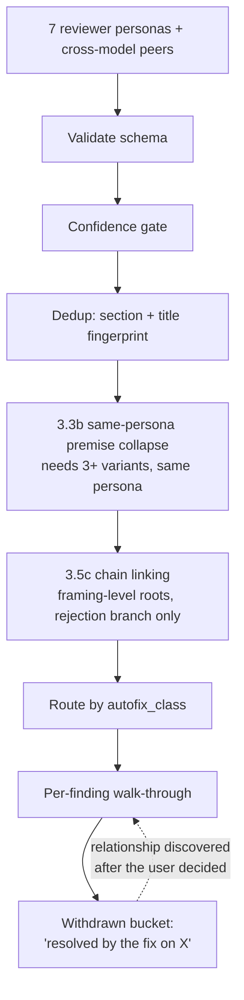
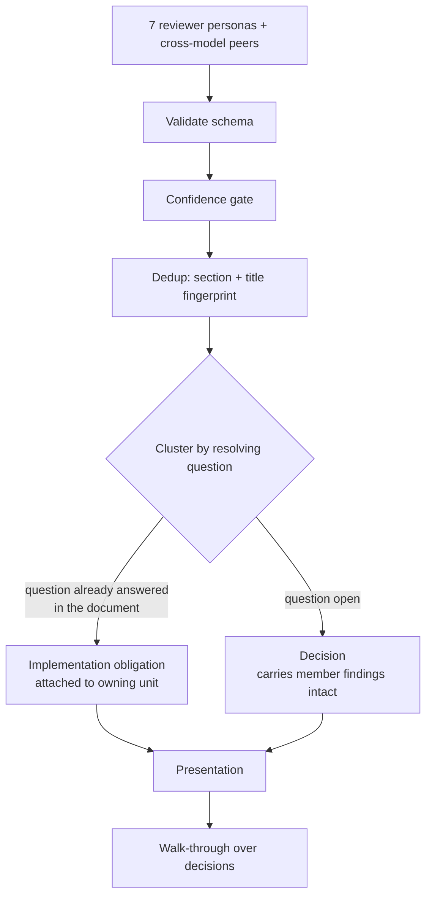
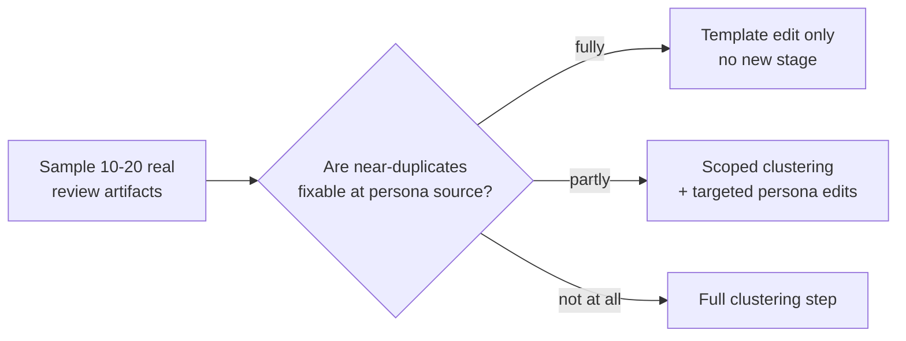

# fix: Make ce-doc-review present decisions instead of findings

## Goal Capsule

`ce-doc-review` asks the user to adjudicate individual findings. On a real 927-line plan it surfaced 34 items, of which 7 were already known duplicates and 4 were already marked skip. Hand-clustering the 23 actionable findings by *what single question resolves each one* collapses them to 9 decisions plus 7 entailed corrections that need no user judgment at all.

This plan changes the unit the user acts on from a finding to a decision — but gates that structural change behind an evidence bar the repository already requires, because a competing explanation (personas emitting near-duplicates at source) would be fixed by a much smaller change.

---

## Product Contract

### Summary

Cluster review findings by the question whose answer resolves them, present decisions rather than findings, and route entailed corrections to the implementation unit that owns them. Prove the change with paired old-vs-new behavioral evals across a purpose-built fixture corpus before it ships.

### Problem Frame

The synthesis pipeline is finding-centric end to end. Every stage preserves individual findings as the unit of work: the routing question offers "Review each finding one by one," the walk-through is a per-finding loop, and `recommended_action` is computed per finding. No stage asks what the smallest set of decisions is.

Two grouping mechanisms exist and both are too narrow to matter. Cross-persona dedup fingerprints on `normalize(section) + normalize(title)`, so the same problem attached to different sections under different titles survives as separate items. Premise-dependency chain linking only fires when a *framing-level* premise is rejected, cascading dependents that evaporate with it — it models "if we kill this premise these disappear," not "whichever way we decide this, these are settled." The latter is the common shape.

Evidence from the observed run, extracted from the recorded reviewer transcripts:

- Four findings from one reviewer, all on the same implementation unit, are four facets of one question — how much UI contract that unit carries. Different titles defeat section+title dedup; different `why_it_matters` phrasing defeats same-persona premise collapse.
- Four separate pairs of findings, each pair raised by two different reviewers at different sections with different titles, each pair resolved by one decision. No cross-persona semantic mechanism exists to catch these.
- Seven findings were entailed corrections — contradictions the document already resolves elsewhere, a missing implementation owner for diagnostics the plan already requires, an exclusion callsite the plan's own decision implies removing. These were routed as user decisions.

The skill already computes the relationship needed, at the wrong end of the pipeline: the bulk preview's withdrawn bucket retires findings as "resolved by the applied fix on X" — but only after the user has decided, as cleanup, never as the structure it presents.

A second symptom is visible in the same data and is **not yet diagnosed**: all 23 findings arrived at confidence anchor 75 or 100, none at 50, so the FYI tier absorbed nothing. Two mechanisms produce that identical symptom and they call for opposite fixes. See R7.

### Key Decisions

1. **The decision, not the finding, is the unit the user acts on.** (session-settled: user-approved — chosen over keeping per-finding routing and adding an authority gate in front of it: adjudicating a question surfaces the tradeoff a disconnected edit proposal hides.) **This does not by itself defuse the authority problem — it enlarges the blast radius of a single Apply**, so KTD7 sets the compensating floor. Governs R1, R2, R4.

2. **No numeric cap on findings or decisions.** (session-settled: user-approved — chosen over a fixed 5-8 decision budget: `ce-doc-review-calibration-patterns.md` already rejected a numeric cap in favor of "the criteria themselves are the filter," and every production review system found in external prior art controls volume with a precision bar rather than post-hoc truncation.) Governs R6.

3. **The cross-model pass keeps discovering, not only corroborating.** (session-settled: user-approved — chosen over gating peer findings on corroboration with an in-process reviewer: blind-spot catching across model families was the purpose of that pass, and corroboration-gating discards it.) Governs R5.

4. **The structural change is gated on sampled evidence, not on the observed run.** (session-settled: user-directed — chosen over building the clustering step directly: the repository killed a prior synthesis-stage proposal after sampling showed the diagnosis was "directionally correct but mechanistically wrong," and set a 10-20 artifact bar for structural interventions.) Governs R8.

5. **Behavioral evals gate the ship, and run across a purpose-built corpus.** (session-settled: user-directed — chosen over shipping the deletions first and measuring afterward: clustering's failure mode is silent, so it must be measured before it lands.) Governs R9, R10.

### Requirements

- **R1** — Findings that share a resolving question are presented as one decision, with the findings it settles listed under it.
- **R2** — A finding whose resolving question is already answered in the document under review is an implementation obligation, attached to the unit that owns it, and is not presented as a user decision.
- **R3** — Clustering is non-destructive. Every constituent finding is retained as a record with its own `section`, `title`, and `evidence` intact.
- **R4** — Every **actionable** finding (anchor 75 or 100) that enters clustering leaves it assigned to exactly one decision or one obligation. Advisory findings (anchor 50) bypass clustering and remain a third bucket with their existing exported count. No finding is dropped, hidden, or silently merged out of existence.
- **R5** — Cross-model peer findings continue to enter synthesis and may originate a decision; they remain barred from silent apply without in-process corroboration.
- **R6** — No rule in the skill states a typical or maximum number of decisions, roots, clusters, or findings.
- **R7** — The empty advisory tier is diagnosed to a specific cause before any calibration text changes.
- **R8** — The clustering step is not added until sampled evidence shows source-level correction is insufficient.
- **R9** — Behavioral evidence covers both a strong-model and a weaker-model host, and both Claude and Codex.
- **R10** — No behavioral claim rests on a single run.
- **R11** — Deleting a rule also deletes the downstream prose, footnotes, and rendering machinery that only existed to serve it.
- **R12** — Callers that parse the output envelope continue to work, or are updated in the same change.

### Success Criteria

- Every actionable finding in an eval run traces to exactly one decision, one obligation, or one advisory observation, verified per run rather than in aggregate.
- **The post-change arm reduces items the user must adjudicate by more than the per-cell variance U9 measures.** Without this, every other gate passes on a run that produces one single-member decision per finding — the change would satisfy the contract while delivering nothing.
- Decision count and obligation count are reported with variance across trials, not as single numbers.
- The negative control's post-change mean falls inside the pass band computed from its own pre-change spread, and no pre-change finding is absent post-change.
- No caller of `ce-doc-review` breaks: `bun run test` and `bun run release:validate` pass.
- Net line count across `skills/ce-doc-review/` decreases.

### Scope Boundaries

In scope: the synthesis pipeline's grouping and routing steps, the presentation surfaces that render them, the two multiplicative reviewer instructions, the envelope contract shared with `ce-plan`, the eval fixture corpus, and the captured learnings this change supersedes.

Out of scope:

- A numeric decision budget or finding cap, in any form.
- Reversing the additive cross-model design.
- Restructuring the reviewer persona set, or changing which personas activate.
- HTML-plan review mutation, which remains markdown-only.

#### Deferred to Follow-Up Work

- Porting `ce-code-review`'s independent per-finding validator to the bulk-apply path. Its original exclusion rationale — that doc review has no externalizing mode and its worst case is a report dismissed with a keystroke — is falsified by a bulk preview that applies 21 edits on one confirmation. It stays deferred as the escalation if the clustering and authority changes prove insufficient.
- Instrumenting the drop-count footnote to break down suppression reasons permanently, beyond what R7's diagnosis needs.

### Dependencies and Assumptions

- The three existing fixtures at `tests/fixtures/ce-doc-review/` are wired to no test and are referenced only by prose.
- `ce-plan` is the only caller coupled to the output envelope's parsed counts. `ce-brainstorm` depends on the completion signal and residual severity counts. `lfg` reaches the skill through `ce-plan`.
- No open pull request currently touches this skill's synthesis pipeline.

### Sources and Research

- Recorded reviewer transcripts and bulk-preview blocks from the observed run, extracted from an `omp` session store.
- `docs/solutions/skill-design/ce-doc-review-calibration-patterns.md`, `confidence-anchored-scoring.md`, `safe-auto-rubric-calibration.md`, `multi-surface-output-needs-a-shared-rendering-floor.md`, `paired-old-vs-new-injection-skill-evals.md`, `validate-skill-prose-behavior-with-cross-host-evals.md`, `strong-models-mask-defensive-skill-fixes.md`.
- `docs/solutions/best-practices/ce-pipeline-end-to-end-learnings.md` for the structural-intervention evidence bar.
- External prior art on review-volume control: a per-analyzer precision floor at Google, a production multi-persona LLM reviewer reaching 1.2 findings per review through upstream suppression, and developer-facing research showing volume converts false positives into missed true positives.

---

## Planning Contract

### Key Technical Decisions

- **KTD1 — Clustering is a routing and presentation layer over the finding set, not a replacement for it.** (session-settled: user-approved — chosen over collapsing findings into new decision objects.) Round-to-round memory keys on a single finding's `normalize(section) + normalize(title)` plus evidence overlap. A decision has neither a single section nor a single evidence array, so a destructive collapse would break rejected-finding suppression, the fix-landed check, the decision primer, and the open-questions dedup key at once — every finding the user settled would re-raise next round. Governs R3.

- **KTD2 — Keep the envelope's bucket names and exported counts; change what a bucket entry *is*.** The envelope already uses `Decisions` for `manual`-class findings and exports `decisions_count`, which `ce-plan` parses and gates its handoff menu on. Today's two actionable buckets split by `autofix_class`, and one clustered decision will routinely contain both a concrete-fix finding and a judgment finding — so the split cannot survive on its current basis. Resolution: keep both bucket names and both exported counts, and re-base the split on **whether the cluster has a committed recommendation** — a cluster whose resolution is determined lands in the proposed-fixes bucket, one requiring judgment lands in decisions. A cluster entry, not a finding, becomes the counted item. This preserves the parsed contract and the menu gate while making the counts mean what a reader assumes they mean: how many things need attention.

  **Obligations and advisory observations are separate channels, not a third and fourth actionable bucket.** Advisory findings keep their existing exported count unchanged. Obligations gain one new exported count alongside the two actionable ones. Neither conflicts with the rejection below, which is about redefining the two *actionable* buckets — obligations were never one of them.

  Rejected alternatives: minting a new vocabulary for the two actionable buckets, which would silently redefine a cross-skill contract and force a coordinated change in every caller; and confining clustering to the interactive walk-through, which would leave non-interactive consumers seeing per-finding output while interactive users see decisions — reintroducing exactly the per-surface drift the shared rendering floor was created to close. Governs R12.

- **KTD3 — Route every presentation change through the shared rendering floor.** Four surfaces render finding data and were unified behind `references/rendering-floor.md` precisely to close a per-surface drift class. A decision block is new content for that floor, not a reason to re-author per-surface rules. The floor's existing two-anchor budget and on-request trace are the answer to an aggregated block straining its anchor allowance.

- **KTD4 — Name the authoritative post-step snapshot when the chain step is deleted.** The count-invariant rule currently anchors coverage counting and rendering to the post-step `dependents` array as a single source of truth, and requires any pipeline change that adds filtering or reorganization to re-state which snapshot is authoritative. Deleting the chain step removes that anchor; clustering must supply its replacement. Governs R4, R11.

- **KTD5 — Commit to one modality for a decision block.** Bulk preview and per-item walk-through are distinct modalities, and mixing them "feels dense and efficient until volume hits, then it breaks." A decision rendered with its member findings sits exactly on that line. U5 states which modality owns the expanded view and which owns the summary.

- **KTD6 — Prose must not state a typical count.** A phrase of the form "typically 0-2 roots surface" empirically anchored the synthesizer into under-elevating, and is documented as the same harm class as the numeric cap already rejected. Clustering guidance describes the criterion, never the expected yield. Governs R6.

- **KTD7 — A cluster's apply authority is the minimum of its members'.** (session-settled: user-directed — chosen over bringing the deferred per-finding validator into scope now, which would add a subsystem and a recurring per-review model cost for a control the minimum-authority rule already supplies.) One confirmation on a decision lands every member edit, so authority cannot be inherited from the strongest member. Any cluster containing a peer-origin finding without in-process corroboration routes to the judgment bucket and is ineligible for bulk apply. Governs R5.

### Assumptions and Constraints

- Skill prose is executed by models of differing capability across five harnesses. A clustering rule that only a frontier model applies correctly degrades silently on a weaker one, so the rule must be a falsifiable criterion rather than an open judgment.
- A strong model can mask a defensive fix, so eval design must guard both failure directions rather than reading a pass-rate tie as no-change.
- The installed plugin copy differs from this working tree. Any eval that invokes the installed skill measures pre-change bytes.

### Sequencing

Phase B (U3) lands **first**: it is independent of the evidence gate, and U1 must judge source-fixability against post-U3 persona text rather than the prose U3 is about to change. Phase A (U1, U2) is then the evidence gate and produces no further skill edits. Phase C (U4-U7) is unlocked only by U1's verdict and is scoped by it. Phase D (U9) validates. Phase E (U10, U11) captures.

U8 does not sit in a single phase. Its U1-independent half — repairing the three existing fixtures and authoring the negative control and the seeded-advisory fixture — has no dependency and starts immediately alongside U3, since U2 and U9 both need it. Its clustering-specific half waits on U1.

### Risks and Mitigations

| Risk | Why it matters here | Mitigation |
|---|---|---|
| **Over-clustering hides a real issue** | The defining failure mode, and it is silent. A duplicate the user sees is cheap; a genuine concern buried inside an unrelated decision is invisible. Unlike noise, nothing signals it happened. | Traceability is the primary eval measure, not counts (U9). A large decision-count drop with unchanged coverage is treated as suspected over-clustering, not success. Clustering is non-destructive (KTD1), so every member finding stays individually addressable. |
| **U1 cannot source 10-20 real artifacts** | Only one recorded multi-persona session is known to exist. Fresh runs against synthetic fixtures are not real artifacts and would not satisfy the structural-intervention bar. | U1 states its actual sample size and provenance. If real artifacts fall short, the verdict says so and either narrows the change to what the available evidence supports, or ships only the source-level fix. An honest "insufficient evidence to add a stage" is a valid U1 outcome. |
| **Reviewer variance swamps the signal** | This skill's measured spread on one fixture ran from 6 to 19 user decisions with no change at all. Most plausible eval designs would read noise as effect. | N≥3 floor with depth on noisy cells before breadth; variance reported per cell; a negative control that must not move; traceability as the deterministic primary measure. |
| **A strong model masks the change** | Documented failure mode in this repo: a capable model compensates for weak skill prose, so a pass-rate tie hides a real difference in both directions. | Include a weaker model alongside the frontier one, and run both Claude and Codex (R9). Report hosts separately rather than pooling. |
| **Deletion leaves orphaned prose** | Removing the two grouping rules also strands chain-rendering rules, a sub-block, a footnote, and the walk-through's cascade machinery. Half-removal is the accretion defect this repo explicitly warns about. | U6 enumerates every downstream artifact and adds a guard that the removed vocabulary cannot reappear (U10). |
| **A caller breaks silently** | `ce-plan` parses exported counts and gates its menu on their sum; `ce-brainstorm` depends on the completion signal. A shape change could pass tests and fail in use. | KTD2 preserves bucket names and counts. U7 updates the coupling in the same change; the contract test is updated in place rather than replaced (U10). |
| **The eval becomes a rubber stamp** | Running it once and declaring success is the cheapest wrong outcome, and it looks like rigor. | U9 requires an explicit ship-or-no-ship verdict with per-cell trial counts, and states that more than one tuning cycle is expected. |

### Open Questions

**Resolved during planning**

- Whether to cap decisions numerically — no. Rejected on repo precedent and external prior art; recorded as Key Decision 2.
- Whether to make the cross-model pass corroboration-only — no. Recorded as Key Decision 3.
- How to avoid breaking the envelope contract — keep names and counts, re-base the bucket split. Recorded as KTD2.

**Deferred to implementation**

- Whether cluster co-membership counts as independent cross-persona corroboration for anchor promotion. U4 recommends it does not, since co-membership means the reviewers described one problem rather than independently confirming two. Confirm against eval data before fixing the rule.
- The exact wording of the clustering criterion. This is what U9's tuning cycles determine; a first draft written here would be guessed, not measured.
- Whether the three existing fixtures are salvageable as baselines after repair, or should be replaced. U8 decides once their defects are assessed.

**Open, may need product input**

- If U1 finds the collapse is mostly source-fixable, this plan shrinks to a persona or template edit and most units are cancelled. That is a legitimate and cheaper outcome, not a failure — but it is a materially different piece of work, so surface the verdict before proceeding into Phase C.

---

## High-Level Technical Design

Current pipeline, with the two narrow grouping mechanisms and the late withdrawal step:

Target pipeline. Clustering is inserted once, both narrow mechanisms are removed, and the resolved-by relationship moves ahead of presentation:

The evidence gate that must clear before the clustering step is built:

---

## Implementation Units

### U1. Sample real review artifacts and test the clustering counterfactual

**Goal:** Establish whether the finding-to-decision collapse requires a synthesis stage, or is largely fixable where findings are emitted.

**Requirements:** R8. Gates U4 and U5.

**Dependencies:** U3. The verdict must be judged against post-U3 persona text, or it reads a duplicate rate that U3's own deletions have already changed.

**Files:**
- `docs/solutions/skill-design/finding-collapse-cause-sampling.md` — the sampling result and verdict

**Approach:**

1. Collect real `ce-doc-review` outputs, targeting 10-20. Sources, in preference order: recorded session stores holding per-persona reviewer returns; prior review artifacts committed in this repo; review output embedded in merged pull requests. Fresh runs against synthetic fixtures do **not** count toward the sample — they test the reviewers against authored material, not the real distribution of documents. State the achieved sample size and provenance explicitly; if it falls short of 10, say so and narrow the verdict's authority accordingly.
2. For each artifact, hand-cluster its findings by resolving question and record: total findings, resulting decisions, resulting obligations, and for each cluster whether its members came from one persona or several.
3. **Classify each cluster by the named prose edit that would have prevented it — not by persona provenance.** For every cluster, ask which concrete edit would plausibly have stopped the duplication: an edit to a single persona brief, an edit to the **shared** subagent template that every reviewer receives, or nothing at the emission layer. Record the candidate edit per cluster. Persona provenance is a weak proxy and must not be the classifier: a cross-persona duplicate is still source-fixable when a shared-template edit would prevent it, and the template already carries cross-cutting rules such as the one suppressing other personas' territory. Classifying by provenance would count every cross-persona cluster toward "build the stage" and authorize Phase C by construction.
4. Evaluate each candidate edit against the **post-U3** persona and template text, since U3 has already removed two emission-volume instructions. Report the residual source-fixable share — the share that survives after U3 and after the candidate edits are accounted for. That residual is the number the R8 gate reads. If it dominates, the correct fix is a further prose edit with no new stage, and Phase C is cancelled or narrowed.

**Execution note:** This unit is analysis, not implementation. Its written finding is the deliverable and it must be able to conclude "no clustering stage needed."

**Test scenarios:** Test expectation: none — analysis unit with a written artifact as output.

**Verification:** A written finding states the per-cause shares, names the artifacts sampled, and issues an explicit verdict on whether U4/U5 proceed as scoped, narrow, or are cancelled.

### U2. Diagnose the empty advisory tier to a specific cause

**Goal:** Determine why zero findings landed at the advisory anchor, distinguishing two mechanisms that produce the same symptom and call for opposite fixes.

**Requirements:** R7.

**Dependencies:** the U1-independent half of U8, for the seeded fixture. Runs in parallel with U1.

**Files:**
- `docs/solutions/skill-design/empty-advisory-tier-diagnosis.md` — the diagnosis and its verdict
- `tests/fixtures/ce-doc-review/seeded-advisory-plan.md` — fixture seeded with known advisory-shaped observations (shared with U8)

**Approach:**

1. State the two competing causes precisely. *Round-up*: reviewers emit advisory observations at 75+ instead of 50. *Suppression*: reviewers discard them entirely under the false-positive catalog, which `references/subagent-template.md` gives explicit precedence over the advisory rule, restated with domain carve-outs in four personas.
2. Note that the calibration mechanism is live — the anchor-75 paragraph is present verbatim and every in-process persona carries an advisory band — so this is not a missing-mechanism defect.
3. Confirm the known gap: the whole-document reviewer carries no per-persona advisory band, which is the configuration the calibration learning names as insufficient, since band and template anchoring are both required.
4. Discriminate empirically. Run reviewers against a fixture seeded with known advisory-shaped observations and record whether they emit at 75+, emit at 50, or omit entirely. The existing drop-count footnote cannot distinguish these, so capture reviewer output directly rather than reading the footnote. **Inject the working tree's persona and template bytes into blind subagents; never invoke the installed skill** — the installed copy is a different checkout, not this tree's prior state, so invoking it diagnoses the wrong text.
5. Report a verdict and the fix it implies. Do not edit calibration text in this unit; U11 consumes the verdict and makes any calibration edit it names.

**Test scenarios:**
- A seeded advisory-shaped observation with no downstream consequence is emitted at anchor 50, not 75 or higher.
- A seeded false-positive-catalog match is omitted entirely, confirming the catalog path is distinguishable from the advisory path.
- The whole-document reviewer's handling of the same seeded observation is recorded separately from the in-process personas.

**Verification:** The written diagnosis names one cause as primary with supporting per-reviewer counts, and states whether any calibration text change is warranted.

### U3. Delete the multiplicative emission instructions

**Goal:** Remove the two reviewer instructions that direct output volume to scale with document size.

**Requirements:** R11.

**Dependencies:** none. Independent of the U1 gate.

**Files:**
- `skills/ce-doc-review/references/personas/security-lens-reviewer.md`
- `skills/ce-doc-review/references/personas/adversarial-document-reviewer.md`
- `skills/ce-doc-review/references/synthesis-and-presentation.md`

**Approach:**

1. In the security persona, remove the instruction to produce a finding for each attack-surface element lacking a corresponding consideration. Replace with a criterion that selects the highest-signal gaps rather than enumerating.
2. In the adversarial persona, remove **all three** volume-scaling instructions, not only the Deep-mode one: the Deep-mode direction to run multiple passes over major decisions, the Quick-mode cap of at most three findings, and the Standard-mode direction to emit findings proportional to the document's decision density. Deep should mean stronger tracing and better counterexamples, not more opportunities to emit — and the Quick cap and Standard proportionality rule both violate R6 directly. Standard is the tier most reviewed documents hit, so leaving it would preserve the defect in the mode that fires most often. Replace all three with the same highest-signal criterion step 1 applies to the security persona.
3. In the synthesis confidence-gate rationale, remove the claim that the routing menu handles volume. The menu has no volume mechanism, and the sentence licenses broad surfacing on a promise nothing implements. Preserve the surrounding rationale for the loose gate itself, which is a separate and still-valid decision.
4. Reconcile: reread each edited block and remove text the change makes obsolete.

**Test scenarios:**
- Neither persona file contains an instruction to emit one finding per enumerated element.
- No adversarial depth tier states a finding count or a size-proportional volume rule — Quick, Standard, and Deep all fail this scenario if any survives.
- The confidence-gate section no longer claims the routing menu manages volume.

**Verification:** `bun run test` and `bun run release:validate` pass. Net line count across the three files decreases.

### U4. Add cross-persona semantic consolidation

**Goal:** Detect that findings from different personas, at different sections, under different titles describe the same underlying problem.

**Requirements:** R1, R3, R4, R5, R6. Scoped by U1's verdict.

**Dependencies:** U1.

**Files:**
- `skills/ce-doc-review/references/synthesis-and-presentation.md`

**Approach:**

1. Extend the dedup step with a semantic pass that runs after the existing fingerprint match and operates across personas and across sections.
2. Express the match criterion as a falsifiable test a mid-tier model can apply, not an open similarity judgment. The operative question is whether one fix would resolve both findings.
3. Preserve both findings as records when they merge, per KTD1. Merging affects presentation and routing only.
4. State whether cluster co-membership counts as independent cross-persona corroboration for anchor promotion. Recommended: it does not, since co-membership means the reviewers described one problem rather than independently confirming two.

**Test scenarios:**
- Two findings from different personas at different sections, resolved by the same fix, merge into one decision.
- Two findings that share a section but would need different fixes do not merge.
- After merging, both constituent findings remain individually addressable with their original section, title, and evidence.
- A merged pair does not receive an anchor promotion on the basis of co-membership alone.
- The clustering match criterion states a decision rule, never an expected or typical yield.

**Verification:** A fixture seeded with a known cross-persona duplicate pair yields one decision carrying two member findings, across three runs.

### U5. Make the decision the presentation unit and route entailed findings to obligations

**Goal:** Present decisions with their member findings, and attach entailed corrections to the implementation unit that owns them rather than the decision queue.

**Requirements:** R1, R2, R3, R4, R12.

**Dependencies:** U1, U4.

**Files:**
- `skills/ce-doc-review/references/synthesis-and-presentation.md`
- `skills/ce-doc-review/references/rendering-floor.md`
- `skills/ce-doc-review/references/review-output-template.md`
- `skills/ce-doc-review/references/walkthrough.md`
- `skills/ce-doc-review/references/bulk-preview.md`
- `skills/ce-doc-review/references/open-questions-defer.md`
- `skills/ce-doc-review/references/decision-primer.md`
- `skills/ce-doc-review/SKILL.md`

**Approach:**

1. Define the obligation test: a finding is an obligation when the question that resolves it is already answered elsewhere in the document under review. Entailed contradictions, missing owners for already-required behavior, and callsites implied by the document's own decisions qualify. A finding that introduces a new user-visible state, limit, failure policy, retention rule, or operational commitment does not.
2. Resolve the naming and bucket question from KTD2. Preferred: keep the envelope's existing bucket names and exported counts so `ce-plan` continues to parse them, and change what a bucket entry *is* rather than inventing a parallel vocabulary — with the split between the two actionable buckets restated on a basis that survives a mixed-class cluster.
3. Add the decision block to `references/rendering-floor.md` as the single source, per KTD3, and let each surface map its own layout onto it. Do not author per-surface decision rules.
4. Commit to one modality per KTD5: the summary surface lists decisions with a one-line consequence each; the expanded member-finding view belongs to the walk-through, entered per decision.
5. Update the walk-through so the loop iterates decisions. Retain per-finding addressability inside an expanded decision so a user can act on one member without the whole cluster.
6. **Fan the decision-level outcome back out to per-finding memory.** A decision-level Apply, Skip, or Defer emits one primer entry per member finding, each carrying that member's own section, title, and first evidence quote. KTD1 protects the finding *records*, but the primer entry is what round 2 matches against, and the round-to-round predicates key on a single finding's section, title, and evidence overlap. Without the fan-out, every finding the user settled at cluster level re-raises next round — the exact failure KTD1 exists to prevent.
7. **Set cluster apply authority to the minimum of its members'**, per KTD7. A cluster containing any peer-origin finding without in-process corroboration routes to the judgment bucket and is ineligible for bulk apply, regardless of how strong its other members are.
8. Update the routing question's option labels, which currently name the finding as the unit.

**Execution note:** Land the rendering-floor change before the four surfaces that consume it, so no surface temporarily carries its own decision rules.

**Test scenarios:**
- A decision renders with its member findings listed beneath it and a single consequence line.
- An entailed finding appears attached to its implementation unit and does not appear in the decision queue.
- A finding introducing a new operational commitment is not classified as an obligation.
- The non-interactive envelope's bucket headers and exported counts remain parseable by the consuming skill.
- A user acting on one member finding inside an expanded decision does not implicitly act on its siblings.
- A decision-level Apply emits one primer entry per member finding, and a round-2 run suppresses every member rather than re-raising it.
- A cluster containing one peer-origin uncorroborated member and several in-process members routes to the judgment bucket and cannot be bulk-applied.
- The rendering floor is the only file defining the decision block's field order.

**Verification:** The envelope round-trips through the consuming skill's parser unchanged in shape. Every presentation surface defers to the floor.

### U6. Delete the two narrow grouping rules and all machinery that served them

**Goal:** Remove the superseded mechanisms completely rather than leaving them beside their replacement.

**Requirements:** R4, R11.

**Dependencies:** U4, U5.

**Files:**
- `skills/ce-doc-review/references/synthesis-and-presentation.md`
- `skills/ce-doc-review/references/review-output-template.md`
- `skills/ce-doc-review/references/walkthrough.md`
- `skills/ce-doc-review/references/decision-primer.md`

**Approach:**

1. Delete the same-persona premise collapse step and the premise-dependency chain linking step.
2. Delete everything downstream that existed only to serve them: the chain-rendering rules in the output template, the dependents sub-block in the non-interactive envelope, the chains footnote in both modes, and the walk-through's cascade, root-first ordering, and orphaned-dependent handling.
3. Supply the replacement for the count-invariant anchor per KTD4: name which post-clustering snapshot is authoritative for both coverage counting and rendering, and state that a finding appears in exactly one place.
4. State explicitly that clustering regroups and never drops, so the deletion cannot be read as licensing suppression.
5. Reconcile the whole file. Leaving cascade prose behind is the most likely accretion defect in this plan.

**Test scenarios:**
- None of the exact deleted tokens survives anywhere under `skills/ce-doc-review/`: `3.3b`, `3.5c`, `depends_on`, `dependents:`, `Dependents (`, `Chains:`, `Cascade —`. The check is on those literal tokens within that directory only — **not** on the words "cascade", "chain", or "dependent", which appear legitimately elsewhere in the skill and across other skills.
- The walk-through's cascade-opt-out withdrawal rule is rewritten rather than deleted, since it is phrased in cascade terms but governs behavior that survives.
- The coverage count and the rendered output derive from the same named snapshot.
- An actionable finding appears in exactly one decision or obligation, never both.

**Verification:** Net line count across `skills/ce-doc-review/` decreases. A search for the deleted vocabulary returns nothing.

### U7. Update the consuming skill's envelope coupling

**Goal:** Keep `ce-plan`'s handoff working against the changed envelope.

**Requirements:** R12.

**Dependencies:** U5.

**Files:**
- `skills/ce-plan/references/plan-handoff.md`
- `skills/ce-plan/SKILL.md`

**Approach:** Update the review-state summary line and the menu gate that reads the exported counts, so the summary reports decisions and obligations in the vocabulary U5 settles. Verify the completion signal the brainstorm handoff depends on is unchanged.

**Test scenarios:**
- The plan handoff renders a correct review-state summary from a clustered envelope.
- The open-items menu option appears when actionable items remain and is hidden when only observations remain.
- The completion signal is emitted unchanged.

**Verification:** `bun run test` passes, including the pipeline review contract tests.

### U8. Build the eval fixture corpus

**Goal:** Provide plan documents varied enough to test clustering across realistic shapes, without the defects the existing fixtures carry.

**Requirements:** R9, R10.

**Dependencies:** split. The U1-independent half — repairing the three existing fixtures, and authoring the negative control and the seeded-advisory fixture — has no dependency and starts immediately; U2 needs the seeded-advisory fixture. The clustering-specific half — the seeded cross-persona duplicate pair and the seeded entailed corrections — depends on **U1**, because those fixtures exist only to exercise a mechanism U1 may conclude is unnecessary. Building them early would put sunk cost behind the verdict the gate exists to make honestly.

**Files:**
- `tests/fixtures/ce-doc-review/` — new fixtures and repairs to the three existing ones

**Approach:**

1. Repair the two defects in the existing three fixtures: inline seeded-classification answer keys leaking into body prose, and missing provenance frontmatter that force-activates the adversarial reviewer on every one of them. **Provenance must carry a value that actually suppresses activation** — a legacy `origin:` path, `product_contract_source: ce-brainstorm`, or `legacy-requirements`. `ce-plan-bootstrap` is the most natural value for an authored fixture and reads as greenfield, so it does *not* suppress; requiring "provenance frontmatter" generically would leave the defect intact and the adversarial-off path untested across the whole corpus. At least one repaired fixture and the negative control carry a suppressing value.
2. Author additional fixtures spanning the dimensions that plausibly change clustering behavior: a large multi-unit plan near the size of the observed run; a short plan with genuinely independent findings and no clusters; a plan seeded with a known cross-persona duplicate pair; a plan seeded with entailed corrections whose answers appear elsewhere in the same document; and a **negative control** with a stable, well-understood outcome that must not move.
3. Record each fixture's expected outcome in a sidecar file rather than in body prose, so expectations cannot leak into the reviewed text and cannot be rationalized after the fact.
4. Carry realistic unified-plan frontmatter so document classification and persona activation behave as they would in production.

**Test scenarios:**
- No fixture body contains a seeded-classification annotation.
- Every fixture carries provenance frontmatter, so adversarial activation is a property of the fixture rather than an artifact of omission.
- Each fixture has a sidecar recording expected decisions, obligations, and cluster membership. Expectations live only in the sidecar — never in body prose, which is what leaked in the existing three.
- The negative-control fixture is documented as such, and its pre-change spread is measured at the same N the eval will use and recorded as its pass band before any post-change arm runs.

**Verification:** Running the current skill against the repaired fixtures reproduces documented behavior, establishing the pre-change baseline.

### U9. Run paired old-vs-new behavioral evals, cross-host

**Goal:** Prove the change works and does not regress recall, at a trial count that beats this skill's known variance.

**Requirements:** R9, R10. Gates the ship.

**Dependencies:** U3, U5, U6, U8.

**Files:**
- `docs/solutions/skill-design/decision-clustering-eval-results.md` — per-cell trial counts, variance, traceability result, ship verdict

**Approach:**

1. Use the paired old-vs-new injection method. Extract the baseline skill bytes from git and the post-change bytes from the working tree, and inject each into blind subagents on identical scenarios. **Never invoke the installed skill** — the installed copy is a different checkout, so invoking it measures the wrong bytes.
2. **The injected unit is the synthesis excerpt driven by a frozen per-fixture finding set**, captured once per fixture from a baseline run and reused across every trial and both arms. This makes clustering measurable deterministically and takes the 6-to-19 reviewer spread out of the measurement entirely. Reserve full end-to-end fixture runs — where reviewers actually re-run — for a small sample that exercises the presentation surfaces U5 touches, at a stated lower trial count. Running everything end to end would be 120+ full reviews, each dispatching seven persona subagents, with reviewer variance sitting inside the thing being measured.
3. **Take the baseline after U3 lands, so both arms carry U3's deletions.** U9 depends on U3, and U3 exists to cut emission volume — so a pre-U3 baseline guarantees the post-change arm surfaces fewer findings on every fixture and the recall gate fails on runs where nothing is wrong. Scope the recall gate to findings the post-U3 baseline arm emits. Measure U3's own emission reduction as a separately reported before/after number, outside the recall gate, since it is an intended effect rather than a regression.
4. Run each fixture on both arms at N≥3, raising to 7 or more on any cell whose variance is wide. Depth on the noisy cell beats breadth across new cells.
5. Lead with traceability, not counts. The primary measure is whether every actionable finding maps to exactly one decision or obligation, and every advisory finding stays in its own bucket — checkable per run. Counts are secondary and reported with variance. But counts are not optional: the ship gate requires a reduction in adjudicated items exceeding the measured per-cell variance, or the change satisfies every other gate while delivering nothing.
6. Guard both failure directions. Watch for over-clustering, where unrelated findings merge and a real issue is buried, as carefully as under-clustering. A large drop in decision count with unchanged coverage is a suspected over-clustering failure, not a success.
7. Run on both Claude and Codex hosts, and include a weaker model, since a strong model can mask a defensive fix and a pass-rate tie can hide it.
8. Judge the negative control against its **pre-registered band** from U8, not as an equality. "Does not move" is unevaluable against a fixture whose own spread runs 6 to 19 with no change; the control fails only when its post-change mean falls outside that recorded band, or when a pre-change finding is absent post-change. Its deterministic traceability result is the component that must hold exactly.
9. Iterate: if traceability fails or over-clustering appears, tune the clustering criterion and re-run rather than accepting the result.

**Execution note:** Expect more than one tuning cycle. The eval is the mechanism for finding the right criterion wording, not a rubber stamp on the first draft.

**Test scenarios:**
- Every finding in every run traces to exactly one decision or obligation.
- No run drops a finding that the pre-change arm surfaced.
- The negative control's outcome is unchanged across arms.
- Variance is reported per cell, with trial counts stated.
- Both hosts are covered, and results are reported separately rather than pooled.

**Verification:** A written eval record states per-cell trial counts, variance, the traceability result, and an explicit ship or no-ship verdict.

### U10. Update the mechanical guards

**Goal:** Pin the new invariants at the smallest falsifiable unit, tightening existing guards rather than adding suites.

**Requirements:** R4, R11, R12.

**Dependencies:** U5, U6, U7.

**Files:**
- `tests/skills/ce-doc-review-rendering-floor.test.ts`
- `tests/pipeline-review-contract.test.ts`

**Approach:**

1. Tighten the rendering-floor test by extending its existing surfaces list, which already encodes "every presentation surface defers to one source" — the exact invariant being re-parameterized.
2. Update the pipeline review contract test in place. It pins the literal option labels, bucket headers, and the menu gate that this change touches, so it is what breaks; update it rather than replacing it.
3. Add one guard for the deletion, scoped to **exact tokens within `skills/ce-doc-review/**` only**: `3.3b`, `3.5c`, `depends_on`, `dependents:`, `Dependents (`, `Chains:`, `Cascade —`. Do **not** match the words "cascade", "chain", or "dependent" anywhere: they occur legitimately in this skill's surviving prose, `dependent` is a substring of `independent` which appears throughout the template and cross-model reference, and an any-skill-file scope matches dozens of occurrences in unrelated skills — a guard written that way goes red on an untouched repo and blocks its own test gate.
4. Add one guard for R6: no clustering-related prose in the edited files states a typical or maximum count. This is the only requirement with a documented harm precedent and no other enforcement.
5. Do not add a guard for clustering quality. That is model judgment and belongs in the eval tier.

**Test scenarios:**
- The rendering-floor guard fails if a surface defines its own decision-block field order.
- The contract test fails if the envelope's exported counts change shape.
- A guard fails if any exact deleted token reappears under `skills/ce-doc-review/`, and passes on an otherwise-untouched repo — including the surviving legitimate uses of "chain", "cascade", and "independent" in that same directory and in unrelated skills.
- A guard fails if clustering prose states a typical or maximum count.

**Verification:** `bun run test`, `bun run release:validate`, and `bun run plugin:validate` pass.

### U11. Correct and capture the affected learnings

**Goal:** Leave the knowledge base consistent with what this change establishes.

**Requirements:** R11.

**Dependencies:** U2, U9.

**Files:**
- `docs/solutions/skill-design/ce-doc-review-calibration-patterns.md`
- `docs/solutions/skill-design/confidence-anchored-scoring.md`
- `docs/skills/ce-doc-review.md`

**Approach:**

1. Correct the superseded reasoning, notably the claim that the routing menu handles volume, and the count-invariant rule's dependence on the deleted chain step.
2. Preserve what remains valid: the rejection of numeric caps, the rationale for the loose confidence gate, and the variance warning. These are reinforced by this work, not superseded.
3. **Act on U2's verdict.** If it names a calibration-text change — an advisory-band addition for the whole-document reviewer, or a correction to the false-positive catalog's precedence over the advisory rule — make that edit here. U2 deliberately produces a verdict without editing; U11 is the unit that consumes it, and without this step the diagnosis blocks the Definition of Done while nothing acts on it.
4. Capture the clustering result and U2's diagnosis as new learnings, including the counterfactual finding — especially if it showed the source-level fix was sufficient.
4. Update the user-facing skill page if behavior visibly changed.

**Test scenarios:** Test expectation: none — documentation unit.

**Verification:** No captured learning contradicts the shipped behavior.

---

## Verification Contract

Gates marked **(clustering only)** apply when U1's verdict authorizes Phase C. In the source-fix-only outcome they do not apply, and the eval requirement reduces to a paired before/after measurement of U3's emission change at N≥3 across both hosts.

| Gate | How it is satisfied |
|---|---|
| Mechanical | `bun run test`, `bun run release:validate`, `bun run plugin:validate` all pass |
| Evidence gate | U1 issues an explicit verdict, classified by candidate prose edit against post-U3 text, before U4/U5 begin |
| Diagnosis gate | U2 names a single primary cause, and U11 acts on it |
| No-count rule | No clustering prose states a typical or maximum count (R6), guarded mechanically in U10 |
| Traceability **(clustering only)** | Every actionable finding traces to exactly one decision or obligation, and every advisory finding stays in its own bucket, verified per run |
| Adjudication reduction **(clustering only)** | The post-change arm reduces items requiring user adjudication by more than the measured per-cell variance |
| Recall | No finding surfaced by the **post-U3 baseline** arm is absent from the post-change arm. U3's own emission reduction is reported separately and is not a recall failure |
| Variance | Every behavioral claim reports trial count and spread; none rests on one run |
| Negative control | The post-change mean falls inside the band recorded from its own pre-change spread, and its deterministic traceability result holds exactly |
| Cross-host | Results reported separately for Claude and Codex |
| Net reduction | Line count across `skills/ce-doc-review/` decreases |

## Definition of Done

**Both outcomes**

- U3's deletions have landed: all three adversarial volume-scaling instructions, the security per-element instruction, and the volume-delegation claim are gone.
- U1 and U2 have issued written verdicts, and the units they gate were scoped, narrowed, or cancelled accordingly.
- The fixture corpus exists, the existing three are repaired with suppressing provenance values, and the negative control has a recorded pass band.
- A paired cross-host eval has run at N≥3 with a ship verdict and no recall regression against the post-U3 baseline.
- Mechanical guards are tightened in place and pass, including the token-scoped deletion guard and the R6 no-count guard.
- Affected learnings are corrected, U2's verdict is acted on, and new results captured.

**Additionally, when U1 authorizes clustering**

- Clustering is implemented non-destructively; decisions are the presentation unit; entailed findings attach to their implementation unit; both superseded grouping rules and all their downstream machinery are gone.
- A decision-level outcome fans out to one primer entry per member finding, and cluster apply authority is the minimum of its members'.
- The consuming skill parses the envelope correctly and its handoff menu gates correctly.
- Traceability and adjudication-reduction gates are satisfied.
- Net line count across the skill directory has decreased.

**In the source-fix-only outcome**

- Phase C, U7, and the clustering-specific fixtures are explicitly cancelled and recorded as such, not left pending.
- The learning captures why the counterfactual came back source-fixable — the most valuable thing this plan can produce if it does.
