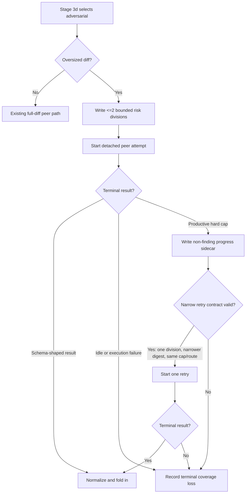

# Cross-Model Productive Timeout Scope - Plan

## Goal Capsule

- **Objective:** Make oversized `ce-code-review` cross-model adversarial runs reliably return usable evidence by bounding the question, classifying productive wall-clock expiry as a scope failure, and allowing only a materially narrower same-route retry.
- **Authority:** The Product Contract and session-settled KTDs in this plan govern behavior. Existing route security, model identity, schema validation, and optional-peer rules remain unchanged.
- **Execution profile:** Standard cross-cutting skill, shell-worker, documentation, and test change.
- **Stop conditions:** Stop if implementation would weaken read-only isolation, publish progress as findings, change provider/model during retry, or require raising the default hard cap.
- **Tail ownership:** `ce-work` implements and verifies. LFG owns simplification, review, shipping, and CI follow-through.

---

## Product Contract

### Summary

Oversized cross-model review becomes bounded risk-sampled corroboration instead of an unreliable promise to cover the whole change set. A peer that reaches the hard wall-clock cap while still producing events is classified as a productive scope timeout. It may be retried once only with a smaller review brief, on the same route and hard-cap value. Only a terminal schema-shaped result can contribute findings.

### Problem Frame

The current large-diff path gives one Codex xhigh process a semantic map over a large changed surface and asks it to finish every material division before returning one structured result. On an observed 286-file change, whole-surface runs crossed 1200 and 1500 second hard caps while continuing to inspect relevant files. Because findings appear only in the terminal structured response, reaping productive work near completion produced no usable fold-in artifact. Raising the budget did not make the result reliable; narrowing the brief did.

### Requirements

#### Oversized review scope

- R1. When large-diff mode is active, the orchestrator must describe cross-model coverage as risk-sampled corroboration rather than whole-change-set coverage.
- R2. An oversized initial peer brief must contain at most two material risk divisions.
- R3. Each selected division must name one failure question or invariant, one to three representative path prefixes, and explicit exclusions or a bounded dependency-expansion rule.
- R4. An oversized brief may name at most one cross-division interaction.
- R5. Paths and divisions in the brief are the authorized review boundary, not an invitation to enumerate unrelated changed files for completeness.

#### Timeout and retry behavior

- R6. A hard-cap expiry is `productive_scope_timeout` only when the peer log continued to grow within the configured productive-evidence window before termination; idle expiry remains a separate nonproductive outcome.
- R7. A productive scope timeout may trigger at most one retry on the same provider, route, requested model, effort, base ref, and `CROSS_MODEL_HARD_SECS` value.
- R8. The retry brief must contain exactly one division selected from the original brief. When that division has multiple authorized path prefixes, the retry must use a strict subset. When it has one path prefix, the retry must retain that path and tighten the failure question or invariant. The retry must record its parent scope digest and a distinct narrower scope digest.
- R9. An unchanged-scope retry, a retry with a larger hard cap, or a retry that widens paths must fail closed before peer egress.
- R10. A productive timeout does not permit a late in-process adversarial fallback; the started cross-model route continues to own the adversarial lens for the run.

#### Evidence and fold-in

- R11. Only a completed, normalized, schema-shaped `adversarial-<provider>.json` result may contribute findings, confidence corroboration, residual risks, or testing gaps.
- R12. Event logs, heartbeats, usage files, and timeout progress records are non-finding evidence and must never be reconstructed into review findings.
- R13. A bounded private progress sidecar must record terminal reason, elapsed seconds, last peer-log activity age, initial or retry scope digest, division identifiers, and `usable_review_output: false` when no terminal result exists.
- R14. Progress-sidecar content is untrusted telemetry. It may classify timeout productivity and support retry narrowing, but it cannot assert model identity, reviewer completion, or finding content.
- R15. Final Coverage must distinguish idle timeout, productive scope timeout, failed execution, and a completed retry, and must state the sampled divisions when oversized review was used.

#### Compatibility and documentation

- R16. Existing small-diff behavior, strict structured-output schemas, read-only route controls, recipient disclosure, receipt-based identity, and optional-peer requiredness must remain unchanged.
- R17. Public documentation must explain bounded risk sampling and narrower same-budget retry without presenting the cross-model pass as full oversized-diff coverage.
- R18. Behavioral evaluation must exercise productive timeout narrowing separately from context exhaustion; context exhaustion narrows what is read, while productive timeout narrows what is asked.

### Acceptance Examples

- AE1. **Covers R1-R2, R5.** Given an oversized 286-file diff, when Stage 3d writes the adversarial brief, then the brief contains no more than two bounded divisions and explicitly states that unselected changed files remain covered by canonical in-process reviewers rather than this peer.
- AE2. **Covers R3-R4.** Given an oversized selected division, when its brief is written, then it contains one failure question or invariant, one to three path prefixes, explicit exclusions or a bounded dependency-expansion rule, and the full brief names at most one cross-division interaction.
- AE3. **Covers R6-R8, R10.** Given a peer whose event log grows until the hard cap, when the initial job terminates, then the outcome is `productive_scope_timeout`; one retry may start only with the same provider, route, requested model, effort, base ref, and hard cap, a mechanically narrower scope, and no late local adversarial fallback.
- AE4. **Covers R9.** Given a retry request with the same scope digest, widened paths, or `CROSS_MODEL_HARD_SECS` increased from 1200 to 1500, when retry preflight runs, then no peer process starts and the failure is recorded as an invalid retry contract.
- AE5. **Covers R11-R14.** Given event logs that include code reads and partial analysis but no terminal JSON result, when synthesis runs, then no peer finding is folded in; the progress sidecar records non-finding timeout evidence only.
- AE6. **Covers R11, R15-R16.** Given a narrowed retry that returns `findings: []`, when normalization succeeds, then the canonical peer artifact is published and Coverage reports a completed risk-sampled retry with no additional issues.
- AE7. **Covers R17-R18.** Given the shipped documentation and behavioral eval, when a reader compares productive timeout with context exhaustion, then the docs state that oversized review samples bounded risks, the productive-timeout retry narrows what is asked at the same budget, and context exhaustion narrows what is read.

### Scope Boundaries

- **Included:** `ce-code-review` large-diff brief contract, productive-timeout classification, one bounded narrowed retry, progress sidecar, route and pipeline contract tests, behavioral eval guidance, and public skill documentation.
- **Deferred:** One process per division. Adopt it only if repeated evidence shows that a maximum-two-division brief still cannot reliably return terminal JSON. It would require multi-job receipts, deadline allocation, partial completion, and same-provider result merging.
- **Outside this product's identity:** Changing the default 1200-second hard cap, lowering Codex reasoning effort, reconstructing findings from event logs, or changing the optional cross-model peer into a required reviewer.

---

## Planning Contract

### Key Technical Decisions

- KTD1. **Treat productive hard-cap expiry as a scope failure.** (session-settled: user-approved — chosen over raising the hard cap from 1200 to 1500 seconds: the same 1500-second cap both succeeded and failed, while a narrower brief changed reachability.) The worker records whether peer-log activity continued near the hard cap; the orchestrator uses that evidence only to decide whether a narrower retry is eligible. Governs R6-R10.
- KTD2. **Use at most two bounded material risk divisions for oversized review.** (session-settled: user-approved — chosen over whole-change-set cross-model coverage across the observed 286-file surface: whole-surface Codex xhigh runs were not reliably reachable within 1200-1500 seconds.) In-process canonical reviewers retain full-change coverage. Governs R1-R5.
- KTD3. **Retry once with narrower scope at the same route and cap.** (session-settled: user-approved — chosen over unchanged-scope budget escalation: productive activity did not yield a terminal structured result before reap.) Use scope digests and subset validation to make “materially narrower” mechanical. The retry selects one original division and removes at least one authorized path prefix or tightens the invariant when the original division has one prefix. Governs R7-R10.
- KTD4. **Keep progress evidence outside the findings contract.** (session-settled: user-approved — chosen over recovering findings from peer events: findings materialize only in the terminal schema-shaped response.) Publish a private bounded sidecar atomically after termination; never pass it through findings normalization. Governs R11-R15.
- KTD5. **Keep one peer process per attempt.** A maximum-two-division initial attempt plus one single-division retry is the smallest compatible change. Process-per-division remains deferred until measured evidence justifies its additional lifecycle and merge semantics. Governs R2, R7-R10.
- KTD6. **Classify productive timeout above the generic runner state.** Keep `peer-job-runner.py` process lifecycle states stable. The worker writes semantic timeout metadata, and the orchestrator interprets runner `timeout` plus the sidecar. This avoids turning provider-specific activity into a universal runner state. Governs R6, R13-R16.

### High-Level Technical Design

The orchestrator owns division selection and retry narrowing. The worker owns read-only execution, activity measurement, timeout-sidecar publication, and terminal result normalization. `peer-job-runner.py` remains the process supervisor and does not interpret semantic review progress.

### Implementation Constraints

- Preserve the exclusive routing boundary: a successfully started peer still replaces the in-process adversarial persona for the entire canonical review.
- Preserve one external recipient and the already-sanctioned fixed route. Retry must not resolve a new provider or model.
- Preserve the existing strict findings schema and `RUN_SUCCEEDED` publication gate.
- Create progress files under the private review run directory with `0600` mode and atomic replacement. Bound arrays and strings so event logs cannot inflate the artifact.
- Do not parse or expose hidden model reasoning. Productivity is based on observable peer-log byte growth and terminal events only.
- The retry path must use a separate brief artifact with lineage metadata; do not overwrite the initial brief.

### Sequencing

1. Pin the normative large-diff and retry contract in references and persona prose.
2. Add worker scope metadata, timeout classification, and sidecar publication while preserving terminal-only output.
3. Add the orchestrator retry seam and mechanical scope-narrowing validation.
4. Add deterministic route and contract tests, then behavioral eval coverage.
5. Align public documentation and run repository validation.

### Risks and Mitigations

- **False productive classification:** Require recent peer-log growth, not wrapper heartbeat growth. Test heartbeat-only and peer-event growth separately.
- **Retry doubles unbounded spend:** Permit one retry only, retain the same per-attempt cap, and disclose both attempt outcomes. Do not silently raise the cap.
- **Scope digest proves bytes but not semantics:** Validate both digest lineage and structured division/path subset rules.
- **Provider-specific event shapes:** Keep the sidecar provider-neutral and derive only fields observable across the worker boundary. Omit unavailable optional fields rather than guessing.
- **Progress artifact prompt injection:** Treat progress/log text as untrusted telemetry; do not place raw event text into a new peer prompt.

### Sources

- `skills/ce-code-review/references/cross-model-review.md` — current detached peer, semantic map, deadline, and fold-in owner.
- `skills/ce-code-review/scripts/cross-model-adversarial-review.sh` — current large-diff prompt, hard/idle guards, and terminal-only publication boundary.
- `skills/ce-code-review/references/personas/adversarial-reviewer.md` — current “finish every material division” large-diff behavior to narrow.
- `docs/solutions/skill-design/detached-job-lifecycle-for-delegated-work.md` — detached terminal publication and timeout lifecycle precedent.
- `docs/solutions/skill-design/cli-output-buffering-for-progress-detection.md` — heartbeat versus peer-output evidence boundary.
- `docs/solutions/integration-issues/portable-structured-output-schemas-across-model-clis.md` — terminal schema-shaped output remains the sole findings contract.
- `docs/solutions/skill-design/dispatch-script-failure-degrade-outcome-not-boundary.md` — recovery preserves route and trust boundaries while narrowing ambition.
- `docs/solutions/skill-design/quiet-interval-floors-for-streaming-peer-routes.md` — small-input timing measurements do not justify oversized-diff cap increases.

---

## Implementation Units

### U1. Bound oversized risk divisions and reviewer semantics

- **Goal:** Make risk-sampled scope explicit before changing runtime mechanics.
- **Requirements:** R1-R5, R17.
- **Files:** `skills/ce-code-review/SKILL.md`, `skills/ce-code-review/references/cross-model-review.md`, `skills/ce-code-review/references/personas/adversarial-reviewer.md`, `skills/ce-code-review/references/dispatch-reviewers.md`.
- **Approach:** Replace the current 2–8/all-divisions oversized contract with at most two bounded divisions, one interaction, explicit exclusions, and risk-sampled coverage language. Define productive timeout, retry eligibility, no late local fallback, and terminal-only findings at the orchestration seam.
- **Test Scenarios:**
  - The skill contract requires no more than two oversized divisions.
  - The persona reviews selected divisions only and does not claim whole-diff completeness.
  - Productive timeout and context exhaustion have distinct mitigations.
  - Same-scope or larger-cap retry is explicitly forbidden.
- **Verification:** `bun test tests/pipeline-review-contract.test.ts`.
- **Dependencies:** None.

### U2. Publish bounded non-finding timeout evidence

- **Goal:** Distinguish productive hard-cap expiry from idle or execution failure without weakening terminal result publication.
- **Requirements:** R6, R11-R16.
- **Files:** `skills/ce-code-review/scripts/cross-model-adversarial-review.sh`, `tests/skills/ce-code-review-cross-model-routes.test.ts`.
- **Approach:** Track peer-log activity separately from wrapper heartbeat. On termination, atomically publish a private bounded progress sidecar containing semantic terminal reason and scope identity. Leave `RUN_SUCCEEDED`, JSON recovery, normalization, and `adversarial-<provider>.json` publication unchanged.
- **Test Scenarios:**
  - Heartbeat-only activity ends as idle/nonproductive, not productive timeout.
  - Peer-log growth through the hard cap produces `productive_scope_timeout` and no findings artifact.
  - Progress sidecar has private mode, bounded fields, scope digest, and `usable_review_output: false`.
  - Schema-looking partial log content is never published as findings after timeout.
  - Successful terminal `findings: []` continues to publish normally.
- **Verification:** `bun test tests/skills/ce-code-review-cross-model-routes.test.ts`.
- **Dependencies:** U1.

### U3. Add one mechanically narrowed same-route retry

- **Goal:** Recover productive oversized runs by asking less, not waiting longer.
- **Requirements:** R7-R10, R13-R15.
- **Files:** `skills/ce-code-review/SKILL.md`, `skills/ce-code-review/references/cross-model-review.md`, `skills/ce-code-review/references/dispatch-reviewers.md`, `skills/ce-code-review/scripts/cross-model-adversarial-review.sh`, `tests/skills/ce-code-review-cross-model-routes.test.ts`, `tests/pipeline-review-contract.test.ts`.
- **Approach:** Give retry briefs separate immutable artifacts with parent and child scope digests. Accept one original division only. Validate route/model/base/effective-cap equality before egress. Require a strict path-prefix subset when the original division has multiple prefixes; when it has one prefix, retain it and require a tighter invariant. Start a new detached job only after the initial job terminalizes and cleanup preserves the evidence needed for lineage. Keep runner lifecycle states unchanged; evidence that this is infeasible is a plan-change blocker, not an implementation-local exception.
- **Test Scenarios:**
  - A valid retry keeps provider, route, requested model, effort, base, and cap unchanged.
  - A valid retry removes one division and either reduces multiple path prefixes to a strict subset or tightens the invariant for a single-prefix division.
  - Same digest, wider paths, new division, route change, model change, base change, or cap increase fails before provider invocation.
  - Only one retry is allowed.
  - Retry timeout remains non-blocking and does not dispatch the local adversarial twin.
  - A completed retry artifact folds in under the original canonical reviewer identity with retry lineage in Coverage.
- **Verification:** `bun test tests/skills/ce-code-review-cross-model-routes.test.ts tests/pipeline-review-contract.test.ts`.
- **Dependencies:** U1, U2.

### U4. Align public documentation and behavioral evaluation

- **Goal:** Make the new coverage and retry guarantees understandable and behaviorally testable.
- **Requirements:** R15, R17-R18.
- **Files:** `docs/skills/ce-code-review.md`, `skills/ce-code-review/references/cross-model-eval.md`, `tests/pipeline-review-contract.test.ts`.
- **Approach:** Explain that oversized review samples at most two risks and retains full-change coverage through canonical local reviewers. Document that a productive timeout narrows the question at the same budget. Extend the eval with whole-surface timeout, bounded initial scope, successful narrowed retry, and progress-only no-fold-in cases.
- **Test Scenarios:**
  - Public docs do not promise whole-change-set cross-model review for oversized diffs.
  - Contract tests pin the user-relevant scope and terminal evidence language without locking incidental prose.
  - Behavioral eval proves the orchestrator chooses a smaller question rather than a larger timeout.
- **Verification:** `bun test tests/pipeline-review-contract.test.ts` plus the `skill-creator` eval workflow for `skills/ce-code-review/references/cross-model-eval.md`.
- **Dependencies:** U1-U3.

---

## Verification Contract

| Gate | Command or method | Proves |
|---|---|---|
| Worker route tests | `bun test tests/skills/ce-code-review-cross-model-routes.test.ts` | Timeout classification, sidecar safety, terminal-only publication, retry preflight, and route invariants. |
| Pipeline contract tests | `bun test tests/pipeline-review-contract.test.ts` | Skill/reference/public contract parity and bounded-risk semantics. |
| Focused combined tests | `bun test tests/skills/ce-code-review-cross-model-routes.test.ts tests/pipeline-review-contract.test.ts` | Cross-file contract integration. |
| Behavioral skill evaluation | Run the `skill-creator` workflow using `skills/ce-code-review/references/cross-model-eval.md` | The orchestrator narrows a productive timeout request and never converts progress into findings. |
| Release consistency | `bun run release:validate` | Skill inventory and release metadata remain synchronized. |
| Strict plugin schemas | `bun run plugin:validate` | Marketplace and plugin manifests remain valid. |
| Full repository suite | `bun run test` | No converter, writer, skill-contract, or lifecycle regression. |
| Patch hygiene | `git diff --check` | No whitespace errors. |

The deterministic suite must use hermetic throwaway repositories and stub peer routes. Any empirical Codex timing evaluation must run separately from CI and report usable structured-output rate, brief shape, cap, and terminal outcome; a single successful or failed run does not set a new timeout default.

---

## Definition of Done

- R1-R18 are implemented without increasing the default hard cap or weakening route isolation.
- Oversized cross-model briefs contain at most two bounded risk divisions and one interaction.
- Productive hard-cap timeout, idle timeout, and execution failure are distinguishable in durable evidence.
- Exactly one materially narrower retry is possible; unchanged scope, widened scope, or cap escalation fails before egress.
- Progress and event artifacts cannot enter the findings normalization or confidence-promotion path.
- Small-diff behavior and terminal schema-shaped output remain backward compatible.
- Focused tests, release validation, strict plugin validation, the full suite, and patch hygiene pass.
- Behavioral evaluation covers productive timeout narrowing and terminal-only fold-in.
- Public documentation describes risk-sampled corroboration accurately.
- Experimental or abandoned retry/sidecar code is removed before completion.
