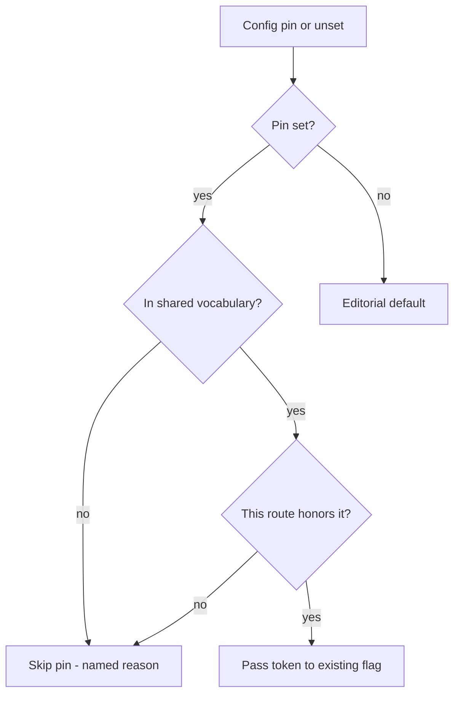

# Work-engine effort pin - Plan

## Goal Capsule

- **Objective:** A checkout can pin reasoning effort for implementation, planning/brainstorm elevation, and review on one vocabulary that includes Codex `max` and `none`, and an explicit pin the route cannot honor is skipped rather than swapped for another tier.
- **Means:** Smallest patches to existing adapters, validators, config keys, and docs (KTD1, KTD2, KTD3).
- **Authority:** Issues #1569, #1415, #1565 and session-settled Key Decisions outrank inferred polish. `AGENTS.md` config-maintenance and skill-isolation rules outrank a shared-file extraction.
- **Execution profile:** Three units, one PR. Mechanical tests on existing `--emit-adapter` and health suites. Invoke `ce-skill-work` before editing anything under `skills/**`.
- **Stop conditions:** Stop if honoring a work pin requires expanding the authorization key-set or sharing `CROSS_MODEL_EFFORT_OVERRIDE` with work. Do not add OpenCode `model#variant` config syntax.
- **Tail ownership:** The invoking pipeline (`lfg`) owns simplify, review, commit, PR, and CI.

---

## Product Contract

### Summary

Add an optional `effort` field on `work_engine_preferences`, sibling `plan_effort` / `brainstorm_effort` scalars, and one shared effort vocabulary reused by review, work, and elevation. Codex review (and any other Codex consumer of that vocabulary) accepts `max` and `none`. Omission keeps today's editorial `high` on work and elevation. Unhonored tokens skip; they are never substituted.

Product Contract preservation: N/A (bootstrap).

### Problem Frame

Work adapters hard-code `high` (#1569). Elevation's Claude CLI worker hard-codes `EFFORT="high"` (#1415). Review's Codex whitelist still rejects `max` and `none` even though the Codex CLI accepts them (#1565). A checkout can pin review effort today and cannot make the matching choice for implementation or elevated planning.

### Key Decisions

- **Smallest possible pins.** (session-settled: user-directed — chosen over a broad architecture: a thrown-away prior implementation was too large.) Governs R1, R8, R9.
- **Separate work and review knobs.** (session-settled: user-directed — chosen over sharing `CROSS_MODEL_EFFORT_OVERRIDE` with work.) Governs R2, R7.
- **One shared vocabulary including Codex `max` and `none`.** (session-settled: user-directed — chosen over reusing today's review Codex whitelist as-is.) Governs R4, R5.
- **Omission keeps editorial `high`.** (session-settled: user-directed — chosen over changing the standing default.) Governs R3.
- **OpenCode 2 `model#variant` is out of scope.** (session-settled: user-directed — chosen over encoding effort in the OpenCode model string.) Governs R9.
- **No new subsystems.** (session-settled: user-directed — chosen over carrier grammar, authorization key-set, receipts, attestation, and `CONCEPTS.md` entries.) Governs R8, R10.

### Requirements

**Pins**

- R1. `work_engine_preferences` entries may include optional `effort`. When a pin is set and the selected route honors it, `ce-work` adapters use that token instead of hard-coded `high`.
- R2. `plan_effort` and `brainstorm_effort` are ordinary sibling scalars next to `plan_model` / `brainstorm_model`. They use the same local-then-tracked cascade.
- R3. Omitting a work or elevation effort pin leaves the editorial tier `high` unchanged.

**Vocabulary and fail-closed**

- R4. The shared effort vocabulary is `none|minimal|low|medium|high|xhigh|max|default`. Review, work, and elevation reuse it. Codex accepts `max` and `none`.
- R5. A token the resolved route cannot honor is not applied and is never replaced with another legal token. The adapter fail-closes if that token is still passed in. The orchestrator omits the override instead, with a named reason, and keeps the candidate.
- R6. Cursor work routes take no effort override. A YAML `effort` on those routes is omitted per R5; the candidate still runs.

**Non-expansion**

- R7. Work does not read `CROSS_MODEL_EFFORT_OVERRIDE`. Review keeps that env var.
- R8. Health accepts the new keys so they are not reported as malformed. It does not grow new effort-value checks or report fields.
- R9. This work does not add OpenCode 2 `model#variant` config, authorization fields, attestation, or new receipt keys. The LFG `implementation_engine` carrier includes `effort` (`null` when unset); that value is not copied into the authorization schema.
- R10. Config template, byte-identical example, `docs/guides/configuration.md`, and consumer skill docs name the new keys in the same change.

### Success Criteria

- SC1. `--emit-adapter` for work Codex/Claude/Grok shows the pinned token when set and `high` when unset.
- SC2. Review Codex `--emit-adapter` accepts `max` and `none`; the old fail-closed `["codex", "max"]` row is gone.
- SC3. Elevation `--emit-adapter` shows `--effort` from `plan_effort` / `brainstorm_effort` when set, else `high`.
- SC4. A `work_engine_preferences` entry with `effort:` does not make `check-health` report an unsupported entry.

### Acceptance Examples

- AE1. Work pin honored
  - **Covers:** R1, R3, R4
  - **Given:** a Codex preference with `effort: max`
  - **When:** the work adapter emits argv
  - **Then:** Codex carries `model_reasoning_effort=max`, not `high`
- AE2. Elevation omission
  - **Covers:** R2, R3
  - **Given:** `plan_model` set and `plan_effort` unset
  - **When:** the elevation worker emits argv
  - **Then:** `--effort high` remains
- AE3. Unhonored token
  - **Covers:** R5, R6
  - **Given:** `effort: xhigh` on a Cursor work preference
  - **When:** that candidate is selected
  - **Then:** `CE_WORK_EFFORT_OVERRIDE` is not exported; the Cursor adapter runs with no effort flag
- AE5. Adapter fail-closed
  - **Covers:** R5
  - **Given:** `CE_WORK_EFFORT_OVERRIDE=banana` on Codex, or `=high` on Cursor
  - **When:** `--emit-adapter` runs
  - **Then:** exit 2 with a named reason; argv does not contain a substituted legal token
- AE4. Codex review `max`
  - **Covers:** R4, R5
  - **Given:** `CROSS_MODEL_EFFORT_OVERRIDE=max` on the Codex review route
  - **When:** `--emit-adapter codex`
  - **Then:** the command includes Codex `max` and does not fail closed as "not a Codex level"

### Scope Boundaries

- In: optional work `effort`; `plan_effort` / `brainstorm_effort`; LFG `implementation_engine.effort`; shared vocabulary; Codex `max`/`none`; docs/template/health acceptance.
- Out: OpenCode 2 `model#variant`; sharing `CROSS_MODEL_EFFORT_OVERRIDE` with work; health value validation; new receipt keys; attestation; authorization key-set; `ce-pov` hard-coded `high`.
- **Deferred to Follow-Up Work:** live-prompt effort wording for elevation beyond config scalars; OpenCode work `--effort` (that adapter has no effort flag today).

---

## Planning Contract

### Assumptions

- A1. Work effort reaches `cross-model-work.sh` as `CE_WORK_EFFORT_OVERRIDE` on the runner `start` environment (same inherit path as `CE_PEER_HARD_SECS`). It is not an `env` argv prefix and not an authorization field.
- A2. Elevation effort applies to the Claude CLI worker only. Native in-harness dispatch has no per-call effort flag; session effort stays as the host provides it.
- A3. The shared enum is a duplicated token list in existing validators, not a new shared file (skills cannot import across directories).
- A4. OpenCode and Cursor work routes take no effort override this change.
- A5. Elevation effort is config-only this change; no new `plan_effort:<token>` carrier.

### Key Technical Decisions

- KTD1. **Patch existing functions, do not add subsystems.** (session-settled: user-directed — chosen over a broad architecture: prior implementation was too large.) Add `route_effort` / `validate_effort_override` next to work's existing `route_model`; replace `EFFORT="high"` in `elevation-dispatch.sh`; extend review's existing Codex case. Cite R1, R2, R4, R9.
- KTD2. **Work uses `CE_WORK_EFFORT_OVERRIDE`, not the review env var and not authorization.** (session-settled: user-directed — chosen over sharing `CROSS_MODEL_EFFORT_OVERRIDE`. Binding may carry `effort`; authorization does not.) Runner `worker_env` already forwards `os.environ`. Cite R7, R8, R9.
- KTD3. **Per-route honor set stays fail-closed; only Codex's set grows.** Claude stays `low|medium|high|xhigh|max`. Grok stays `low|medium|high`. Codex becomes `none|minimal|low|medium|high|xhigh|max`. Cursor-family and OpenCode work reject any override. Editorial defaults stay: work/elevation `high`, review Codex `xhigh`. Cite R3, R4, R5, R6.
- KTD4. **Health awk learns `effort` as a known optional field and ignores the value.** Same dash-first and indented shapes as `model`. `ITEM` output stays harness + model. Cite R8.

### High-Level Technical Design

Pin resolution is one gate on three consumers:

Work Codex/Claude/Grok already have an effort flag; replace the literal `high`. Review Codex already has a whitelist; add `none` and `max`. Elevation CLI already passes `--effort "$EFFORT"`; stop hard-coding the value.

### Implementation Constraints

- Invoke `ce-skill-work` before editing `skills/**`.
- Keep byte-identical pairs: review workers' `validate_effort_override`, both `elevation-dispatch.sh` copies, both `reasoning-elevation.md` copies, config template and `config.example.yaml`.
- Do not put CLI flags in config YAML. `effort` is intent; adapters choose the flag (`--effort` vs `model_reasoning_effort=`).

### Sequencing

U1 (shared enum + review Codex) first so work and elevation validators copy a current list. U2 (work) and U3 (elevation + docs) follow. One PR.

---

## Implementation Units

### U1. Shared vocabulary and Codex review `max`/`none`

- **Goal:** Review accepts Codex `none` and `max`. The shared vocabulary is the one work and elevation will copy.
- **Requirements:** R4, R5, R10
- **Dependencies:** none
- **Files:**
  - `skills/ce-code-review/scripts/cross-model-adversarial-review.sh`
  - `skills/ce-doc-review/scripts/cross-model-doc-review.sh`
  - `skills/ce-code-review/references/cross-model-review.md` (comment/docs if they restate the Codex list)
  - `tests/skills/ce-code-review-cross-model-routes.test.ts`
  - `tests/skills/ce-doc-review-cross-model-routes.test.ts` (only if it duplicates the fail-closed table)
- **Approach:**
  1. Extend `validate_effort_override` Codex arm with `codex:none` and `codex:max`. Update the comment that restates the list.
  2. Keep the function byte-identical across the two review workers.
  3. Remove `["codex", "max"]` from the fail-closed table. Add happy-path `--emit-adapter` coverage for Codex `max` and `none`.
  4. Do not change editorial `route_effort` defaults.
- **Patterns to follow:** Existing `validate_effort_override` / `route_effort` split; fail-closed tests around `tests/skills/ce-code-review-cross-model-routes.test.ts`.
- **Test scenarios:**
  - Codex override `max` emits `model_reasoning_effort` `max` and exit 0.
  - Codex override `none` emits `none` and exit 0.
  - Claude override `minimal` still fails closed.
  - Cursor override `high` still fails closed.
  - Unset still emits Codex editorial `xhigh`.
  - `validate_effort_override` bodies stay byte-identical across the two scripts.
- **Verification:** `bun test tests/skills/ce-code-review-cross-model-routes.test.ts` (and the doc-review counterpart if touched).

### U2. Work-engine optional `effort`

- **Goal:** A preference `effort` pin replaces hard-coded `high` on Codex/Claude/Grok work adapters.
- **Requirements:** R1, R3, R4, R5, R6, R7, R8
- **Dependencies:** U1
- **Files:**
  - `skills/ce-work/scripts/cross-model-work.sh`
  - `skills/ce-work/references/execution-engines.md`
  - `skills/ce-work/references/cross-model-execution.md`
  - `skills/ce-setup/scripts/check-health`
  - `tests/skills/ce-work-cross-model-routes.test.ts`
  - `tests/skills/ce-setup-check-health.test.ts`
- **Approach:**
  1. Add `route_effort` / `validate_effort_override` that read `CE_WORK_EFFORT_OVERRIDE`, copy U1's per-route honor set, and keep editorial `high` when unset.
  2. In `adapter_argv`, replace literal `high` on Codex, Claude, and Grok with `route_effort`. Do not add an effort flag to Cursor, Composer, Grok-Cursor, or OpenCode.
  3. If `CE_WORK_EFFORT_OVERRIDE` is set and the route cannot honor it, fail closed the same way model override already does.
  4. Document: when the selected preference has `effort` and the route honors it, export `CE_WORK_EFFORT_OVERRIDE` on the runner `start` call. On Cursor, Composer, Grok-Cursor, and OpenCode, omit the env even if YAML has `effort`, and name that skip. Do not put it on worker argv. Do not read `CROSS_MODEL_EFFORT_OVERRIDE`.
  5. In `read_work_engine_preferences`, accept `effort` in the same dash-first and indented shapes as `model`. Do not emit it. Do not validate the token.
- **Execution note:** Invoke `ce-skill-work` before editing ce-work or ce-setup skill files.
- **Patterns to follow:** `CE_WORK_MODEL_OVERRIDE` + `validate_model_override`; health parser's existing `model` arms; `--emit-adapter` tests in `tests/skills/ce-work-cross-model-routes.test.ts`.
- **Test scenarios:**
  - Unset: Codex still emits `model_reasoning_effort=high`; Claude/Grok still `--effort high`.
  - `CE_WORK_EFFORT_OVERRIDE=max` on Codex replaces `high` with `max`.
  - `CE_WORK_EFFORT_OVERRIDE=xhigh` on Claude replaces `high`.
  - `CE_WORK_EFFORT_OVERRIDE=high` on Cursor exits 2 with a named incompatibility.
  - `CE_WORK_EFFORT_OVERRIDE=banana` on Codex exits 2; argv does not contain a substituted legal token.
  - Health: a valid preference with `effort: max` does not print `unsupported work_engine_preferences entry`.
  - Health: `effort` does not appear as a new availability/detail field.
- **Verification:** `bun test tests/skills/ce-work-cross-model-routes.test.ts tests/skills/ce-setup-check-health.test.ts`.

### U3. Elevation scalars and config docs

- **Goal:** `plan_effort` / `brainstorm_effort` drive the Claude CLI elevation worker. Template, example, and guides name every new key.
- **Requirements:** R2, R3, R4, R5, R9, R10
- **Dependencies:** U1
- **Files:**
  - `skills/ce-plan/scripts/elevation-dispatch.sh`
  - `skills/ce-brainstorm/scripts/elevation-dispatch.sh`
  - `skills/ce-plan/references/reasoning-elevation.md`
  - `skills/ce-brainstorm/references/reasoning-elevation.md`
  - `skills/ce-setup/references/config-template.yaml`
  - `.compound-engineering/config.example.yaml`
  - `docs/guides/configuration.md`
  - `docs/guides/ce-plan.md`
  - `docs/guides/ce-brainstorm.md`
  - `docs/guides/ce-work.md`
  - `tests/skills/elevation-dispatch.test.ts`
  - `tests/skills/ce-setup-check-health.test.ts` (template advertises the new keys)
- **Approach:**
  1. Replace `EFFORT="high"` with editorial `high` unless `CE_ELEVATION_EFFORT_OVERRIDE` is set. Validate against the Claude honor set from U1. Unhonored: skip (named reason), never substitute.
  2. In `reasoning-elevation.md`, resolve `plan_effort` / `brainstorm_effort` with the ordinary-key rule next to the model key. When set, export `CE_ELEVATION_EFFORT_OVERRIDE` on the existing `start` invocation. Keep both copies byte-identical.
  3. Comment the new keys in the template beside `plan_model` / `brainstorm_model` and as optional `effort` on the work-engine example. Copy byte-identically to `config.example.yaml`.
  4. Update `docs/guides/configuration.md` (options table + implementation routing) and the three consumer guides. Codex review docs change `minimal..xhigh` to include `none` and `max`.
- **Execution note:** Invoke `ce-skill-work` before editing ce-plan / ce-brainstorm skill files.
- **Patterns to follow:** Model-elevation config comments; `tests/skills/elevation-dispatch.test.ts` argv assertions; `keeps the committed example identical to the bundled template`.
- **Test scenarios:**
  - Unset: `--emit-adapter` still contains `--effort` `high`.
  - `CE_ELEVATION_EFFORT_OVERRIDE=xhigh` emits `--effort` `xhigh` and not `high`.
  - `CE_ELEVATION_EFFORT_OVERRIDE=minimal` fails closed (not a Claude level).
  - Both elevation workers stay byte-identical; both `reasoning-elevation.md` copies stay byte-identical.
  - Template contains `plan_effort`, `brainstorm_effort`, and work `effort`; example equals template; `configuration.md` names each key.
- **Verification:** `bun test tests/skills/elevation-dispatch.test.ts tests/reasoning-elevation-parity.test.ts tests/skills/ce-setup-check-health.test.ts`.

---

## Verification Contract

| Gate | When | Command / signal |
|---|---|---|
| Unit tests | After U1–U3 | `bun test tests/skills/ce-code-review-cross-model-routes.test.ts tests/skills/ce-work-cross-model-routes.test.ts tests/skills/elevation-dispatch.test.ts tests/skills/ce-setup-check-health.test.ts tests/reasoning-elevation-parity.test.ts` |
| Full suite | Before PR | `bun run test` (same suite CI runs; includes `--parallel`) |
| Release metadata | If skill/docs counts or config surfaces change | `bun run release:validate` |
| Skill prose | Before editing `skills/**` | Invoke `ce-skill-work` |

---

## Definition of Done

- Global: R1–R10 hold on the diff. No authorization, LFG engine, OpenCode `model#variant`, shared review env var, receipts, or `CONCEPTS.md` changes. Abandoned spikes are absent.
- U1: Codex `max`/`none` accepted; fail-closed table updated; review workers identical.
- U2: Work `--emit-adapter` honors a pin and keeps `high` on omission; Cursor pin fails closed; health accepts `effort`.
- U3: Elevation omission stays `high`; template/example/docs name the keys.
- PR: draft; body includes `Fixes #1569 #1415 #1565` plus Security Disclosure and Agent Disclosure.

---

## System-Wide Impact

Config schema is a public checkout contract. Review, work, and elevation all consume the same vocabulary but keep separate override env vars. Health remains a parser, not an effort policy engine.

## Risks & Dependencies

- **Health awk shapes.** Unusual YAML (flow maps, multiline) already fails today. Do not turn this into a general YAML parser.
- **Byte-identical drift.** Editing one review worker, one elevation script, or only the template (not the example) fails CI.
- **Idle budget at `max`.** A work pin of `max` can lengthen silent stretches; `CE_PEER_IDLE_SECS` stays as-is this change (#1565 caveat).

## Documentation / Operational Notes

- Central reference: `docs/guides/configuration.md`.
- Consumer pages: `docs/guides/ce-work.md`, `ce-plan.md`, `ce-brainstorm.md`.
- Template comments are the in-checkout documentation surface `/ce-setup` copies.

## Sources / Research

- #1569 work hard-coded `high`; #1415 elevation `EFFORT="high"`; #1565 Codex CLI enum includes `none` and `max`.
- Work adapter: `skills/ce-work/scripts/cross-model-work.sh` `adapter_argv`.
- Review validator: `validate_effort_override` in both cross-model review scripts; fail-closed row `["codex", "max"]` in `tests/skills/ce-code-review-cross-model-routes.test.ts`.
- Elevation worker: `skills/ce-plan/scripts/elevation-dispatch.sh` (byte-identical brainstorm copy).
- Runner forwards `os.environ` into `worker_env` (`skills/ce-work/scripts/peer-job-runner.py`).
- Health parser: `read_work_engine_preferences` in `skills/ce-setup/scripts/check-health`.
