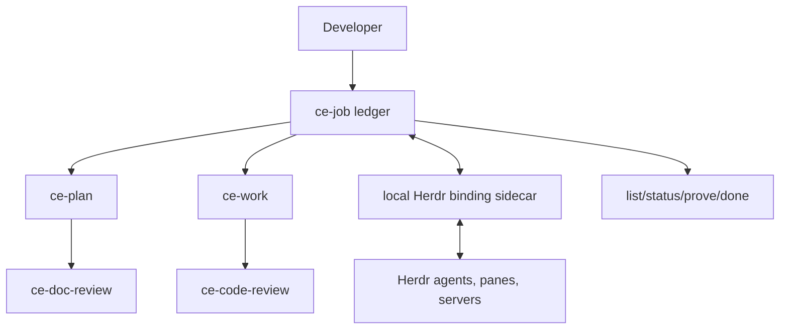
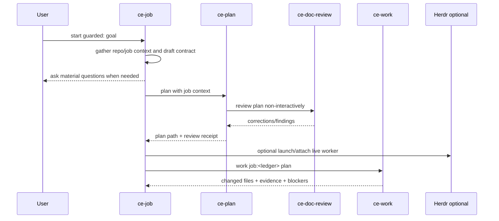

# feat: Add guarded job orchestration

## Goal Capsule

| Field | Value |
|---|---|
| Objective | Developers can start several guarded CE jobs, align scope through planning, supervise live agents when Herdr is present, send feedback or test requests, and close work only when review and evidence support it. |
| Means | Extend `ce-job` from a passive ledger into a job wrapper that orchestrates `ce-plan`, `ce-doc-review`, `ce-work`, `ce-code-review`, and optional Herdr live control. |
| Authority | The job ledger is durable source of truth; Herdr is optional live transport; CE skills keep owning their existing work phases. |
| Stop conditions | Stop before implementation when alignment has unresolved product blockers, before live control when Herdr is unavailable or not in `HERDR_ENV=1`, and before closing when done criteria lack evidence. |
| Execution profile | Standard plan, skill-prose-heavy, with mechanical contract tests and targeted behavior evals. |
| Finishing strategy | Implement through `ce-work`; run `ce-doc-review` on this plan first, then `ce-code-review` on the diff before shipping. |

---

## Product Contract

### Summary

`ce-job` should become the light control plane around CE work: start with alignment, keep shared state across humans and agents, show active workstreams, accept feedback and test requests, and attach to Herdr for live supervision when available.

### Problem Frame

The current MVP records job state but stays passive. It can hold decisions and receipts, but it does not help the user align a guarded job before autonomy begins, does not show the active work fleet, and does not let the user feed a live worker a new decision or test request. The desired workflow needs Builders-like visibility without Builders-like rigidity.

### Requirements

**Guarded kickoff**

- R1. `ce-job start guarded:<goal>` creates a draft ledger only after it has enough context to state goal, scope, non-goals, risks, open questions, candidate done criteria, and likely verification.
- R2. A guarded start invokes or routes through `ce-plan` when the work is non-trivial, risky, or product/technical scope is not already settled.
- R3. The plan produced for a guarded job is reviewed through `ce-doc-review` before the job is marked ready for implementation.
- R4. The job ledger links the final plan path, document-review result, and any launch blockers.

**Multi-job visibility**

- R5. A developer can list active jobs and see each job's status, mode, branch, owner, last update, open questions, blockers, latest evidence, review state, and next safe action.
- R6. Status derives from ledger facts and optional live state rather than chat history.
- R7. A job is not shown as complete unless `done` has mapped each done criterion to evidence or a user-marked out-of-scope decision.

**Feedback and test requests**

- R8. A developer can add feedback to a job while it is active; the note is classified as a decision, requirement, test request, blocker, or ordinary work-log note.
- R9. A test request becomes an evidence requirement the next worker must satisfy or block on.
- R10. Feedback is recorded in the ledger before any live prompt is sent, so the durable state survives a missed prompt, agent restart, or Herdr absence.

**Optional Herdr control**

- R11. `ce-job` works without Herdr. Herdr only adds launch, watch, live status, feedback delivery, test prompts, pause, interrupt, and resume.
- R12. Herdr control only runs from inside a Herdr-managed pane (`HERDR_ENV=1`) and uses explicit discovered agent names or pane IDs, never UI focus.
- R13. Live bindings are local/session state unless the job is configured local; tracked ledgers must not commit stale Herdr pane IDs as team truth.
- R14. Interrupt and pause are explicit user actions and record a durable ledger entry before or immediately after live control.

**Skill boundaries**

- R15. `ce-job` owns job state and orchestration only; it does not implement product code, ship PRs, or replace `ce-plan`, `ce-work`, `ce-code-review`, or `ce-doc-review`.
- R16. Existing CE skills that accept a job ledger read it as context and append durable results, but they do not create a new job unless `ce-job` invoked them to do so.

### Success Criteria

- Starting a guarded job produces an alignment artifact that a human can affirm or correct before implementation begins.
- A job with an attached plan records that `ce-doc-review` ran or records why it could not start.
- A developer can run one command and see all active jobs with useful next actions.
- Feedback and test requests persist in the ledger and are visible to the next `ce-work` run.
- In a Herdr session, a job can attach to a live agent, read status, send feedback, and interrupt safely.
- In a non-Herdr session, every non-live job command still works and reports that live control is unavailable.

### Scope Boundaries

#### In scope

- Skill prose and references for `ce-job`.
- Job-ledger schema additions needed by kickoff, list/status, feedback, tests, and Herdr binding metadata.
- Optional local sidecar state for live Herdr attachments.
- Wiring in `ce-plan`, `ce-work`, `ce-code-review`, and `ce-doc-review` so receipts update a named job ledger.
- User-facing docs and config reference updates.
- Mechanical tests for greppable skill contracts and config/docs parity.

#### Deferred to Follow-Up Work

- A full web dashboard or TUI beyond Herdr's existing UI.
- Cross-machine Herdr fleet inventory.
- Automatic PR merge or deployment gates.
- A persistent daemon separate from Herdr.
- Rich analytics over job history.

#### Outside this product's identity

- A rigid mandatory SDLC pipeline that forces all work through the same steps.
- Treating Herdr as required for CE job state.
- Replacing chat or human coding with autonomous-only execution.

---

## Planning Contract

### Key Technical Decisions

- KTD1. **Make `ce-job` the orchestrator, not the executor.** It starts and updates ledgers, then invokes existing CE skills for planning, work, document review, and code review. This preserves CE's current ownership boundaries and avoids a second implementation pipeline.
- KTD2. **Run `ce-doc-review` in guarded kickoff before implementation readiness.** The plan review catches incoherent scope, weak verification, and missing decisions before an autonomous worker begins. This makes the guarded path more pipeline-like without making every job a rigid lane.
- KTD3. **Store durable job truth in Markdown, store Herdr liveness locally.** The ledger is portable and reviewable. Herdr pane IDs and live agent names are session-scoped, so the tracked ledger references a local attachment when present rather than treating pane IDs as stable team facts.
- KTD4. **Derive status from explicit sections.** `list` and `status --all` should classify jobs from `status`, `mode`, `Open questions`, `Evidence`, `Reviews`, `Done criteria`, and optional Herdr state. They should not infer success from a worker saying it is done.
- KTD5. **Feedback writes before prompting.** The durable ledger update happens first; live Herdr delivery is a best-effort follow-up. This keeps the source of truth intact if the agent is busy, blocked, or gone.
- KTD6. **Herdr integration follows the Herdr skill safety model.** Commands run only when `HERDR_ENV=1`, discover IDs from Herdr JSON responses, avoid focus-based targeting, and treat `blocked` as a state that needs inspection rather than blind input.

### High-Level Technical Design

### Assumptions

- The current passive `ce-job` MVP remains in the branch and can be extended rather than replaced.
- Hosts can invoke sibling CE skills through their normal skill mechanism; where they cannot, `ce-job` records a skipped receipt rather than pretending the phase passed.
- Herdr is present only in some operator sessions. The non-Herdr path must remain first-class.
- The first implementation can be skill/file based. No daemon is needed to prove the workflow.

---

## Implementation Units

### U1. Expand the job ledger contract for guarded orchestration

- **Goal:** Add fields and sections that can hold kickoff alignment, plan/doc-review receipts, status derivation, feedback, test requests, and optional live attachment pointers.
- **Requirements:** R1, R4, R5, R7, R8, R9, R13.
- **Dependencies:** None.
- **Files:** `skills/ce-job/SKILL.md`, `docs/guides/ce-job.md`, `tests/skills/ce-job-contract.test.ts`.
- **Approach:** Define the ledger shape once in `ce-job`, with frontmatter fields for `job_id`, `status`, `mode`, `branch`, `risk`, and optional `live_binding`. Add sections for `Kickoff`, `Test requests`, and `Live control` only if they carry information. Keep append-only history for decisions and feedback.
- **Patterns to follow:** `docs/solutions/skill-design/portable-agent-skill-authoring.md`, especially outcome spine first and only protocol that protects the outcome.
- **Test scenarios:**
  - Starting from the skill body, a corpus test finds the required status values, guarded mode, plan link, doc-review receipt, feedback, test request, and Herdr optionality rules.
  - The test proves the skill tells agents not to close a job without evidence for each done criterion.
  - The test proves tracked ledgers do not treat session-scoped Herdr pane IDs as stable team truth.
- **Verification:** The contract test fails if any load-bearing ledger section, status, or ownership boundary disappears.

### U2. Add guarded kickoff and `ce-plan` handoff

- **Goal:** Make `ce-job start guarded:<goal>` align scope before implementation and route to `ce-plan` when planning is needed.
- **Requirements:** R1, R2, R3, R4, R15.
- **Dependencies:** U1.
- **Files:** `skills/ce-job/SKILL.md`, `skills/ce-job/references/guarded-start.md`, `skills/ce-plan/SKILL.md`, `skills/ce-plan/references/intake.md`, `docs/guides/ce-job.md`, `docs/guides/ce-plan.md`, `tests/skills/ce-job-contract.test.ts`, `tests/skills/ce-plan-handoff-routing.test.ts`.
- **Approach:** Move guarded-start detail into a `ce-job` reference so the always-loaded body stays small. The start flow gathers bounded context, writes a draft contract, asks only material questions, then either records an executable small-job contract or invokes `ce-plan` with job context. Update `ce-plan` to accept `job:<ledger>` as a context carrier, write the final plan path back to the ledger, and carry the job path into its mandatory `ce-doc-review` phase.
- **Execution note:** Treat this as skill-authoring work; invoke `ce-skill-work` before editing each touched skill block.
- **Patterns to follow:** `skills/ce-plan/references/plan-handoff.md` for mandatory document review; `docs/solutions/skill-design/context-absent-skill-handoff-needs-pinned-invocation.md` for sibling-skill invocation clarity.
- **Test scenarios:**
  - A greppable test proves guarded start names context gathering, material questions, `ce-plan` routing, `ce-doc-review`, and plan-link recording.
  - A `ce-plan` contract test proves `job:<ledger>` is parsed as a context carrier, not product prose.
  - A test proves `ce-job` records `skill_unreachable` or equivalent when `ce-doc-review` cannot start, instead of claiming review passed.
- **Verification:** Targeted tests for `ce-job` and `ce-plan` pass, and a fresh-agent eval confirms a guarded start produces alignment before implementation.

### U3. Add list and status across active jobs

- **Goal:** Let developers see all active workstreams and their next safe action.
- **Requirements:** R5, R6, R7.
- **Dependencies:** U1.
- **Files:** `skills/ce-job/SKILL.md`, `skills/ce-job/references/job-index.md`, `docs/guides/ce-job.md`, `tests/skills/ce-job-contract.test.ts`.
- **Approach:** Add `list` and `status --all` actions. They scan the resolved job root, read frontmatter and required sections, classify each job as active, blocked, needs decision, needs evidence, needs review, ready for work, or complete, and print a compact table. When a live binding exists and Herdr is available, enrich the row with live state; otherwise omit live state or report unavailable.
- **Test scenarios:**
  - Given sample ledger text in test fixtures, the skill contract describes active/blocked/complete classification from ledger sections.
  - A test pins that status must not infer completion from Herdr `done` alone.
  - A test pins that `status --all` reports open questions, latest evidence, review state, and next safe action.
- **Verification:** Contract tests pass and the docs show list/status examples.

### U4. Add feedback and test-request actions

- **Goal:** Let a developer steer an active job without losing the instruction in chat.
- **Requirements:** R8, R9, R10, R14.
- **Dependencies:** U1, U3.
- **Files:** `skills/ce-job/SKILL.md`, `skills/ce-job/references/feedback.md`, `docs/guides/ce-job.md`, `tests/skills/ce-job-contract.test.ts`.
- **Approach:** Add `feedback`, `test`, `pause`, and `resume` actions. `feedback` classifies the note and appends it to the narrowest ledger section. `test` appends to `Test requests` and `Done criteria` or `Evidence` expectations. `pause` records a durable pause/blocker. `resume` reports the next safe action and, when live control is available, can send a resume prompt.
- **Patterns to follow:** The existing `capture` action's narrow-section classification, expanded into explicit user-facing commands.
- **Test scenarios:**
  - Feedback containing a decision lands in `Decisions` before any live prompt is sent.
  - A test request becomes a durable evidence requirement.
  - Pause records a blocker and does not require Herdr.
- **Verification:** Contract tests cover classification and durability-before-live-delivery ordering.

### U5. Add optional Herdr live binding and controls

- **Goal:** Attach a job to live Herdr agents/panes so the user can watch, prompt, test, interrupt, and resume active workers.
- **Requirements:** R11, R12, R13, R14.
- **Dependencies:** U1, U3, U4.
- **Files:** `skills/ce-job/SKILL.md`, `skills/ce-job/references/herdr-control.md`, `skills/ce-setup/references/config-template.yaml`, `.compound-engineering/config.example.yaml`, `docs/guides/configuration.md`, `docs/guides/ce-job.md`, `tests/skills/ce-job-contract.test.ts`, `tests/skills/ce-setup-check-health.test.ts`.
- **Approach:** Add `attach`, `launch`, `watch`, `read`, `interrupt`, and live-aware `feedback` / `test` behavior. Herdr commands run only when `HERDR_ENV=1`. The skill discovers live agents with `herdr agent list` / `agent get`, reads with `agent read --source recent-unwrapped`, sends with `agent prompt --wait`, and interrupts with `agent send-keys <target> ctrl+c`. Store session binding in `.context/compound-engineering/jobs/<job_id>.json` by default; when `job_state_visibility: local`, allow the ledger to carry more local live data because the ledger is not intended for commit.
- **Execution note:** Keep exact Herdr command forms in the Herdr reference, not repeated in every action block.
- **Patterns to follow:** Herdr skill safety rule: verify `HERDR_ENV=1`, use explicit IDs/names, avoid focused-pane defaults, and inspect blocked agents before sending input.
- **Test scenarios:**
  - Contract test pins the `HERDR_ENV=1` gate.
  - Contract test pins that focus-based targeting is forbidden.
  - Contract test pins that live prompt delivery happens after ledger update.
  - Setup test proves `.context/compound-engineering/` remains the local sidecar root and is offered for gitignore.
- **Verification:** Contract tests pass; manual smoke in a Herdr session attaches to a harmless agent and reads status without changing code.

### U6. Wire job receipts through `ce-work`, `ce-code-review`, and `ce-doc-review`

- **Goal:** Ensure downstream skills append durable results to the job instead of leaving receipts only in chat.
- **Requirements:** R3, R4, R6, R7, R15, R16.
- **Dependencies:** U1, U2.
- **Files:** `skills/ce-work/SKILL.md`, `skills/ce-work/references/input-triage.md`, `skills/ce-code-review/SKILL.md`, `skills/ce-code-review/references/modes-and-output.md`, `skills/ce-doc-review/SKILL.md`, `skills/ce-doc-review/references/modes.md`, `docs/guides/ce-work.md`, `docs/guides/ce-code-review.md`, `docs/guides/ce-doc-review.md`, `tests/skills/ce-job-contract.test.ts`, `tests/skills/ce-work-outcome-spine.test.ts`, `tests/skills/ce-plan-handoff-routing.test.ts`.
- **Approach:** Standardize `job:<ledger>` as a context carrier across these skills. Each skill reads the job before its own scope decision, uses it as context, and appends only durable output: plan path, doc-review result, changed files, commands and outcomes, report paths, findings, blockers, and final status. They must not copy transcripts or create a new job on their own.
- **Test scenarios:**
  - `ce-work` contract test proves job context is read before implementation planning and durable evidence is appended.
  - `ce-code-review` contract test proves review receipts attach to the ledger.
  - `ce-doc-review` contract test proves a plan review can attach result counts and unresolved decisions to the job.
- **Verification:** Targeted tests pass and docs show `job:<ledger>` examples for all consumer skills.

### U7. Update setup, docs, inventory, and validation guidance

- **Goal:** Make the new workflow discoverable and keep repository metadata consistent.
- **Requirements:** R5, R11, R13, R15.
- **Dependencies:** U1-U6.
- **Files:** `README.md`, `docs/guides/README.md`, `docs/guides/configuration.md`, `docs/guides/ce-setup.md`, `skills/ce-setup/SKILL.md`, `skills/ce-setup/references/repo-fixes.md`, `tests/release-metadata.test.ts`.
- **Approach:** Document `ce-job` as a workflow utility and control-plane wrapper. Keep skill counts synced. Extend setup docs only for config and ignore-rule effects; do not make Herdr an optional dependency that setup bulk-installs.
- **Test scenarios:**
  - Release metadata test sees the correct skill count and catalog row.
  - Setup health tests still pass and config template/example remain byte-identical.
  - Configuration docs mention every active `job_state_*` key.
- **Verification:** `bun run release:validate`, targeted tests, and plugin validation pass.

### U8. Add behavior evals for guarded kickoff and Herdr absence

- **Goal:** Check that models use the new guarded workflow as intended across hosts.
- **Requirements:** R1, R2, R3, R10, R11, R12, R15.
- **Dependencies:** U2, U5, U6.
- **Files:** `tests/skill-eval-cell/catalog.ts`, `tests/skill-eval-cell/scenarios.md`, `tests/skill-eval-cell/fixtures/ce-job-guarded-start/*`.
- **Approach:** Add at least two eval scenarios: guarded start on a non-trivial feature should align and route to planning/review before implementation; Herdr control requested outside `HERDR_ENV=1` should record durable feedback and report live control unavailable rather than inventing commands.
- **Test scenarios:**
  - Claude and Codex post-arm runs create or describe a job contract, do not start implementation immediately, and mention plan/doc-review before work.
  - Non-Herdr runs do not attempt `herdr` commands and still update the ledger.
- **Verification:** Run the eval pack or record an explicit skip reason if local host credentials/tools cannot run the cells.

---

## Verification Contract

| Gate | Applies to | Success signal |
|---|---|---|
| Skill-authoring procedure | Every edit under `skills/**` | `ce-skill-work` was read/applied; touched blocks state outcome, done condition, boundaries, and owning layer. |
| Targeted contract tests | U1-U7 | `bun test` on the touched `tests/skills/*` and release metadata tests passes. |
| Setup/config parity | U5, U7 | `skills/ce-setup/references/config-template.yaml` and `.compound-engineering/config.example.yaml` are byte-identical. |
| Release metadata | U7 | `bun run release:validate` reports 36 skills and no drift. |
| Plugin schema | U7 | `bun run plugin:validate` passes. |
| Full mechanical suite | All code/prose contracts | `bun run test` passes, or any failure is named as environmental with targeted tests passing and log evidence. |
| Behavior eval | U8 | Fresh-agent evals show guarded kickoff aligns before implementation and Herdr absence fails safe. |
| Plan review | This plan and future guarded plans | `ce-doc-review mode:non-interactive <plan>` runs; P0/P1 findings are fixed before implementation. |
| Code review | Final diff | `ce-code-review` runs with the job ledger as context and records its receipt. |

---

## Definition of Done

- The `ce-job` skill supports guarded kickoff, list/status, feedback, test requests, prove/done, review, and optional Herdr live controls.
- `ce-job start guarded` uses `ce-plan` for non-trivial work and records `ce-doc-review` state before the job becomes implementation-ready.
- `ce-work`, `ce-code-review`, `ce-doc-review`, and `ce-plan` accept `job:<ledger>` where their role needs it and append durable receipts without taking over job ownership.
- `ce-job` works in a non-Herdr session and reports live control unavailable when requested.
- Herdr actions verify `HERDR_ENV=1`, use explicit IDs or agent names, and never target by UI focus.
- Job list/status can summarize all active ledgers and distinguish blocked, needs decision, needs evidence, needs review, active, and complete.
- Feedback and test requests are durable before any live prompt is sent.
- Docs, config template/example, catalog, and skill count are updated.
- Contract tests, release validation, plugin validation, and a targeted behavior eval pass or have an explicit environmental skip.
- Abandoned prototype code, dead references, and stale wording from the passive MVP are removed before shipping.

---

## Appendix

### Research notes

- Current branch already added a passive `ce-job` ledger and light `job:<ledger>` hooks for `ce-work` and `ce-code-review`.
- `ce-plan` already owns mandatory `ce-doc-review` in `references/plan-handoff.md`; guarded jobs should reuse that instead of inventing a second plan-review path.
- Herdr exposes deterministic CLI surfaces for `agent list`, `agent get`, `agent read`, `agent prompt`, `agent send-keys`, `pane split`, and `pane run`. Its skill requires `HERDR_ENV=1` before control commands and warns against focus-based targeting.
- Relevant skill-design learnings: keep skill prose outcome-first, put mechanics at the owning layer, pass paths rather than long content, and give watch/control loops an explicit blocked state rather than treating external waits as success.
