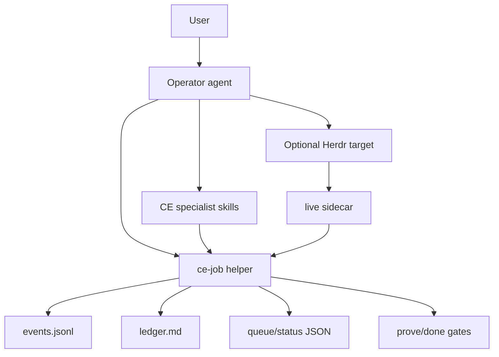
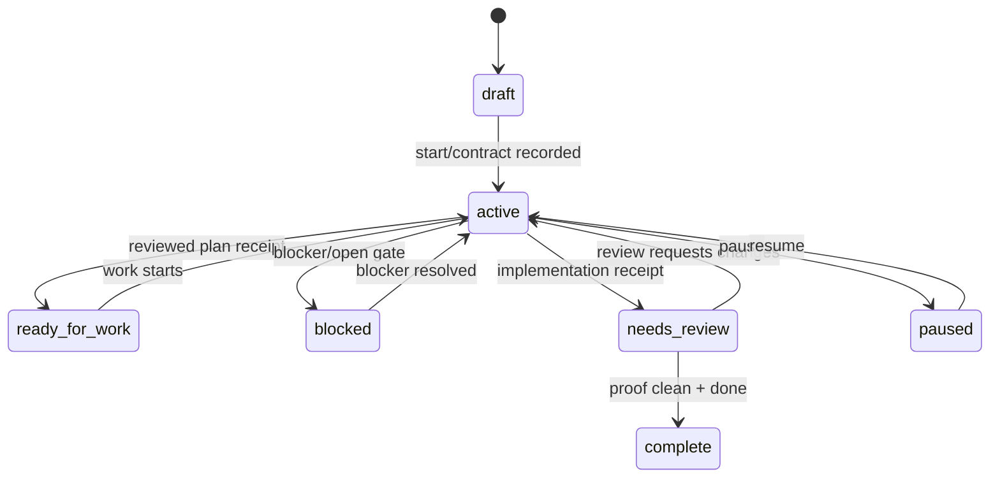

# feat: Build ce-job into a factory control plane

## Goal Capsule

- **Objective:** `ce-job` can coordinate several active human-and-agent workstreams with durable state, enforceable evidence gates, worker visibility, and operator handoff without turning CE into a rigid Builders-style pipeline.
- **Means:** Add an append-only event layer, structured receipt commands, proof gates, queue views, Herdr sidecar integration, and operator status commands around the current Markdown ledger and skill protocol.
- **Authority:** The job ledger and its event stream are source of truth; Herdr and worker output are live signals only; specialist CE skills still own planning, implementation, review, and shipping.
- **Execution profile:** Standard/deep plugin work touching a bundled CLI, skill contracts, docs, and tests.
- **Stop conditions:** Stop before any design that requires a centralized service, production state, or a mandatory pipeline lane. Stop if Markdown ledger compatibility would be broken without a migration path.
- **Who finishes:** `ce-work` or a human implementer should execute this plan in the existing git worktree `compound-engineering-plugin-ce-jobs`, then run `ce-doc-review` and `ce-code-review` before shipping.

---

## Product Contract

### Summary

The current `ce-job` seed is useful because it creates a repo-local shared ledger and a helper script for basic operations. It is not yet a factory-grade control plane because receipts, proof, queue ordering, worker state, and operator reconciliation still depend on agent discipline. This plan turns those parts into deterministic helper behavior while preserving the flexible CE-native model.

### Problem Frame

Builders is a delivery lane: it runs a known pipeline. The desired `ce-job` layer is different: it keeps work coherent when humans, agents, CE skills, Herdr panes, and external lanes all touch the same job. To scale past one or two manually supervised jobs, the mechanical parts need to stop relying on prose. Agents should still decide and communicate; scripts should parse, append, check gates, and summarize.

The work already lives in a git worktree at `compound-engineering-plugin-ce-jobs` on branch `feat/ce-job-state`. No separate repository needs to be initialized for this implementation unless the user later asks to extract `ce-job` into a standalone package.

### Requirements

- R1. The repo keeps one durable job source of truth per workstream, with a human-readable Markdown ledger and a machine-readable append-only event stream that can be replayed into ledger state.
- R2. The helper exposes deterministic commands for root resolution, start, list, status, append feedback, append test requests, pause, resume, ready, prove, done, receipt append, queue views, operator status, and live attachment state.
- R3. Receipt commands record structured outputs from `ce-plan`, `ce-doc-review`, `ce-work`, `ce-code-review`, tests, shipping, and external lanes without requiring agents to hand-write receipt prose.
- R4. `prove` and `done` enforce the job gates: done criteria, test requests, blocking questions, plan review, code review, and unresolved blockers must be proven, explicitly skipped by the user, or reported as missing.
- R5. Queue views classify jobs into operational buckets such as blocked, paused, ready for work, needs review, needs evidence, stale, and complete, with priority, assignee, dependencies, and age when present.
- R6. Herdr integration remains optional and sidecar-backed: attach, watch, interrupt, launch, and heartbeat state never replace ledger evidence.
- R7. Operator mode gives one user-facing agent a concise, repeatable loop for status, feedback intake, worker routing, live supervision, and completion reconciliation.
- R8. Multiple agents can append safely without corrupting the ledger; conflict-prone writes use an append-only JSONL event log and atomic file replacement for rendered Markdown.
- R9. `ce-plan`, `ce-doc-review`, `ce-work`, and `ce-code-review` carry `job:<ledger>` from instruction-level support to deterministic receipt writes where the invoking workflow provides a helper command. Sibling skills must not reference files inside `skills/ce-job/` directly.
- R10. The helper and docs remain portable across harnesses: Python interpreter probing, repo-relative paths in docs, JSON output for agents, actionable errors, and no long-running foreground shell calls.

### Success Criteria

- An operator can run `skills/ce-job/scripts/ce-job queue --json` and see which jobs are blocked, ready, stale, or review-bound without reading every ledger.
- A worker or specialist skill can append a plan/work/review/test receipt with one helper command and a structured JSON response.
- `skills/ce-job/scripts/ce-job done <job>` fails when test requests or review gates lack evidence, and reports exact missing items.
- A Herdr-attached job can show live target, last seen, heartbeat/stale state, and safe interrupt command while still refusing to mark completion from live output alone.
- Existing Markdown ledger files created by the current helper still parse and remain readable.

### Actors

- A1. Human operator who asks for status, supplies feedback, and decides material questions.
- A2. Operator agent that owns ledger hygiene and routes work to specialist skills or live workers.
- A3. Specialist CE skill or human worker that produces plans, code, reviews, tests, or shipping artifacts.
- A4. Optional Herdr worker/pane that provides live process state.
- A5. Future dashboard/TUI that consumes JSON output and event logs.

### Key Flows

- F1. Job start and planning: operator starts a guarded job, records scope, routes non-trivial work through `ce-plan`, and records plan plus doc-review receipt.
- F2. User feedback: user gives a change; operator records an event, renders the ledger, and only then forwards the note to a live worker if attached.
- F3. Worker receipt: `ce-work` finishes a unit; the operator or skill appends a structured work receipt with changed files, checks, blockers, and evidence.
- F4. Proof gate: operator runs prove; missing evidence or reviews block `done`; proven criteria allow completion.
- F5. Live supervision: operator attaches a Herdr target, reads or watches state, interrupts by explicit target, and records live observations without treating them as evidence.

### Scope Boundaries

#### In scope

- Extending `skills/ce-job/scripts/ce-job` as the deterministic file and status engine.
- Adding append-only event storage under the job root or job-adjacent sidecar path.
- Rendering Markdown ledgers from parsed state while preserving manual content where possible.
- Adding receipt, proof, queue, operator, and Herdr sidecar commands.
- Updating `ce-job` skill docs, guide docs, and sibling CE skill instructions for helper-backed receipts.
- Adding focused tests for helper behavior, contracts, and docs.

#### Out of scope

- A centralized server, SaaS dashboard, database, or networked queue.
- Replacing `ce-plan`, `ce-work`, `ce-doc-review`, `ce-code-review`, or Builders.
- A mandatory autonomous lane that runs without human/operator policy.
- Full TUI implementation; JSON output should make it possible later.
- Production writes or any live production repair.

#### Deferred to Follow-Up Work

- A standalone installable `ce-job` binary outside the plugin package.
- A web or terminal dashboard built on top of `queue --json`.
- A Builders adapter that imports full Builders run records.
- Cross-repo portfolio views spanning several checkouts.

### Assumptions

- The implementation continues in the existing git worktree and branch rather than creating a new repository.
- Python remains acceptable for the helper because existing CE scripts already use Python for cross-harness tooling.
- Markdown ledgers remain the human-facing artifact; JSONL events are the machine append path.
- `ce-doc-review` and `ce-code-review` may not be invocable in every host, so helper receipt commands must record skipped/unreachable states distinctly from passed reviews.

---

## Planning Contract

### Key Technical Decisions

- KTD1. **Append-only JSONL events plus rendered Markdown.** Use per-job event logs for concurrency-safe appends and machine receipts, while keeping the Markdown ledger as the user-facing view. This satisfies R1, R8, and avoids turning the ledger into opaque JSON.
- KTD2. **Helper is the mechanical gatekeeper.** `scripts/ce-job` owns status classification, proof checks, receipt schemas, queue sorting, sidecar reads, and safe rendering. Skills remain responsible for judgment and communication. This satisfies R2, R4, R5, and R10.
- KTD3. **Receipts are typed events, not prose conventions.** Plan, doc-review, work, code-review, test, shipping, and lane results each get a typed append command with common fields plus type-specific fields. This satisfies R3 and makes dashboards possible.
- KTD4. **Herdr state is a sidecar, not a ledger replacement.** Attachment metadata and heartbeat/live target state live in `.context/compound-engineering/jobs/<job_id>.json` or a configured local sidecar; evidence still comes from ledger receipts. This satisfies R6.
- KTD5. **Gates fail closed with actionable missing items.** `done` should not set `complete` unless `prove` returns clean or the caller passes explicit user-approved skip records already present in the ledger. This satisfies R4.
- KTD6. **Queue status is derived, not another mutable field.** Frontmatter status stays coarse; queue buckets derive from events, sections, timestamps, dependencies, and live sidecars. This satisfies R5 and prevents stale status labels from lying.
- KTD7. **No long-running foreground worker control.** Herdr watch/launch behavior should be short-call and sidecar-oriented, following the repo's detached-job and watch-loop learnings. This satisfies R6 and R10.

### High-Level Technical Design

### Event Model Direction

The event log should use one JSON object per line. Common fields: `event_id`, `job_id`, `ts`, `type`, `actor`, `source`, `message`, and optional `payload`. Type-specific payloads should stay small and stable enough for tests. The initial event types should include `job.started`, `note.added`, `decision.recorded`, `requirement.added`, `test.requested`, `evidence.recorded`, `receipt.plan`, `receipt.doc_review`, `receipt.work`, `receipt.code_review`, `receipt.test`, `receipt.shipping`, `live.attached`, `live.heartbeat`, `job.paused`, `job.resumed`, `job.ready`, `job.blocked`, and `job.completed`.

### Path and Storage Direction

- Markdown ledger: existing job path, usually `docs/jobs/<job_id>.md`.
- Event log: prefer a hidden sibling `docs/jobs/.events/<job_id>.jsonl` when `job_state_visibility: tracked`; prefer `.context/compound-engineering/jobs/<job_id>/events.jsonl` when local visibility is configured.
- Live sidecar: `.context/compound-engineering/jobs/<job_id>.json`, as the current Herdr reference already states.
- Rendered Markdown remains editable, but helper appends should write events first and render second.

### System-Wide Impact

This changes `ce-job` from a notes workflow into a control-plane primitive consumed by several skills. `ce-plan`, `ce-doc-review`, `ce-work`, and `ce-code-review` should keep working without `ce-job`, but when `job:<ledger>` is present they should prefer helper-backed receipts. Tests should protect this as an optional integration, not a hard dependency for every skill invocation.

### Risks & Dependencies

- Event-log and Markdown divergence is the main risk. Mitigate by rendering after every helper write and adding tests that parse old Markdown-only ledgers.
- Concurrent writes can still race at render time. Mitigate with atomic append and atomic replace; do not promise cross-machine locking in this plan.
- Herdr CLI shape may drift or be unavailable. Mitigate by putting every live command behind explicit availability checks and sidecar records.
- Receipt schemas can overfit early needs. Mitigate by using common receipt fields plus open `payload` while testing the fields that gates consume.
- Existing full-suite instability is environmental; targeted tests and validations remain the primary proof unless the environment is fixed.

---

## Implementation Units

### U1. Add the event store and renderer foundation

- **Goal:** Make helper writes append-only and render the current Markdown ledger from canonical job state.
- **Requirements:** R1, R8, R10; KTD1, KTD2.
- **Dependencies:** None.
- **Files:** `skills/ce-job/scripts/ce-job`, `tests/skills/ce-job-script.test.ts`, `tests/skills/ce-job-contract.test.ts`.
- **Approach:** Introduce event-log path resolution, atomic JSONL append, event replay, and an idempotent renderer that can create or update the existing ledger sections. Keep Markdown-only ledgers readable by synthesizing state from frontmatter and sections when no event log exists. Preserve manual prose by appending helper-generated bullets to the relevant sections rather than rewriting rich user text.
- **Patterns to follow:** `docs/solutions/agent-friendly-cli-principles.md` for distinct outcomes and JSON output; `docs/solutions/skill-design/bundled-script-path-resolution-across-harnesses.md` for portable script use.
- **Test scenarios:**
  - Starting a job writes both a Markdown ledger and an event log with `job.started`.
  - Appending feedback writes an event before rendering the Markdown bullet.
  - A Markdown-only legacy ledger still returns a valid `status --json` response.
  - A malformed JSONL line reports an actionable state and does not silently mark the job complete.
  - Concurrent-style repeated appends keep distinct event IDs and all notes visible after render.
- **Verification:** Focused helper tests prove create, append, replay, render, legacy fallback, and error classification.

### U2. Add typed receipt commands and schemas

- **Goal:** Let CE skills and operators append structured receipts without hand-writing ledger prose.
- **Requirements:** R3, R9; KTD3.
- **Dependencies:** U1.
- **Files:** `skills/ce-job/scripts/ce-job`, `skills/ce-job/SKILL.md`, `skills/ce-job/references/operator.md`, `tests/skills/ce-job-script.test.ts`, `tests/skills/ce-job-contract.test.ts`.
- **Approach:** Add a `receipt` subcommand with typed modes or subcommands for `plan`, `doc-review`, `work`, `code-review`, `test`, `shipping`, and `lane`. Each receipt records status, artifact paths, verdict, changed files, checks, blockers, skipped reason, and free-form payload where relevant. Render receipts into `Plan links`, `Evidence`, `Reviews`, or `Work log` according to type.
- **Patterns to follow:** Existing `ce-code-review/scripts/run-log.py` cost/event shape for durable JSON records; review receipt language in `ce-code-review` and `ce-doc-review` references.
- **Test scenarios:**
  - Plan receipt records a plan path and moves a guarded job toward `ready-for-work` only when doc review is present or explicitly skipped.
  - Doc-review receipt distinguishes passed, findings, failed, skipped, and skill-unreachable states.
  - Work receipt records changed files and checks without marking done.
  - Code-review receipt moves a job out of `needs-review` only when unresolved findings are empty or skipped by user.
  - Invalid receipt types or missing required fields fail with specific errors.
- **Verification:** Receipt tests assert JSON output and rendered Markdown sections.

### U3. Implement `prove` and enforce gated `done`

- **Goal:** Make completion evidence-bound rather than a status write.
- **Requirements:** R4; KTD5.
- **Dependencies:** U1, U2.
- **Files:** `skills/ce-job/scripts/ce-job`, `skills/ce-job/SKILL.md`, `docs/guides/ce-job.md`, `tests/skills/ce-job-script.test.ts`.
- **Approach:** Add `prove --json` that reads done criteria, test requests, open blockers/questions, and receipt states. It returns `proven`, `missing`, `out_of_scope`, and `blocked` groups. Change `done` so it calls the same proof engine and refuses completion unless missing and blocked groups are empty. Allow completion with skipped reviews only when a receipt records explicit user-approved skip or out-of-scope state.
- **Patterns to follow:** Current `ce-job` `prove` prose contract; `docs/solutions/agent-friendly-cli-principles.md` for expected missing evidence vs command failure.
- **Test scenarios:**
  - A job with an open test request and no evidence cannot be completed.
  - A job with a blocker cannot be completed even if review receipts pass.
  - A job with plan, doc-review, work, code-review, test evidence, and done-criteria evidence completes.
  - A review skipped as `skill_unreachable` blocks done; a user-approved skip is reported as risk but not a hard blocker.
  - `prove --json` is stable enough for a dashboard to consume.
- **Verification:** Gating tests demonstrate fail-closed behavior and exact missing-item reporting.

### U4. Add queue, portfolio, and stale-state views

- **Goal:** Support operator management of several jobs without reading each ledger.
- **Requirements:** R5, R7; KTD6.
- **Dependencies:** U1, U2, U3.
- **Files:** `skills/ce-job/scripts/ce-job`, `skills/ce-job/references/job-index.md`, `docs/guides/ce-job.md`, `tests/skills/ce-job-script.test.ts`.
- **Approach:** Add `queue --json` and human output. Derive buckets from replayed state: blocked, paused, ready-for-work, active, needs-review, needs-evidence, stale, complete. Support optional fields in frontmatter or events for `priority`, `assignee`, `depends_on`, and `due`. Stale should be a derived view from `updated`/last event age and optional live heartbeat, not a new mutable status.
- **Patterns to follow:** Existing `job-index.md` durable-first classification; watch-loop learning that external blocked states must be first-class.
- **Test scenarios:**
  - Complete jobs are hidden by default and included with `--all`.
  - A ready job with no blocker appears before active low-priority work when sorting by next action.
  - A dependency on an incomplete job marks the dependent job waiting.
  - Stale classification appears after configured or default age threshold without mutating frontmatter.
  - JSON rows include enough fields for a future TUI.
- **Verification:** Queue tests cover bucket derivation, priority/order, dependencies, and JSON stability.

### U5. Add Herdr sidecar commands and live-state reconciliation

- **Goal:** Make optional live control mechanically safe and visible.
- **Requirements:** R6, R7, R10; KTD4, KTD7.
- **Dependencies:** U1, U4.
- **Files:** `skills/ce-job/scripts/ce-job`, `skills/ce-job/references/herdr-control.md`, `skills/ce-job/references/operator.md`, `tests/skills/ce-job-script.test.ts` or a new `tests/skills/ce-job-herdr.test.ts`.
- **Approach:** Add helper commands for `attach`, `live-status`, `heartbeat`, and `detach` that read/write the sidecar without requiring Herdr. Keep actual Herdr CLI actions in the skill/operator layer unless a small shell-safe wrapper is warranted. Sidecar fields should include target, target_type, attached_by, attached_at, last_seen, last_output_summary, state, and last_interrupt. `status` and `queue` should merge sidecar state as live context only.
- **Patterns to follow:** `herdr-control.md`; `docs/solutions/skill-design/watch-loops-need-a-blocked-external-terminal-state.md`; `docs/solutions/skill-design/detached-job-lifecycle-for-delegated-work.md` for short calls and durable state.
- **Test scenarios:**
  - Attaching writes sidecar state and appends a live-control event.
  - `status --json` shows live target and stale heartbeat without changing job completion.
  - Interrupt without an attached explicit target fails safely.
  - Herdr unavailable still permits sidecar/status operations that do not call Herdr.
  - A live `done` claim does not satisfy proof without evidence receipts.
- **Verification:** Sidecar tests avoid requiring Herdr on PATH while proving the safety contract.

### U6. Add operator loop commands

- **Goal:** Give the operator agent a repeatable command surface for the user's “what is happening / what next?” loop.
- **Requirements:** R7; KTD2, KTD6.
- **Dependencies:** U3, U4, U5.
- **Files:** `skills/ce-job/scripts/ce-job`, `skills/ce-job/references/operator.md`, `docs/guides/ce-job.md`, `tests/skills/ce-job-script.test.ts`.
- **Approach:** Add `operator-status <job> --json` and `next <job> --json`. `operator-status` should combine proof state, queue bucket, review gates, latest evidence, open questions, live state, and one concise next safe action. `next` should return one action with reason and an optional suggested CE skill invocation string.
- **Patterns to follow:** Operator reference's status report shape; existing `ce-plan` handoff style that gives the next consumer a clear route without redoing work.
- **Test scenarios:**
  - A blocked job asks for the blocker decision and does not suggest worker launch.
  - A guarded job lacking doc review suggests `ce-doc-review job:<ledger> <plan>`.
  - A ready job suggests `ce-work job:<ledger> <plan-or-brief>`.
  - A needs-review job suggests `ce-code-review job:<ledger>`.
  - A fully proven job suggests `done`.
- **Verification:** Operator tests compare returned JSON and concise human output for each state.

### U7. Wire sibling skills to helper-backed receipts

- **Goal:** Move `job:<ledger>` support from instruction-only to deterministic updates where possible without breaking skill self-containment.
- **Requirements:** R3, R9.
- **Dependencies:** U2, U3.
- **Files:** `skills/ce-plan/SKILL.md`, `skills/ce-plan/references/plan-handoff.md`, `skills/ce-doc-review/SKILL.md`, `skills/ce-doc-review/references/modes.md`, `skills/ce-work/SKILL.md`, `skills/ce-work/references/input-triage.md`, `skills/ce-code-review/SKILL.md`, `skills/ce-code-review/references/modes-and-output.md`, `tests/skills/ce-job-contract.test.ts`, `tests/skills/ce-plan-handoff-routing.test.ts`, `tests/skills/ce-work-outcome-spine.test.ts`.
- **Approach:** Teach each skill to use a `ce-job` helper command only when the invoking workflow provides one, or to return enough structured receipt data for the operator/caller to append. Do not name `skills/ce-job/scripts/ce-job` or traverse into sibling skill directories from another skill; that violates the repo's self-contained skill rule. Keep a prose fallback when no helper command is available. Each skill should append or return only its durable result, not transcripts.
- **Patterns to follow:** Existing `job:<ledger>` carrier text; skill self-containment and host-generic invocation conventions.
- **Test scenarios:**
  - `ce-plan` docs name the helper receipt for plan and doc-review outcomes.
  - `ce-doc-review` docs name the helper receipt for passed, findings, and skipped states.
  - `ce-work` docs name the helper receipt for changed files, checks, blockers, and evidence without referencing sibling skill files.
  - `ce-code-review` docs name the helper receipt for verdict, findings, and report path.
  - Contract tests reject instructions that create a new job ledger from sibling skills.
- **Verification:** Contract tests plus targeted existing skill tests pass.

### U8. Improve setup, install, and command discovery

- **Goal:** Make the helper easy for agents and humans to find, and make config health visible.
- **Requirements:** R2, R10.
- **Dependencies:** U1.
- **Files:** `skills/ce-setup/SKILL.md`, `skills/ce-setup/references/repo-fixes.md`, `skills/ce-setup/references/config-template.yaml`, `.compound-engineering/config.example.yaml`, `docs/guides/ce-setup.md`, `docs/guides/configuration.md`, `docs/guides/ce-job.md`, `tests/skills/ce-setup-check-health.test.ts`.
- **Approach:** Extend setup health to report the job root, local/tracked visibility, helper executable bit, and event/sidecar paths. Offer gitignore repair when `job_state_visibility: local`. Document direct invocation from `skills/ce-job/scripts/ce-job` and note that a standalone PATH wrapper is deferred.
- **Patterns to follow:** Existing `ce-setup` check-health sections and config-template tests.
- **Test scenarios:**
  - Health reports a valid helper as executable.
  - Health flags non-executable helper or invalid `job_state_root` distinctly.
  - Local visibility prompts a `.gitignore` repair for the configured ledger/event paths.
  - Config docs include the new event/sidecar behavior without implying Herdr is required.
- **Verification:** `ce-setup` targeted tests pass.

### U9. Add regression coverage and docs for factory-mode use

- **Goal:** Lock in the control-plane behavior and explain how it differs from Builders.
- **Requirements:** R1-R10.
- **Dependencies:** U1-U8.
- **Files:** `tests/skills/ce-job-script.test.ts`, `tests/skills/ce-job-contract.test.ts`, `docs/guides/ce-job.md`, `docs/guides/README.md`, `README.md`, `docs/jobs/guarded-job-orchestration.md`.
- **Approach:** Expand script tests around event replay, receipts, prove/done, queue, sidecar, and operator status. Expand docs with a “Factory seed, not pipeline” section and a quickstart showing one operator managing several jobs. Update the dogfood ledger through the helper with plan, review, and validation receipts.
- **Patterns to follow:** Current `ce-job` guide; release metadata count tests.
- **Test scenarios:**
  - Docs mention that `ce-job` can wrap Builders-like lanes but does not replace them.
  - Contract test verifies ledger is source of truth and Herdr is live-only.
  - Script tests cover old ledgers created before event logs.
  - Release metadata stays in sync with the new skill files.
- **Verification:** Targeted tests, release validation, plugin validation, and `git diff --check` pass.

---

## Verification Contract

| Check | Purpose | Expected signal |
| --- | --- | --- |
| `bun test tests/skills/ce-job-script.test.ts tests/skills/ce-job-contract.test.ts` | Primary helper and contract regression suite | Event store, receipts, proof, queue, sidecar, and operator contracts pass |
| `bun test tests/skills/ce-plan-handoff-routing.test.ts tests/skills/ce-work-outcome-spine.test.ts tests/skills/ce-setup-check-health.test.ts` | Cross-skill and setup integration | Existing CE contracts still pass with job receipts added |
| `bun run release:validate` | Catalog and release metadata | Metadata stays in sync |
| `bun run plugin:validate` | Claude plugin manifests | Strict plugin validation passes |
| `git diff --check` | Patch hygiene | No whitespace errors |

Attempt the full `bun test` suite before shipping. If it fails or times out for known environmental reasons such as `ENOSPC` or external CLI path timeouts, record the exact blocker separately and do not treat targeted green checks as a full-suite pass.

---

## Definition of Done

- The helper stores job events append-only and renders/reads legacy Markdown ledgers without data loss.
- Receipt commands exist for plan, doc review, work, code review, tests, shipping, and lane results.
- `prove` reports missing evidence and `done` fails closed until gates are satisfied or explicitly skipped by the user.
- Queue/operator commands produce stable JSON and useful human output for several active jobs.
- Herdr sidecar commands make live state visible and safe without requiring Herdr for file-only jobs; any helper-level `interrupt`, `watch`, or `launch` scope is explicitly aligned with the skill-layer Herdr actions before shipping.
- Sibling CE skills document and prefer helper-backed receipts when `job:<ledger>` is present.
- Setup/docs explain helper discovery, job visibility, event storage, and the difference from Builders.
- All targeted tests and validations in the Verification Contract pass or have recorded, environment-specific blockers.
- Dead-end experimental code is removed before review.

---

## Appendix

### Research Notes

- Existing helper: `skills/ce-job/scripts/ce-job` already supports `root`, `start`, `list`, `status`, `feedback`, `capture`, `test`, `pause`, `resume`, `ready`, and `done` with JSON output.
- Existing skill contract: `skills/ce-job/SKILL.md` already defines ledger shape, guarded start, operator mode, durable-first feedback, optional Herdr control, review, prove, and done.
- Existing tests: `tests/skills/ce-job-script.test.ts` and `tests/skills/ce-job-contract.test.ts` cover the seed helper and skill contract.
- Existing learnings shape this plan: append-friendly CLI outcomes, bundled script path portability, detached job lifecycle, and watch-loop blocked-external states.
- Current worktree is already a git repository/worktree: `compound-engineering-plugin-ce-jobs` on `feat/ce-job-state`.
