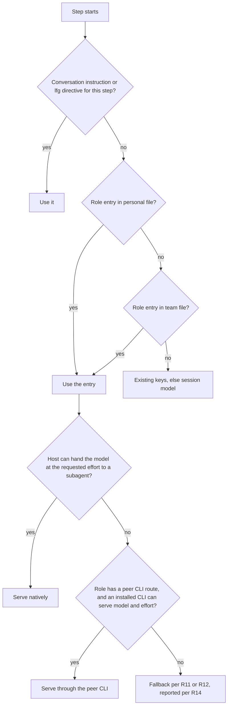
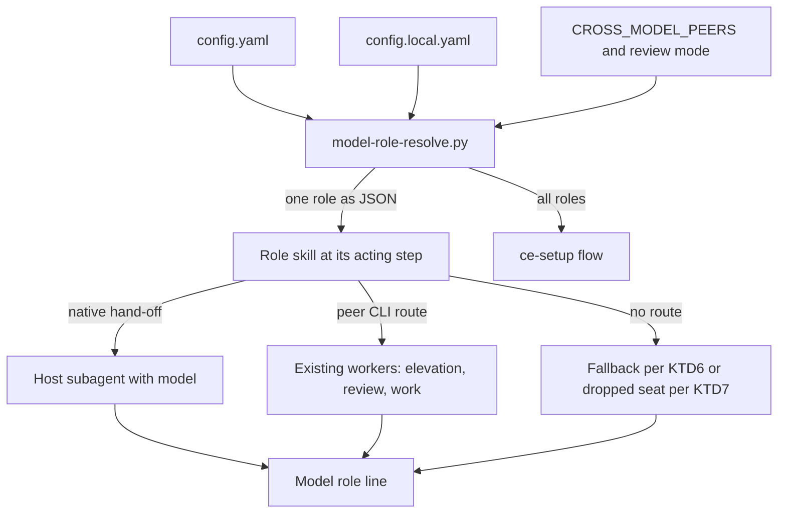
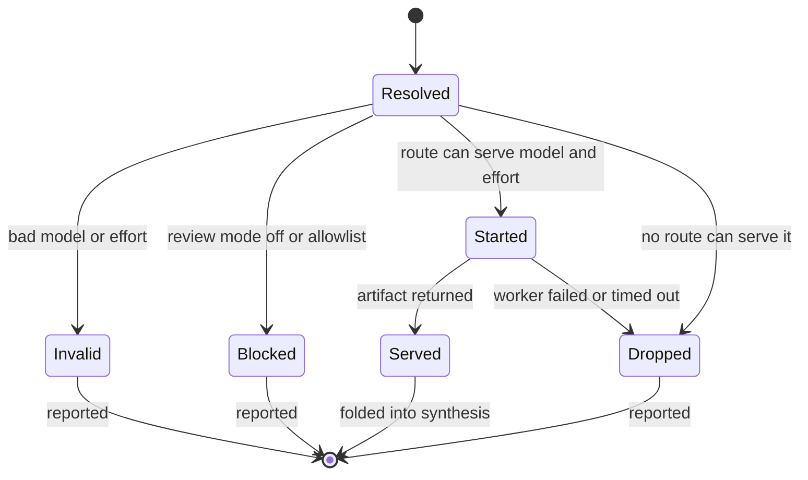

# Model Role Map - Plan

## Goal Capsule

- **Objective:** A developer chooses once per repo which model and reasoning effort does each kind of work in the Compound Engineering pipeline. Every step then produces its output on that choice, whether the developer runs the skill by hand or `lfg` runs it, in any supported app, and reports which model actually served.
- **Means:** One `model_roles` map in the existing CE config, resolved by a bundled script that every role skill calls (KTD1, KTD2), plus a guided `ce-setup` flow that writes it.
- **Authority:** The Product Contract decides behavior and the Planning Contract decides mechanism. Entries marked `session-settled` were decided by the maintainer on 2026-10-01 and are not re-opened during implementation.
- **Execution profile:** One pull request. Units run in dependency order. Every edit under `skills/**` starts from the repo-local `ce-skill-work` skill in edit mode.
- **Stop conditions:** A settled decision proves infeasible. A touched `SKILL.md` cannot stay under the prompt budget without losing a test-pinned rule. An eval shows the no-map path changed behavior and the change cannot be removed.
- **Who finishes:** `lfg` runs simplification, review, the pull request, and CI. Merging stays with the maintainer.
- **Open blockers:** None.

---

## Product Contract

### Summary

Add one role map to the CE config with one entry per pipeline role. An entry names a model and effort, a list of them for a review panel, or `inherit`. Each step skill honors its own entry the same way by hand and under `lfg`, and `ce-setup` detects reachable models and writes the map.

### Problem Frame

A developer with several models available can steer only part of the pipeline today, through three unrelated settings. `plan_model` and `brainstorm_model` take a model alias with no effort. `cross_model_peer`, `cross_model_model`, and `cross_model_effort` name a single reviewer peer that `ce-doc-review` and `ce-code-review` must share. `work_engine_preferences` and `work_engine_effort` cover implementation. `ce-debug`, `ce-simplify-code`, and `ce-compound` read no model setting at all.

`lfg` can pass a model assignment to two stages only, planning and implementation. Every other step runs on whatever model the session is on.

The cost is a mismatch the developer cannot correct from config: an expensive session model does the mechanical steps, or a cheap one does the judgment steps. A multi-model review panel cannot be expressed at all.

Cursor's `pstack` plugin shows the shape developers now expect: one file, one line per role, a list for a panel, written by a setup command that detects available models.

### Key Decisions

- **One shared map for `lfg` and standalone skills.** (session-settled: user-approved — chosen over a separate `lfg` file plus a separate work-type file: two files can disagree and need a precedence rule.) Governs R1, R15.
- **The map lives per repo in the existing two config files.** (session-settled: user-approved — chosen over a user-wide map in the home directory: no new config layer, and cloud sessions can read it.) Governs R4.
- **A single role map replaces writing three dialects.** (session-settled: user-approved — chosen over adding effort, lists, and missing keys to each existing key family: that leaves no single place showing the model setup.) Governs R1, R2, R5.
- **The map works in every supported app, and Cursor follows pstack's mechanism.** (session-settled: user-directed — chosen over a Cursor-only map: the primary user works across more than one app.) Governs R3, R10.
- **An entry governs the step's deliverable, not the conversation.** (session-settled: user-approved — chosen over running each whole stage as a delegated worker under `lfg`: a much larger change to how `lfg` runs stages.) Governs R7.
- **Fallback differs by role kind.** (session-settled: user-approved — chosen over pstack's same-family substitution for every role: a substituted panel seat weakens the independence the panel exists for.) Governs R11, R12.
- **`ce-setup` gains a guided flow for the map.** Requested directly by the user. Governs R16, R17, R18, R19.

### Requirements

**The map**

- R1. CE config accepts one role map with one entry per role in this table.

| Role | Skill | Deliverable the entry governs | Existing keys for the same step | Peer CLI route |
|---|---|---|---|---|
| `brainstorm` | `ce-brainstorm` | The generated approaches | `brainstorm_model` | yes |
| `plan` | `ce-plan` | The authored plan | `plan_model` | yes |
| `doc-review` | `ce-doc-review` | Each independent review of the plan | `cross_model_peer`, `cross_model_model`, `cross_model_effort` | yes |
| `debug` | `ce-debug` | The diagnosis and fix | none | no |
| `work` | `ce-work` | The code | `work_engine_*` | yes |
| `simplify` | `ce-simplify-code` | The simplification | none | no |
| `code-review` | `ce-code-review` | Each independent review of the diff | `cross_model_peer`, `cross_model_model`, `cross_model_effort` | yes |
| `compound` | `ce-compound` | The learning document | none | no |

- R2. An entry is a model with an optional reasoning effort, a list of those on a review role, or `inherit`, which means the session model.
- R3. An entry is app-neutral: it names a model and effort, never an app-specific slug, CLI flag, or command.
- R4. The map resolves from the personal file, then the team file, one role at a time. An invalid entry is skipped the way an invalid ordinary key is.
- R5. A role with an entry uses it in place of the existing keys in R1's table for that step. A role with no entry behaves exactly as it does today.
- R6. A direct instruction in the conversation, and a stage directive given to `lfg`, outrank the map.

**What an entry governs**

- R7. A role's entry decides which model, at which effort, produces that step's deliverable as listed in R1. Dialogue with the user, orchestration inside the skill, and `lfg`'s hand-offs between steps stay on the session model.
- R8. On a review role, each list entry adds one independent reviewer on that model, so the list length sets the number of independent reviews. Seats run on every review of that role, in addition to the skill's existing persona review, which still runs when every seat is dropped.
- R9. Scouts and verifiers that a step dispatches keep their Model tier; an entry does not change them.
- R10. Each app serves an entry natively when it can hand that model, at the requested effort, to a subagent, and otherwise, for a role R1's table gives a peer CLI route, through an installed peer CLI that can serve both. In Cursor, entries are handed to subagents as their model, the way pstack's skills do it. `inherit`, or an entry with no effort that names the session's own model, runs with no hand-off.

**Fallback and reporting**

- R11. When a single-model role's model or effort cannot be served, the step runs on the nearest available option in the same model family, and on the session model when no family match exists.
- R12. When a review seat's model or effort cannot be served, that seat is dropped and the remaining seats run. A seat is never filled by another model.
- R13. `cross_model_review_mode: off` skips every review seat whose model is served by a provider other than the session model's, whether that seat would run as a native subagent or through a peer CLI. A conversation request still overrides it, as it does today. `CROSS_MODEL_PEERS`, when set, filters every review seat by its provider and any intermediary in the same way, and an excluded seat is skipped, never substituted.
- R14. Every step that an entry governs reports the requested model, the served model, and how it was served. A fallback under R11, a dropped seat under R12, and a seat skipped under R13 are each reported with the reason.

**lfg**

- R15. A step honors its entry identically whether the developer invokes the skill or `lfg` does. An `lfg` run needs no extra instruction to apply the map.

**Setup**

- R16. `ce-setup` offers a guided flow that detects the models the current app can reach, shows each role with its effective value and the source of that value, and lets the developer set or clear each role. The source is the map entry, the existing key from R1's table, or the session model, and the flow says so when a new entry replaces an existing key for that step.
- R17. The flow asks which file receives the map and states the reach of each: the team file reaches every worktree, clone, and cloud session, and the personal file reaches this checkout only.
- R18. Re-running the flow starts from the current map and changes only the roles the developer changes.
- R19. The flow offers the models it detected and also accepts one it could not confirm, which it writes marked as unconfirmed. `inherit` is always accepted.



### Key Flows

- F1. Setting up the map
  - **Trigger:** The developer runs `ce-setup` and chooses the model flow.
  - **Steps:** Setup detects reachable models. It shows each role with its effective value and source. The developer sets the roles they care about and leaves the rest unset. The developer picks the team or personal file, and setup writes it.
  - **Outcome:** The next run of any governed skill uses the map wherever the chosen file reaches.
  - **Covered by:** R16, R17, R18, R19
- F2. An `lfg` run under the map
  - **Trigger:** The developer starts `lfg` on a feature with a map in place.
  - **Steps:** Each step resolves its role entry and produces its deliverable on that model. Review roles run one reviewer per seat. A step with no entry behaves as today.
  - **Outcome:** The pull request exists, and each governed step has reported requested and served models.
  - **Covered by:** R5, R7, R8, R14, R15

### Acceptance Examples

- AE1. The motivating config
  - **Covers R1, R2, R7, R8, R15.**
  - **Given** a map with `plan` on Fable at low effort, `doc-review` listing a Grok model at high, a GPT model, and Opus at medium, and `work` on Opus at medium, in a session on another model.
  - **When** `lfg` runs a feature.
  - **Then** Fable at low authors the plan, three independent reviewers review it, Opus at medium writes the code, and every role with no entry runs as it does today.
- AE2. Role-by-role layering
  - **Covers R4.**
  - **Given** a team file that sets `plan` and `work`, and a personal file that sets only `plan`.
  - **When** `ce-work` runs.
  - **Then** it uses the team file's `work` entry.
- AE3. Existing keys keep working
  - **Covers R5.**
  - **Given** `plan_model: fable` and a map with no `plan` entry.
  - **When** `ce-plan` runs.
  - **Then** Fable authors the plan as it does today. After a `plan` entry is added, that entry is used instead.
- AE4. A seat that cannot run
  - **Covers R12, R14.**
  - **Given** a three-seat `doc-review` list whose first seat needs a provider that this app cannot serve and has no peer CLI for.
  - **When** `ce-doc-review` runs.
  - **Then** the two remaining seats and the persona review run, and the report names the dropped seat and the reason.
- AE5. Review policy still applies
  - **Covers R13, R14.**
  - **Given** `cross_model_review_mode: off` and a `code-review` list naming two other providers.
  - **When** `ce-code-review` runs with no conversation request for a peer.
  - **Then** no diff leaves for a second provider, and the report names the skipped seats.
- AE6. Effort the app cannot serve
  - **Covers R11, R14.**
  - **Given** `work` on Opus at max in an app that serves Opus only up to high.
  - **When** `ce-work` runs.
  - **Then** Opus at high writes the code, and the report says max was requested and high served.
- AE7. The same map in Cursor
  - **Covers R3, R10.**
  - **Given** AE1's map, opened in Cursor.
  - **When** `ce-doc-review` runs.
  - **Then** all three seats run as Cursor subagents on their models, with no peer CLI involved.
- AE8. Setup marks a model it could not confirm
  - **Covers R16, R17, R19.**
  - **Given** an app that can reach its own provider's models and one installed peer CLI.
  - **When** the developer runs the setup flow, picks the team file, and enters one model from neither source.
  - **Then** setup offers the models from those two sources plus `inherit`, writes the entered model marked as unconfirmed, and writes the map to the team file.
- AE9. Review policy in an app that serves several providers
  - **Covers R13, R14.**
  - **Given** AE1's map opened in Cursor, `cross_model_review_mode: off`, and a session whose serving family is attested as Claude.
  - **When** `ce-doc-review` runs with no conversation request for a peer.
  - **Then** only the Opus seat runs, and the report names the two skipped seats. When the session's family cannot be attested, no named seat runs and the report names all three.

### Success Criteria

- The user's own example (AE1) works as written, with no other configuration.
- A checkout with no role map behaves exactly as it did before this work.
- A developer can produce a working map from `ce-setup` alone, without reading the configuration guide.

### Scope Boundaries

Deferred for later:

- Roles for `lfg`'s shipping tail: `ce-test-browser`, `ce-commit-push-pr`, and `ce-babysit-pr` stay on the session model.
- Skills outside the `lfg` flow, including `ce-pov` panels, `ce-ideate`, and `ce-explain`.
- A budget control in setup that sets every effort at once.
- A user-wide map in the home directory.
- `lfg`-only overrides of individual roles.
- CE-maintained per-role model defaults or named profiles. An unset role is governed by R5.
- Removing or deprecating `plan_model`, `brainstorm_model`, `cross_model_*`, or `work_engine_*`.
- Running a whole `lfg` stage as a delegated worker.
- Peer CLI serving for `debug`, `simplify`, and `compound`. It needs a write-capable external worker, which only `ce-work` has today.

Outside this work:

- Credentials, CLI commands, and app flags in the map. The existing config rule already excludes them.
- A `model_roles` section in the `ce-setup` health check. Considered and not built: each run prints the resolver's warnings for its role, each review names its recipients before sending, and the setup flow shows effective values and shadowed keys. A report of a bad map going unnoticed through those three would change the call.
- Changes to how Model tiers are assigned.

### Dependencies / Assumptions

- pstack's Cursor behavior is taken from its skill text (`setup-pstack`, `interrogate`, `arena`), not from a test in Cursor. The assumption behind R10 and AE7 is that Cursor's subagent tool accepts any model the account can use.
- A list means a review panel only on `doc-review` and `code-review`. Ordered fallbacks for implementation stay in `work_engine_preferences`. The user has not confirmed this.
- Role names follow the skill names in R1's table. The user has not confirmed them.
- R4's role-by-role layering is an exception to the rule that a map in the personal file replaces the whole key. `packs:` already has its own merge rule, so it is not the first exception.
- A map in the team file applies to teammates who may not reach a listed model. R11 and R12 govern what they get.
- The model names in the user's example are illustrative. Which aliases and versions are valid stays with the existing alias handling.
- A config option change updates `skills/ce-setup/references/config-template.yaml`, `.compound-engineering/config.example.yaml`, and `docs/guides/configuration.md` in the same change, per the project's instructions.

### Open Questions

Deferred to implementation:

- Whether `ce-work` already runs any unit in a native subagent that can take a model. Where it does, a `work` entry may be served natively; otherwise KTD10's engine routes serve it.
- Which block each near-budget `SKILL.md` relocates, if a pointer line does not fit (U7, U9).
- The exact optional field names that carry the report line in `ce-code-review`'s `mode:agent` return and `ce-debug`'s return (KTD13).
- Whether `cross-model-work.sh` already exposes the accepted effort levels of a route at preflight, or needs that added (U5).

Not verified in this work:

- AE7 and the Cursor half of AE9. The eval harness has no Cursor host, so both are manual checks recorded in the pull request.

### Sources / Research

- `skills/ce-setup/references/config-template.yaml` — every existing model and effort key, with comments.
- `docs/guides/configuration.md` — the two-file layering rule and the "config is a default" precedence.
- `skills/lfg/SKILL.md` and `skills/lfg/references/stage-routing.md` — the pipeline steps and the two routable stages.
- `skills/ce-plan/references/reasoning-elevation.md` — the native, Claude CLI, inline adapter order that R10 extends.
- `skills/ce-doc-review/references/cross-model-review.md` and `skills/ce-code-review/references/cross-model-review.md` — the single-peer pass, `cross_model_review_mode`, and the skip-rather-than-substitute rule behind R12 and R13.
- `CONCEPTS.md` — Model tier, Cross-model pass, Model identity receipt, Engine carrier.
- `docs/plans/2026-08-12-002-fix-repo-config-cascade-plan.md` — why most keys are team-default and locally overrideable, and the no-deep-merge rule R4 departs from.
- `docs/plans/2026-03-25-002-refactor-config-storage-redesign-plan.md` — why durable config left `.context/compound-engineering/`.
- pstack: https://github.com/cursor/plugins/tree/main/pstack — `skills/setup-pstack/SKILL.md` for the map shape and detection, `skills/interrogate/SKILL.md` and `skills/arena/SKILL.md` for how a skill consumes a role line.

---

## Planning Contract

### Product Contract preservation

Changed: AE9 — a session whose serving family cannot be attested skips every named seat under `cross_model_review_mode: off` (KTD7). Cursor's family is unknown by this repo's own rule, so the original result could not be promised there.

Clarified, no scope change:

- R1's peer CLI column for `plan` and `brainstorm` covers Claude-family models, the only family the elevation engine has an adapter for (KTD9).
- R14's served effort is the effort the route was asked to run at. No route returns an effort receipt.
- R10's no-hand-off case is an entry with no effort, because no host exposes the session's effort (KTD5).
- R1's table names the three review keys an entry replaces. `cross_model_review_mode` stays in force under R13.
- The Product Contract's planning questions are resolved by KTD1 through KTD13.

### Key Technical Decisions

- KTD1. **The map is one top-level `model_roles` key whose entries are plain strings.** An entry is `<model> [<effort>]`, the word `inherit`, or on a review role a list of those. The effort scale is `low`, `medium`, `high`, `xhigh`, `max`. Strings read like the example the user wrote and fit the narrow hand-rolled parser `packs-resolve.py` already uses. Object entries in the style of `work_engine_preferences` were judged heavier with no added expressiveness, so no bake-off ran. Governs R2, R3.
- KTD2. **One bundled resolver script owns grammar, layering, family classification, and review egress policy.** `model-role-resolve.py` is stdlib-only Python, byte-duplicated into every consumer skill with a parity test, as `packs-resolve.py` is. A skill runs it only when a config file holds an active `model_roles:` key, so a checkout with no map never needs Python and behaves as it does today. The `ce-config-layers` prose block stays untouched, because role-by-role layering lives in the script the way the `packs:` merge rule does. Governs R4, R5, R13.
- KTD3. **Skill bodies gain no role prose.** Every touched `SKILL.md` except `ce-simplify-code` sits within 161 bytes of the 8,000-byte prompt budget. The shared contract is one reference, `references/model-roles.md`, byte-duplicated into the eight role skills and loaded from the reference each skill already reads at its acting step.
- KTD4. **Precedence is live instruction, then `lfg` carrier, then map entry, then existing key, then session model.** A map entry in either file outranks an existing key in either file. A live instruction or carrier replaces the entry whole, including its effort and, on a review role, its seat list for that run. One personal opt-out survives: `work_engine_mode: off` in the personal file keeps a team-file `work` entry off any external engine, while a personal-file `work` entry still wins. Governs R5, R6.
- KTD5. **An entry with an explicit effort always hands off.** (session-settled: user-approved — chosen over picking the native route on the model alone: native dispatch cannot set effort, so the motivating config would lose its efforts.) No host exposes the session's own effort, so only an entry with no effort that names the attested session model runs without a hand-off. Governs R10.
- KTD6. **The single-model fallback ladder keeps the named model as long as any route can serve it.** In order: the same model at the next lower effort the route accepts; the same model with the effort unapplied, on a route that has no effort control; the route's own default model where it has one; the session model. The native route of `debug`, `simplify`, and `compound` is the no-effort-control case on every host verified so far, and the `Model role` line reports the effort as not applied. The resolver owns the effort order and each adapter's preflight owns which levels a route accepts. This applies to map entries only. `ce-work`'s rule that nothing runs at a different effort than requested, and elevation's rule that recovery never substitutes a model, keep governing the existing keys. Governs R11.
- KTD7. **Review roles fail closed.** When an active `model_roles` block is malformed or the resolver cannot run, a review skill runs its persona review only and names the reason. An invalid seat drops alone; a list never falls through to another layer's seats. An unattested host family blocks every named seat under `off` or a set `CROSS_MODEL_PEERS`, and so does a seat whose own family is unknown. Governs R12, R13.
- KTD8. **A seat is one job on the review skill's existing peer brief, with its own identity.** `ce-doc-review` seats run the `whole-doc` brief. `ce-code-review` seats run the adversarial peer brief beside the in-process adversarial reviewer. Seats replace the conditional single-peer pass when the role has an entry, and the rule that a started peer removes the in-process adversarial reviewer stays scoped to that legacy pass. Synthesis rules do not change: seat-only findings never auto-apply and agreement between seats does not stack. A seat in the host's own family bypasses the worker's same-family exclusion and never records `independence_verified`. Governs R8.
- KTD9. **`plan` and `brainstorm` keep one peer adapter, the Claude CLI.** An entry in another family is served only where the host can hand that model to a subagent, and otherwise falls to the session model with a report. New read-only Codex and Grok elevation adapters are follow-up work.
- KTD10. **A `work` entry becomes one `prefer` engine candidate.** The resolver maps family to harness: Claude to `claude`, GPT to `codex`, Grok to `grok`, Composer to `cursor`. The entry's effort replaces `work_engine_effort` for that candidate. `ce-work`'s existing return fields carry the report, so `lfg`'s work gate is unchanged.
- KTD11. **Native-only hand-offs pass files, and the session keeps every gate.** `ce-simplify-code` hands apply-and-verify to one subagent. `ce-compound` has a subagent draft the body into scratch from a hand-off file while the orchestrator classifies, writes, and validates. `ce-debug` hands investigation and the test-first fix to subagents while the session keeps the causal-chain gate, branch, scope record, commit, and return. A hand-off that fails mid-edit is finished inline by the session, which re-runs verification and reports the fallback. Governs R7.
- KTD12. **Cursor serving is a condition, not a table.** The resolver emits model and effort only. A session whose subagent tool lists model ids that encode effort matches the entry against that list, and no match means the entry cannot be served there. No Cursor ids are stored in the repo. Governs R3, R10.
- KTD13. **Each governed step prints one `Model role` line in the output it already produces.** The line names the role, the requested model and effort, the served model or `unverified`, the route, and the reason for any fallback, drop, or skip. Structured returns gain optional fields only; no test-pinned key is renamed. `lfg` relays the lines in its close-out. Governs R14, R15.

### High-Level Technical Design



Precedence for one role, highest first (KTD4):

| Source | Single-model role | Review role |
|---|---|---|
| Live instruction this run | Replaces the entry, effort included | Runs the legacy single-peer path as today; the seat list is not used |
| `lfg` carrier | Replaces the entry, effort included | None exists |
| Personal-file entry | Used | Its seats are used |
| Team-file entry | Used | Its seats are used |
| Existing key, either file | Used as today | Conditional single-peer pass as today |
| Nothing | Session model | Persona review only |

Seat lifecycle:



Resolver output for one role, as a directional shape:

```text
role, state (unset | inherit | entries | invalid), source (local | team)
entries[]: seat, model, effort or null, family, harness or null, blocked_by or null
effort_scale, warnings[], errors[]
```

The `--all` form reports each role's effective value and source, plus any existing key a map entry shadows.

### Assumptions

These are planning bets the user has not confirmed.

- A map entry in the team file outranks a personal existing key for the same step, with the one exception in KTD4. The setup flow names every shadowed key.
- A personal `work_engine_mode: off` is treated as an opt-out from external engines, the way R13 treats the review mode. The user has not confirmed that reading.
- A live "review with X" instruction runs the existing single-peer path for that run and ignores the seat list.
- On a review role, scalar `inherit` and an empty list both mean no seats and no legacy pass. Inside a list, `inherit` is one seat on the session model.
- Duplicate seats each run, and the list has no cap.
- Seats run when a review dispatches its persona team. A re-invocation that reuses completed review results reuses seat results too.
- A natively served review seat is instructed read-only and document-only, matching the peer-CLI bound.
- A `provider/model` id, or any model the resolver cannot place in a family, is served only natively and otherwise falls back or drops.
- Seats never use an intermediary route such as Grok through `cursor-agent`.
- In a remote-only review scope, peer-CLI `code-review` seats are dropped and reported, and native seats run.
- Setup treats a family as confirmed when the host or an installed CLI serves it. It does not test account entitlement.
- Evals run on Claude and OpenCode. Codex is recorded as a skipped host because its CLI does not start on the authoring machine.

### System-Wide Impact

- **Egress.** A committed map can send plans, diffs, and implementation work to providers a teammate did not pick. R13 and KTD7 control review roles, KTD4's opt-out controls `work`, and each review names every recipient before anything is sent (U6).
- **Prompt budget.** Nine skills gain a script and a reference. Bodies stay under the 8,000-byte cap by KTD3.
- **Cost.** A three-seat list adds three full reviews to every plan and every diff `lfg` handles.
- **Existing contracts.** `ce-work`'s return, `ce-debug`'s return, and `ce-code-review`'s `mode:agent` return are read by `lfg` and pinned by tests. Changes are additive.

### Risks & Dependencies

| Risk | Mitigation |
|---|---|
| Native effort is unproven on every host | KTD5 routes effort through a peer CLI; U11 records which hosts were verified live |
| Hand-off prose regresses the no-map path | Every consumer skips the resolver when no active key exists; U11 carries a restraint cell per role |
| Review rounds accrete cases onto the shared contract | The contract has one owner per rule (KTD2, KTD3); restate the condition on the second round |
| Subprocess-heavy tests hit the bun parallel timeout | Resolver tests build throwaway repos and stay spawn-light |
| Codex may expose no model selector to subagents, so native-only roles could always fall to the session model there, and Codex is a skipped eval host | The pull request states that Codex behavior is unverified; the `Model role` line reports each fallback at run time |
| `tests/gpt-5-6-skill-migration.test.ts` rejects pinned GPT variants under `skills/` | Template and reference examples use Claude aliases and a placeholder for other families |

---

## Implementation Units

| Unit | Title | Key files | Depends on |
|---|---|---|---|
| U1 | Resolver script and parity | `skills/ce-setup/scripts/model-role-resolve.py` | none |
| U2 | Config surface | `skills/ce-setup/references/config-template.yaml`, `docs/guides/configuration.md` | U1 |
| U3 | Shared role contract reference | `skills/ce-plan/references/model-roles.md` | U1 |
| U4 | `plan` and `brainstorm` | `skills/ce-plan/references/reasoning-elevation.md` | U3 |
| U5 | `work` | `skills/ce-work/references/execution-engines.md` | U3 |
| U6 | Review seats | `skills/ce-doc-review/references/cross-model-review.md` | U3 |
| U7 | `simplify` and `compound` | `skills/ce-simplify-code/SKILL.md`, `skills/ce-compound/references/assembly.md` | U3 |
| U8 | `debug` | `skills/ce-debug/references/fix.md` | U3 |
| U9 | Setup flow | `skills/ce-setup/references/model-roles-setup.md` | U1, U2 |
| U10 | `lfg` relay and guides | `skills/lfg/references/task-visibility.md`, `docs/guides/` | U4 to U9 |
| U11 | Behavioral evals | `tests/skill-eval-cell/catalog.ts` | U4 to U10 |

### U1. Resolver script and parity

- **Goal:** One script turns the two config files into a per-role answer that every consumer reads the same way.
- **Requirements:** R1, R2, R3, R4, R13; KTD1, KTD2, KTD7, KTD10.
- **Dependencies:** None.
- **Files:**
  - Create `skills/ce-setup/scripts/model-role-resolve.py` as the canonical copy.
  - Create byte-identical copies under `scripts/` in `ce-brainstorm`, `ce-plan`, `ce-doc-review`, `ce-code-review`, `ce-work`, `ce-debug`, `ce-simplify-code`, and `ce-compound`.
  - Create `tests/skills/model-role-resolver.test.ts`.
- **Approach:**
  1. Parse only the `model_roles` block with a narrow parser that accepts scalars, block lists, and flow lists, and reports anything else as an error in the JSON.
  2. Resolve each role from the personal file, then the team file. An invalid single-role entry is skipped with a warning.
  3. Classify each model into a family with one table: Claude aliases and `claude-*`, `gpt-*` and `o<digit>*`, `grok-*`, `composer-*`, otherwise unknown.
  4. For review roles, read `cross_model_review_mode` by the ordinary two-file rule and `CROSS_MODEL_PEERS` from the environment, take the attested host family as an argument, and mark each seat's `blocked_by`.
  5. Print one JSON object and exit 0 whenever resolution ran. `--role <name>` answers one role and `--all` answers every role with effective value, source, and shadowed existing keys.
- **Execution note:** Write the test file first; the script's contract is the JSON.
- **Patterns to follow:** `skills/ce-setup/scripts/packs-resolve.py` for the parser and never-throw contract. `tests/skills/ce-packs-resolver.test.ts` for the copy list and throwaway repos.
- **Test scenarios:**
  - Covers AE2. Team file sets `plan` and `work`, personal file sets `plan`: `--role work` returns the team entry and `--role plan` the personal one.
  - `opus medium` returns model `opus`, effort `medium`, family `claude`, harness `claude`; `opus` alone returns a null effort.
  - Personal `inherit` over a team entry returns state `inherit`.
  - A block list and a flow list on `doc-review` both return seats in order with seat numbers; duplicate entries stay duplicated.
  - A scalar model on a review role returns one seat; `[]` and scalar `inherit` return state `inherit`.
  - A list on `work` is invalid in that layer with a warning, and the other layer's scalar is returned.
  - An unknown effort word invalidates a single-role entry; with no other layer the role is unset.
  - One bad seat in a three-seat list is returned marked invalid, the other two are returned, and the other layer is not consulted.
  - A malformed `model_roles` block returns state `invalid` with an error and exit 0.
  - `code_review` as a key is ignored by `--role` and warned about by `--all`.
  - Family table: `fable`, `claude-opus-5-5`, a `gpt-` id, an `o3` id, `grok-4.7`, `composer-2.5-fast`, and `provider/model` each land in the expected family.
  - Covers AE5, AE9. Mode `off` with host family `claude` blocks the Grok and GPT seats and leaves the Opus seat; host family `unknown` blocks all three; an `inherit` seat is never blocked.
  - `CROSS_MODEL_PEERS=codex` with host `claude` blocks the Grok seat only.
  - A `provider/model` seat is blocked under mode `off` and under `CROSS_MODEL_PEERS=codex`, each with host `claude`.
  - A personal `cross_model_review_mode: off` beats a team `auto`.
  - Covers AE3. `--all` with `plan_model: fable` and no `plan` entry reports the existing key as the source; with an entry it reports the entry and lists `plan_model` as shadowed.
  - Outside a git repository, and with no config files, every role is unset.
  - All nine copies are byte-identical.
- **Verification:** The new test file passes, and `tests/skill-conventions.test.ts` and `tests/bundled-script-line-endings.test.ts` stay green.

### U2. Config surface

- **Goal:** The new key is documented where every other key is.
- **Requirements:** R1, R4, R5, R13; KTD1.
- **Dependencies:** U1.
- **Files:**
  - Modify `skills/ce-setup/references/config-template.yaml` and its byte-identical copy `.compound-engineering/config.example.yaml`.
  - Modify `docs/guides/configuration.md`.
  - Modify `tests/skills/ce-setup-check-health.test.ts`, which owns the template identity and docs coverage checks.
- **Approach:**
  1. Add a `# --- Model roles ---` section to the template with every role commented out, the role-by-role layering exception stated at the key, and a pointer to `cross_model_review_mode`.
  2. In the guide, add a "How keys resolve" bullet for the exception, an Options row, and a worked example covering `inherit`, a seat list, shadowed existing keys, and the personal opt-outs.
- **Patterns to follow:** The `# --- Model elevation ---` template section; "Implementation routing" in the guide.
- **Test scenarios:**
  - The example file equals the template byte for byte.
  - `model_roles` appears in the configuration guide; no prose comment line in the template parses as an undocumented key.
  - The template's example lines parse through the resolver once uncommented.
- **Verification:** The identity and docs coverage tests pass, and the health check's output is unchanged for every existing fixture.

### U3. Shared role contract reference

- **Goal:** The common rules exist once per skill directory and never in a skill body.
- **Requirements:** R6, R7, R9, R10, R11, R14; KTD3, KTD4, KTD5, KTD6, KTD12, KTD13.
- **Dependencies:** U1.
- **Files:**
  - Create `references/model-roles.md` in `ce-brainstorm`, `ce-plan`, `ce-doc-review`, `ce-code-review`, `ce-work`, `ce-debug`, `ce-simplify-code`, and `ce-compound`, byte-identical.
  - Create `tests/model-roles-reference-parity.test.ts`.
  - Modify `CONCEPTS.md` to add Model role map and Review seat.
- **Approach:** The reference states, in this order: when to consult the map (an active key exists), the resolver recipe with the `SKILL_DIR` and `PY` probe and its failure direction, precedence (KTD4), when a hand-off happens (KTD5), the serving order with the Cursor condition (KTD12), the single-model fallback (KTD6), what stays on the session model (R7, R9), and the `Model role` line (KTD13), which also carries any resolver warning for the role. Seat rules live in U6, not here.
- **Patterns to follow:** `skills/ce-plan/references/reasoning-elevation.md` and `tests/reasoning-elevation-parity.test.ts` for a byte-duplicated engine reference; `skills/ce-brainstorm/references/dialogue.md` for the script recipe.
- **Test scenarios:**
  - All eight copies are byte-identical, and renaming one token in one copy turns the parity test red.
  - Each copy names `scripts/model-role-resolve.py` and the path exists in that skill.
  - The reference contains the stable tokens `Model role`, `inherit`, and the five effort words.
  - `tests/codex-skill-prompt-budget.test.ts` stays green for every touched skill.
- **Verification:** Parity and convention tests pass. Behavior is evaluated in U11.

### U4. `plan` and `brainstorm`

- **Goal:** A `plan` or `brainstorm` entry decides the authoring or approach-generation model and its effort.
- **Requirements:** R5, R6, R7, R10, R11, R14; KTD4, KTD5, KTD6, KTD9.
- **Dependencies:** U3.
- **Files:**
  - Modify `skills/ce-plan/references/reasoning-elevation.md` and its byte-identical copy in `skills/ce-brainstorm/`.
  - Modify `skills/ce-plan/scripts/elevation-dispatch.sh` and its byte-identical copy in `skills/ce-brainstorm/`.
  - Modify `tests/skills/elevation-dispatch.test.ts`.
- **Approach:**
  1. At the Config step of activation resolution, consult the role entry first and the existing key second, loading `references/model-roles.md` at that point.
  2. Give the worker an optional effort, validated against the Claude CLI's levels, defaulting to `high`.
  3. For an entry with an effort, use the Claude CLI for a Claude-family model while that route is available, and otherwise the native adapter with the effort unapplied (KTD6). For an entry with no effort, keep today's native-first order.
  4. Scope the existing rule that skips dispatch when the session model is the resolved model to entries with no effort (KTD5).
  5. Extend the transparency line into the `Model role` line, adding the applied effort and any step-down.
- **Patterns to follow:** The existing `--emit-adapter` test seam; the receipt rule already in the reference.
- **Test scenarios:**
  - The emitted adapter carries `--effort low` when effort `low` is passed and `--effort high` when none is.
  - An effort the Claude CLI does not document is rejected before launch with a named reason.
  - The result envelope records the requested effort.
  - Both copies of the reference and of the script stay byte-identical.
- **Verification:** Elevation tests and the parity test pass. AE1's plan half and AE3 are graded by U11's cells.

### U5. `work`

- **Goal:** A `work` entry selects the implementation model and effort through the engine `ce-work` already has.
- **Requirements:** R5, R6, R7, R10, R11, R14; KTD4, KTD5, KTD6, KTD10.
- **Dependencies:** U3.
- **Files:**
  - Modify `skills/ce-work/references/execution-engines.md` and `skills/ce-work/references/cross-model-execution.md`.
  - Modify `skills/ce-work/scripts/cross-model-work.sh` only if preflight cannot already report a route's accepted effort levels.
  - Modify `tests/skills/ce-work-cross-model-routes.test.ts`.
- **Approach:**
  1. At the per-checkout configuration step, a role entry becomes the only candidate, at `prefer`, with the resolver's harness and the entry's model and effort; `inherit` selects native execution.
  2. A candidate that carries an effort is never treated as equivalent to the host: it runs through the host's own CLI route at that effort. Only an entry with no effort that names the session model collapses to native (KTD5).
  3. A team-file entry is not served by an external engine when the personal file sets `work_engine_mode: off` (KTD4).
  4. Apply KTD6 for this candidate.
  5. State the outcome in `fallback_reason` and the `Model role` line; add no envelope key.
- **Patterns to follow:** The candidate normalization and collapse-to-native rules already in `execution-engines.md`.
- **Test scenarios:**
  - Covers AE6. A route whose preflight rejects `max` and accepts `high` runs at `high`, with `requested_effort` `max` and a `fallback_reason` naming the step-down.
  - A route with no effort knob and an entry with an effort runs the named model at the route's default effort, reported as not applied.
  - `opus medium` in a session already on Opus runs through the `claude` route at `medium`; `opus` alone collapses to native.
  - A team-file entry with a personal `work_engine_mode: off` runs natively with the reason stated; a personal-file entry with the same key still routes.
  - An entry in an unknown family ends on native execution with the reason stated.
  - With an entry present, `work_engine_preferences` and `work_engine_effort` are not consulted; with none, the existing routing tests pass unchanged.
  - An `implementation_engine` carrier still wins over an entry.
- **Verification:** The `ce-work` route tests and `tests/pipeline-review-contract.test.ts` pass.

### U6. Review seats

- **Goal:** A list on `doc-review` or `code-review` runs one independent reviewer per seat on every review.
- **Requirements:** R5, R8, R12, R13, R14; KTD4, KTD7, KTD8, KTD12.
- **Dependencies:** U3.
- **Files:**
  - Modify `skills/ce-doc-review/references/cross-model-review.md` and `skills/ce-code-review/references/cross-model-review.md`, sharing one delimited seat block.
  - Modify `skills/ce-doc-review/scripts/cross-model-doc-review.sh` and `skills/ce-code-review/scripts/cross-model-adversarial-review.sh`.
  - Modify `skills/ce-doc-review/references/dispatch.md` and `skills/ce-code-review/references/select-and-route.md`, the references every dispatching review reads, as the seat trigger.
  - Modify the synthesis reference of each review skill where seat results are folded in and reported.
  - Create `tests/review-seat-block-parity.test.ts`; modify `tests/skills/ce-doc-review-cross-model-routes.test.ts`, `tests/skills/ce-code-review-cross-model-routes.test.ts`, and `tests/skills/cross-model-review-mode.test.ts`.
  - Modify `tests/skill-eval-cell/packs/ce-doc-review-cross-model.md` and `tests/skill-eval-cell/packs/ce-code-review-cross-model.md`.
- **Approach:**
  1. At persona dispatch, check for an active `model_roles` key and, when the role resolves to seats, load `references/cross-model-review.md` and start the seats in the same wave, whether or not a judgment lens activated. The lens-activation condition stays scoped to the legacy single-peer pass.
  2. In the seat block, state the lifecycle from the High-Level Technical Design, the fail-closed rule (KTD7), and that seats replace the conditional pass for that review.
  3. Start one detached worker job per unblocked seat with its target, model, and effort; a seat the host can serve natively, or an `inherit` seat, runs as a subagent on the same brief and its return is saved in the same artifact shape.
  4. Give the workers a seat number that enters the artifact name and reviewer identity, and an explicit-seat flag that skips both the same-family exclusion and the skip on an unknown host family, while leaving `independence_verified` false.
  5. In `pr-remote` and `branch-remote` scope, drop a `code-review` seat served through a peer CLI, because the reviewed head is not the local tree; natively served seats still run.
  6. Announce every recipient in one notice before anything is sent.
  7. Report started, dropped, blocked, and invalid seats in Coverage, in the non-interactive result, and in the `mode:agent` return.
- **Patterns to follow:** `skills/ce-pov/references/cross-model-panel.md` for one job per target; the existing override environment variables for per-invocation model and effort.
- **Test scenarios:**
  - Two seats on one provider with seat numbers 1 and 2 write two artifacts with different reviewer identities.
  - With the explicit-seat flag, a Claude seat under a Claude host emits its adapter and records `independence_verified: false`; without the flag the host family is still skipped.
  - With the flag, a seat under host family `unknown` emits its adapter and records `independence_verified: false`.
  - `dispatch.md` and `select-and-route.md` each name the seat trigger, and neither ties it to a judgment lens.
  - The `ce-code-review` seat block states the remote-scope drop for peer-CLI seats.
  - A seat's model and effort reach the adapter arguments for the Claude and Codex routes.
  - An effort on a `cursor-agent` route ends as a named skip with no artifact.
  - The seat block is byte-identical in both references.
  - Both references state that the persona review runs when every seat is dropped and that one notice names every recipient.
  - Covers AE1, AE4. The hand-run packs gain a three-seat scenario and a one-seat-unreachable scenario on stub CLIs.
- **Verification:** Route tests, the review-mode test, the new parity test, and `tests/review-skill-contract.test.ts` pass.

### U7. `simplify` and `compound`

- **Goal:** A `simplify` or `compound` entry moves that step's deliverable to a native subagent on the named model.
- **Requirements:** R7, R9, R10, R11, R14; KTD5, KTD11.
- **Dependencies:** U3.
- **Files:**
  - Modify `skills/ce-simplify-code/SKILL.md`.
  - Modify `skills/ce-compound/references/research.md`, `skills/ce-compound/references/assembly.md`, and `skills/ce-compound/references/report.md`.
  - Modify `tests/skills/ce-compound-headless-depth.test.ts`; create `tests/skills/model-role-native-handoff.test.ts` for the shared pins of U7 and U8.
- **Approach:**
  1. In `ce-simplify-code`, when the role resolves to a model the host can hand to a subagent, dispatch one subagent that receives the three reviewers' findings and the mutation boundary and performs apply and verify together; otherwise the session does both as today and says so.
  2. In `ce-compound`, write the conversation-derived facts to a hand-off file, have the subagent draft the body into the run's scratch directory, and keep classification, the write under the artifact root, and validation with the orchestrator.
  3. Print the `Model role` line in the simplify summary and the compound report, above the terminal `Documentation complete` or `Documentation skipped` line. An entry's effort is reported as not applied on a host whose subagent tool cannot set one (KTD6).
- **Patterns to follow:** The files-not-prose hand-off in `reasoning-elevation.md`; `ce-compound`'s rejected-dispatch rule in `research.md`.
- **Test scenarios:**
  - `ce-simplify-code` names `references/model-roles.md` at its apply step and its body stays under the prompt budget.
  - `ce-compound`'s `SKILL.md` is unchanged in size, and `assembly.md` keeps the orchestrator as the only writer under the artifact root.
  - The compound report keeps its exact terminal lines.
  - Both skills state the inline fallback and the mid-edit failure rule.
- **Verification:** The listed tests pass. Dispatch behavior is graded by U11's cells.

### U8. `debug`

- **Goal:** A `debug` entry moves investigation and the test-first fix to native subagents while the session keeps every gate.
- **Requirements:** R7, R9, R10, R11, R14; KTD5, KTD11, KTD13.
- **Dependencies:** U3.
- **Files:**
  - Modify `skills/ce-debug/references/investigate.md` and `skills/ce-debug/references/fix.md`.
  - Modify `skills/ce-debug/references/return-to-caller.md` and `skills/ce-debug/references/pipeline-mode.md`.
  - Modify `skills/lfg/references/debug-return.md` and `tests/skills/lfg-intake-contract.test.ts` only for an optional report field.
- **Approach:**
  1. Investigation: one read-only subagent returns evidence and a proposed causal chain to a scratch file; the session presents the findings and owns the gate.
  2. Fix: the session creates the branch, confirms any user edits in the files the diagnosis names, and records the pre-fix scope; the subagent then writes the failing test and the minimal fix inside those files and returns.
  3. The session reviews the diff, runs the verification, commits, and counts failed attempts; a retry re-dispatches from the hand-off file.
  4. `ce-debug`'s `SKILL.md` is over budget and may not grow, so every change sits in references.
- **Patterns to follow:** The optional parallel investigators in `investigate.md` for the evidence-return shape.
- **Test scenarios:**
  - Every existing status and JSON key in the `ce-debug` return stays pinned; the report field is optional and `lfg`'s gate accepts a return without it.
  - `fix.md` keeps the scope record and commit with the session.
  - `ce-debug`'s `SKILL.md` byte size does not increase.
  - The existing five `ce-debug` eval cells still pass on the no-map path (run in U11).
- **Verification:** The `lfg` intake contract test and the budget test pass.

### U9. Setup flow

- **Goal:** A developer builds or edits the map from `ce-setup` and chooses where it is written.
- **Requirements:** R16, R17, R18, R19; KTD2.
- **Dependencies:** U1, U2.
- **Files:**
  - Create `skills/ce-setup/references/model-roles-setup.md`.
  - Modify `skills/ce-setup/SKILL.md`, relocating a block if the pointer does not fit the budget.
  - Modify `skills/ce-setup/references/repo-fixes.md` where it forbids creating `config.local.yaml`.
  - Create `tests/skills/ce-setup-model-roles.test.ts`; modify `tests/skills/ce-setup-check-health.test.ts` for the changed wording.
  - Modify `docs/guides/ce-setup.md`.
- **Approach:**
  1. Open the reference with outcome, done condition, and the safe failure direction: write nothing the developer has not seen.
  2. Show each role's effective value and source from the resolver's `--all` output.
  3. Offer the families the host and installed CLIs serve; accept a typed model and write it with a trailing `# unconfirmed` comment.
  4. Ask which file to write, state each one's reach, and warn when a personal entry would shadow a team write.
  5. Preview the whole block, write on approval, keep unrelated settings and comments, apply the existing gitignore check when creating the personal file, and re-run the health check.
  6. In a non-interactive run, print the preview and write nothing.
- **Patterns to follow:** `skills/ce-setup/references/pack-scaffold.md` and `tests/skills/ce-setup-pack-scaffold.test.ts`.
- **Test scenarios:**
  - The skill's body points to the new reference, its `argument-hint` names the flow, and the body stays under budget.
  - The reference states the two targets and their reach, the unconfirmed marker, the preview-before-write rule, and the non-interactive rule.
  - The statement that setup never creates `config.local.yaml` is replaced by one scoped to the template-copy step, and its test follows.
  - `docs/guides/ce-setup.md` has a section for the flow.
  - Covers AE8. Graded by U11's judged conversation scenario.
- **Verification:** The new test file, the health-check tests, and `bun run release:validate` pass.

### U10. `lfg` relay and guides

- **Goal:** An `lfg` run shows each step's `Model role` line, and every role skill's guide explains its entry.
- **Requirements:** R14, R15; KTD13.
- **Dependencies:** U4 to U9.
- **Files:**
  - Modify `skills/lfg/references/task-visibility.md` so the per-step return line and the close-out recap carry any `Model role` line a child printed.
  - Modify `docs/guides/` pages for `ce-brainstorm`, `ce-plan`, `ce-doc-review`, `ce-debug`, `ce-work`, `ce-simplify-code`, `ce-code-review`, `ce-compound`, and `lfg`.
  - Modify the consumer-guide list in `tests/skills/ce-setup-check-health.test.ts` to add the three skills that had no configuration link.
- **Approach:** `lfg`'s body and `stage-routing.md` are not edited: each child resolves its own role (KTD13). Each guide gains a short "Model role" section linking to `./configuration.md`.
- **Test scenarios:**
  - `lfg`'s `SKILL.md` is byte-identical to before.
  - `task-visibility.md` names the relay; the `lfg` contract tests pass.
  - Every role skill's guide contains `./configuration.md`.
- **Verification:** `tests/skills/lfg-intake-contract.test.ts`, `tests/skills/task-visibility-contract.test.ts`, and the docs coverage test pass.

### U11. Behavioral evals

- **Goal:** Fresh-agent evidence that each role resolves, routes, and restrains as specified, on the on-disk skills.
- **Requirements:** All; Success Criteria.
- **Dependencies:** U4 to U10.
- **Files:**
  - Modify `tests/skill-eval-cell/catalog.ts` and add fixtures under `tests/skill-eval-cell/fixtures/`.
  - Modify `tests/skill-eval-cell/judged/scenarios.ts` for the setup flow.
  - Modify the two cross-model packs from U6.
- **Approach:**
  1. Resolution cells, one per role, in write mode so the resolver can run, graded on a clean worktree and the `Model role` line: a two-file fixture where the personal file overrides one role, and a task that asks for the skill's ordinary work without naming model roles.
  2. One `ce-doc-review` cell on a routine plan that activates no judgment lens, graded on the seat notice.
  3. Restraint cells, one per role: no `model_roles` key; the grade fails if the resolver is run or a `Model role` line appears.
  4. Precedence cells for `plan` and `doc-review`, in write mode: an existing key plus an entry, and a live instruction over an entry.
  5. Policy cells for both review roles, in write mode: mode `off` and a set allowlist.
  6. Live delegation cells for `simplify` and `compound`, graded on the dispatch trailer and on-disk artifacts.
  7. Seat dispatch through the hand-run packs with stub CLIs first on `PATH`.
  8. One judged conversation scenario for the setup flow.
  9. Run with the working-tree arm on every row and the baseline arm where a baseline exists, three runs per discriminating cell, on Claude and OpenCode.
- **Execution note:** Run evals only after `bun run test` is green; each cell bills a host CLI.
- **Patterns to follow:** The `ce-plan/config-model-reaches-authoring-gate` row and its fixture; `.agents/skills/ce-skill-work/references/evaluate.md`.
- **Test scenarios:**
  - Covers AE1. `ce-plan` reports Fable at low from the map; `ce-work` reports Opus at medium on the `claude` harness; `ce-doc-review` reports three seats.
  - Covers AE2. The personal file's one role wins and the other roles come from the team file.
  - Covers AE3. With only `plan_model`, the existing row still passes; with both, the entry is reported.
  - Covers AE4. One unreachable seat is reported dropped and two run.
  - Covers AE5. Under `off`, no stub CLI for another provider is invoked.
  - Covers AE8. The judged setup run offers detected families, marks a typed model unconfirmed, and writes the chosen file only after approval.
  - No-map cells for all eight roles show no resolver run and no `Model role` line.
- **Verification:** `pack.json` for each skill shows every post-arm cell passing, or a recorded reason. Results, hosts, and skipped hosts go in the pull request.

---

## Verification Contract

| Gate | Command or evidence | Applies to |
|---|---|---|
| Unit tests while iterating | `bun test <file>` for the files each unit names | U1 to U10 |
| Full suite | `bun run test` | Before U11 and before the pull request |
| Release metadata | `bun run release:validate` | U9, and whenever a skill `description` or `argument-hint` changes |
| Plugin schema | `bun run plugin:validate` | U9 |
| Skill authoring procedure | `ce-skill-work` in edit mode before each `skills/**` edit, with its completion report | U3 to U10 |
| Behavioral evals | `bun run test:skill-eval-pack -- --skill <name> --arm ab` per touched skill, on Claude and OpenCode, three runs per discriminating cell | U11 |
| Judged setup eval | `bun run test:skill-eval-judge` for the setup scenario | U11 |
| Hand-run seat packs | The two cross-model packs with stub CLIs, Codex launched under `env -u CLAUDECODE` where a Codex CLI works | U6, U11 |
| Manual, not run here | AE7 and AE9 in a live Cursor session | Recorded in the pull request as unverified |

---

## Definition of Done

- Every unit's verification holds and `bun run test`, `bun run release:validate`, and `bun run plugin:validate` pass.
- A checkout with no `model_roles` key runs no resolver and prints no `Model role` line in any role skill, shown by U11's restraint cells.
- AE1 through AE6 and AE8 are each covered by a passing test or eval cell; AE7 and AE9's Cursor half are listed in the pull request as manual checks not run.
- No touched `SKILL.md` exceeds the prompt budget, and `ce-debug`'s and `lfg`'s bodies did not grow.
- The template, the example config, and the configuration guide describe `model_roles` identically.
- The pull request records the eval scenarios, hosts, skipped hosts with reasons, and pre and post results.
- No abandoned experiment, unused script flag, or scratch fixture remains in the diff.
