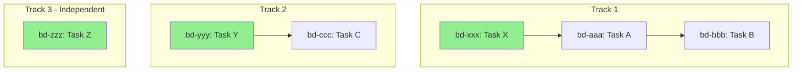

# bd Execution Plan

Generate an optimal execution plan based on dependencies using bv.

## Workflow

### 1. Get Execution Plan

```bash
bv --robot-plan
```

The plan includes:
- **Tracks:** Independent work streams that can run in parallel
- **Items:** Issues sorted by priority within each track
- **Unblocks:** What becomes available when each item completes
- **Summary:** Highest-impact starting point

### 2. Present Plan

#### Ready Now (No Blockers)

| Track | ID | Title | Priority | Unblocks |
|-------|-----|-------|----------|----------|
| 1 | bd-xxx | ... | P1 | bd-aaa, bd-bbb |
| 2 | bd-yyy | ... | P1 | bd-ccc |
| 3 | bd-zzz | ... | P2 | - |

#### Dependency Chain

For each track, show the sequence:

**Track 1:**
```
bd-xxx (ready) → bd-aaa → bd-bbb → bd-ddd
```

**Track 2:**
```
bd-yyy (ready) → bd-ccc
```

### 3. Mermaid Diagram (if $ARGUMENTS contains --mermaid)

Generate a mermaid flowchart:



Green = Ready to start now

### 4. Recommendations

```markdown
## Execution Recommendations

**Parallelism Available:** [N] independent tracks

**Highest Impact Start:**
- [Issue ID]: [Title]
- Unblocks: [N] downstream issues
- Priority: P[X]

**Suggested Assignment:**
- Track 1: Agent/Developer A
- Track 2: Agent/Developer B
- Track 3: Agent/Developer C

**Total Work Items:** [N] issues
**Critical Path Length:** [M] sequential steps
```

### 5. For Agent Orchestration

When spawning parallel agents:

```markdown
## Agent Tasks

Launch these in parallel:

1. Task bd-issue-resolver(bd-xxx): "Resolve issue bd-xxx"
2. Task bd-issue-resolver(bd-yyy): "Resolve issue bd-yyy"
3. Task bd-issue-resolver(bd-zzz): "Resolve issue bd-zzz"

After Track 1 item bd-xxx completes, spawn:
4. Task bd-issue-resolver(bd-aaa): "Resolve issue bd-aaa"
```

## Output Formats

| Format | Use Case |
|--------|----------|
| Default | Human-readable summary |
| `--mermaid` | Visual diagram for documentation |
| Raw JSON | Agent orchestration |

## Integration

This command integrates with:
- `/bd-resolve-parallel` - Uses plan for parallel execution
- `/workflows:work` - References plan for task ordering
- `/bd-status` - Quick view of ready work
