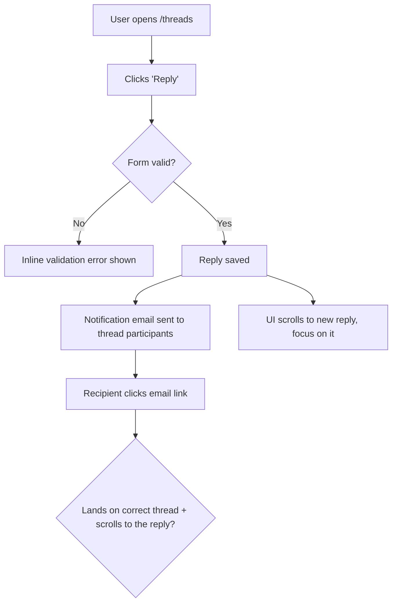

# Dogfood

This is **diff-scoped** browser QA, not whole-app exploration: you test what *this branch* introduced or modified versus the trunk, fix what is small and broken, and leave a durable report.

## Prerequisites

**User-runnable invocation rendering.** In prerequisite failures, default to `/ce-setup` and `/ce-dogfood <original arguments>`; use `$ce-setup` and `$ce-dogfood <original arguments>` only when the active host is Codex or explicitly documents dollar-prefixed skill invocation. Render only each invocation as inline code and output one form only.

- A local dev server you can start (`bin/dev`, `rails server`, `npm run dev`, etc.).
- Drive the browser only with the `agent-browser` binary — not `npx agent-browser` (the direct binary uses the fast Rust client), and not a browser MCP or other built-in browser-control tool.
- `agent-browser` installed. Check:

  ```bash
  command -v agent-browser >/dev/null 2>&1 && echo "Ready" || echo "NOT INSTALLED"
  ```

  If not installed, stop and tell the user to install `agent-browser`: print the rendered `ce-setup` invocation for the current install command, followed by the rendered `ce-dogfood <original arguments>` invocation to retry. This workflow cannot function without it.

## Workflow

### Phase 0: Scope and Get on the Right Branch

Parse the arguments you were invoked with: a PR number, a branch name, or blank (use current branch). Strip `--port PORT` if present.

1. **Identify the target — do not switch the working tree yet.**
   - **PR number:** the target *is the PR*, not its head branch — carry the number through the later steps (trunk check, isolation, checkout). Read its head only for display (`gh pr view <number> --json headRefName,isCrossRepository`).
   - **Branch name:** the target is that branch.
   - **Blank:** the target is the current branch.
2. **Refuse to run on the trunk — branch/blank targets only.** If a *branch-name or blank* target resolves to the trunk (`main`/`master`/the detected default), stop — there is no diff to dogfood. A **PR is always diffable** (it has a base), so this check never applies to a PR target; never refuse a `ce-dogfood <number>` invocation just because the PR's head branch happens to be named `main` — a fork PR's head can be named `main`/`master`.
3. **Decide isolation; let `ce-worktree` own the worktree mechanics.** The only call this skill makes is *whether to ask for isolation at all*:
   - **Blank / current-branch target:** do **not** isolate — dogfood in place. You are already on the branch under test, the fix-commits belong on it, and git cannot check the same branch out in a second worktree anyway.
   - **A PR or a different named branch:** offer isolation (platform's blocking question tool); unattended, isolate without asking. On **yes**, invoke `ce-worktree` to isolate **that target ref** and act on its verdict; the primary checkout is never switched. On **no**, check the target out in place (`gh pr checkout <number>` for a PR, `git checkout <branch>` for a branch) — if uncommitted changes would be disturbed, confirm first, and unattended isolate instead of disturbing them.
4. **Resume if a prior run exists.** Look for an existing report at `docs/dogfood-reports/*-<branch-slug>-dogfood.md` (branch-slug rule under Resumability). If one is found with unfinished scenarios, ask whether to resume it or start fresh; unattended, resume it. To resume, re-hydrate the task list from its matrix: `Pass`/`Fixed`/`Skipped` stay done; `Pending` and `in_progress` become the remaining auto-runnable work. `Blocked (needs human verify)` and `Blocked (human decision)` are **not** auto-runnable — they wait on a person, so surface them to the user rather than silently re-queuing them.

### Resumability

- **The task list** (the harness's task tool) is the live to-do — one task per matrix scenario.
- **The report doc** at `docs/dogfood-reports/<YYYY-MM-DD>-<branch-slug>-dogfood.md` is the durable checkpoint and the source of truth for resuming, since tasks are session-scoped. `<branch-slug>` is the branch name lowercased with every run of non-alphanumeric characters (slashes included) collapsed to a single `-` (e.g. `feature/Foo_Bar` -> `feature-foo-bar`). **Create it as soon as the matrix exists (end of Phase 2) by instantiating `references/dogfood-report-template.md`** so the checkpoint carries the template-owned section shape, then fill in every scenario at `Pending` and update it as each scenario is judged.

### Phase 1: Analyze Changes

Resolve the trunk ref before diffing — never hard-code `main`, or a repo whose default branch is `master` fails with `fatal: ambiguous argument 'main...HEAD'`. Prefer a local branch matching the detected default (`origin/HEAD`, then `gh repo view --json defaultBranchRef`), else the *qualified* `origin/<name>`: a bare remote name resolves via `refs/remotes/<name>`, **not** `refs/remotes/origin/<name>`, so a remote-only trunk (common on PR/CI checkouts with no local `main`) would otherwise miss. Then read the diff:

```bash
git diff --name-only <trunk>...HEAD   # what changed
git diff <trunk>...HEAD               # how it changed
```

**Ground in the product's personas and vision.** Look for persona and vision context so flows can be judged from real users' eyes, not just "does it work." Check, in order: `STRATEGY.md` (its "Who it's for" section names the primary persona and their job-to-be-done), `VISION.md`, and any persona docs (e.g. `docs/personas/`, `PERSONAS.md`). Capture the 1-3 primary personas and what each cares about. If none exist, infer a reasonable primary persona from the product and the diff, and say so in the report.

### Phase 2: Map the Flows, Then Build the Matrix

Do not jump straight to a flat list of pages. First **understand the user flows the diff touches**, then derive the matrix from them.

#### 2a. Map the user flows

For every user-visible change, trace the **complete journey** end to end and map it as a **Mermaid `flowchart`** — entry point, each user action, branch points (success / validation error / empty / permission-denied), side effects (emails, jobs, notifications), and the true end state.

> Email example: it's not enough that "an email sends." Does it go to the *right* recipient? When the user clicks through, does the app land on and scroll to the *right* message? Does the content make sense? Does the whole flow align with the product's vision and UX? The flowchart must carry the click-through and its destination, not stop at "email sent."



Produce one flowchart per distinct journey, scaled to the diff: a one-route or copy-only change gets a single small flowchart, a multi-step feature gets several. Cover the happy path **and** the branch points (error, empty, boundary, permission). These diagrams become the spine of the matrix and belong in the final report.

#### 2b. Derive the matrix from the flows

Walk each flowchart and turn every node and branch into one or more test scenarios. Read `references/test-matrix-taxonomy.md` before building the matrix. Cover both **functional** ("does it work?") and **experiential** ("does it feel right and align with the product?").

Map changed files to concrete routes using the taxonomy's file-to-routes table, and attach those routes to the flows that exercise them.

**Load the matrix as a task list** (the harness's task tool, as above), one task per scenario, so progress is tracked and nothing is skipped. Order tasks by flow, following the flowcharts, not by file.

### Phase 3: Detect Port and Start the Dev Server

Determine the port (priority: explicit `--port` > a port explicitly stated in your in-context project instructions > `package.json` dev script > `.env*` `PORT=` > default `3000`). If a server is already listening on it, reuse it. Otherwise start the project's dev command (`bin/dev`, `rails server`, `npm run dev`, etc.) in the background and poll the port until it accepts connections before opening the browser. This skill is hands-off, so start the server automatically without asking — do not block on a confirmation.

```bash
agent-browser open "http://localhost:${PORT}"
agent-browser snapshot -i
```

### Phase 4: Execute the Matrix

Work the task list **one item at a time**, driving each scenario with agent-browser:

```bash
agent-browser open "http://localhost:${PORT}/<route>"
agent-browser snapshot -i
agent-browser click @e1
agent-browser fill @e2 "value"
agent-browser screenshot "$(mktemp -d)/<scenario>.png"   # scratch dir, not the repo root
agent-browser errors      # check console/page errors
```

Follow each scenario to its true end state — right data, right destination, sensible content, no console errors — then record the verdict in the report.

Walk each flow as each primary persona (from Phase 1) and record paper cuts with the persona and a severity; see the taxonomy's paper-cut definition. A scenario can be functionally `Pass` yet still carry paper cuts: they do not block a `Pass`, but a **sharp** one (severe enough to fix now) is routed into the Phase 5 fix loop just like a failure, under the same auto-fix-vs-escalate judgment. Log the rest in the report.

**External-interaction flows** (OAuth, real email delivery, payments, SMS) can't be fully driven headlessly — ask the user to verify that leg and mark the scenario `Blocked (needs human verify)` until they confirm; unattended, mark it and move on without waiting. Then continue.

### Phase 5: Fix Loop (Autonomous)

When a scenario fails — or a passing scenario carries a sharp paper cut worth fixing now — **fix it and prove it**, but first decide whether the fix is yours to make autonomously or a human's to decide.

**Judge the size of the fix before touching code.** Auto-fix when the change is small, well-understood, and low-risk: a clear bug with an obvious correct fix, contained to a few files, no schema/architecture/product trade-off. **Do not auto-fix** when the change is large or ambiguous — it requires an architectural or schema decision, changes product behavior or UX intent, spans many files, has plausible competing solutions, or you're not confident the "right" answer is unambiguous.

**For autonomous fixes:**

1. Investigate the root cause. If it's non-obvious, use `ce-debug`.
2. Apply the fix in the code.
3. **Add an automated regression test** that fails before the fix and passes after, so the bug can't return. This is the default for behavioral and code bugs. When an automated test is genuinely impractical — a pure copy, spacing, or visual fix with no behavioral assertion to make — substitute a documented browser-replay or screenshot check and **state in the report why no automated test was meaningful**. Do not invent a hollow test just to satisfy the step.
4. Commit the fix yourself, one logical fix per commit, with a message following the project's commit conventions.
5. Re-run the failing scenario in the browser to confirm it now passes; then continue the matrix.
6. If the bug carried a reusable lesson, record it in the report's **Learnings** section.

**For changes too big to make autonomously:** do not implement. Record it in the report's **Decisions for a human** section with: what's broken, why it's not a safe autonomous fix, the options you see (with trade-offs), and your recommendation. Mark the scenario `Blocked (human decision)` in the matrix, then continue with the rest.

Keep iterating until every task is `completed` or in a terminal `Blocked` state. Re-test anything a fix might have affected (watch for regressions in adjacent journeys).

**Before declaring the branch ready, run the project's automated test suite once** (the new regression tests plus everything that already exists). Discover the test command from the project's active instructions and conventions already in your context — do not assume a specific runner. Record the result in the report; a green matrix with a red suite is not "ready."

### Phase 6: Write the Report Artifact

When the matrix is green (or every remaining item is explicitly blocked), **finalize** the report doc, then surface a short summary in chat with the file path.

**Finalize against `references/dogfood-report-template.md`** — every section it names must be present and filled from the run's actual evidence. Do not reconstruct the section list from memory, as that drifts from the template.
